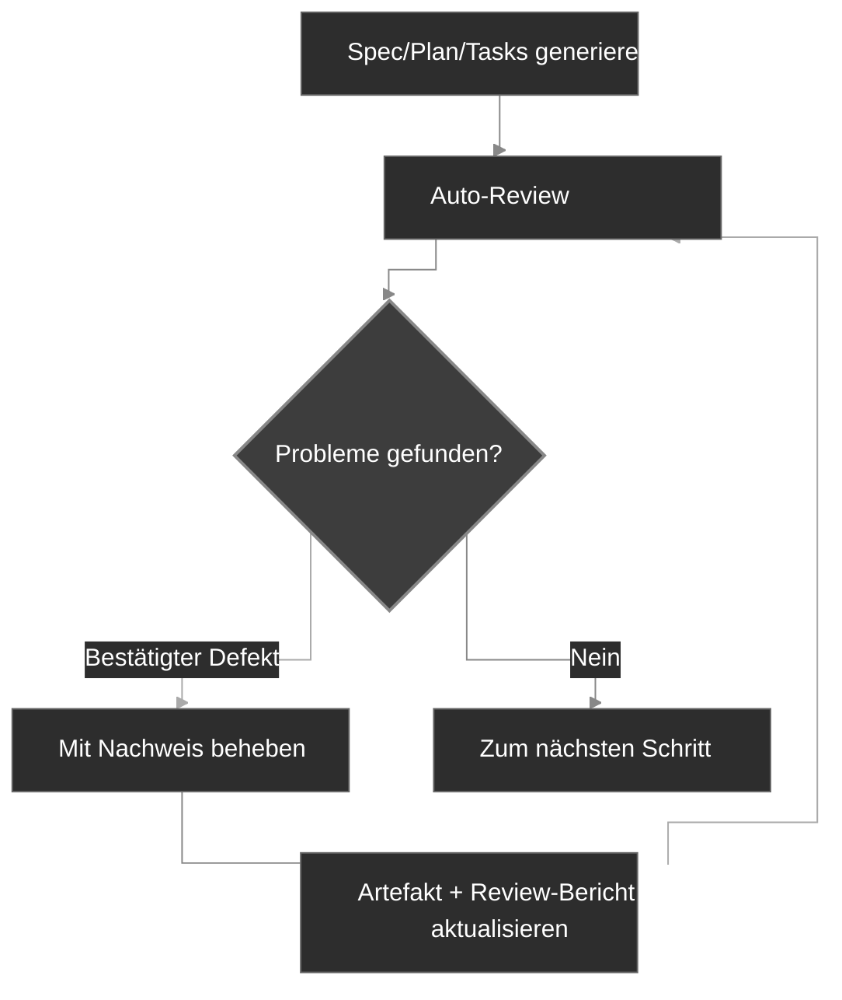

<div align="center">
  <picture>
    <source media="(prefers-color-scheme: dark)" srcset="codexspec-logo-dark.svg">
    <source media="(prefers-color-scheme: light)" srcset="codexspec-logo-light.svg">
    
  </picture>
</div>

<h1 align="center">CodexSpec</h1>

<p align="center">
  <a href="README.md">English</a> | <a href="README.zh-CN.md">中文</a> | <a href="README.ja.md">日本語</a> | <a href="README.es.md">Español</a> | <a href="README.pt-BR.md">Português</a> | <a href="README.ko.md">한국어</a> | <b>Deutsch</b> | <a href="README.fr.md">Français</a>
</p>

<p align="center">
  <a href="https://pypi.org/project/codexspec/"></a>
  <a href="https://pypi.org/project/codexspec/"></a>
  <a href="https://opensource.org/licenses/MIT"></a>
</p>

<p align="center">
  <strong>Ein Requirements-First-SDD-Toolkit für Claude Code</strong>
</p>

CodexSpec unterstützt Sie dabei, hochwertige Software durch **Requirements-First Spec-Driven Development (SDD)** zu erstellen – bestätigte Anforderungen stehen am Anfang, und nichts wird verbindlich, bis Sie es ausdrücklich bestätigen.
Anstatt sofort Code zu schreiben, klären Sie zunächst **was** gebaut wird und **warum**, bevor Sie entscheiden, **wie** es gebaut wird.

[📖 Documentation](https://zts0hg.github.io/codexspec/) | [中文文档](https://zts0hg.github.io/codexspec/zh/) | [日本語ドキュメント](https://zts0hg.github.io/codexspec/ja/) | [한국어 문서](https://zts0hg.github.io/codexspec/ko/) | [Documentación](https://zts0hg.github.io/codexspec/es/) | [Documentation](https://zts0hg.github.io/codexspec/fr/) | [Dokumentation](https://zts0hg.github.io/codexspec/de/) | [Documentação](https://zts0hg.github.io/codexspec/pt-BR/)

---

## Inhaltsverzeichnis

- [Warum CodexSpec wählen?](#warum-codexspec-wählen)
- [Was ist Requirements-First SDD?](#was-ist-requirements-first-sdd)
- [Design-Philosophie: Mensch-KI-Zusammenarbeit](#design-philosophie-mensch-ki-zusammenarbeit)
- [30-Sekunden-Schnellstart](#-30-sekunden-schnellstart)
- [Installation](#installation)
- [Kern-Workflow](#kern-workflow)
- [Verfügbare Befehle](#verfügbare-befehle)
- [Vergleich mit spec-kit](#vergleich-mit-spec-kit)
- [Internationalisierung](#internationalisierung-i18n)
- [Mitwirken & Lizenz](#mitwirken)

---

## Warum CodexSpec wählen?

Warum CodexSpec zusätzlich zu Claude Code verwenden? Hier ist der direkte Vergleich:

| Aspekt | Nur Claude Code | CodexSpec + Claude Code |
|--------|-----------------|-------------------------|
| **Mehrsprachige Unterstützung** | Standardmäßig englische Interaktion | Teamsprache konfigurieren für flüssigere Zusammenarbeit und Reviews |
| **Nachvollziehbarkeit** | Entscheidungen lassen sich nach Sitzungsende schwer rekonstruieren | Alle Specs, Pläne und Aufgaben liegen in `.codexspec/specs/` |
| **Sitzungswiederherstellung** | Unterbrechungen im Plan-Modus sind schwer abzufangen | Aufteilung auf mehrere Befehle + persistente Dokumente = einfache Wiederherstellung |
| **Team-Governance** | Keine einheitlichen Prinzipien, inkonsistente Stile | `constitution.md` setzt Team-Standards und Qualität durch |

---

## Was ist Requirements-First SDD?

**Requirements-First SDD** ist die Spec-Driven-Development-Methodik (SDD) mit einer zentralen Erweiterung: **Bestätigte Anforderungen sind die höchste Autorität**. Sie definieren und bestätigen *was* gebaut wird und *warum*, bevor Sie entscheiden *wie* – und nichts wird verbindlich, bevor Sie es ausdrücklich bestätigen.

```
Traditionell:  Idee → Code → Debuggen → Neuschreiben
SDD:           Idee → Bestätigte Anforderungen → Spec → Plan → Aufgaben → Code
```

**Warum Requirements-First SDD verwenden?**

| Problem                  | Lösung durch Requirements-First SDD                       |
| ------------------------ | --------------------------------------------------------- |
| KI-Missverständnisse     | Bestätigte Anforderungen sagen der KI, „was zu bauen ist"; die KI hört auf zu raten |
| Fehlende Anforderungen   | Interaktive Klärung + eine Bestätigungsschranke decken Randfälle auf |
| Architektur-Drift        | Review-Checkpoints stellen die richtige Richtung sicher   |
| Verschwendete Überarbeitung | Probleme werden gefunden und bestätigt, bevor Code entsteht |

<details>
<summary>✨ Hauptfunktionen</summary>

### Kern-Workflow

- **Verfassungsbasierte Entwicklung** – Projektprinzipien etablieren, die alle Entscheidungen leiten
- **Persistente Anforderungserfassung** – `/specify` speichert den bestätigten Dialog in `requirements.md`, bevor Dokumente entstehen
- **Automatische Reviews** – Jedes erzeugte Spec-, Plan- und Aufgaben-Artefakt enthält eingebaute Qualitätsprüfungen
- **Nachvollziehbare Aufgaben** – Aufgabenaufschlüsselungen bewahren die Abdeckung von Anforderungen und Plan und wenden Test-First nur dort an, wo es erforderlich ist

### Mensch-KI-Zusammenarbeit

- **Review-Befehle** – Dedizierte Review-Befehle für Spec, Plan und Aufgaben
- **Interaktive Klärung** – Q&A-basierte Anforderungsverfeinerung
- **Artefaktübergreifende Analyse** – Inkonsistenzen erkennen, bevor implementiert wird

### Entwicklererfahrung

- **Native Claude-Code-Integration** – Slash-Befehle funktionieren nahtlos
- **Mehrsprachige Unterstützung** – 13+ Sprachen über dynamische LLM-Übersetzung
- **Plattformübergreifend** – Bash- und PowerShell-Skripte enthalten
- **Erweiterbar** – Plugin-Architektur für eigene Befehle

</details>

---

## Design-Philosophie: Mensch-KI-Zusammenarbeit

CodexSpec beruht auf der Überzeugung, dass **effektive KI-gestützte Entwicklung aktive menschliche Mitwirkung auf jeder Stufe erfordert**.

### Warum menschliche Aufsicht wichtig ist

| Ohne Reviews                       | Mit Reviews                               |
| ---------------------------------- | ---------------------------------------- |
| Die KI trifft falsche Annahmen     | Menschen erkennen Missverständnisse früh |
| Unvollständige Anforderungen pflanzen sich fort | Lücken werden vor der Implementierung identifiziert |
| Die Architektur driftet von der Absicht ab | Abstimmung wird auf jeder Stufe verifiziert |
| Aufgaben übersehen kritische Features | Systematische Abdeckungsvalidierung      |
| **Ergebnis: Überarbeitung, verschwendeter Aufwand** | **Ergebnis: Beim ersten Versuch korrekt** |

### Der CodexSpec-Ansatz

CodexSpec gliedert die Entwicklung in **überprüfbare Checkpoints**:

```
Idee → /specify → requirements.md → /generate-spec → spec.md → /spec-to-plan → plan.md → /plan-to-tasks → tasks.md → /implement
                                                │                        │                           │
                                          Spec prüfen             Plan prüfen             Aufgaben prüfen
```

Bestätigte Anforderungen bilden die oberste Autorität für Features. Abgeleitete Artefakte tragen explizite Quellverweise, sodass Konflikte zurückverfolgt werden können, anstatt sie stillschweigend weiterzureichen.

**Zu jedem erzeugten Artefakt gibt es einen passenden Review-Befehl:**

- `spec.md` → `/codexspec:review-spec`
- `plan.md` → `/codexspec:review-plan`
- `tasks.md` → `/codexspec:review-tasks`
- Alle Artefakte → `/codexspec:analyze`

Dieser systematische Review-Prozess stellt sicher:

- **Frühe Fehlererkennung**: Missverständnisse aufdecken, bevor Code geschrieben wird
- **Abstimmungsverifikation**: Bestätigen, dass die Interpretation der KI Ihrer Absicht entspricht
- **Qualitätstore**: Vollständigkeit, Klarheit und Machbarkeit auf jeder Stufe validieren
- **Weniger Überarbeitung**: Minuten in Reviews investieren, um Stunden an Neuimplementierung zu sparen

---

## 🚀 30-Sekunden-Schnellstart

```bash
# 1. Installieren
uv tool install codexspec

# 2. Projekt initialisieren
#    Option A: Neues Projekt anlegen
codexspec init my-project && cd my-project

#    Option B: In einem bestehenden Projekt initialisieren
cd your-existing-project && codexspec init .

# 3. In Claude Code verwenden
claude
> /codexspec:constitution Prinzipien erstellen, die sich auf Codequalität und Testing konzentrieren
> /codexspec:specify Ich möchte eine Todo-Anwendung bauen
> /codexspec:generate-spec
> /codexspec:spec-to-plan
> /codexspec:plan-to-tasks
> /codexspec:implement-tasks
```

Das war's. Lesen Sie weiter für den vollständigen Workflow.

---

## Installation

### Voraussetzungen

- Python 3.11+
- [uv](https://docs.astral.sh/uv/) (empfohlen) oder pip

### Empfohlene Installation

```bash
# Mit uv (empfohlen)
uv tool install codexspec

# Oder mit pip
pip install codexspec
```

### Installation überprüfen

```bash
codexspec --version
```

<details>
<summary>📦 Alternative Installationsmethoden</summary>

#### Einmalige Verwendung (ohne Installation)

```bash
# Neues Projekt anlegen
uvx codexspec init my-project

# In einem bestehenden Projekt initialisieren
cd your-existing-project
uvx codexspec init . --ai claude

# Für Codex CLI initialisieren
uvx codexspec init . --ai codex
```

#### Entwicklungsversion von GitHub installieren

```bash
# Mit uv
uv tool install git+https://github.com/Zts0hg/codexspec.git

# Bestimmten Branch oder Tag angeben
uv tool install git+https://github.com/Zts0hg/codexspec.git@main
uv tool install git+https://github.com/Zts0hg/codexspec.git@v0.5.6
```

</details>

<details>
<summary>🪟 Hinweise für Windows-Nutzer</summary>

**Empfohlen: PowerShell verwenden**

```powershell
# 1. uv installieren (falls noch nicht installiert)
powershell -c "irm https://astral.sh/uv/install.ps1 | iex"

# 2. PowerShell neu starten, dann codexspec installieren
uv tool install codexspec

# 3. Installation überprüfen
codexspec --version
```

**Fehlerbehebung in der CMD**

Wenn „Zugriff verweigert"-Fehler auftreten:

1. Alle CMD-Fenster schließen und erneut öffnen
2. Oder PATH manuell aktualisieren: `set PATH=%PATH%;%USERPROFILE%\.local\bin`
3. Oder den vollständigen Pfad verwenden: `%USERPROFILE%\.local\bin\codexspec.exe --version`

Ausführliche Fehlerbehebung im [Windows-Fehlerbehebungsleitfaden](docs/WINDOWS-TROUBLESHOOTING.md).

</details>

### Upgrade

```bash
# Mit uv
uv tool install codexspec --upgrade

# Mit pip
pip install --upgrade codexspec
```

### Installation über den Plugin-Marktplatz (Alternative)

CodexSpec ist außerdem als Claude-Code-Plugin verfügbar. Diese Methode eignet sich, wenn Sie CodexSpec-Befehle direkt in Claude Code verwenden möchten, ohne das CLI-Tool.

#### Installationsschritte

```bash
# In Claude Code den Marktplatz hinzufügen
> /plugin marketplace add Zts0hg/codexspec

# Das Plugin installieren
> /plugin install codexspec@codexspec-market
```

#### Sprachkonfiguration für Plugin-Nutzer

Konfigurieren Sie nach der Installation über den Plugin-Marktplatz Ihre bevorzugte Sprache mit dem Befehl `/codexspec:config`:

```bash
# Interaktive Konfiguration starten
> /codexspec:config

# Oder aktuelle Konfiguration anzeigen
> /codexspec:config --view
```

Der config-Befehl führt Sie durch:

1. Auswahl der Ausgabesprache (für generierte Dokumente)
2. Auswahl der Sprache für Commit-Nachrichten
3. Anlegen der Datei `.codexspec/config.yml`

**Vergleich der Installationsmethoden**

| Methode | Am besten für | Funktionsumfang |
|---------|---------------|-----------------|
| **CLI-Installation** (`uv tool install`) | Vollständiger Entwicklungs-Workflow | CLI-Befehle (`init`, `check`, `config`) + Slash-Befehle |
| **Plugin-Marktplatz** | Schneller Start, bestehende Projekte | Nur Slash-Befehle (Sprache über `/codexspec:config` einstellen) |

**Hinweis**: Das Plugin verwendet den Modus `strict: false` und nutzt die bestehende Mehrsprachigkeit über dynamische LLM-Übersetzung.

---

## Kern-Workflow

CodexSpec gliedert die Entwicklung in **überprüfbare Checkpoints**:

```
Idee → /specify → requirements.md → /generate-spec → spec.md → /spec-to-plan → plan.md → /plan-to-tasks → tasks.md → /implement
                                                │                        │                           │
                                          Spec prüfen             Plan prüfen             Aufgaben prüfen
```

### Workflow-Schritte

| Schritt                        | Befehl                      | Ausgabe                      | Mensch-Check |
| ------------------------------ | --------------------------- | ---------------------------- | ------------ |
| 1. Projektprinzipien           | `/codexspec:constitution`   | `constitution.md`            | ✅           |
| 2. Anforderungsklärung         | `/codexspec:specify`        | `requirements.md`            | ✅           |
| 3. Spec generieren             | `/codexspec:generate-spec`  | `spec.md` + Auto-Review      | ✅           |
| 4. Technische Planung          | `/codexspec:spec-to-plan`   | `plan.md` + Auto-Review      | ✅           |
| 5. Aufgabenaufschlüsselung     | `/codexspec:plan-to-tasks`  | `tasks.md` + Auto-Review     | ✅           |
| 6. Artefaktübergreifende Analyse | `/codexspec:analyze`       | Analysebericht               | ✅           |
| 7. Implementierung             | `/codexspec:implement-tasks`| Code                         | -            |

### specify vs clarify: Wann welchen verwenden?

| Aspekt | `/codexspec:specify` | `/codexspec:clarify` |
|--------|----------------------|----------------------|
| **Zweck** | Initiale Anforderungsanalyse und Bestätigung | Bestätigte Anforderungen oder abgeleitete Spec verfeinern |
| **Wann verwenden** | Beim Start eines Features | Anforderungen oder Spec brauchen Klärung |
| **Ausgabe** | Erstellt/aktualisiert `requirements.md` | Aktualisiert zuerst `requirements.md`, synchronisiert dann `spec.md` |
| **Methode** | Offenes Q&A | Strukturierter Scan (4 Kategorien) |
| **Fragen** | Unbegrenzt | Maximal 5 pro Durchlauf |

### Schlüsselkonzept: Iterativer Qualitätsloop

Jeder Generierungsbefehl enthält ein **automatisches Review**. Bestätigte Defekte dürfen behoben und für höchstens zwei Runden erneut reviewt werden; beratende Vorschläge bleiben getrennt und lösen nie automatische Änderungen aus.

1. Den Bericht prüfen
2. Zu behebende Probleme in natürlicher Sprache beschreiben
3. Das System aktualisiert automatisch Specs und Review-Berichte



<details>
<summary>📖 Detaillierte Workflow-Beschreibung</summary>

### 1. Projekt initialisieren

```bash
codexspec init my-awesome-project
cd my-awesome-project
claude
```

### 2. Projektprinzipien festlegen

```
/codexspec:constitution Prinzipien erstellen, die sich auf Codequalität, Teststandards und Clean Architecture konzentrieren
```

### 3. Anforderungen klären

```
/codexspec:specify Ich möchte eine Aufgabenverwaltungsanwendung bauen
```

Dieser Befehl wird:

- Klärungsfragen stellen, um Ihre Idee zu verstehen
- Randfälle erkunden, die Sie vielleicht nicht bedacht haben
- Sie bitten, die finale Anforderungszusammenfassung zu bestätigen
- Bestätigte Bedürfnisse, Einschränkungen, Entscheidungen, Ausschlüsse und offene Fragen in `requirements.md` festhalten

### 4. Spezifikationsdokument generieren

Sobald die Anforderungen geklärt sind:

```
/codexspec:generate-spec
```

Dieser Befehl:

- Übersetzt die bestätigten Einträge aus `requirements.md` in eine strukturierte Spezifikation
- Fügt Quellverweise für die Anforderungsnachvollziehbarkeit hinzu
- Führt **automatisch** ein Review durch und erzeugt `review-spec.md`

### 5. Technischen Plan erstellen

```
/codexspec:spec-to-plan Python mit FastAPI im Backend, PostgreSQL als Datenbank, React im Frontend verwenden
```

Verwendet nur die relevanten Planabschnitte, trägt `Covers`-Links zu Spezifikationsanforderungen ein und prüft die anwendbaren Projektprinzipien.

### 6. Aufgaben generieren

```
/codexspec:plan-to-tasks
```

Aufgaben sind um überprüfbare Ergebnisse herum organisiert:

- **Bedingtes Testen**: Test-First-Reihenfolge kommt nur zum Einsatz, wenn Plan, Verfassung oder Aufgabenrisiko es verlangen
- **Parallel-Marker `[P]`**: Nur für tatsächlich unabhängige Aufgaben
- **Dateipfad-Spezifikationen**: Klare Ergebnisse pro Aufgabe
- **Nachvollziehbarkeit**: Jede Aufgabe verlinkt auf den Plan und die Anforderungen, die sie abdeckt

### 7. Artefaktübergreifende Analyse (optional, aber empfohlen)

```
/codexspec:analyze
```

Erkennt Probleme über Anforderungen, Spec, Plan und Aufgaben hinweg:

- Abdeckungslücken (Anforderungen ohne Aufgaben)
- Duplikate und Inkonsistenzen
- Verstöße gegen die Verfassung
- Unterspezifizierte Elemente

### 8. Implementierung

```
/codexspec:implement-tasks
```

Die Implementierung folgt einem **bedingten TDD-Workflow**:

- Code-Aufgaben: Test-First (Red → Green → Verifizieren → Refactoren)
- Nicht-testbare Aufgaben (Dokumentation, Konfiguration): Direkte Implementierung

</details>

---

## Verfügbare Befehle

### CLI-Befehle

| Befehl             | Beschreibung                        |
| ------------------ | ----------------------------------- |
| `codexspec init`   | Neues Projekt initialisieren        |
| `codexspec check`  | Installierte Tools überprüfen       |
| `codexspec version`| Versionsinformationen anzeigen      |
| `codexspec config` | Konfiguration anzeigen oder ändern  |

<details>
<summary>📋 init-Optionen</summary>

| Option               | Beschreibung                                                       |
| -------------------- | ------------------------------------------------------------------ |
| `PROJECT_NAME`       | Projektverzeichnisname (`.` oder `--here` für aktuelles Verzeichnis) |
| `--here`, `-h`       | Im aktuellen Verzeichnis initialisieren                            |
| `--ai`, `-a`         | Zu verwendender KI-Assistent: `claude`, `codex` oder `both` (Standard: claude) |
| `--lang`, `-l`       | Ausgabe-(Basis-)Sprache; interaction/document/commit fallen darauf zurück (z. B. en, zh-CN, ja) |
| `--interaction-lang` | Interaktionssprache (LLM-Dialog + CLI-Ausgabe); überschreibt `--lang` |
| `--document-lang`    | Dokumentensprache (generierte Spec/Plan/Tasks); überschreibt `--lang` |
| `--commit-lang`      | Sprache für Commit-Nachrichten; überschreibt `--lang`              |
| `--force`, `-f`      | Dateien überschreiben + Prompts automatisch bestätigen; stellt `config.yml` nie neu her |
| `--no-git`           | Git-Repository-Initialisierung überspringen                        |
| `--debug`, `-d`      | Debug-Ausgabe aktivieren                                           |

</details>

<details>
<summary>📋 config-Optionen</summary>

| Option                    | Beschreibung                                                |
| ------------------------- | ----------------------------------------------------------- |
| `--set-lang`, `-l`        | Ausgabe-(Basis-)Sprache festlegen                           |
| `--set-interaction-lang`  | Interaktionssprache festlegen                               |
| `--set-document-lang`     | Dokumentensprache festlegen                                 |
| `--set-commit-lang`, `-c` | Sprache für Commit-Nachrichten festlegen                    |
| `--list-langs`            | Alle unterstützten Sprachen auflisten                       |
| `--auto-next`             | `workflow.auto_next` umschalten/setzen (ohne Wert = umschalten; oder on/off) |

</details>

### Slash-Befehle

#### Kern-Workflow-Befehle

| Befehl                      | Beschreibung                                                       |
| --------------------------- | ------------------------------------------------------------------ |
| `/codexspec:constitution`   | Projekt-Verfassung erstellen/aktualisieren mit artefaktübergreifender Validierung |
| `/codexspec:specify`        | Anforderungen klären, bestätigen und in `requirements.md` festhalten |
| `/codexspec:generate-spec`  | `spec.md`-Dokument generieren ★ Auto-Review                        |
| `/codexspec:spec-to-plan`   | Spec in technischen Plan umwandeln ★ Auto-Review                   |
| `/codexspec:plan-to-tasks`  | Plan in nachvollziehbare, überprüfbare Aufgaben aufteilen ★ Auto-Review |
| `/codexspec:implement-tasks`| Aufgaben ausführen (bedingtes TDD)                                 |

#### Review-Befehle (Qualitätstore)

| Befehl                   | Beschreibung                              |
| ------------------------ | ----------------------------------------- |
| `/codexspec:review-spec` | Spezifikation prüfen (auto oder manuell)  |
| `/codexspec:review-plan` | Technischen Plan prüfen (auto oder manuell) |
| `/codexspec:review-tasks`| Aufgabenaufschlüsselung prüfen (auto oder manuell) |

#### Erweiterungsbefehle

| Befehl                      | Beschreibung                                                     |
| --------------------------- | ---------------------------------------------------------------- |
| `/codexspec:config`         | Projektkonfiguration verwalten (erstellen/anzeigen/ändern/zurücksetzen) |
| `/codexspec:clarify`        | Spec auf Unklarheiten prüfen (4 Kategorien, max. 5 Fragen)       |
| `/codexspec:analyze`        | Artefaktübergreifende Konsistenzanalyse (nur lesend, schweregradbasiert) |
| `/codexspec:checklist`      | Qualitätschecklisten für Anforderungen generieren                |
| `/codexspec:tasks-to-issues`| Aufgaben in GitHub-Issues umwandeln                              |

#### Git-Workflow-Befehle

| Befehl                    | Beschreibung                                       |
| ------------------------- | -------------------------------------------------- |
| `/codexspec:commit-staged`| Commit-Nachricht aus gestagten Änderungen erzeugen |
| `/codexspec:pr`           | PR-/MR-Beschreibung generieren (Plattform automatisch erkannt) |

#### Code-Review-Befehle

| Befehl                         | Beschreibung                                                     |
| ------------------------------ | ---------------------------------------------------------------- |
| `/codexspec:review-code` | Änderungsbezogenes Defekt-Gate; Pfad-Qualitätsscore mit `--audit` |

---

## Vergleich mit spec-kit

CodexSpec ist von GitHubs spec-kit inspiriert, mit wesentlichen Unterschieden:

| Funktion             | spec-kit                | CodexSpec                                     |
| -------------------- | ----------------------- | --------------------------------------------- |
| Kern-Philosophie     | Spec-driven Entwicklung | Requirements-First SDD + Mensch-KI-Zusammenarbeit |
| CLI-Name             | `specify`               | `codexspec`                                   |
| Primäre KI           | Multi-Agent-Support     | Fokus auf Claude Code                         |
| Verfassungssystem    | Basis                   | Volle Verfassung + artefaktübergreifende Validierung |
| Zwei-Phasen-Spec     | Nein                    | Ja (Klären + Generieren)                      |
| Review-Befehle       | Optional                | 3 dedizierte Review-Befehle + Bewertung       |
| Clarify-Befehl       | Ja                      | 4 Fokuskategorien, Review-Integration         |
| Analyze-Befehl       | Ja                      | Nur lesend, schweregradbasiert, verfassungsbewusst |
| TDD in Aufgaben      | Optional                | Bedingt, abhängig von Anforderungen, Risiko und Policy |
| Implementierung      | Standard                | Bedingtes TDD (Code vs. Docs/Config)          |
| Erweiterungssystem   | Ja                      | Ja                                            |
| PowerShell-Skripte   | Ja                      | Ja                                            |
| i18n-Support         | Nein                    | Ja (13+ Sprachen über LLM-Übersetzung)        |

### Wesentliche Unterscheidungsmerkmale

1. **Review-zuerst-Kultur**: Jedes wichtige Artefakt hat einen dedizierten Review-Befehl
2. **Verfassungs-Governance**: Prinzipien werden validiert, nicht nur dokumentiert
3. **Nachweisbasiertes Review**: Defekte erfordern konkrete Nachweise; beratende Design-Ideen beeinflussen die Abnahme nicht
4. **Bestätigungsschranke**: Anforderungen, Specs, Pläne und Aufgaben werden erst nach ausdrücklicher menschlicher Bestätigung verbindlich

---

## Internationalisierung (i18n)

CodexSpec unterstützt mehrere Sprachen durch **dynamische LLM-Übersetzung**. Es müssen keine Übersetzungsvorlagen gepflegt werden – Claude übersetzt Inhalte zur Laufzeit anhand Ihrer Sprachkonfiguration.

### Sprach-Dimensionen

CodexSpec unterteilt Sprache in vier unabhängig konfigurierbare Dimensionen. `output` ist die Basis; die anderen überschreiben sie und fallen auf sie (und danach auf `en`) zurück, wenn sie nicht gesetzt sind – sodass Sie mit Claude in einer Sprache kommunizieren können, während generierte Artefakte oder Commit-Nachrichten in einer anderen verbleiben.

| Dimension | `config.yml`-Schlüssel | Bei init setzen | Später setzen | Steuert | Fällt zurück auf |
|-----------|-------------------------|-----------------|----------------|---------|------------------|
| Output (Basis) | `output` | `--lang` | `config --set-lang` | Basis für die anderen drei | `en` |
| Interaction | `interaction` | `--interaction-lang` | `config --set-interaction-lang` | LLM-Dialog + CLI-Ausgabe | output → `en` |
| Document | `document` | `--document-lang` | `config --set-document-lang` | generierte Spec/Plan/Tasks | output → `en` |
| Commit | `commit` | `--commit-lang` | `config --set-commit-lang` | Git-Commit-Nachrichten | output → `en` |
| Templates | `templates` | — | — | Vorlagenquelle (immer `en`) | — |

### Sprache festlegen

**Während der Initialisierung:**

```bash
# Chinesische Ausgabe (setzt die output-Basis)
codexspec init my-project --lang zh-CN

# Vollständig nicht-interaktiv: zh-CN-Basis, englische Commit-Nachrichten
codexspec init my-project --lang zh-CN --commit-lang en

# Jede Dimension explizit festlegen (skriptbar, keine Prompts)
codexspec init my-project \
  --interaction-lang zh-CN --document-lang en --commit-lang en
```

Die erstmalige Initialisierung in einem TTY ohne `--lang` (und ohne alle drei Dimensions-Flags) fragt nach einer Basissprache; in einem Nicht-TTY (CI/Skripte) wird standardmäßig `en` verwendet. Ein erneuter `init`-Aufruf bewahrt jeden Sprach-Schlüssel, den Sie nicht angegeben haben.

**Nach der Initialisierung:**

```bash
# Aktuelle Konfiguration anzeigen
codexspec config

# Eine einzelne Dimension ändern
codexspec config --set-lang zh-CN
codexspec config --set-interaction-lang zh-CN
codexspec config --set-document-lang en
codexspec config --set-commit-lang en
codexspec config --auto-next
```

### Unterstützte Sprachen

| Code    | Sprache            |
| ------- | ------------------ |
| `en`    | English (Standard) |
| `zh-CN` | 简体中文           |
| `zh-TW` | 繁體中文           |
| `ja`    | 日本語             |
| `ko`    | 한국어             |
| `es`    | Español            |
| `fr`    | Français           |
| `de`    | Deutsch            |
| `pt-BR` | Português          |
| `ru`    | Русский            |
| `it`    | Italiano           |
| `ar`    | العربية            |
| `hi`    | हिन्दी              |

<details>
<summary>⚙️ Beispiel für eine Konfigurationsdatei</summary>

`.codexspec/config.yml`:

```yaml
version: "1.0"

language:
  output: "zh-CN"        # Basissprache; die drei untenstehenden fallen darauf zurück, danach auf "en"
  interaction: "zh-CN"   # LLM-Dialog + codexspec CLI-Ausgabe (optional → Standard ist output)
  document: "en"         # Generierte Anforderungen/Spec/Plan/Tasks (optional → Standard ist output)
  commit: "en"           # Git-Commit-Nachrichten (optional → Standard ist output)
  templates: "en"        # Als "en" belassen

project:
  ai: "claude"
  created: "2025-02-15"
```

</details>

---

## Projektstruktur

Projektstruktur nach der Initialisierung:

```
my-project/
├── .codexspec/
│   ├── memory/
│   │   └── constitution.md    # Projekt-Verfassung
│   ├── specs/
│   │   └── {feature-id}/
│   │       ├── spec.md        # Funktionsspezifikation
│   │       ├── plan.md        # Technischer Plan
│   │       ├── tasks.md       # Aufgabenaufschlüsselung
│   │       └── checklists/    # Qualitätschecklisten
│   ├── templates/             # Eigene Vorlagen
│   ├── scripts/               # Hilfsskripte
│   └── extensions/            # Eigene Erweiterungen
├── .claude/
│   └── commands/              # Claude-Code-Slash-Befehle
├── .agents/
│   └── skills/                # Codex-Skills (bei Initialisierung mit --ai codex oder both)
├── CLAUDE.md                  # Claude-Code-Kontext
└── AGENTS.md                  # Codex-Kontext
```

---

## Erweiterungssystem

CodexSpec unterstützt eine Plugin-Architektur für eigene Befehle:

```
my-extension/
├── extension.yml          # Erweiterungs-Manifest
├── commands/              # Eigene Slash-Befehle
│   └── command.md
└── README.md
```

Details siehe `extensions/EXTENSION-DEVELOPMENT-GUIDE.md`.

---

## Entwicklung

### Voraussetzungen

- Python 3.11+
- uv-Paketmanager
- Git

### Lokale Entwicklung

```bash
# Repository klonen
git clone https://github.com/Zts0hg/codexspec.git
cd codexspec

# Dev-Abhängigkeiten installieren
uv sync --dev

# Lokal ausführen
uv run codexspec --help

# Tests ausführen
uv run pytest

# Code linten
uv run ruff check src/

# Paket bauen
uv build
```

---

## Mitwirken

Beiträge sind willkommen! Bitte lesen Sie die Mitwirkungsrichtlinien, bevor Sie einen Pull-Request einreichen.

## Lizenz

MIT-Lizenz – siehe [LICENSE](LICENSE) für Details.

## Danksagung

- Inspiriert von [GitHub spec-kit](https://github.com/github/spec-kit)
- Gebaut für [Claude Code](https://claude.ai/code)
