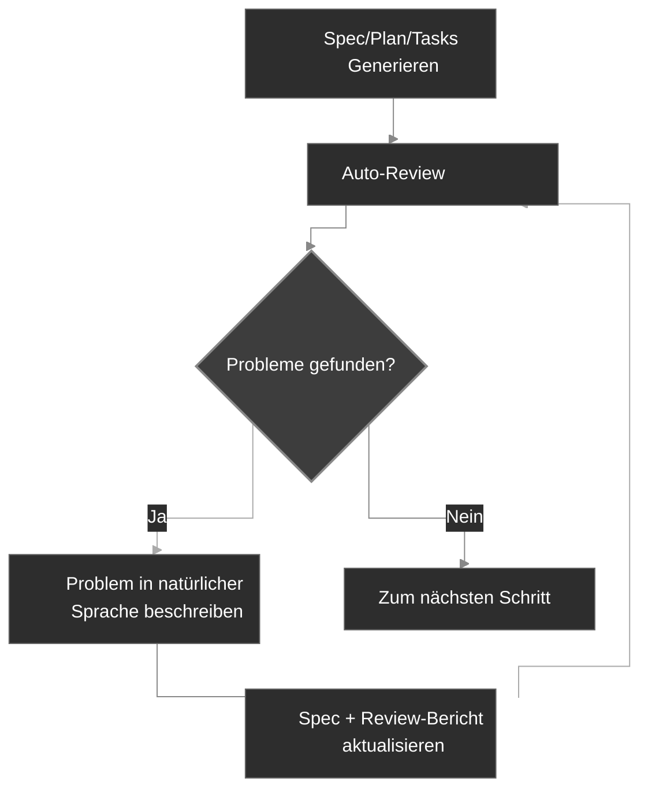

<div align="center">
  <picture>
    <source media="(prefers-color-scheme: dark)" srcset="codexspec-logo-dark.svg">
    <source media="(prefers-color-scheme: light)" srcset="codexspec-logo-light.svg">
    
  </picture>
</div>

# CodexSpec

[English](README.md) | [中文](README.zh-CN.md) | [日本語](README.ja.md) | [Español](README.es.md) | [Português](README.pt-BR.md) | [한국어](README.ko.md) | **Deutsch** | [Français](README.fr.md)

[](https://pypi.org/project/codexspec/)
[](https://pypi.org/project/codexspec/)
[](https://opensource.org/licenses/MIT)

**Ein Spec-Driven Development (SDD) Toolkit für Claude Code**

CodexSpec hilft Ihnen, hochwertige Software durch einen strukturierten, spezifikationsgesteuerten Ansatz zu erstellen. Anstatt direkt zum Code zu springen, definieren Sie **was** zu bauen ist und **warum**, bevor Sie entscheiden, **wie** es zu bauen ist.

[📖 Dokumentation](https://zts0hg.github.io/codexspec/de/) | [Documentation](https://zts0hg.github.io/codexspec/en/) | [中文文档](https://zts0hg.github.io/codexspec/zh/) | [日本語ドキュメント](https://zts0hg.github.io/codexspec/ja/) | [한국어 문서](https://zts0hg.github.io/codexspec/ko/) | [Documentación](https://zts0hg.github.io/codexspec/es/) | [Documentation](https://zts0hg.github.io/codexspec/fr/) | [Documentação](https://zts0hg.github.io/codexspec/pt-BR/)

---

## Inhaltsverzeichnis

- [Warum CodexSpec wählen?](#warum-codexspec-wählen)
- [Was ist Spec-Driven Development?](#was-ist-spec-driven-development)
- [Design-Philosophie: Mensch-KI-Zusammenarbeit](#design-philosophie-mensch-ki-zusammenarbeit)
- [30-Sekunden-Schnellstart](#-30-sekunden-schnellstart)
- [Installation](#installation)
- [Kern-Workflow](#kern-workflow)
- [Verfügbare Befehle](#verfügbare-befehle)
- [Vergleich mit spec-kit](#vergleich-mit-spec-kit)
- [Internationalisierung](#internationalisierung-i18n)
- [Mitwirken & Lizenz](#mitwirken)

---

## Warum CodexSpec wählen?

Warum CodexSpec zusätzlich zu Claude Code verwenden? Hier ist der Vergleich:

| Aspekt | Nur Claude Code | CodexSpec + Claude Code |
|--------|-----------------|-------------------------|
| **Mehrsprachige Unterstützung** | Standardmäßig englische Interaktion | Konfigurieren Sie die Team-Sprache für reibungslosere Zusammenarbeit und Reviews |
| **Nachvollziehbarkeit** | Schwer, Entscheidungen nach Sitzungsende nachzuverfolgen | Alle Specs, Pläne und Aufgaben in `.codexspec/specs/` gespeichert |
| **Sitzungswiederherstellung** | Schwierig, sich von Plan-Modus-Unterbrechungen zu erholen | Multi-Command-Aufteilung + persistente Docs = einfache Wiederherstellung |
| **Team-Governance** | Keine einheitlichen Prinzipien, inkonsistente Stile | `constitution.md` setzt Team-Standards und Qualität durch |

---

## Was ist Spec-Driven Development?

**Spec-Driven Development (SDD)** ist eine "Spezifikationen zuerst, Code später"-Methodik:

```
Traditionell:  Idee → Code → Debuggen → Neuschreiben
SDD:           Idee → Spec → Plan → Aufgaben → Code
```

**Warum SDD verwenden?**

| Problem                  | SDD-Lösung                                         |
| ------------------------ | -------------------------------------------------- |
| KI-Missverständnisse     | Specs klären "was zu bauen ist", die KI hört auf zu raten |
| Fehlende Anforderungen   | Interaktive Klärung deckt Edge Cases auf           |
| Architektur-Drift        | Review-Checkpoints stellen die richtige Richtung sicher |
| Verschwendete Überarbeitung | Probleme werden gefunden, bevor Code geschrieben wird |

<details>
<summary>✨ Hauptfunktionen</summary>

### Kern-Workflow

- **Verfassungsbasierte Entwicklung** - Projektprinzipien etablieren, die alle Entscheidungen leiten
- **Zwei-Phasen-Spezifikation** - Interaktive Klärung (`/specify`) gefolgt von Dokumentgenerierung (`/generate-spec`)
- **Automatische Reviews** - Jedes Artefakt enthält eingebaute Qualitätsprüfungen
- **TDD-bereite Aufgaben** - Aufgabenverteilungen erzwingen Test-First-Methodik

### Mensch-KI-Zusammenarbeit

- **Review-Befehle** - Dedizierte Review-Befehle für Spec, Plan und Aufgaben
- **Interaktive Klärung** - Q&A-basierte Anforderungsverfeinerung
- **Artefaktübergreifende Analyse** - Inkonsistenzen vor der Implementierung erkennen

### Entwicklererfahrung

- **Native Claude Code Integration** - Slash-Befehle funktionieren nahtlos
- **Mehr sprachige Unterstützung** - 13+ Sprachen via LLM-Dynamische Übersetzung
- **Plattformübergreifend** - Bash- und PowerShell-Skripte enthalten
- **Erweiterbar** - Plugin-Architektur für benutzerdefinierte Befehle

</details>

---

## Design-Philosophie: Mensch-KI-Zusammenarbeit

CodexSpec basiert auf der Überzeugung, dass **effektive KI-gestützte Entwicklung aktive menschliche Beteiligung auf jeder Stufe erfordert**.

### Warum menschliche Aufsicht wichtig ist

| Ohne Reviews                      | Mit Reviews                              |
| --------------------------------- | --------------------------------------- |
| KI trifft falsche Annahmen        | Menschen erfassen Missverständnisse früh |
| Unvollständige Anforderungen propagieren sich | Lücken vor Implementierung identifiziert |
| Architektur driftet von der Absicht ab | Abstimmung auf jeder Stufe verifiziert |
| Aufgaben verpassen kritische Features | Systematische Abdeckungsvalidierung |
| **Ergebnis: Überarbeitung, verschwendeter Aufwand** | **Ergebnis: Beim ersten Mal richtig** |

### Der CodexSpec-Ansatz

CodexSpec strukturiert die Entwicklung in **überprüfbare Checkpoints**:

```
Idee → /specify → /generate-spec → /spec-to-plan → /plan-to-tasks → /implement
                         │                  │                │
                    Spec reviewen       Plan reviewen    Aufgaben reviewen
                         │                  │                │
                      ✅ Mensch           ✅ Mensch         ✅ Mensch
```

**Jedes Artefakt hat einen entsprechenden Review-Befehl:**

- `spec.md` → `/codexspec:review-spec`
- `plan.md` → `/codexspec:review-plan`
- `tasks.md` → `/codexspec:review-tasks`
- Alle Artefakte → `/codexspec:analyze`

Dieser systematische Review-Prozess gewährleistet:

- **Frühe Fehlererkennung**: Missverständnisse erfassen, bevor Code geschrieben wird
- **Abstimmungsverifikation**: Bestätigen, dass die Interpretation der KI Ihrer Absicht entspricht
- **Qualitätstore**: Vollständigkeit, Klarheit und Machbarkeit auf jeder Stufe validieren
- **Reduzierte Überarbeitung**: Minuten in Review investieren, um Stunden an Neuimplementierung zu sparen

---

## 🚀 30-Sekunden-Schnellstart

```bash
# 1. Installieren
uv tool install codexspec

# 2. Projekt initialisieren
#    Option A: Neues Projekt erstellen
codexspec init my-project && cd my-project

#    Option B: In bestehendem Projekt initialisieren
cd your-existing-project && codexspec init .

# 3. In Claude Code verwenden
claude
> /codexspec:constitution Prinzipien erstellen, die auf Codequalität und Testing fokussieren
> /codexspec:specify Ich möchte eine Todo-Anwendung erstellen
> /codexspec:generate-spec
> /codexspec:spec-to-plan
> /codexspec:plan-to-tasks
> /codexspec:implement-tasks
```

Das war's! Lesen Sie weiter für den vollständigen Workflow.

---

## Installation

### Voraussetzungen

- Python 3.11+
- [uv](https://docs.astral.sh/uv/) (empfohlen) oder pip

### Empfohlene Installation

```bash
# Mit uv (empfohlen)
uv tool install codexspec

# Oder mit pip
pip install codexspec
```

### Installation überprüfen

```bash
codexspec --version
```

<details>
<summary>📦 Alternative Installationsmethoden</summary>

#### Einmalige Verwendung (Keine Installation)

```bash
# Neues Projekt erstellen
uvx codexspec init my-project

# In bestehendem Projekt initialisieren
cd your-existing-project
uvx codexspec init . --ai claude
```

#### Entwicklungsversion von GitHub installieren

```bash
# Mit uv
uv tool install git+https://github.com/Zts0hg/codexspec.git

# Bestimmten Branch oder Tag angeben
uv tool install git+https://github.com/Zts0hg/codexspec.git@main
uv tool install git+https://github.com/Zts0hg/codexspec.git@v0.5.6
```

</details>

<details>
<summary>🪟 Hinweise für Windows-Benutzer</summary>

**Empfohlen: PowerShell verwenden**

```powershell
# 1. uv installieren (falls noch nicht installiert)
powershell -c "irm https://astral.sh/uv/install.ps1 | iex"

# 2. PowerShell neu starten, dann codexspec installieren
uv tool install codexspec

# 3. Installation überprüfen
codexspec --version
```

**CMD-Fehlerbehebung**

Wenn Sie "Zugriff verweigert"-Fehler erhalten:

1. Alle CMD-Fenster schließen und neu öffnen
2. Oder PATH manuell aktualisieren: `set PATH=%PATH%;%USERPROFILE%\.local\bin`
3. Oder vollständigen Pfad verwenden: `%USERPROFILE%\.local\bin\codexspec.exe --version`

Für detaillierte Fehlerbehebung siehe [Windows-Fehlerbehebungsleitfaden](docs/WINDOWS-TROUBLESHOOTING.md).

</details>

### Upgrade

```bash
# Mit uv
uv tool install codexspec --upgrade

# Mit pip
pip install --upgrade codexspec
```

### Installation über den Plugin-Marktplatz (Alternative)

CodexSpec ist auch als Claude Code Plugin verfügbar. Diese Methode ist ideal, wenn Sie CodexSpec-Befehle direkt in Claude Code ohne das CLI-Tool verwenden möchten.

#### Installationsschritte

```bash
# In Claude Code den Marktplatz hinzufügen
> /plugin marketplace add Zts0hg/codexspec

# Das Plugin installieren
> /plugin install codexspec@codexspec-market
```

#### Sprachkonfiguration für Plugin-Benutzer

Nach der Installation über den Plugin-Marktplatz konfigurieren Sie Ihre bevorzugte Sprache mit dem Befehl `/codexspec:config`:

```bash
# Interaktive Konfiguration starten
> /codexspec:config

# Oder aktuelle Konfiguration anzeigen
> /codexspec:config --view
```

Der config-Befehl führt Sie durch:

1. Auswahl der Ausgabesprache (für generierte Dokumente)
2. Auswahl der Commit-Nachrichtensprache
3. Erstellung der Datei `.codexspec/config.yml`

**Vergleich der Installationsmethoden**

| Methode | Am besten für | Funktionen |
|---------|--------------|------------|
| **CLI-Installation** (`uv tool install`) | Vollständiger Entwicklungs-Workflow | CLI-Befehle (`init`, `check`, `config`) + Slash-Befehle |
| **Plugin-Marktplatz** | Schneller Start, bestehende Projekte | Nur Slash-Befehle (`/codexspec:config` für Spracheinstellung verwenden) |

**Hinweis**: Das Plugin verwendet den Modus `strict: false` und nutzt die bestehende Mehrsprachenunterstützung durch LLM-Dynamische Übersetzung.

---

## Kern-Workflow

CodexSpec unterteilt die Entwicklung in **überprüfbare Checkpoints**:

```
Idee → /specify → /generate-spec → /spec-to-plan → /plan-to-tasks → /implement
                         │                  │                │
                    Spec reviewen       Plan reviewen    Aufgaben reviewen
                         │                  │                │
                      ✅ Mensch           ✅ Mensch         ✅ Mensch
```

### Workflow-Schritte

| Schritt                        | Befehl                      | Ausgabe                     | Mensch-Check |
| ------------------------------ | --------------------------- | --------------------------- | ------------ |
| 1. Projektprinzipien           | `/codexspec:constitution`   | `constitution.md`           | ✅           |
| 2. Anforderungsklärung         | `/codexspec:specify`        | Keine (interaktiver Dialog) | ✅           |
| 3. Spec generieren             | `/codexspec:generate-spec`  | `spec.md` + Auto-Review     | ✅           |
| 4. Technische Planung          | `/codexspec:spec-to-plan`   | `plan.md` + Auto-Review     | ✅           |
| 5. Aufgabenverteilung          | `/codexspec:plan-to-tasks`  | `tasks.md` + Auto-Review    | ✅           |
| 6. Artefaktübergreifende Analyse | `/codexspec:analyze`      | Analysebericht              | ✅           |
| 7. Implementierung             | `/codexspec:implement-tasks`| Code                        | -            |

### specify vs clarify: Wann welchen verwenden?

| Aspekt | `/codexspec:specify` | `/codexspec:clarify` |
|--------|----------------------|----------------------|
| **Zweck** | Initiale Anforderungsexploration | Bestehende Spec verfeinern |
| **Wann verwenden** | Kein spec.md existiert | spec.md braucht Verbesserung |
| **Ausgabe** | Keine (nur Dialog) | Aktualisiert spec.md |
| **Methode** | Offenes Q&A | Strukturierter Scan (4 Kategorien) |
| **Fragenlimit** | Unbegrenzt | Max 5 pro Durchlauf |

### Schlüsselkonzept: Iterativer Qualitätsloop

Jeder Generierungsbefehl enthält **automatisches Review** und generiert einen Review-Bericht. Sie können:

1. Den Bericht reviewen
2. Probleme in natürlicher Sprache beschreiben
3. Das System aktualisiert automatisch Specs und Review-Berichte



<details>
<summary>📖 Detaillierte Workflow-Beschreibung</summary>

### 1. Projekt initialisieren

```bash
codexspec init my-awesome-project
cd my-awesome-project
claude
```

### 2. Projektprinzipien festlegen

```
/codexspec:constitution Prinzipien erstellen, die auf Codequalität, Teststandards und Clean Architecture fokussieren
```

### 3. Anforderungen klären

```
/codexspec:specify Ich möchte eine Aufgabenverwaltungsanwendung erstellen
```

Dieser Befehl wird:

- Klärungsfragen stellen, um Ihre Idee zu verstehen
- Edge Cases erkunden, die Sie vielleicht nicht berücksichtigt haben
- **Keine** Dateien automatisch generieren - Sie behalten die Kontrolle

### 4. Spezifikationsdokument generieren

Sobald die Anforderungen geklärt sind:

```
/codexspec:generate-spec
```

Dieser Befehl:

- Kompiliert geklärte Anforderungen in strukturierte Spezifikation
- **Führt automatisch** Review durch und generiert `review-spec.md`

### 5. Technischen Plan erstellen

```
/codexspec:spec-to-plan Python mit FastAPI für Backend, PostgreSQL für Datenbank, React für Frontend verwenden
```

Beinhaltet **Konstitutionalitäts-Review** - verifiziert, dass der Plan mit Projektprinzipien übereinstimmt.

### 6. Aufgaben generieren

```
/codexspec:plan-to-tasks
```

Aufgaben sind in Standardphasen organisiert:

- **TDD-Erzwingung**: Test-Aufgaben vor Implementierungs-Aufgaben
- **Parallel-Marker `[P]`**: Unabhängige Aufgaben identifizieren
- **Dateipfad-Spezifikationen**: Klare Ergebnisse pro Aufgabe

### 7. Artefaktübergreifende Analyse (Optional aber empfohlen)

```
/codexspec:analyze
```

Erkennt Probleme über Spec, Plan und Aufgaben:

- Abdeckungslücken (Anforderungen ohne Aufgaben)
- Duplikate und Inkonsistenzen
- Verfassungsverletzungen
- Unterspezifizierte Elemente

### 8. Implementierung

```
/codexspec:implement-tasks
```

Implementierung folgt **bedingtem TDD-Workflow**:

- Code-Aufgaben: Test-First (Red → Green → Verifizieren → Refaktorieren)
- Nicht-testbare Aufgaben (Docs, Config): Direkte Implementierung

</details>

---

## Verfügbare Befehle

### CLI-Befehle

| Befehl             | Beschreibung                  |
| ------------------ | ----------------------------- |
| `codexspec init`   | Neues Projekt initialisieren  |
| `codexspec check`  | Installierte Tools überprüfen |
| `codexspec version`| Versionsinformationen anzeigen|
| `codexspec config` | Konfiguration anzeigen/ändern |

<details>
<summary>📋 init-Optionen</summary>

| Option          | Beschreibung                           |
| --------------- | ------------------------------------- |
| `PROJECT_NAME`  | Projektverzeichnisname                |
| `--here`, `-h`  | Im aktuellen Verzeichnis initialisieren |
| `--ai`, `-a`    | KI-Assistent (Standard: claude)       |
| `--lang`, `-l`  | Ausgabesprache (z.B. de, en, zh-CN)   |
| `--force`, `-f` | Bestehende Dateien überschreiben      |
| `--no-git`      | Git-Initialisierung überspringen      |
| `--debug`, `-d` | Debug-Ausgabe aktivieren              |

</details>

<details>
<summary>📋 config-Optionen</summary>

| Option                    | Beschreibung                  |
| ------------------------- | ----------------------------- |
| `--set-lang`, `-l`        | Ausgabesprache festlegen      |
| `--set-commit-lang`, `-c` | Commit-Nachrichten-Sprache festlegen |
| `--list-langs`            | Alle unterstützten Sprachen auflisten |

</details>

### Slash-Befehle

#### Kern-Workflow-Befehle

| Befehl                      | Beschreibung                                                       |
| --------------------------- | ------------------------------------------------------------------ |
| `/codexspec:constitution`   | Projekt-Verfassung erstellen/aktualisieren mit artefaktübergreifender Validierung |
| `/codexspec:specify`        | Anforderungen durch interaktives Q&A klären                        |
| `/codexspec:generate-spec`  | `spec.md` Dokument generieren ★ Auto-Review                        |
| `/codexspec:spec-to-plan`   | Spec in technischen Plan umwandeln ★ Auto-Review                   |
| `/codexspec:plan-to-tasks`  | Plan in atomare Aufgaben aufteilen ★ Auto-Review                   |
| `/codexspec:implement-tasks`| Aufgaben ausführen (bedingtes TDD)                                 |

#### Review-Befehle (Qualitätstore)

| Befehl                   | Beschreibung                            |
| ------------------------ | --------------------------------------- |
| `/codexspec:review-spec` | Spezifikation reviewen (auto oder manuell) |
| `/codexspec:review-plan` | Technischen Plan reviewen (auto oder manuell) |
| `/codexspec:review-tasks`| Aufgabenverteilung reviewen (auto oder manuell) |

#### Erweiterte Befehle

| Befehl                      | Beschreibung                                                     |
| --------------------------- | ---------------------------------------------------------------- |
| `/codexspec:config`         | Projektkonfiguration verwalten (erstellen/anzeigen/ändern/zurücksetzen) |
| `/codexspec:clarify`        | Spec nach Unklarheiten durchsuchen (4 Kategorien, max 5 Fragen)  |
| `/codexspec:analyze`        | Artefaktübergreifende Konsistenzanalyse (nur-Lese, schweregradbasiert) |
| `/codexspec:checklist`      | Qualitätschecklisten für Anforderungen generieren                |
| `/codexspec:tasks-to-issues`| Aufgaben in GitHub-Issues umwandeln                              |

#### Git-Workflow-Befehle

| Befehl                    | Beschreibung                                       |
| ------------------------- | -------------------------------------------------- |
| `/codexspec:commit-staged`| Commit-Nachricht aus gestageten Änderungen generieren |
| `/codexspec:pr`           | PR/MR-Beschreibung generieren (auto-detect Plattform) |

#### Code-Review-Befehle

| Befehl                         | Beschreibung                                                     |
| ------------------------------ | ---------------------------------------------------------------- |
| `/codexspec:review-code` | Code in jeder Sprache reviewen (idiomatische Klarheit, Korrektheit, Robustheit, Architektur) |

---

## Vergleich mit spec-kit

CodexSpec ist von GitHub spec-kit inspiriert mit wichtigen Unterschieden:

| Funktion             | spec-kit                | CodexSpec                                     |
| -------------------- | ----------------------- | --------------------------------------------- |
| Kern-Philosophie     | Spec-driven Entwicklung | Spec-driven + Mensch-KI-Zusammenarbeit        |
| CLI-Name             | `specify`               | `codexspec`                                   |
| Primäre KI           | Multi-Agent-Support     | Fokus auf Claude Code                         |
| Verfassungssystem    | Basis                   | Volle Verfassung + artefaktübergreifende Validierung |
| Zwei-Phasen-Spec     | Nein                    | Ja (Klärung + Generierung)                    |
| Review-Befehle       | Optional                | 3 dedizierte Review-Befehle + Bewertung       |
| Clarify-Befehl       | Ja                      | 4 Fokus-Kategorien, Review-Integration        |
| Analyze-Befehl       | Ja                      | Nur-Lese, schweregradbasiert, verfassungsbewusst |
| TDD in Aufgaben      | Optional                | Erzwungen (Tests vor Implementierung)         |
| Implementierung      | Standard                | Bedingtes TDD (Code vs Docs/Config)           |
| Erweiterungssystem   | Ja                      | Ja                                            |
| PowerShell-Skripte   | Ja                      | Ja                                            |
| i18n-Support         | Nein                    | Ja (13+ Sprachen via LLM-Übersetzung)         |

### Hauptunterschiede

1. **Review-First-Kultur**: Jedes wichtige Artefakt hat einen dedizierten Review-Befehl
2. **Verfassungs-Governance**: Prinzipien werden validiert, nicht nur dokumentiert
3. **TDD als Standard**: Test-First-Methodik in Aufgabengenerierung erzwungen
4. **Menschliche Checkpoints**: Workflow um Validierungstore herum konzipiert

---

## Internationalisierung (i18n)

CodexSpec unterstützt mehrere Sprachen durch **LLM-Dynamische Übersetzung**. Keine Übersetzungsvorlagen zu pflegen - Claude übersetzt Inhalte zur Laufzeit basierend auf Ihrer Sprachkonfiguration.

### Sprache festlegen

**Während der Initialisierung:**

```bash
# Projekt mit deutscher Ausgabe erstellen
codexspec init my-project --lang de

# Projekt mit japanischer Ausgabe erstellen
codexspec init my-project --lang ja
```

**Nach der Initialisierung:**

```bash
# Aktuelle Konfiguration anzeigen
codexspec config

# Ausgabesprache ändern
codexspec config --set-lang de

# Commit-Nachrichten-Sprache festlegen
codexspec config --set-commit-lang en
```

### Unterstützte Sprachen

| Code    | Sprache          |
| ------- | ---------------- |
| `en`    | English (Standard) |
| `zh-CN` | 简体中文         |
| `zh-TW` | 繁體中文         |
| `ja`    | 日本語           |
| `ko`    | 한국어           |
| `es`    | Español          |
| `fr`    | Français         |
| `de`    | Deutsch          |
| `pt-BR` | Português        |
| `ru`    | Русский          |
| `it`    | Italiano         |
| `ar`    | العربية          |
| `hi`    | हिन्दी            |

<details>
<summary>⚙️ Konfigurationsdatei-Beispiel</summary>

`.codexspec/config.yml`:

```yaml
version: "1.0"

language:
  output: "de"         # Ausgabesprache
  commit: "de"         # Commit-Nachrichten-Sprache (Standard: output)
  templates: "en"      # Als "en" belassen

project:
  ai: "claude"
  created: "2025-02-15"
```

</details>

---

## Projektstruktur

Projektstruktur nach der Initialisierung:

```
my-project/
├── .codexspec/
│   ├── memory/
│   │   └── constitution.md    # Projekt-Verfassung
│   ├── specs/
│   │   └── {feature-id}/
│   │       ├── spec.md        # Funktionsspezifikation
│   │       ├── plan.md        # Technischer Plan
│   │       ├── tasks.md       # Aufgabenverteilung
│   │       └── checklists/    # Qualitätschecklisten
│   ├── templates/             # Benutzerdefinierte Vorlagen
│   ├── scripts/               # Hilfsskripte
│   └── extensions/            # Benutzerdefinierte Erweiterungen
├── .claude/
│   └── commands/              # Claude Code Slash-Befehle
└── CLAUDE.md                  # Claude Code Kontext
```

---

## Erweiterungssystem

CodexSpec unterstützt eine Plugin-Architektur für benutzerdefinierte Befehle:

```
my-extension/
├── extension.yml          # Erweiterungs-Manifest
├── commands/              # Benutzerdefinierte Slash-Befehle
│   └── command.md
└── README.md
```

Siehe `extensions/EXTENSION-DEVELOPMENT-GUIDE.md` für Details.

---

## Entwicklung

### Voraussetzungen

- Python 3.11+
- uv Paketmanager
- Git

### Lokale Entwicklung

```bash
# Repository klonen
git clone https://github.com/Zts0hg/codexspec.git
cd codexspec

# Dev-Abhängigkeiten installieren
uv sync --dev

# Lokal ausführen
uv run codexspec --help

# Tests ausführen
uv run pytest

# Code linten
uv run ruff check src/

# Paket bauen
uv build
```

---

## Mitwirken

Beiträge sind willkommen! Bitte lesen Sie die Mitwirkungsrichtlinien, bevor Sie einen Pull-Request einreichen.

## Lizenz

MIT-Lizenz - siehe [LICENSE](LICENSE) für Details.

## Danksagung

- Inspiriert von [GitHub spec-kit](https://github.com/github/spec-kit)
- Erstellt für [Claude Code](https://claude.ai/code)
