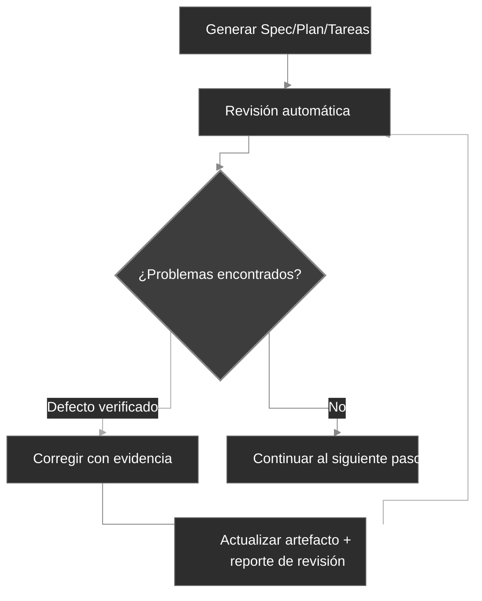

<div align="center">
  <picture>
    <source media="(prefers-color-scheme: dark)" srcset="codexspec-logo-dark.svg">
    <source media="(prefers-color-scheme: light)" srcset="codexspec-logo-light.svg">
    
  </picture>
</div>

<h1 align="center">CodexSpec</h1>

<p align="center">
  📖 <a href="README.es.md"><b>Español</b></a> | <a href="README.md">English</a> | <a href="README.zh-CN.md">中文</a> | <a href="README.ja.md">日本語</a> | <a href="README.pt-BR.md">Português</a> | <a href="README.ko.md">한국어</a> | <a href="README.de.md">Deutsch</a> | <a href="README.fr.md">Français</a>
</p>

<p align="center">
  <a href="https://pypi.org/project/codexspec/"></a>
  <a href="https://pypi.org/project/codexspec/"></a>
  <a href="https://opensource.org/licenses/MIT"></a>
</p>

<p align="center">
  <strong>Un toolkit Requirements-First SDD para Claude Code</strong>
</p>

CodexSpec te ayuda a construir software de alta calidad mediante **Requirements-First Spec-Driven Development (SDD)**: los requisitos confirmados van primero, y nada es vinculante hasta que tú lo confirmes de forma explícita.
En lugar de saltar directamente al código, confirmas **qué** construir y **por qué** antes de decidir **cómo** construirlo.

[📖 Documentación](https://zts0hg.github.io/codexspec/es/) | [Documentation](https://zts0hg.github.io/codexspec/) | [中文文档](https://zts0hg.github.io/codexspec/zh/) | [日本語ドキュメント](https://zts0hg.github.io/codexspec/ja/) | [한국어 문서](https://zts0hg.github.io/codexspec/ko/) | [Documentation](https://zts0hg.github.io/codexspec/fr/) | [Dokumentation](https://zts0hg.github.io/codexspec/de/) | [Documentação](https://zts0hg.github.io/codexspec/pt-BR/)

---

## Tabla de contenidos

- [¿Por qué elegir CodexSpec?](#por-qué-elegir-codexspec)
- [¿Qué es Requirements-First SDD?](#qué-es-requirements-first-sdd)
- [Filosofía de diseño: colaboración Humano-IA](#filosofía-de-diseño-colaboración-humano-ia)
- [Inicio rápido en 30 segundos](#-inicio-rápido-en-30-segundos)
- [Instalación](#instalación)
- [Flujo de trabajo central](#flujo-de-trabajo-central)
- [Comandos disponibles](#comandos-disponibles)
- [Comparación con spec-kit](#comparación-con-spec-kit)
- [Internacionalización (i18n)](#internacionalización-i18n)
- [Contribuir y licencia](#contribuir)

---

## ¿Por qué elegir CodexSpec?

¿Por qué usar CodexSpec encima de Claude Code? Aquí tienes la comparación:

| Aspecto | Solo Claude Code | CodexSpec + Claude Code |
|---------|------------------|-------------------------|
| **Soporte multiidioma** | Interacción en inglés por defecto | Configura el idioma del equipo para una colaboración y revisiones más fluidas |
| **Trazabilidad** | Difícil rastrear decisiones una vez finalizada la sesión | Todas las specs, planes y tareas quedan guardados en `.codexspec/specs/` |
| **Recuperación de sesión** | Las interrupciones del modo plan son difíciles de recuperar | División en múltiples comandos + documentación persistente = recuperación sencilla |
| **Gobernanza de equipo** | Sin principios unificados, estilos inconsistentes | `constitution.md` hace cumplir los estándares y la calidad del equipo |

---

## ¿Qué es Requirements-First SDD?

**Requirements-First SDD** es la metodología Spec-Driven Development (SDD) con una mejora: **los requisitos confirmados son la autoridad de máxima prioridad**. Defines y confirmas *qué* construir y *por qué* antes de decidir *cómo*, y nada se vuelve vinculante hasta que lo confirmes de forma explícita.

```
Tradicional:   Idea → Código → Debug → Reescribir
SDD:           Idea → Requisitos Confirmados → Spec → Plan → Tareas → Código
```

**¿Por qué usar Requirements-First SDD?**

| Problema                   | Solución de Requirements-First SDD                            |
| -------------------------- | ------------------------------------------------------------- |
| Malentendidos de la IA     | Los requisitos confirmados le dicen a la IA "qué construir"; la IA deja de adivinar |
| Requisitos faltantes       | Clarificación interactiva + una puerta de confirmación sacan a la luz los casos límite |
| Deriva de arquitectura     | Puntos de control de revisión aseguran la dirección correcta  |
| Retrabajo desperdiciado    | Los problemas se encuentran y confirman antes de escribir código |

<details>
<summary>✨ Características clave</summary>

### Flujo de trabajo central

- **Desarrollo basado en constitución** - Establece principios de proyecto que guían todas las decisiones
- **Captura persistente de requisitos** - `/specify` registra la discusión confirmada en `requirements.md` antes de la generación de documentos
- **Revisiones automáticas** - Cada artefacto generado (spec, plan y tareas) incluye verificaciones de calidad integradas
- **Tareas trazables** - Los desgloses de tareas conservan la cobertura de requisitos y del plan, aplicando test-first únicamente donde se requiera

### Colaboración Humano-IA

- **Comandos de revisión** - Comandos de revisión dedicados para spec, plan y tareas
- **Clarificación interactiva** - Refinamiento de requisitos basado en Q&A
- **Análisis entre artefactos** - Detecta inconsistencias antes de la implementación

### Experiencia de desarrollador

- **Integración nativa con Claude Code** - Los slash commands funcionan de forma fluida
- **Soporte multiidioma** - Más de 13 idiomas mediante traducción dinámica LLM
- **Multiplataforma** - Se incluyen scripts Bash y PowerShell
- **Extensible** - Arquitectura de plugins para comandos personalizados

</details>

---

## Filosofía de diseño: colaboración Humano-IA

CodexSpec se construye sobre la convicción de que **el desarrollo efectivo asistido por IA requiere participación humana activa en cada etapa**.

### Por qué importa la supervisión humana

| Sin revisiones                       | Con revisiones                            |
| ------------------------------------ | ----------------------------------------- |
| La IA hace suposiciones incorrectas  | Los humanos detectan malentendidos temprano |
| Los requisitos incompletos se propagan | Las brechas se identifican antes de la implementación |
| La arquitectura se desvía de la intención | La alineación se verifica en cada etapa |
| Las tareas pierden funcionalidad crítica | Validación sistemática de la cobertura |
| **Resultado: retrabajo, esfuerzo desperdiciado** | **Resultado: acertar a la primera** |

### El enfoque de CodexSpec

CodexSpec estructura el desarrollo en **puntos de control revisables**:

```
Idea → /specify → requirements.md → /generate-spec → spec.md → /spec-to-plan → plan.md → /plan-to-tasks → tasks.md → /implement
                                                   │                         │                            │
                                              Revisar spec              Revisar plan                 Revisar tareas
```

Los requisitos confirmados son la autoridad de funcionalidad de máxima prioridad. Los artefactos derivados incluyen enlaces explícitos a su origen, de modo que los conflictos pueden rastrearse hacia atrás en lugar de propagarse de forma silenciosa.

**Cada artefacto generado tiene un comando de revisión correspondiente:**

- `spec.md` → `/codexspec:review-spec`
- `plan.md` → `/codexspec:review-plan`
- `tasks.md` → `/codexspec:review-tasks`
- Todos los artefactos → `/codexspec:analyze`

Este proceso de revisión sistemático garantiza:

- **Detección temprana de errores**: Atrapar los malentendidos antes de escribir código
- **Verificación de alineación**: Confirmar que la interpretación de la IA coincide con tu intención
- **Puertas de calidad**: Validar completitud, claridad y viabilidad en cada etapa
- **Menos retrabajo**: Invertir minutos en revisión para ahorrar horas de reimplementación

---

## 🚀 Inicio rápido en 30 segundos

```bash
# 1. Instalar
uv tool install codexspec

# 2. Inicializar proyecto
#    Opción A: Crear un proyecto nuevo
codexspec init my-project && cd my-project

#    Opción B: Inicializar en un proyecto existente
cd your-existing-project && codexspec init .

# 3. Usar en Claude Code
claude
> /codexspec:constitution Crear principios enfocados en calidad de código y testing
> /codexspec:specify Quiero construir una aplicación de tareas
> /codexspec:generate-spec
> /codexspec:spec-to-plan
> /codexspec:plan-to-tasks
> /codexspec:implement-tasks
```

¡Eso es todo! Sigue leyendo para ver el flujo de trabajo completo.

---

## Instalación

### Requisitos previos

- Python 3.11+
- [uv](https://docs.astral.sh/uv/) (recomendado) o pip

### Instalación recomendada

```bash
# Usando uv (recomendado)
uv tool install codexspec

# O usando pip
pip install codexspec
```

### Verificar la instalación

```bash
codexspec --version
```

<details>
<summary>📦 Métodos de instalación alternativos</summary>

#### Uso puntual (sin instalación)

```bash
# Crear un proyecto nuevo
uvx codexspec init my-project

# Inicializar en un proyecto existente
cd your-existing-project
uvx codexspec init . --ai claude

# Inicializar para Codex CLI
uvx codexspec init . --ai codex
```

#### Instalar la versión de desarrollo desde GitHub

```bash
# Usando uv
uv tool install git+https://github.com/Zts0hg/codexspec.git

# Especificar rama o tag
uv tool install git+https://github.com/Zts0hg/codexspec.git@main
uv tool install git+https://github.com/Zts0hg/codexspec.git@v0.5.6
```

</details>

<details>
<summary>🪟 Notas para usuarios de Windows</summary>

**Recomendado: usar PowerShell**

```powershell
# 1. Instalar uv (si aún no está instalado)
powershell -c "irm https://astral.sh/uv/install.ps1 | iex"

# 2. Reiniciar PowerShell y luego instalar codexspec
uv tool install codexspec

# 3. Verificar la instalación
codexspec --version
```

**Solución de problemas en CMD**

Si encuentras errores de "Acceso denegado":

1. Cierra todas las ventanas de CMD y vuelve a abrirlas
2. O actualiza manualmente el PATH: `set PATH=%PATH%;%USERPROFILE%\.local\bin`
3. O usa la ruta completa: `%USERPROFILE%\.local\bin\codexspec.exe --version`

Para una solución de problemas detallada, consulta la [Guía de solución de problemas de Windows](docs/WINDOWS-TROUBLESHOOTING.md).

</details>

### Actualizar

```bash
# Usando uv
uv tool install codexspec --upgrade

# Usando pip
pip install --upgrade codexspec
```

### Instalación desde el Marketplace de Plugins (alternativa)

CodexSpec también está disponible como plugin de Claude Code. Este método es ideal si quieres usar los comandos de CodexSpec directamente en Claude Code sin la herramienta CLI.

#### Pasos de instalación

```bash
# En Claude Code, añadir el marketplace
> /plugin marketplace add Zts0hg/codexspec

# Instalar el plugin
> /plugin install codexspec@codexspec-market
```

#### Configuración de idioma para usuarios del plugin

Tras instalar desde el Marketplace de Plugins, configura tu idioma preferido con el comando `/codexspec:config`:

```bash
# Iniciar configuración interactiva
> /codexspec:config

# O ver la configuración actual
> /codexspec:config --view
```

El comando config te guiará a través de:

1. Seleccionar el idioma de salida (para los documentos generados)
2. Seleccionar el idioma de los mensajes de commit
3. Crear el archivo `.codexspec/config.yml`

**Comparación de métodos de instalación**

| Método | Ideal para | Características |
|--------|------------|-----------------|
| **Instalación CLI** (`uv tool install`) | Flujo de desarrollo completo | Comandos CLI (`init`, `check`, `config`) + slash commands |
| **Marketplace de Plugins** | Inicio rápido, proyectos existentes | Solo slash commands (usa `/codexspec:config` para la configuración de idioma) |

**Nota**: El plugin usa el modo `strict: false` y reutiliza el soporte multiidioma existente mediante traducción dinámica LLM.

---

## Flujo de trabajo central

CodexSpec descompone el desarrollo en **puntos de control revisables**:

```
Idea → /specify → requirements.md → /generate-spec → spec.md → /spec-to-plan → plan.md → /plan-to-tasks → tasks.md → /implement
                                                   │                         │                            │
                                              Revisar spec              Revisar plan                 Revisar tareas
```

### Pasos del flujo de trabajo

| Paso                            | Comando                      | Salida                       | Verificación humana |
| ------------------------------- | ---------------------------- | ---------------------------- | ------------------- |
| 1. Principios del proyecto      | `/codexspec:constitution`    | `constitution.md`            | ✅                  |
| 2. Clarificación de requisitos  | `/codexspec:specify`         | `requirements.md`            | ✅                  |
| 3. Generar spec                 | `/codexspec:generate-spec`   | `spec.md` + auto-revisión    | ✅                  |
| 4. Planificación técnica        | `/codexspec:spec-to-plan`    | `plan.md` + auto-revisión    | ✅                  |
| 5. Desglose de tareas           | `/codexspec:plan-to-tasks`   | `tasks.md` + auto-revisión   | ✅                  |
| 6. Análisis entre artefactos    | `/codexspec:analyze`         | Reporte de análisis          | ✅                  |
| 7. Implementación               | `/codexspec:implement-tasks` | Código                       | -                   |

### specify vs clarify: ¿cuándo usar cuál?

| Aspecto | `/codexspec:specify` | `/codexspec:clarify` |
|---------|----------------------|----------------------|
| **Propósito** | Exploración y confirmación inicial de requisitos | Refinar los requisitos confirmados o la spec derivada |
| **Cuándo usarlo** | Al empezar una funcionalidad | Cuando los requisitos o la spec necesitan aclararse |
| **Salida** | Crea/actualiza `requirements.md` | Actualiza primero `requirements.md` y luego sincroniza `spec.md` |
| **Método** | Q&A abierto | Escaneo estructurado (4 categorías) |
| **Preguntas** | Sin límite | Máximo 5 por ejecución |

### Concepto clave: bucle de calidad iterativo

Cada comando de generación incluye **revisión automática**. Los defectos verificados pueden corregirse y volver a revisarse durante un máximo de dos rondas; las sugerencias consultivas se mantienen separadas y nunca desencadenan cambios automáticos.

1. Revisar el reporte
2. Describir en lenguaje natural los problemas a corregir
3. El sistema actualiza automáticamente specs y reportes de revisión



<details>
<summary>📖 Descripción detallada del flujo de trabajo</summary>

### 1. Inicializar el proyecto

```bash
codexspec init my-awesome-project
cd my-awesome-project
claude
```

### 2. Establecer los principios del proyecto

```
/codexspec:constitution Crear principios enfocados en calidad de código, estándares de testing y arquitectura limpia
```

### 3. Clarificar requisitos

```
/codexspec:specify Quiero construir una aplicación de gestión de tareas
```

Este comando:

- Hará preguntas de clarificación para entender tu idea
- Explorará casos límite que quizás no habías considerado
- Te pedirá confirmar el resumen final de requisitos
- Persistirá en `requirements.md` las necesidades, restricciones, decisiones, exclusiones y preguntas abiertas confirmadas

### 4. Generar el documento de especificación

Una vez clarificados los requisitos:

```
/codexspec:generate-spec
```

Este comando:

- Compila las entradas confirmadas de `requirements.md` en una especificación estructurada
- Añade referencias de origen para la trazabilidad de los requisitos
- **Automáticamente** ejecuta la revisión y genera `review-spec.md`

### 5. Crear el plan técnico

```
/codexspec:spec-to-plan Usar Python con FastAPI para el backend, PostgreSQL para la base de datos y React para el frontend
```

Usa únicamente las secciones de planificación relevantes, registra enlaces `Covers` hacia los requisitos de la especificación y verifica los principios de proyecto aplicables.

### 6. Generar tareas

```
/codexspec:plan-to-tasks
```

Las tareas se organizan en torno a resultados verificables:

- **Testing condicional**: El orden test-first se aplica solo cuando lo exige el plan, la constitución o el riesgo de la tarea
- **Marcadores de paralelismo `[P]`**: Se usan solo para tareas genuinamente independientes
- **Especificaciones de rutas de archivo**: Entregables claros por tarea
- **Trazabilidad**: Cada tarea enlaza con el plan y los requisitos que cubre

### 7. Análisis entre artefactos (opcional pero recomendado)

```
/codexspec:analyze
```

Detecta problemas entre requisitos, spec, plan y tareas:

- Brechas de cobertura (requisitos sin tareas)
- Duplicaciones e inconsistencias
- Violaciones de la constitución
- Elementos subespecificados

### 8. Implementación

```
/codexspec:implement-tasks
```

La implementación sigue un **flujo de trabajo TDD condicional**:

- Tareas de código: Test-first (Rojo → Verde → Verificar → Refactorizar)
- Tareas no testeables (docs, configuración): Implementación directa

</details>

---

## Comandos disponibles

### Comandos CLI

| Comando             | Descripción                     |
| ------------------- | ------------------------------- |
| `codexspec init`    | Inicializar un proyecto nuevo   |
| `codexspec check`   | Verificar las herramientas instaladas |
| `codexspec version` | Mostrar información de versión  |
| `codexspec config`  | Ver o modificar la configuración |

<details>
<summary>📋 Opciones de init</summary>

| Opción               | Descripción                                                       |
| -------------------- | ----------------------------------------------------------------- |
| `PROJECT_NAME`       | Nombre del directorio del proyecto (`.` o `--here` para el directorio actual) |
| `--here`, `-h`       | Inicializar en el directorio actual                               |
| `--ai`, `-a`         | Asistente de IA a usar: `claude`, `codex` o `both` (por defecto: claude) |
| `--lang`, `-l`       | Idioma (base) de salida; interaction/document/commit hacen fallback a él (p. ej. en, zh-CN, ja) |
| `--interaction-lang` | Idioma de interacción (diálogo LLM + salida del CLI); sobrescribe `--lang` |
| `--document-lang`    | Idioma de los documentos (spec/plan/tasks generados); sobrescribe `--lang` |
| `--commit-lang`      | Idioma de los mensajes de commit; sobrescribe `--lang`           |
| `--force`, `-f`      | Sobrescribir archivos + autoconfirmar prompts; nunca regenera `config.yml` |
| `--no-git`           | Omitir la inicialización del repositorio git                      |
| `--debug`, `-d`      | Habilitar salida de depuración                                    |

</details>

<details>
<summary>📋 Opciones de config</summary>

| Opción                     | Descripción                                |
| -------------------------- | ------------------------------------------ |
| `--set-lang`, `-l`         | Establecer el idioma (base) de salida      |
| `--set-interaction-lang`   | Establecer el idioma de interacción        |
| `--set-document-lang`      | Establecer el idioma de los documentos     |
| `--set-commit-lang`, `-c`  | Establecer el idioma de los mensajes de commit |
| `--list-langs`             | Listar todos los idiomas soportados        |
| `--auto-next`              | Alternar/establecer `workflow.auto_next` (sin valor alterna; o on/off) |

</details>

### Slash commands

#### Comandos del flujo de trabajo central

| Comando                      | Descripción                                                       |
| ---------------------------- | ----------------------------------------------------------------- |
| `/codexspec:constitution`    | Crear/actualizar la constitución del proyecto con validación entre artefactos |
| `/codexspec:specify`         | Clarificar, confirmar y persistir los requisitos en `requirements.md` |
| `/codexspec:generate-spec`   | Generar el documento `spec.md` ★ Auto-revisión                    |
| `/codexspec:spec-to-plan`    | Convertir la spec en un plan técnico ★ Auto-revisión              |
| `/codexspec:plan-to-tasks`   | Desglosar el plan en tareas trazables y verificables ★ Auto-revisión |
| `/codexspec:implement-tasks` | Ejecutar las tareas (TDD condicional)                             |

#### Comandos de revisión (puertas de calidad)

| Comando                  | Descripción                              |
| ------------------------ | ---------------------------------------- |
| `/codexspec:review-spec`  | Revisar la especificación (auto o manual) |
| `/codexspec:review-plan`  | Revisar el plan técnico (auto o manual)  |
| `/codexspec:review-tasks` | Revisar el desglose de tareas (auto o manual) |

#### Comandos de mejora

| Comando                      | Descripción                                                     |
| ---------------------------- | --------------------------------------------------------------- |
| `/codexspec:config`          | Gestionar la configuración del proyecto (crear/ver/modificar/restablecer) |
| `/codexspec:clarify`         | Escanear la spec en busca de ambigüedades (4 categorías, máx. 5 preguntas) |
| `/codexspec:analyze`         | Análisis de consistencia entre artefactos (solo lectura, basado en severidad) |
| `/codexspec:checklist`       | Generar listas de verificación de calidad para validar los requisitos           |
| `/codexspec:tasks-to-issues` | Convertir tareas en GitHub Issues                               |

#### Comandos del flujo de trabajo Git

| Comando                    | Descripción                                       |
| -------------------------- | ------------------------------------------------- |
| `/codexspec:commit-staged` | Generar un mensaje de commit a partir de los cambios preparados |
| `/codexspec:pr`            | Generar la descripción de PR/MR (autodetección de plataforma) |

#### Comandos de revisión de código

| Comando                     | Descripción                                                     |
| --------------------------- | --------------------------------------------------------------- |
| `/codexspec:review-code`    | Puerta de defectos para cambios; puntuación por ruta con `--audit` |

---

## Comparación con spec-kit

CodexSpec está inspirado en GitHub spec-kit, con algunas diferencias clave:

| Característica          | spec-kit                   | CodexSpec                                       |
| ----------------------- | -------------------------- | ----------------------------------------------- |
| Filosofía central       | Desarrollo guiado por specs | Requirements-First SDD + colaboración Humano-IA |
| Nombre del CLI          | `specify`                  | `codexspec`                                     |
| IA principal            | Soporte multiagente        | Enfocado en Claude Code                         |
| Sistema de constitución | Básico                     | Constitución completa + validación entre artefactos |
| Spec en dos fases       | No                         | Sí (clarificar + generar)                       |
| Comandos de revisión    | Opcional                   | 3 comandos de revisión dedicados + puntuación   |
| Comando clarify         | Sí                         | 4 categorías enfocadas, integración con revisión |
| Comando analyze         | Sí                         | Solo lectura, basado en severidad, consciente de la constitución |
| TDD en tareas           | Opcional                   | Condicional según requisitos, riesgo y política |
| Implementación          | Estándar                   | TDD condicional (código vs. docs/configuración) |
| Sistema de extensiones  | Sí                         | Sí                                              |
| Scripts de PowerShell   | Sí                         | Sí                                              |
| Soporte i18n            | No                         | Sí (más de 13 idiomas mediante traducción LLM)  |

### Diferenciadores clave

1. **Cultura de revisión primero**: Cada artefacto principal tiene un comando de revisión dedicado
2. **Gobernanza por constitución**: Los principios se validan, no solo se documentan
3. **Revisión basada en evidencia**: Los defectos requieren evidencia concreta; las ideas de diseño consultivas no afectan la aceptación
4. **Puerta de confirmación**: Los requisitos, specs, planes y tareas se vuelven vinculantes únicamente tras la confirmación humana explícita

---

## Internacionalización (i18n)

CodexSpec soporta múltiples idiomas mediante **traducción dinámica LLM**. No hay plantillas de traducción que mantener: Claude traduce el contenido en tiempo de ejecución según tu configuración de idioma.

### Dimensiones de idioma

CodexSpec divide el idioma en cuatro dimensiones configurables de forma independiente. `output` es la base; las demás la sobrescriben y, si no se establecen, hacen fallback a ella (y luego a `en`). Así puedes conversar con Claude en un idioma mientras mantienes los artefactos generados o los mensajes de commit en otro.

| Dimensión       | Clave `config.yml` | Establecer en init    | Establecer después              | Controla                        | Fallback a       |
| --------------- | ------------------ | --------------------- | ------------------------------- | ------------------------------- | ---------------- |
| Output (base)   | `output`           | `--lang`              | `config --set-lang`             | base para las otras tres        | `en`             |
| Interaction     | `interaction`      | `--interaction-lang`  | `config --set-interaction-lang` | diálogo LLM + salida del CLI    | output → `en`    |
| Document        | `document`         | `--document-lang`     | `config --set-document-lang`    | spec/plan/tasks generados       | output → `en`    |
| Commit          | `commit`           | `--commit-lang`       | `config --set-commit-lang`      | mensajes de commit de git       | output → `en`    |
| Templates       | `templates`        | —                     | —                               | origen de plantillas (siempre `en`) | —                |

### Establecer el idioma

**Durante la inicialización:**

```bash
# Salida en chino (establece la base de output)
codexspec init my-project --lang zh-CN

# Totalmente no interactivo: base zh-CN, mensajes de commit en inglés
codexspec init my-project --lang zh-CN --commit-lang en

# Establecer cada dimensión explícitamente (scriptable, sin prompts)
codexspec init my-project \
  --interaction-lang zh-CN --document-lang en --commit-lang en
```

La primera inicialización en una TTY sin `--lang` (y sin las tres flags de dimensión) solicita un idioma base; en una no-TTY (CI/scripts) el valor por defecto es `en`. Volver a ejecutar `init` preserva cualquier clave de idioma que no hayas especificado.

**Después de la inicialización:**

```bash
# Ver la configuración actual
codexspec config

# Cambiar una sola dimensión
codexspec config --set-lang zh-CN
codexspec config --set-interaction-lang zh-CN
codexspec config --set-document-lang en
codexspec config --set-commit-lang en
codexspec config --auto-next
```

### Idiomas soportados

| Código  | Idioma             |
| ------- | ------------------ |
| `en`    | English (por defecto) |
| `zh-CN` | 简体中文            |
| `zh-TW` | 繁體中文            |
| `ja`    | 日本語              |
| `ko`    | 한국어              |
| `es`    | Español            |
| `fr`    | Français           |
| `de`    | Deutsch            |
| `pt-BR` | Português          |
| `ru`    | Русский            |
| `it`    | Italiano           |
| `ar`    | العربية            |
| `hi`    | हिन्दी               |

<details>
<summary>⚙️ Ejemplo de archivo de configuración</summary>

`.codexspec/config.yml`:

```yaml
version: "1.0"

language:
  output: "zh-CN"        # Idioma base; los tres siguientes hacen fallback a él, luego a "en"
  interaction: "zh-CN"   # Diálogo LLM + salida del CLI codexspec (opcional → por defecto output)
  document: "en"         # requirements/spec/plan/tasks generados (opcional → por defecto output)
  commit: "en"           # Mensajes de commit de git (opcional → por defecto output)
  templates: "en"        # Mantener como "en"

project:
  ai: "claude"
  created: "2025-02-15"
```

</details>

---

## Estructura del proyecto

Estructura del proyecto tras la inicialización:

```
my-project/
├── .codexspec/
│   ├── memory/
│   │   └── constitution.md    # Constitución del proyecto
│   ├── specs/
│   │   └── {feature-id}/
│   │       ├── spec.md        # Especificación de la funcionalidad
│   │       ├── plan.md        # Plan técnico
│   │       ├── tasks.md       # Desglose de tareas
│   │       └── checklists/    # Listas de verificación de calidad
│   ├── templates/             # Plantillas personalizadas
│   ├── scripts/               # Scripts de ayuda
│   └── extensions/            # Extensiones personalizadas
├── .claude/
│   └── commands/              # Slash commands para Claude Code
├── .agents/
│   └── skills/                # Skills de Codex (cuando se inicializa con --ai codex o both)
├── CLAUDE.md                  # Contexto para Claude Code
└── AGENTS.md                  # Contexto para Codex
```

---

## Sistema de extensiones

CodexSpec soporta una arquitectura de plugins para añadir comandos personalizados:

```
my-extension/
├── extension.yml          # Manifiesto de la extensión
├── commands/              # Slash commands personalizados
│   └── command.md
└── README.md
```

Consulta `extensions/EXTENSION-DEVELOPMENT-GUIDE.md` para más detalles.

---

## Desarrollo

### Requisitos previos

- Python 3.11+
- Gestor de paquetes uv
- Git

### Desarrollo local

```bash
# Clonar el repositorio
git clone https://github.com/Zts0hg/codexspec.git
cd codexspec

# Instalar dependencias de desarrollo
uv sync --dev

# Ejecutar localmente
uv run codexspec --help

# Ejecutar las pruebas
uv run pytest

# Revisar el código con el linter
uv run ruff check src/

# Compilar el paquete
uv build
```

---

## Contribuir

¡Las contribuciones son bienvenidas! Por favor, lee las guías de contribución antes de enviar un pull request.

## Licencia

Licencia MIT - ver [LICENSE](LICENSE) para más detalles.

## Agradecimientos

- Inspirado en [GitHub spec-kit](https://github.com/github/spec-kit)
- Construido para [Claude Code](https://claude.ai/code)
