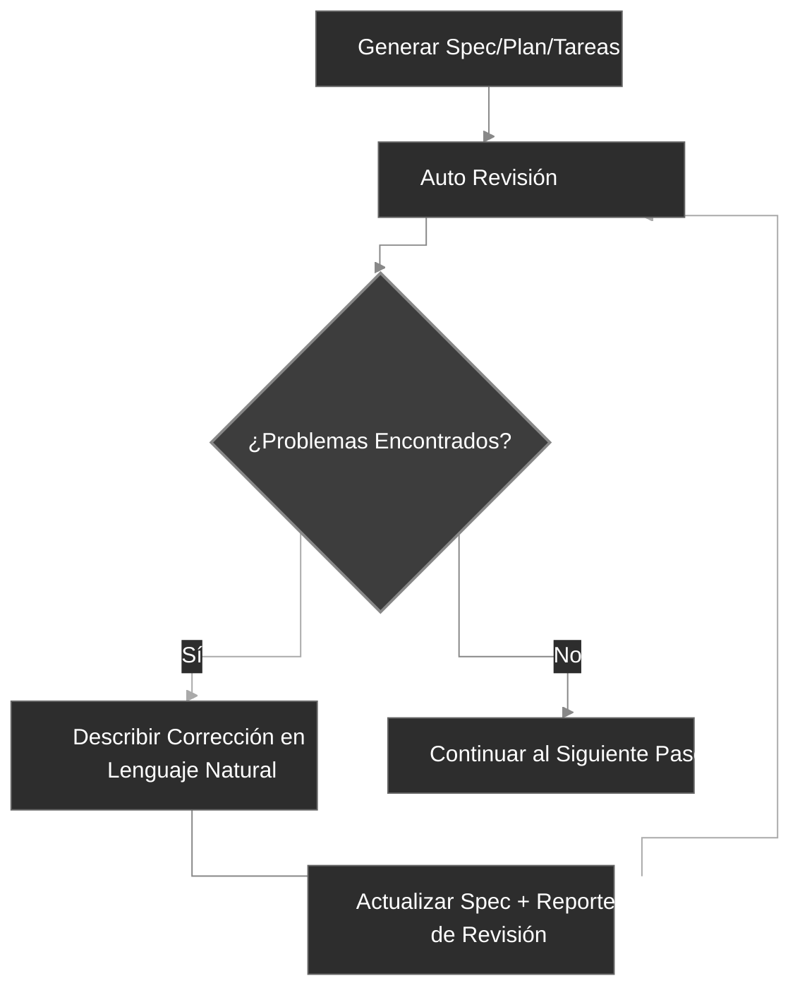

<div align="center">
  <picture>
    <source media="(prefers-color-scheme: dark)" srcset="codexspec-logo-dark.svg">
    <source media="(prefers-color-scheme: light)" srcset="codexspec-logo-light.svg">
    
  </picture>
</div>

<h1 align="center">CodexSpec</h1>

<p align="center">
  <a href="README.md">English</a> | <a href="README.zh-CN.md">中文</a> | <a href="README.ja.md">日本語</a> | <b>Español</b> | <a href="README.pt-BR.md">Português</a> | <a href="README.ko.md">한국어</a> | <a href="README.de.md">Deutsch</a> | <a href="README.fr.md">Français</a>
</p>

<p align="center">
  <a href="https://pypi.org/project/codexspec/"></a>
  <a href="https://pypi.org/project/codexspec/"></a>
  <a href="https://opensource.org/licenses/MIT"></a>
</p>

<p align="center">
  <strong>Un toolkit Requirements-First SDD para Claude Code</strong>
</p>

CodexSpec te ayuda a construir software de alta calidad utilizando un enfoque estructurado y guiado por especificaciones. Antes de decidir **cómo** construir, define **qué** construir y **por qué**.

[📖 Documentación](https://zts0hg.github.io/codexspec/es/) | [Documentation](https://zts0hg.github.io/codexspec/en/) | [中文文档](https://zts0hg.github.io/codexspec/zh/) | [日本語ドキュメント](https://zts0hg.github.io/codexspec/ja/) | [한국어 문서](https://zts0hg.github.io/codexspec/ko/) | [Documentation](https://zts0hg.github.io/codexspec/fr/) | [Dokumentation](https://zts0hg.github.io/codexspec/de/) | [Documentação](https://zts0hg.github.io/codexspec/pt-BR/)

---

## Tabla de Contenidos

- [¿Por qué elegir CodexSpec?](#por-qué-elegir-codexspec)
- [¿Qué es el Desarrollo Guiado por Especificaciones?](#qué-es-el-desarrollo-guiado-por-especificaciones)
- [Filosofía de Diseño: Colaboración Humano-AI](#filosofía-de-diseño-colaboración-humano-ai)
- [Inicio Rápido en 30 Segundos](#-inicio-rápido-en-30-segundos)
- [Instalación](#instalación)
- [Flujo de Trabajo Central](#flujo-de-trabajo-central)
- [Comandos Disponibles](#comandos-disponibles)
- [Comparación con spec-kit](#comparación-con-spec-kit)
- [Internacionalización](#internacionalización-i18n)
- [Contribuir y Licencia](#contribuir)

---

## ¿Por qué elegir CodexSpec?

¿Por qué usar CodexSpec sobre Claude Code? Aquí está la comparación:

| Aspecto | Solo Claude Code | CodexSpec + Claude Code |
|---------|------------------|-------------------------|
| **Soporte Multiidioma** | Interacción en inglés por defecto | Configura el idioma del equipo para una colaboración y revisión más fluida |
| **Trazabilidad** | Difícil rastrear decisiones después de que termina la sesión | Todos los specs, planes y tareas guardados en `.codexspec/specs/` |
| **Recuperación de Sesión** | Difícil recuperarse de interrupciones del modo plan | División en múltiples comandos + docs persistentes = fácil recuperación |
| **Gobernanza de Equipo** | Sin principios unificados, estilos inconsistentes | `constitution.md` aplica estándares y calidad del equipo |

---

## ¿Qué es el Desarrollo Guiado por Especificaciones?

**Desarrollo Guiado por Especificaciones (SDD)** es una metodología de "especificaciones primero, código después":

```
Desarrollo Tradicional:  Idea → Código → Debug → Reescribir
SDD:                      Idea → Spec → Plan → Tareas → Código
```

**¿Por qué usar SDD?**

| Problema | Solución SDD |
|----------|--------------|
| Malentendidos de IA | Las specs clarifican "qué construir", la IA deja de adivinar |
| Requisitos faltantes | Clarificación interactiva descubre casos límite |
| Deriva de arquitectura | Puntos de control de revisión aseguran dirección correcta |
| Retrabajo desperdiciado | Problemas encontrados antes de escribir código |

<details>
<summary>✨ Características Clave</summary>

### Flujo de Trabajo SDD Central

- **Desarrollo Basado en Constitución** - Establecer principios de proyecto que guían todas las decisiones
- **Especificación en Dos Fases** - Clarificación interactiva (`/specify`) seguida de generación de documento (`/generate-spec`)
- **Revisiones Automáticas** - Cada artefacto incluye verificaciones de calidad integradas
- **Tareas Preparadas para TDD** - Desgloses de tareas aplican metodología test-first

### Colaboración Humano-AI

- **Comandos de Revisión** - Comandos de revisión dedicados para spec, plan y tareas
- **Clarificación Interactiva** - Refinamiento de requisitos basado en Q&A
- **Análisis Entre Artefactos** - Detectar inconsistencias antes de implementación

### Experiencia del Desarrollador

- **Integración Nativa con Claude Code** - Comandos slash funcionan sin problemas
- **Soporte Multiidioma** - 13+ idiomas mediante traducción dinámica LLM
- **Multiplataforma** - Scripts Bash y PowerShell incluidos
- **Extensible** - Arquitectura de plugins para comandos personalizados

</details>

---

## Filosofía de Diseño: Colaboración Humano-AI

CodexSpec está construido sobre la creencia de que **el desarrollo efectivo asistido por IA requiere participación humana activa en cada etapa**.

### Por Qué Importa la Supervisión Humana

| Sin Revisión | Con Revisión |
|--------------|--------------|
| La IA hace suposiciones incorrectas | El humano captura malas interpretaciones temprano |
| Requisitos incompletos se propagan | Brechas identificadas antes de implementación |
| La arquitectura se desvía de la intención | Alineación verificada en cada etapa |
| Las tareas pierden funcionalidad crítica | Cobertura validada sistemáticamente |
| **Resultado: Retrabajo, esfuerzo desperdiciado** | **Resultado: Correcto a la primera** |

### El Enfoque de CodexSpec

CodexSpec estructura el desarrollo en **puntos de control revisables**:

```
Idea → /specify → /generate-spec → /spec-to-plan → /plan-to-tasks → /implement
                         │                  │                │
                    Revisar spec        Revisar plan     Revisar tareas
                         │                  │                │
                      ✅ Humano           ✅ Humano         ✅ Humano
```

**Cada artefacto tiene un comando de revisión correspondiente:**

- `spec.md` → `/codexspec:review-spec`
- `plan.md` → `/codexspec:review-plan`
- `tasks.md` → `/codexspec:review-tasks`
- Todos los artefactos → `/codexspec:analyze`

Este proceso de revisión sistemático asegura:

- **Detección temprana de errores**: Capturar malentendidos antes de escribir código
- **Verificación de alineación**: Confirmar que la interpretación de la IA coincide con tu intención
- **Puertas de calidad**: Validar completitud, claridad y viabilidad en cada etapa
- **Reducción de retrabajo**: Invertir minutos en revisión para ahorrar horas de reimplementación

---

## 🚀 Inicio Rápido en 30 Segundos

```bash
# 1. Instalar
uv tool install codexspec

# 2. Inicializar proyecto
#    Opción A: Crear nuevo proyecto
codexspec init my-project && cd my-project

#    Opción B: Inicializar en proyecto existente
cd your-existing-project && codexspec init .

# 3. Usar en Claude Code
claude
> /codexspec:constitution Crear principios enfocados en calidad de código y testing
> /codexspec:specify Quiero construir una app de tareas
> /codexspec:generate-spec
> /codexspec:spec-to-plan
> /codexspec:plan-to-tasks
> /codexspec:implement-tasks
```

¡Eso es todo! Continúa leyendo para el flujo de trabajo completo.

---

## Instalación

### Requisitos previos

- Python 3.11+
- [uv](https://docs.astral.sh/uv/) (recomendado) o pip

### Instalación Recomendada

```bash
# Usando uv (recomendado)
uv tool install codexspec

# O usando pip
pip install codexspec
```

### Verificar Instalación

```bash
codexspec --version
```

<details>
<summary>📦 Métodos de Instalación Alternativos</summary>

#### Uso Único (Sin Instalación)

```bash
# Crear nuevo proyecto
uvx codexspec init my-project

# Inicializar en proyecto existente
cd your-existing-project
uvx codexspec init . --ai claude
```

#### Instalar Versión de Desarrollo desde GitHub

```bash
# Usando uv
uv tool install git+https://github.com/Zts0hg/codexspec.git

# Especificar rama o tag
uv tool install git+https://github.com/Zts0hg/codexspec.git@main
uv tool install git+https://github.com/Zts0hg/codexspec.git@v0.5.6
```

</details>

<details>
<summary>🪟 Notas para Usuarios de Windows</summary>

**Recomendado: Usar PowerShell**

```powershell
# 1. Instalar uv (si aún no está instalado)
powershell -c "irm https://astral.sh/uv/install.ps1 | iex"

# 2. Reiniciar PowerShell, luego instalar codexspec
uv tool install codexspec

# 3. Verificar la instalación
codexspec --version
```

**Solución de Problemas para Usuarios de CMD**

Si encuentras errores de "Acceso denegado":

1. Cerrar todas las ventanas de CMD y abrir una nueva
2. O actualizar manualmente PATH: `set PATH=%PATH%;%USERPROFILE%\.local\bin`
3. O usar ruta completa: `%USERPROFILE%\.local\bin\codexspec.exe --version`

Para más detalles, consulta la [Guía de Solución de Problemas de Windows](docs/WINDOWS-TROUBLESHOOTING.md) (en inglés).

</details>

### Actualizar

```bash
# Usando uv
uv tool install codexspec --upgrade

# Usando pip
pip install --upgrade codexspec
```

### Instalación desde el Mercado de Plugins (Alternativa)

CodexSpec también está disponible como un plugin de Claude Code. Este método es ideal si deseas usar los comandos de CodexSpec directamente en Claude Code sin la herramienta CLI.

#### Pasos de Instalación

```bash
# En Claude Code, añadir el mercado
> /plugin marketplace add Zts0hg/codexspec

# Instalar el plugin
> /plugin install codexspec@codexspec-market
```

#### Configuración de Idioma para Usuarios de Plugin

Después de instalar desde el Mercado de Plugins, configura tu idioma preferido usando el comando `/codexspec:config`:

```bash
# Iniciar configuración interactiva
> /codexspec:config

# O ver la configuración actual
> /codexspec:config --view
```

El comando config te guiará a través de:

1. Seleccionar idioma de salida (para documentos generados)
2. Seleccionar idioma de mensajes de commit
3. Crear el archivo `.codexspec/config.yml`

**Comparación de Métodos de Instalación**

| Método | Mejor Para | Características |
|--------|-----------|-----------------|
| **Instalación CLI** (`uv tool install`) | Flujo de desarrollo completo | Comandos CLI (`init`, `check`, `config`) + comandos slash |
| **Mercado de Plugins** | Inicio rápido, proyectos existentes | Solo comandos slash (usar `/codexspec:config` para configuración de idioma) |

**Nota**: El plugin usa el modo `strict: false` y reutiliza el soporte multiidioma existente mediante traducción dinámica LLM.

---

## Flujo de Trabajo Central

CodexSpec descompone el desarrollo en **puntos de control revisables**:

```
Idea → /specify → /generate-spec → /spec-to-plan → /plan-to-tasks → /implement
                         │                  │                │
                    Revisar spec        Revisar plan     Revisar tareas
                         │                  │                │
                      ✅ Humano           ✅ Humano         ✅ Humano
```

### Pasos del Flujo de Trabajo

| Paso | Comando | Salida | Chequeo Humano |
|------|---------|--------|----------------|
| 1. Principios del Proyecto | `/codexspec:constitution` | `constitution.md` | ✅ |
| 2. Clarificación de Requisitos | `/codexspec:specify` | Ninguno (diálogo interactivo) | ✅ |
| 3. Generar Spec | `/codexspec:generate-spec` | `spec.md` + auto-revisión | ✅ |
| 4. Planificación Técnica | `/codexspec:spec-to-plan` | `plan.md` + auto-revisión | ✅ |
| 5. Desglose de Tareas | `/codexspec:plan-to-tasks` | `tasks.md` + auto-revisión | ✅ |
| 6. Análisis Entre Artefactos | `/codexspec:analyze` | Reporte de análisis | ✅ |
| 7. Implementación | `/codexspec:implement-tasks` | Código | - |

### specify vs clarify: ¿Cuál usar cuándo?

| Aspecto | `/codexspec:specify` | `/codexspec:clarify` |
|---------|----------------------|----------------------|
| **Propósito** | Exploración inicial de requisitos | Refinamiento iterativo de spec existente |
| **Cuándo usar** | spec.md aún no existe | spec.md necesita mejoras |
| **Salida** | Ninguna (solo diálogo) | Actualiza spec.md |
| **Método** | Q&A abierto | Escaneo estructurado (4 categorías) |
| **Preguntas** | Sin límite | Máximo 5 |

### Concepto Clave: Bucle de Calidad Iterativo

Cada comando de generación incluye **revisión automática**, generando un reporte de revisión. Puedes:

1. Revisar el reporte
2. Describir problemas a corregir en lenguaje natural
3. El sistema actualiza automáticamente specs y reportes de revisión



<details>
<summary>📖 Descripción Detallada del Flujo de Trabajo</summary>

### 1. Inicializar un Proyecto

```bash
codexspec init my-awesome-project
cd my-awesome-project
claude
```

### 2. Establecer Principios del Proyecto

```
/codexspec:constitution Crear principios enfocados en calidad de código, estándares de testing y arquitectura limpia
```

### 3. Clarificar Requisitos

```
/codexspec:specify Quiero construir una aplicación de gestión de tareas
```

Este comando:

- Hará preguntas de clarificación para entender tu idea
- Explorará casos límite que quizás no hayas considerado
- **NO** generará archivos automáticamente - tú mantienes el control

### 4. Generar Documento de Especificación

Una vez clarificados los requisitos:

```
/codexspec:generate-spec
```

Este comando:

- Compila requisitos clarificados en especificación estructurada
- **Automáticamente** ejecuta revisión y genera `review-spec.md`

### 5. Crear un Plan Técnico

```
/codexspec:spec-to-plan Usar Python con FastAPI para el backend, PostgreSQL para la base de datos y React para el frontend
```

Incluye **revisión de constitucionalidad** - verificando que tu plan se alinea con los principios del proyecto.

### 6. Generar Tareas

```
/codexspec:plan-to-tasks
```

Las tareas se organizan en fases estándar con:

- **Aplicación de TDD**: Las tareas de test preceden a las de implementación
- **Marcadores de paralelismo `[P]`**: Identifican tareas independientes
- **Especificaciones de rutas de archivo**: Entregables claros por tarea

### 7. Análisis Entre Artefactos (Opcional pero Recomendado)

```
/codexspec:analyze
```

Detecta problemas entre spec, plan y tareas:

- Brechas de cobertura (requisitos sin tareas)
- Duplicaciones e inconsistencias
- Violaciones de constitución
- Elementos subespecificados

### 8. Implementar

```
/codexspec:implement-tasks
```

La implementación sigue **flujo de trabajo TDD condicional**:

- Tareas de código: Test-first (Rojo → Verde → Verificar → Refactorizar)
- Tareas no testeables (docs, config): Implementación directa

</details>

---

## Comandos Disponibles

### Comandos CLI

| Comando | Descripción |
|---------|-------------|
| `codexspec init` | Inicializar un nuevo proyecto |
| `codexspec check` | Verificar herramientas instaladas |
| `codexspec version` | Mostrar información de versión |
| `codexspec config` | Ver o modificar configuración |

<details>
<summary>📋 Opciones de init</summary>

| Opción | Descripción |
|--------|-------------|
| `PROJECT_NAME` | Nombre del directorio del proyecto (`.` o `--here` para el directorio actual) |
| `--here`, `-h` | Inicializar en el directorio actual |
| `--ai`, `-a` | Asistente de IA a usar (por defecto: claude) |
| `--lang`, `-l` | Idioma base de salida; interaction/document/commit caen a él (ej: en, zh-CN, ja) |
| `--interaction-lang` | Idioma de interacción (diálogo LLM + salida del CLI); sobrescribe `--lang` |
| `--document-lang` | Idioma de documentos (spec/plan/tasks generados); sobrescribe `--lang` |
| `--commit-lang` | Idioma de mensajes de commit; sobrescribe `--lang` |
| `--force`, `-f` | Sobrescribir archivos + autoconfirmar prompts; nunca regenera `config.yml` |
| `--no-git` | Saltar inicialización de git |
| `--debug`, `-d` | Habilitar salida de depuración |

</details>

<details>
<summary>📋 Opciones de config</summary>

| Opción | Descripción |
|--------|-------------|
| `--set-lang`, `-l` | Establecer el idioma base de salida |
| `--set-interaction-lang` | Establecer el idioma de interacción |
| `--set-document-lang` | Establecer el idioma de documentos |
| `--set-commit-lang`, `-c` | Establecer el idioma de los mensajes de commit |
| `--list-langs` | Listar todos los idiomas soportados |

</details>

### Comandos Slash

#### Comandos de Flujo de Trabajo Central

| Comando | Descripción |
|---------|-------------|
| `/codexspec:constitution` | Crear/actualizar constitución del proyecto con validación entre artefactos |
| `/codexspec:specify` | Clarificar requisitos mediante Q&A interactivo (sin generación de archivos) |
| `/codexspec:generate-spec` | Generar documento `spec.md` ★ Auto-revisión |
| `/codexspec:spec-to-plan` | Convertir especificación a plan técnico ★ Auto-revisión |
| `/codexspec:plan-to-tasks` | Desglosar plan en tareas atómicas ★ Auto-revisión |
| `/codexspec:implement-tasks` | Ejecutar tareas (TDD condicional) |

#### Comandos de Revisión (Puertas de Calidad)

| Comando | Descripción |
|---------|-------------|
| `/codexspec:review-spec` | Revisar especificación (auto o manual) |
| `/codexspec:review-plan` | Revisar plan técnico (auto o manual) |
| `/codexspec:review-tasks` | Revisar desglose de tareas (auto o manual) |

#### Comandos de Mejora

| Comando | Descripción |
|---------|-------------|
| `/codexspec:config` | Gestionar configuración del proyecto (crear/ver/modificar/restablecer) |
| `/codexspec:clarify` | Escanear spec.md existente buscando ambigüedades (4 categorías, máx 5 preguntas) |
| `/codexspec:analyze` | Análisis no destructivo entre artefactos (solo lectura, basado en severidad) |
| `/codexspec:checklist` | Generar checklists de calidad para validación de requisitos |
| `/codexspec:tasks-to-issues` | Convertir tareas a GitHub Issues |

#### Comandos de Flujo de Trabajo Git

| Comando | Descripción |
|---------|-------------|
| `/codexspec:commit-staged` | Generar mensaje de commit desde cambios preparados |
| `/codexspec:pr` | Generar descripción de PR/MR (auto-detectar plataforma) |

#### Comandos de Revisión de Código

| Comando | Descripción |
|---------|-------------|
| `/codexspec:review-code` | Revisar código en cualquier lenguaje (claridad idiomática, corrección, robustez, arquitectura) |

---

## Comparación con spec-kit

CodexSpec está inspirado en spec-kit de GitHub pero con algunas diferencias clave:

| Característica | spec-kit | CodexSpec |
|----------------|----------|-----------|
| Filosofía Central | Desarrollo guiado por especificaciones | Desarrollo guiado por especificaciones + colaboración humano-AI |
| Nombre del CLI | `specify` | `codexspec` |
| IA Principal | Soporte multi-agente | Enfocado en Claude Code |
| Sistema de Constitución | Básico | Constitución completa con validación entre artefactos |
| Spec en Dos Fases | No | Sí (clarificar + generar) |
| Comandos de Revisión | Opcional | 3 comandos de revisión dedicados con puntuación |
| Comando Clarify | Sí | 4 categorías enfocadas, integración con revisión |
| Comando Analyze | Sí | Solo lectura, basado en severidad, consciente de constitución |
| TDD en Tareas | Opcional | Aplicado (tests preceden implementación) |
| Implementación | Estándar | TDD condicional (código vs docs/config) |
| Sistema de Extensiones | Sí | Sí |
| Scripts PowerShell | Sí | Sí |
| Soporte i18n | No | Sí (13+ idiomas vía traducción LLM) |

### Diferenciadores Clave

1. **Cultura de Revisión Primero**: Cada artefacto principal tiene un comando de revisión dedicado
2. **Gobernanza por Constitución**: Los principios se validan, no solo se documentan
3. **TDD por Defecto**: Metodología test-first aplicada en generación de tareas
4. **Puntos de Control Humanos**: Flujo de trabajo diseñado alrededor de puertas de validación

---

## Internacionalización (i18n)

CodexSpec soporta múltiples idiomas a través de **traducción dinámica LLM**. En lugar de mantener plantillas traducidas, dejamos que Claude traduzca el contenido en tiempo real basándose en tu configuración de idioma.

### Dimensiones de Idioma

CodexSpec divide el idioma en cuatro dimensiones configurables de forma independiente. `output` es la base; las demás la sobrescriben y caen a ella (luego a `en`) cuando no están establecidas — así puedes conversar con Claude en un idioma mientras mantienes los artefactos generados o los mensajes de commit en otro.

| Dimensión | Clave `config.yml` | Establecer en init | Establecer después | Controla | Cae a |
|-----------|---------------------|--------------------|--------------------|----------|--------|
| Output (base) | `output` | `--lang` | `config --set-lang` | base para las otras tres | `en` |
| Interaction | `interaction` | `--interaction-lang` | `config --set-interaction-lang` | diálogo LLM + salida del CLI | output → `en` |
| Document | `document` | `--document-lang` | `config --set-document-lang` | spec/plan/tasks generados | output → `en` |
| Commit | `commit` | `--commit-lang` | `config --set-commit-lang` | mensajes de commit de git | output → `en` |
| Templates | `templates` | — | — | fuente de plantillas (siempre `en`) | — |

### Establecer Idioma

**Durante la inicialización:**

```bash
# Salida en chino (establece la base de output)
codexspec init my-project --lang zh-CN

# Totalmente no interactivo: base zh-CN, mensajes de commit en inglés
codexspec init my-project --lang zh-CN --commit-lang en

# Establecer cada dimensión explícitamente (scriptable, sin prompts)
codexspec init my-project \
  --interaction-lang zh-CN --document-lang en --commit-lang en
```

La primera inicialización en una TTY sin `--lang` (y sin las tres flags de dimensión) solicita un idioma base; en una no-TTY (CI/scripts) el valor predeterminado es `en`. Volver a ejecutar `init` preserva cualquier clave de idioma que no hayas especificado.

**Después de la inicialización:**

```bash
# Ver configuración actual
codexspec config

# Cambiar una sola dimensión
codexspec config --set-lang zh-CN
codexspec config --set-interaction-lang zh-CN
codexspec config --set-document-lang en
codexspec config --set-commit-lang en
```

### Idiomas Soportados

| Código | Idioma |
|--------|--------|
| `en` | English (por defecto) |
| `zh-CN` | Chinese (Simplified) |
| `zh-TW` | Chinese (Traditional) |
| `ja` | Japanese |
| `ko` | Korean |
| `es` | Spanish |
| `fr` | French |
| `de` | German |
| `pt-BR` | Portuguese |
| `ru` | Russian |
| `it` | Italian |
| `ar` | Arabic |
| `hi` | Hindi |

<details>
<summary>⚙️ Ejemplo de Archivo de Configuración</summary>

`.codexspec/config.yml`:

```yaml
version: "1.0"

language:
  output: "zh-CN"        # Idioma base; los tres siguientes caen a él, luego a "en"
  interaction: "zh-CN"   # Diálogo LLM + salida del CLI codexspec (opcional → por defecto output)
  document: "en"         # requirements/spec/plan/tasks generados (opcional → por defecto output)
  commit: "en"           # Mensajes de commit de git (opcional → por defecto output)
  templates: "en"        # Mantener como "en"

project:
  ai: "claude"
  created: "2025-02-15"
```

</details>

---

## Estructura del Proyecto

Estructura del proyecto después de la inicialización:

```
my-project/
├── .codexspec/
│   ├── memory/
│   │   └── constitution.md    # Constitución del proyecto
│   ├── specs/
│   │   └── {feature-id}/
│   │       ├── spec.md        # Especificación de característica
│   │       ├── plan.md        # Plan técnico
│   │       ├── tasks.md       # Desglose de tareas
│   │       └── checklists/    # Checklists de calidad
│   ├── templates/             # Plantillas personalizadas
│   ├── scripts/               # Scripts de ayuda
│   └── extensions/            # Extensiones personalizadas
├── .claude/
│   └── commands/              # Comandos slash para Claude Code
└── CLAUDE.md                  # Contexto para Claude Code
```

---

## Sistema de Extensiones

CodexSpec soporta una arquitectura de plugins para agregar comandos personalizados:

```
my-extension/
├── extension.yml          # Manifiesto de extensión
├── commands/              # Comandos slash personalizados
│   └── command.md
└── README.md
```

Consulta `extensions/EXTENSION-DEVELOPMENT-GUIDE.md` para más detalles.

---

## Desarrollo

### Requisitos Previos

- Python 3.11+
- Gestor de paquetes uv
- Git

### Desarrollo Local

```bash
# Clonar el repositorio
git clone https://github.com/Zts0hg/codexspec.git
cd codexspec

# Instalar dependencias de desarrollo
uv sync --dev

# Ejecutar localmente
uv run codexspec --help

# Ejecutar pruebas
uv run pytest

# Revisar código con linter
uv run ruff check src/

# Compilar el paquete
uv build
```

---

## Contribuir

¡Las contribuciones son bienvenidas! Por favor lee nuestras guías de contribución antes de enviar un pull request.

## Licencia

Licencia MIT - ver [LICENSE](LICENSE) para detalles.

## Agradecimientos

- Inspirado por [GitHub spec-kit](https://github.com/github/spec-kit)
- Construido para [Claude Code](https://claude.ai/code)
