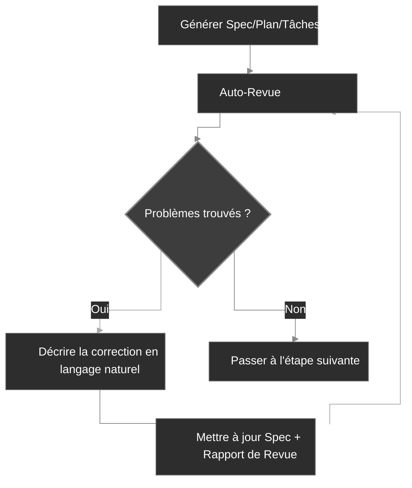

<div align="center">
  <picture>
    <source media="(prefers-color-scheme: dark)" srcset="codexspec-logo-dark.svg">
    <source media="(prefers-color-scheme: light)" srcset="codexspec-logo-light.svg">
    
  </picture>
</div>

# CodexSpec

[English](README.md) | [中文](README.zh-CN.md) | [日本語](README.ja.md) | [Español](README.es.md) | [Português](README.pt-BR.md) | [한국어](README.ko.md) | [Deutsch](README.de.md) | **Français**

[](https://pypi.org/project/codexspec/)
[](https://pypi.org/project/codexspec/)
[](https://opensource.org/licenses/MIT)

**Une boîte à outils de Développement Piloté par les Spécifications (SDD) pour Claude Code**

CodexSpec vous aide à construire des logiciels de haute qualité grâce à une approche structurée et pilotée par les spécifications. Au lieu de passer directement au code, vous définissez **quoi** construire et **pourquoi** avant de décider **comment** le construire.

[📖 Documentation](https://zts0hg.github.io/codexspec/fr/) | [Documentation](https://zts0hg.github.io/codexspec/en/) | [中文文档](https://zts0hg.github.io/codexspec/zh/) | [日本語ドキュメント](https://zts0hg.github.io/codexspec/ja/) | [한국어 문서](https://zts0hg.github.io/codexspec/ko/) | [Documentación](https://zts0hg.github.io/codexspec/es/) | [Dokumentation](https://zts0hg.github.io/codexspec/de/) | [Documentação](https://zts0hg.github.io/codexspec/pt-BR/)

---

## Table des Matières

- [Pourquoi choisir CodexSpec ?](#pourquoi-choisir-codexspec-)
- [Qu'est-ce que le Développement Piloté par les Spécifications?](#quest-ce-que-le-développement-piloté-par-les-spécifications)
- [Philosophie de Conception : Collaboration Humain-AI](#philosophie-de-conception--collaboration-humain-ai)
- [Démarrage Rapide en 30 Secondes](#-démarrage-rapide-en-30-secondes)
- [Installation](#installation)
- [Workflow Principal](#workflow-principal)
- [Commandes Disponibles](#commandes-disponibles)
- [Comparaison avec spec-kit](#comparaison-avec-spec-kit)
- [Internationalisation](#internationalisation-i18n)
- [Contribuer & Licence](#contribuer)

---

## Pourquoi choisir CodexSpec ?

Pourquoi utiliser CodexSpec en plus de Claude Code ? Voici la comparaison :

| Aspect | Claude Code Seul | CodexSpec + Claude Code |
|--------|------------------|-------------------------|
| **Support Multilingue** | Interaction en anglais par défaut | Configurez la langue de l'équipe pour une collaboration et des revues plus fluides |
| **Traçabilité** | Difficile de retracer les décisions après la fin de la session | Tous les specs, plans et tâches sauvegardés dans `.codexspec/specs/` |
| **Récupération de Session** | Difficile de récupérer après une interruption du mode plan | Division en commandes multiples + docs persistants = récupération facile |
| **Gouvernance d'Équipe** | Pas de principes unifiés, styles incohérents | `constitution.md` applique les standards et la qualité de l'équipe |

---

## Qu'est-ce que le Développement Piloté par les Spécifications?

**Le Développement Piloté par les Spécifications (SDD)** est une méthodologie "spécifications d'abord, code ensuite" :

```
Traditionnel :  Idée → Code → Débogage → Réécriture
SDD :           Idée → Spec → Plan → Tâches → Code
```

**Pourquoi utiliser SDD ?**

| Problème                    | Solution SDD                                         |
| --------------------------- | ---------------------------------------------------- |
| Malentendus de l'IA         | Les specs clarifient "quoi construire", l'IA arrête de deviner |
| Exigences manquantes        | La clarification interactive découvre les cas limites |
| Dérive d'architecture       | Les points de contrôle de revue assurent la bonne direction |
| Retravail gaspillé          | Les problèmes sont trouvés avant que le code ne soit écrit |

<details>
<summary>✨ Fonctionnalités Clés</summary>

### Workflow Principal

- **Développement Basé sur une Constitution** - Établir des principes de projet qui guident toutes les décisions
- **Spécification en Deux Phases** - Clarification interactive (`/specify`) suivie de la génération de document (`/generate-spec`)
- **Revues Automatiques** - Chaque artefact inclut des contrôles de qualité intégrés
- **Tâches Prêtes pour TDD** - Les décompositions de tâches appliquent la méthodologie test-first

### Collaboration Humain-AI

- **Commandes de Revue** - Commandes de revue dédiées pour spec, plan et tâches
- **Clarification Interactive** - Raffinement des exigences basé sur Q&R
- **Analyse Inter-Artefacts** - Détecter les incohérences avant l'implémentation

### Expérience Développeur

- **Intégration Claude Code Native** - Les commandes slash fonctionnent de manière transparente
- **Support Multilingue** - 13+ langues via traduction dynamique LLM
- **Multiplateforme** - Scripts Bash et PowerShell inclus
- **Extensible** - Architecture de plugins pour commandes personnalisées

</details>

---

## Philosophie de Conception : Collaboration Humain-AI

CodexSpec est construit sur la conviction que **le développement efficace assisté par l'IA nécessite une participation humaine active à chaque étape**.

### Pourquoi la Supervision Humaine est Importante

| Sans Revues                      | Avec Revues                              |
| -------------------------------- | --------------------------------------- |
| L'IA fait de mauvaises suppositions | Les humains repèrent les malentendus tôt |
| Les exigences incomplètes se propagent | Les lacunes identifiées avant implémentation |
| L'architecture dérive de l'intention | L'alignement vérifié à chaque étape |
| Les tâches manquent des fonctionnalités critiques | Validation systématique de la couverture |
| **Résultat : Retravail, effort gaspillé** | **Résultat : Réussir du premier coup** |

### L'Approche CodexSpec

CodexSpec structure le développement en **points de contrôle révisables** :

```
Idée → /specify → /generate-spec → /spec-to-plan → /plan-to-tasks → /implement
                         │                  │                │
                    Réviser spec       Réviser plan    Réviser tâches
                         │                  │                │
                      ✅ Humain           ✅ Humain        ✅ Humain
```

**Chaque artefact a une commande de revue correspondante :**

- `spec.md` → `/codexspec:review-spec`
- `plan.md` → `/codexspec:review-plan`
- `tasks.md` → `/codexspec:review-tasks`
- Tous les artefacts → `/codexspec:analyze`

Ce processus de revue systématique assure :

- **Détection précoce des erreurs** : Repérer les malentendus avant que le code ne soit écrit
- **Vérification de l'alignement** : Confirmer que l'interprétation de l'IA correspond à votre intention
- **Portes de qualité** : Valider la complétude, la clarté et la faisabilité à chaque étape
- **Réduction du retravail** : Investir des minutes en revue pour économiser des heures de réimplémentation

---

## 🚀 Démarrage Rapide en 30 Secondes

```bash
# 1. Installer
uv tool install codexspec

# 2. Initialiser le projet
#    Option A : Créer un nouveau projet
codexspec init my-project && cd my-project

#    Option B : Initialiser dans un projet existant
cd your-existing-project && codexspec init .

# 3. Utiliser dans Claude Code
claude
> /codexspec:constitution Créer des principes axés sur la qualité du code et les tests
> /codexspec:specify Je veux construire une application todo
> /codexspec:generate-spec
> /codexspec:spec-to-plan
> /codexspec:plan-to-tasks
> /codexspec:implement-tasks
```

C'est tout ! Lisez la suite pour le workflow complet.

---

## Installation

### Prérequis

- Python 3.11+
- [uv](https://docs.astral.sh/uv/) (recommandé) ou pip

### Installation Recommandée

```bash
# Avec uv (recommandé)
uv tool install codexspec

# Ou avec pip
pip install codexspec
```

### Vérifier l'Installation

```bash
codexspec --version
```

<details>
<summary>📦 Méthodes d'Installation Alternatives</summary>

#### Utilisation Ponctuelle (Sans Installation)

```bash
# Créer un nouveau projet
uvx codexspec init my-project

# Initialiser dans un projet existant
cd your-existing-project
uvx codexspec init . --ai claude
```

#### Installer la Version de Développement depuis GitHub

```bash
# Avec uv
uv tool install git+https://github.com/Zts0hg/codexspec.git

# Spécifier une branche ou un tag
uv tool install git+https://github.com/Zts0hg/codexspec.git@main
uv tool install git+https://github.com/Zts0hg/codexspec.git@v0.5.6
```

</details>

<details>
<summary>🪟 Notes pour les Utilisateurs Windows</summary>

**Recommandé : Utiliser PowerShell**

```powershell
# 1. Installer uv (si pas déjà installé)
powershell -c "irm https://astral.sh/uv/install.ps1 | iex"

# 2. Redémarrer PowerShell, puis installer codexspec
uv tool install codexspec

# 3. Vérifier l'installation
codexspec --version
```

**Dépannage CMD**

Si vous rencontrez des erreurs "Accès refusé" :

1. Fermer toutes les fenêtres CMD et rouvrir
2. Ou actualiser manuellement PATH : `set PATH=%PATH%;%USERPROFILE%\.local\bin`
3. Ou utiliser le chemin complet : `%USERPROFILE%\.local\bin\codexspec.exe --version`

Pour un dépannage détaillé, voir le [Guide de Dépannage Windows](docs/WINDOWS-TROUBLESHOOTING.md).

</details>

### Mise à Niveau

```bash
# Avec uv
uv tool install codexspec --upgrade

# Avec pip
pip install --upgrade codexspec
```

### Installation via le Marketplace de Plugins (Alternative)

CodexSpec est également disponible en tant que plugin Claude Code. Cette méthode est idéale si vous souhaitez utiliser les commandes CodexSpec directement dans Claude Code sans l'outil CLI.

#### Étapes d'Installation

```bash
# Dans Claude Code, ajouter le marketplace
> /plugin marketplace add Zts0hg/codexspec

# Installer le plugin
> /plugin install codexspec@codexspec-market
```

#### Configuration de la Langue pour les Utilisateurs de Plugin

Après l'installation via le Marketplace de Plugins, configurez votre langue préférée en utilisant la commande `/codexspec:config` :

```bash
# Démarrer la configuration interactive
> /codexspec:config

# Ou voir la configuration actuelle
> /codexspec:config --view
```

La commande config vous guidera à travers :

1. Sélection de la langue de sortie (pour les documents générés)
2. Sélection de la langue des messages de commit
3. Création du fichier `.codexspec/config.yml`

**Comparaison des Méthodes d'Installation**

| Méthode | Meilleur Pour | Fonctionnalités |
|---------|--------------|-----------------|
| **Installation CLI** (`uv tool install`) | Flux de développement complet | Commandes CLI (`init`, `check`, `config`) + commandes slash |
| **Marketplace de Plugins** | Démarrage rapide, projets existants | Commandes slash uniquement (utiliser `/codexspec:config` pour la configuration linguistique) |

**Note** : Le plugin utilise le mode `strict: false` et réutilise le support multilingue existant via la traduction dynamique LLM.

---

## Workflow Principal

CodexSpec divise le développement en **points de contrôle révisables** :

```
Idée → /specify → /generate-spec → /spec-to-plan → /plan-to-tasks → /implement
                         │                  │                │
                    Réviser spec       Réviser plan    Réviser tâches
                         │                  │                │
                      ✅ Humain           ✅ Humain        ✅ Humain
```

### Étapes du Workflow

| Étape                          | Commande                    | Sortie                      | Contrôle Humain |
| ------------------------------ | --------------------------- | --------------------------- | --------------- |
| 1. Principes du Projet         | `/codexspec:constitution`   | `constitution.md`           | ✅              |
| 2. Clarification des Exigences | `/codexspec:specify`        | Aucun (dialogue interactif) | ✅              |
| 3. Générer Spec                | `/codexspec:generate-spec`  | `spec.md` + Auto-Revue      | ✅              |
| 4. Planification Technique     | `/codexspec:spec-to-plan`   | `plan.md` + Auto-Revue      | ✅              |
| 5. Décomposition des Tâches    | `/codexspec:plan-to-tasks`  | `tasks.md` + Auto-Revue     | ✅              |
| 6. Analyse Inter-Artefacts     | `/codexspec:analyze`        | Rapport d'analyse           | ✅              |
| 7. Implémentation              | `/codexspec:implement-tasks`| Code                        | -               |

### specify vs clarify : Quand utiliser lequel ?

| Aspect | `/codexspec:specify` | `/codexspec:clarify` |
|--------|----------------------|----------------------|
| **Objectif** | Exploration initiale des exigences | Affiner une spec existante |
| **Quand utiliser** | Aucun spec.md n'existe | spec.md a besoin d'amélioration |
| **Sortie** | Aucune (dialogue uniquement) | Met à jour spec.md |
| **Méthode** | Q&R ouvert | Scan structuré (4 catégories) |
| **Limite de questions** | Illimitée | Max 5 par exécution |

### Concept Clé : Boucle de Qualité Itérative

Chaque commande de génération inclut **une revue automatique** et génère un rapport de revue. Vous pouvez :

1. Examiner le rapport
2. Décrire les problèmes à corriger en langage naturel
3. Le système met à jour automatiquement les specs et les rapports de revue



<details>
<summary>📖 Description Détaillée du Workflow</summary>

### 1. Initialiser le Projet

```bash
codexspec init my-awesome-project
cd my-awesome-project
claude
```

### 2. Établir les Principes du Projet

```
/codexspec:constitution Créer des principes axés sur la qualité du code, les standards de test et l'architecture propre
```

### 3. Clarifier les Exigences

```
/codexspec:specify Je veux construire une application de gestion de tâches
```

Cette commande va :

- Poser des questions de clarification pour comprendre votre idée
- Explorer les cas limites que vous n'avez peut-être pas envisagés
- **NE PAS** générer de fichiers automatiquement - vous gardez le contrôle

### 4. Générer le Document de Spécification

Une fois les exigences clarifiées :

```
/codexspec:generate-spec
```

Cette commande :

- Compile les exigences clarifiées en spécification structurée
- **Exécute automatiquement** la revue et génère `review-spec.md`

### 5. Créer un Plan Technique

```
/codexspec:spec-to-plan Utiliser Python avec FastAPI pour le backend, PostgreSQL pour la base de données, React pour le frontend
```

Inclut une **revue de constitutionnalité** - vérifie que le plan s'aligne avec les principes du projet.

### 6. Générer les Tâches

```
/codexspec:plan-to-tasks
```

Les tâches sont organisées en phases standard :

- **Application TDD** : Les tâches de test précèdent les tâches d'implémentation
- **Marqueurs parallèles `[P]`** : Identifier les tâches indépendantes
- **Spécifications de chemins de fichiers** : Livrables clairs par tâche

### 7. Analyse Inter-Artefacts (Optionnel mais Recommandé)

```
/codexspec:analyze
```

Détecte les problèmes entre spec, plan et tâches :

- Lacunes de couverture (exigences sans tâches)
- Duplications et incohérences
- Violations de la constitution
- Éléments sous-spécifiés

### 8. Implémentation

```
/codexspec:implement-tasks
```

L'implémentation suit le **workflow TDD conditionnel** :

- Tâches de code : Test-First (Red → Green → Vérifier → Refactorer)
- Tâches non-testables (docs, config) : Implémentation directe

</details>

---

## Commandes Disponibles

### Commandes CLI

| Commande             | Description                  |
| -------------------- | ---------------------------- |
| `codexspec init`     | Initialiser un nouveau projet|
| `codexspec check`    | Vérifier les outils installés|
| `codexspec version`  | Afficher les informations de version |
| `codexspec config`   | Afficher ou modifier la configuration |

<details>
<summary>📋 Options init</summary>

| Option          | Description                           |
| --------------- | ------------------------------------- |
| `PROJECT_NAME`  | Nom du répertoire du projet           |
| `--here`, `-h`  | Initialiser dans le répertoire actuel |
| `--ai`, `-a`    | Assistant IA à utiliser (défaut : claude) |
| `--lang`, `-l`  | Langue de sortie (ex : fr, en, zh-CN) |
| `--force`, `-f` | Forcer l'écrasement des fichiers existants |
| `--no-git`      | Ignorer l'initialisation git          |
| `--debug`, `-d` | Activer la sortie de débogage         |

</details>

<details>
<summary>📋 Options config</summary>

| Option                    | Description                  |
| ------------------------- | ---------------------------- |
| `--set-lang`, `-l`        | Définir la langue de sortie  |
| `--set-commit-lang`, `-c` | Définir la langue des messages de commit |
| `--list-langs`            | Lister toutes les langues supportées |

</details>

### Commandes Slash

#### Commandes de Workflow Principal

| Commande                      | Description                                                       |
| ----------------------------- | ----------------------------------------------------------------- |
| `/codexspec:constitution`     | Créer/mettre à jour la constitution du projet avec validation inter-artefacts |
| `/codexspec:specify`          | Clarifier les exigences via Q&R interactif                        |
| `/codexspec:generate-spec`    | Générer le document `spec.md` ★ Auto-Revue                        |
| `/codexspec:spec-to-plan`     | Convertir la spec en plan technique ★ Auto-Revue                  |
| `/codexspec:plan-to-tasks`    | Décomposer le plan en tâches atomiques ★ Auto-Revue               |
| `/codexspec:implement-tasks`  | Exécuter les tâches (TDD conditionnel)                            |

#### Commandes de Revue (Portes de Qualité)

| Commande                   | Description                            |
| -------------------------- | -------------------------------------- |
| `/codexspec:review-spec`   | Réviser la spécification (auto ou manuel) |
| `/codexspec:review-plan`   | Réviser le plan technique (auto ou manuel) |
| `/codexspec:review-tasks`  | Réviser la décomposition des tâches (auto ou manuel) |

#### Commandes Avancées

| Commande                      | Description                                                     |
| ----------------------------- | --------------------------------------------------------------- |
| `/codexspec:config`           | Gérer la configuration du projet (créer/afficher/modifier/réinitialiser) |
| `/codexspec:clarify`          | Scanner la spec pour ambiguïtés (4 catégories, max 5 questions) |
| `/codexspec:analyze`          | Analyse de cohérence inter-artefacts (lecture seule, basée sur la sévérité) |
| `/codexspec:checklist`        | Générer des checklists de qualité pour les exigences            |
| `/codexspec:tasks-to-issues`  | Convertir les tâches en GitHub Issues                           |

#### Commandes de Workflow Git

| Commande                    | Description                                       |
| --------------------------- | ------------------------------------------------- |
| `/codexspec:commit-staged`  | Générer un message de commit à partir des changements indexés |
| `/codexspec:pr`             | Générer une description PR/MR (auto-détection plateforme) |

#### Commandes de Revue de Code

| Commande                         | Description                                                     |
| -------------------------------- | --------------------------------------------------------------- |
| `/codexspec:review-code` | Réviser le code dans n'importe quel langage (clarté idiomatique, correction, robustesse, architecture) |

---

## Comparaison avec spec-kit

CodexSpec est inspiré par GitHub spec-kit avec des différences clés :

| Fonctionnalité         | spec-kit                | CodexSpec                                     |
| ---------------------- | ----------------------- | --------------------------------------------- |
| Philosophie Centrale   | Développement spec-driven | Spec-driven + Collaboration Humain-AI        |
| Nom CLI                | `specify`               | `codexspec`                                   |
| IA Principale          | Support multi-agents    | Focus sur Claude Code                         |
| Système de Constitution| Basique                 | Constitution complète + validation inter-artefacts |
| Spec en Deux Phases    | Non                     | Oui (clarification + génération)              |
| Commandes de Revue     | Optionnelles            | 3 commandes de revue dédiées + scoring        |
| Commande Clarify       | Oui                     | 4 catégories focus, intégration revue         |
| Commande Analyze       | Oui                     | Lecture seule, basée sur la sévérité, sensible à la constitution |
| TDD dans les Tâches    | Optionnel               | Appliqué (tests avant implémentation)         |
| Implémentation         | Standard                | TDD conditionnel (code vs docs/config)        |
| Système d'Extensions   | Oui                     | Oui                                           |
| Scripts PowerShell     | Oui                     | Oui                                           |
| Support i18n           | Non                     | Oui (13+ langues via traduction LLM)          |

### Différenciateurs Clés

1. **Culture Revue d'Abord** : Chaque artefact majeur a une commande de revue dédiée
2. **Gouvernance par Constitution** : Les principes sont validés, pas seulement documentés
3. **TDD par Défaut** : Méthodologie test-first appliquée dans la génération de tâches
4. **Points de Contrôle Humains** : Workflow conçu autour des portes de validation

---

## Internationalisation (i18n)

CodexSpec supporte plusieurs langues via **traduction dynamique LLM**. Pas de modèles de traduction à maintenir - Claude traduit le contenu à l'exécution en fonction de votre configuration linguistique.

### Définir la Langue

**Pendant l'initialisation :**

```bash
# Créer un projet avec sortie en français
codexspec init my-project --lang fr

# Créer un projet avec sortie en japonais
codexspec init my-project --lang ja
```

**Après l'initialisation :**

```bash
# Afficher la configuration actuelle
codexspec config

# Changer la langue de sortie
codexspec config --set-lang fr

# Définir la langue des messages de commit
codexspec config --set-commit-lang en
```

### Langues Supportées

| Code    | Langue          |
| ------- | --------------- |
| `en`    | English (défaut)|
| `zh-CN` | 简体中文        |
| `zh-TW` | 繁體中文        |
| `ja`    | 日本語          |
| `ko`    | 한국어          |
| `es`    | Español         |
| `fr`    | Français        |
| `de`    | Deutsch         |
| `pt-BR` | Português       |
| `ru`    | Русский         |
| `it`    | Italiano        |
| `ar`    | العربية         |
| `hi`    | हिन्दी           |

<details>
<summary>⚙️ Exemple de Fichier de Configuration</summary>

`.codexspec/config.yml` :

```yaml
version: "1.0"

language:
  output: "fr"         # Langue de sortie
  commit: "fr"         # Langue des messages de commit (défaut : output)
  templates: "en"      # Garder comme "en"

project:
  ai: "claude"
  created: "2025-02-15"
```

</details>

---

## Structure du Projet

Structure du projet après l'initialisation :

```
my-project/
├── .codexspec/
│   ├── memory/
│   │   └── constitution.md    # Constitution du projet
│   ├── specs/
│   │   └── {feature-id}/
│   │       ├── spec.md        # Spécification de fonctionnalité
│   │       ├── plan.md        # Plan technique
│   │       ├── tasks.md       # Décomposition des tâches
│   │       └── checklists/    # Checklists de qualité
│   ├── templates/             # Modèles personnalisés
│   ├── scripts/               # Scripts d'aide
│   └── extensions/            # Extensions personnalisées
├── .claude/
│   └── commands/              # Commandes slash Claude Code
└── CLAUDE.md                  # Contexte Claude Code
```

---

## Système d'Extensions

CodexSpec supporte une architecture de plugins pour les commandes personnalisées :

```
my-extension/
├── extension.yml          # Manifeste de l'extension
├── commands/              # Commandes slash personnalisées
│   └── command.md
└── README.md
```

Voir `extensions/EXTENSION-DEVELOPMENT-GUIDE.md` pour les détails.

---

## Développement

### Prérequis

- Python 3.11+
- Gestionnaire de paquets uv
- Git

### Développement Local

```bash
# Cloner le dépôt
git clone https://github.com/Zts0hg/codexspec.git
cd codexspec

# Installer les dépendances de dev
uv sync --dev

# Exécuter localement
uv run codexspec --help

# Exécuter les tests
uv run pytest

# Linter le code
uv run ruff check src/

# Construire le paquet
uv build
```

---

## Contribuer

Les contributions sont les bienvenues ! Veuillez lire les directives de contribution avant de soumettre une pull request.

## Licence

Licence MIT - voir [LICENSE](LICENSE) pour les détails.

## Remerciements

- Inspiré par [GitHub spec-kit](https://github.com/github/spec-kit)
- Construit pour [Claude Code](https://claude.ai/code)
