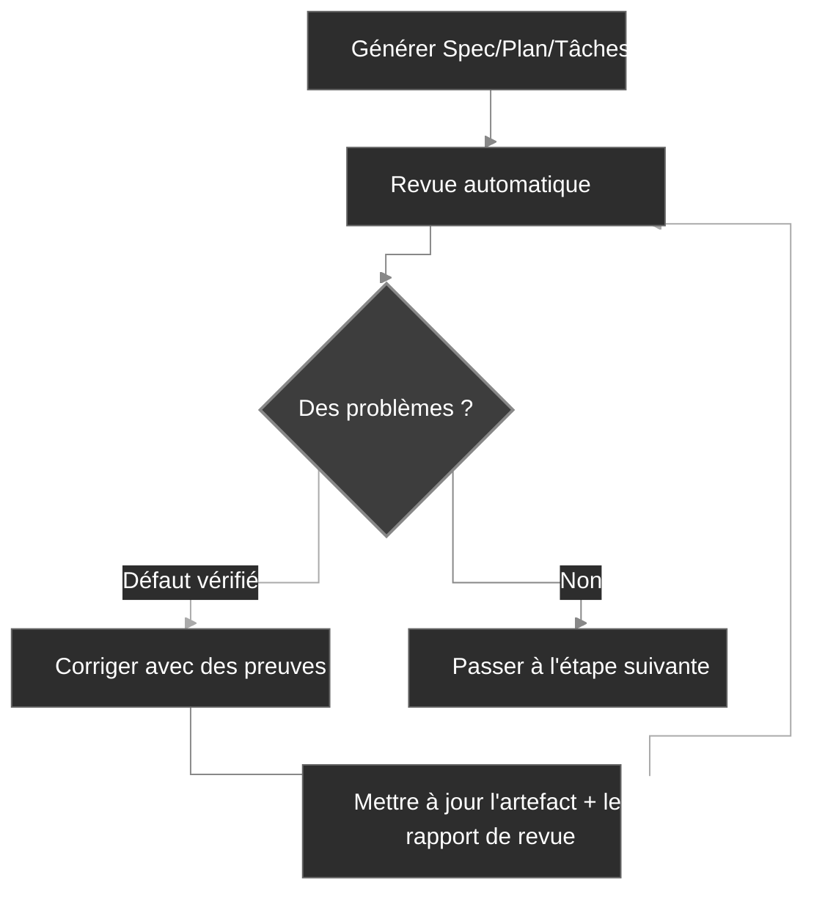

<div align="center">
  <picture>
    <source media="(prefers-color-scheme: dark)" srcset="codexspec-logo-dark.svg">
    <source media="(prefers-color-scheme: light)" srcset="codexspec-logo-light.svg">
    
  </picture>
</div>

<h1 align="center">CodexSpec</h1>

<p align="center">
  📖 <a href="README.fr.md"><b>Français</b></a> | <a href="README.md">English</a> | <a href="README.zh-CN.md">中文</a> | <a href="README.ja.md">日本語</a> | <a href="README.es.md">Español</a> | <a href="README.pt-BR.md">Português</a> | <a href="README.ko.md">한국어</a> | <a href="README.de.md">Deutsch</a>
</p>

<p align="center">
  <a href="https://pypi.org/project/codexspec/"></a>
  <a href="https://pypi.org/project/codexspec/"></a>
  <a href="https://opensource.org/licenses/MIT"></a>
</p>

<p align="center">
  <strong>Une boîte à outils Requirements-First SDD pour Claude Code</strong>
</p>

CodexSpec vous aide à produire des logiciels de qualité grâce au **Requirements-First Spec-Driven Development (SDD)** : les exigences confirmées passent avant tout, et rien n'a de valeur contraignante tant que vous ne l'avez pas explicitement validé.
Au lieu de vous précipiter sur le code, vous confirmez d'abord **ce** qu'il faut construire et **pourquoi**, avant de décider **comment** le construire.

[📖 Documentation](https://zts0hg.github.io/codexspec/fr/) | [English docs](https://zts0hg.github.io/codexspec/) | [中文文档](https://zts0hg.github.io/codexspec/zh/) | [日本語ドキュメント](https://zts0hg.github.io/codexspec/ja/) | [한국어 문서](https://zts0hg.github.io/codexspec/ko/) | [Documentación](https://zts0hg.github.io/codexspec/es/) | [Dokumentation](https://zts0hg.github.io/codexspec/de/) | [Documentação](https://zts0hg.github.io/codexspec/pt-BR/)

---

## Table des matières

- [Pourquoi choisir CodexSpec ?](#pourquoi-choisir-codexspec-)
- [Qu'est-ce que le Requirements-First SDD ?](#quest-ce-que-le-requirements-first-sdd-)
- [Philosophie de conception : collaboration humain–IA](#philosophie-de-conception--collaboration-humainia)
- [🚀 Démarrage rapide en 30 secondes](#-démarrage-rapide-en-30-secondes)
- [Installation](#installation)
- [Flux de travail principal](#flux-de-travail-principal)
- [Commandes disponibles](#commandes-disponibles)
- [Comparaison avec spec-kit](#comparaison-avec-spec-kit)
- [Internationalisation (i18n)](#internationalisation-i18n)
- [Contribuer & Licence](#contribuer)

---

## Pourquoi choisir CodexSpec ?

Pourquoi utiliser CodexSpec en complément de Claude Code ? Voici la comparaison :

| Aspect | Claude Code seul | CodexSpec + Claude Code |
|--------|------------------|-------------------------|
| **Support multilingue** | Interaction en anglais par défaut | Configurez la langue de l'équipe pour une collaboration et des revues plus fluides |
| **Traçabilité** | Difficile de retracer les décisions une fois la session terminée | Toutes les spécifications, plans et tâches sont conservés dans `.codexspec/specs/` |
| **Récupération de session** | Les interruptions du mode plan sont difficiles à rattraper | Éclatement en plusieurs commandes + documents persistants = récupération aisée |
| **Gouvernance d'équipe** | Aucun principe commun, styles hétérogènes | `constitution.md` impose les standards et le niveau de qualité de l'équipe |

---

## Qu'est-ce que le Requirements-First SDD ?

Le **Requirements-First SDD** est la méthodologie Spec-Driven Development (SDD) enrichie d'un principe clé : **les exigences confirmées constituent l'autorité de plus haute priorité**. Vous définissez et confirmez *ce* qu'il faut construire et *pourquoi* avant de décider *comment* — et rien n'acquiert de valeur contraignante tant que vous ne l'avez pas explicitement validé.

```
Approche traditionnelle :  Idée → Code → Débogage → Réécriture
SDD :                      Idée → Exigences confirmées → Spec → Plan → Tâches → Code
```

**Pourquoi adopter le Requirements-First SDD ?**

| Problème                   | Réponse Requirements-First SDD                                    |
| -------------------------- | ----------------------------------------------------------------- |
| Incompréhensions de l'IA   | Les exigences confirmées indiquent à l'IA « quoi construire » ; l'IA cesse de deviner |
| Exigences manquantes       | Clarification interactive + porte de confirmation : les cas limites remontent |
| Dérive architecturale      | Les points de revue garantissent qu'on reste dans la bonne direction |
| Retravail gaspillé         | Les problèmes sont détectés et validés avant l'écriture du code   |

<details>
<summary>✨ Fonctionnalités clés</summary>

### Flux de travail principal

- **Développement fondé sur une constitution** — Établissez des principes de projet qui guident toutes les décisions
- **Capture persistante des exigences** — `/specify` consigne les échanges confirmés dans `requirements.md` avant la génération des documents
- **Revues automatiques** — Chaque spécification, plan et tâche générée embarque des contrôles qualité intégrés
- **Tâches traçables** — La décomposition préserve la couverture des exigences et du plan, en n'appliquant l'approche test-first que lorsque c'est nécessaire

### Collaboration humain–IA

- **Commandes de revue** — Commandes dédiées pour la spécification, le plan et les tâches
- **Clarification interactive** — Raffinement des exigences par échange de questions/réponses
- **Analyse inter-artefacts** — Détectez les incohérences avant l'implémentation

### Expérience développeur

- **Intégration native à Claude Code** — Les commandes slash fonctionnent sans accroc
- **Support multilingue** — Plus de 13 langues via traduction dynamique par LLM
- **Multiplateforme** — Scripts Bash et PowerShell inclus
- **Extensible** — Architecture de plugins pour des commandes personnalisées

</details>

---

## Philosophie de conception : collaboration humain–IA

CodexSpec repose sur une conviction : **un développement efficace assisté par l'IA exige une participation humaine active à chaque étape**.

### Pourquoi la supervision humaine compte

| Sans revues                              | Avec revues                                         |
| ---------------------------------------- | --------------------------------------------------- |
| L'IA formule de mauvaises hypothèses     | Les humains repèrent les malentendus tôt            |
| Les exigences incomplètes se propagent   | Les lacunes sont identifiées avant l'implémentation |
| L'architecture dérive de l'intention     | L'alignement est vérifié à chaque étape             |
| Les tâches omettent des fonctionnalités critiques | Validation systématique de la couverture  |
| **Résultat : retravail, efforts gaspillés** | **Résultat : réussir du premier coup**           |

### L'approche CodexSpec

CodexSpec structure le développement en **points de contrôle révisables** :

```
Idée → /specify → requirements.md → /generate-spec → spec.md → /spec-to-plan → plan.md → /plan-to-tasks → tasks.md → /implement
                                                   │                         │                            │
                                              Réviser la spec            Réviser le plan              Réviser les tâches
```

Les exigences confirmées constituent l'autorité fonctionnelle de plus haute priorité. Les artefacts dérivés comportent des liens explicites vers leurs sources, afin que les conflits puissent être retracés plutôt que propagés silencieusement.

**Chaque artefact généré dispose d'une commande de revue correspondante :**

- `spec.md` → `/codexspec:review-spec`
- `plan.md` → `/codexspec:review-plan`
- `tasks.md` → `/codexspec:review-tasks`
- Tous les artefacts → `/codexspec:analyze`

Ce processus de revue systématique garantit :

- **Détection précoce des erreurs** : repérez les malentendus avant d'écrire le code
- **Vérification de l'alignement** : confirmez que l'interprétation de l'IA correspond à votre intention
- **Portes de qualité** : validez la complétude, la clarté et la faisabilité à chaque étape
- **Réduction du retravail** : investissez quelques minutes de revue pour économiser des heures de réimplémentation

---

## 🚀 Démarrage rapide en 30 secondes

```bash
# 1. Installer
uv tool install codexspec

# 2. Initialiser le projet
#    Option A : créer un nouveau projet
codexspec init my-project && cd my-project

#    Option B : initialiser dans un projet existant
cd your-existing-project && codexspec init .

# 3. Utiliser dans Claude Code
claude
> /codexspec:constitution Créer des principes axés sur la qualité du code et les tests
> /codexspec:specify Je veux construire une application de gestion de tâches
> /codexspec:generate-spec
> /codexspec:spec-to-plan
> /codexspec:plan-to-tasks
> /codexspec:implement-tasks
```

C'est tout ! Lisez la suite pour le flux de travail complet.

---

## Installation

### Prérequis

- Python 3.11+
- [uv](https://docs.astral.sh/uv/) (recommandé) ou pip

### Installation recommandée

```bash
# Avec uv (recommandé)
uv tool install codexspec

# Ou avec pip
pip install codexspec
```

### Vérifier l'installation

```bash
codexspec --version
```

<details>
<summary>📦 Méthodes d'installation alternatives</summary>

#### Utilisation ponctuelle (sans installation)

```bash
# Créer un nouveau projet
uvx codexspec init my-project

# Initialiser dans un projet existant
cd your-existing-project
uvx codexspec init . --ai claude

# Initialiser pour Codex CLI
uvx codexspec init . --ai codex
```

#### Installer la version de développement depuis GitHub

```bash
# Avec uv
uv tool install git+https://github.com/Zts0hg/codexspec.git

# Spécifier une branche ou un tag
uv tool install git+https://github.com/Zts0hg/codexspec.git@main
uv tool install git+https://github.com/Zts0hg/codexspec.git@v0.5.6
```

</details>

<details>
<summary>🪟 Notes pour les utilisateurs Windows</summary>

**Recommandé : utiliser PowerShell**

```powershell
# 1. Installer uv (s'il n'est pas déjà installé)
powershell -c "irm https://astral.sh/uv/install.ps1 | iex"

# 2. Redémarrer PowerShell, puis installer codexspec
uv tool install codexspec

# 3. Vérifier l'installation
codexspec --version
```

**Dépannage CMD**

Si vous rencontrez des erreurs « Accès refusé » :

1. Fermez toutes les fenêtres CMD et rouvrez-les
2. Ou rafraîchissez manuellement le PATH : `set PATH=%PATH%;%USERPROFILE%\.local\bin`
3. Ou utilisez le chemin complet : `%USERPROFILE%\.local\bin\codexspec.exe --version`

Pour un dépannage détaillé, consultez le [Guide de dépannage Windows](docs/WINDOWS-TROUBLESHOOTING.md).

</details>

### Mettre à niveau

```bash
# Avec uv
uv tool install codexspec --upgrade

# Avec pip
pip install --upgrade codexspec
```

### Installation via le marketplace de plugins (alternative)

CodexSpec est également disponible en tant que plugin Claude Code. Cette méthode est idéale si vous souhaitez utiliser les commandes CodexSpec directement dans Claude Code, sans l'outil CLI.

#### Étapes d'installation

```bash
# Dans Claude Code, ajouter le marketplace
> /plugin marketplace add Zts0hg/codexspec

# Installer le plugin
> /plugin install codexspec@codexspec-market
```

#### Configuration de la langue pour les utilisateurs du plugin

Après l'installation via le marketplace de plugins, configurez votre langue préférée avec la commande `/codexspec:config` :

```bash
# Lancer la configuration interactive
> /codexspec:config

# Ou afficher la configuration actuelle
> /codexspec:config --view
```

La commande `config` vous accompagne pour :

1. Choisir la langue de sortie (pour les documents générés)
2. Choisir la langue des messages de commit
3. Créer le fichier `.codexspec/config.yml`

**Comparaison des méthodes d'installation**

| Méthode | Idéale pour | Fonctionnalités |
|--------|----------|----------|
| **Installation CLI** (`uv tool install`) | Flux de développement complet | Commandes CLI (`init`, `check`, `config`) + commandes slash |
| **Marketplace de plugins** | Démarrage rapide, projets existants | Commandes slash uniquement (utilisez `/codexspec:config` pour la configuration linguistique) |

**Note** : Le plugin utilise le mode `strict: false` et réutilise la prise en charge multilingue existante via la traduction dynamique par LLM.

---

## Flux de travail principal

CodexSpec découpe le développement en **points de contrôle révisables** :

```
Idée → /specify → requirements.md → /generate-spec → spec.md → /spec-to-plan → plan.md → /plan-to-tasks → tasks.md → /implement
                                                   │                         │                            │
                                              Réviser la spec            Réviser le plan              Réviser les tâches
```

### Étapes du flux de travail

| Étape                          | Commande                      | Sortie                      | Contrôle humain |
| ------------------------------ | ----------------------------- | --------------------------- | --------------- |
| 1. Principes du projet         | `/codexspec:constitution`     | `constitution.md`           | ✅              |
| 2. Clarification des exigences | `/codexspec:specify`          | `requirements.md`           | ✅              |
| 3. Génération de la spec       | `/codexspec:generate-spec`    | `spec.md` + auto-revue      | ✅              |
| 4. Planification technique     | `/codexspec:spec-to-plan`     | `plan.md` + auto-revue      | ✅              |
| 5. Décomposition des tâches    | `/codexspec:plan-to-tasks`    | `tasks.md` + auto-revue     | ✅              |
| 6. Analyse inter-artefacts     | `/codexspec:analyze`          | Rapport d'analyse           | ✅              |
| 7. Implémentation              | `/codexspec:implement-tasks`  | Code                        | -               |

### `specify` vs `clarify` : quand utiliser laquelle ?

| Aspect | `/codexspec:specify` | `/codexspec:clarify` |
|--------|----------------------|----------------------|
| **Objectif** | Exploration et confirmation initiale des exigences | Raffiner des exigences confirmées ou la spec dérivée |
| **Quand l'utiliser** | Au démarrage d'une fonctionnalité | Quand les exigences ou la spec nécessitent des éclaircissements |
| **Sortie** | Crée/met à jour `requirements.md` | Met d'abord à jour `requirements.md`, puis synchronise `spec.md` |
| **Méthode** | Q/R ouverte | Scan structuré (4 catégories) |
| **Questions** | Illimitées | 5 maximum par exécution |

### Concept clé : la boucle qualité itérative

Chaque commande de génération inclut une **revue automatique**. Les défauts vérifiés peuvent être corrigés puis soumis à une nouvelle revue, pour deux tours maximum ; les suggestions consultatives restent séparées et ne déclenchent jamais de modification automatique.

1. Examinez le rapport
2. Décrivez en langage naturel les problèmes à corriger
3. Le système met automatiquement à jour les spécifications et les rapports de revue



<details>
<summary>📖 Description détaillée du flux de travail</summary>

### 1. Initialiser le projet

```bash
codexspec init my-awesome-project
cd my-awesome-project
claude
```

### 2. Établir les principes du projet

```
/codexspec:constitution Créer des principes axés sur la qualité du code, les standards de test et une architecture propre
```

### 3. Clarifier les exigences

```
/codexspec:specify Je veux construire une application de gestion de tâches
```

Cette commande :

- Poser des questions de clarification pour cerner votre idée
- Explorer des cas limites que vous n'aviez peut-être pas envisagés
- Vous demander de confirmer le récapitulatif final des exigences
- Consigner dans `requirements.md` les besoins, contraintes, décisions, exclusions et questions ouvertes que vous avez validés

### 4. Générer le document de spécification

Une fois les exigences clarifiées :

```
/codexspec:generate-spec
```

Cette commande :

- Synthétise les entrées confirmées de `requirements.md` en une spécification structurée
- Ajoute des références de source pour la traçabilité des exigences
- **Exécute automatiquement** une revue et génère `review-spec.md`

### 5. Créer le plan technique

```
/codexspec:spec-to-plan Utiliser Python FastAPI pour le backend, PostgreSQL pour la base de données, React pour le frontend
```

N'utilise que les sections de planification pertinentes, enregistre les liens `Covers` vers les exigences de la spécification et vérifie les principes applicables du projet.

### 6. Générer les tâches

```
/codexspec:plan-to-tasks
```

Les tâches sont organisées autour de résultats vérifiables :

- **Tests conditionnels** : l'ordre test-first est appliqué lorsque le plan, la constitution ou le risque de la tâche l'exige
- **Marqueurs parallèles `[P]`** : réservés aux tâches réellement indépendantes
- **Spécifications des chemins de fichiers** : des livrables clairs par tâche
- **Traçabilité** : chaque tâche est reliée au plan et aux exigences qu'elle couvre

### 7. Analyse inter-artefacts (optionnelle mais recommandée)

```
/codexspec:analyze
```

Détecte les problèmes entre exigences, spécification, plan et tâches :

- Lacunes de couverture (exigences sans tâche associée)
- Duplications et incohérences
- Violations de la constitution
- Éléments sous-spécifiés

### 8. Implémentation

```
/codexspec:implement-tasks
```

L'implémentation suit le **flux de travail TDD conditionnel** :

- Tâches de code : test-first (Red → Green → Vérifier → Refactorer)
- Tâches non testables (docs, config) : implémentation directe

</details>

---

## Commandes disponibles

### Commandes CLI

| Commande             | Description                          |
| -------------------- | ------------------------------------ |
| `codexspec init`     | Initialise un nouveau projet         |
| `codexspec check`    | Vérifie les outils installés         |
| `codexspec version`  | Affiche les informations de version  |
| `codexspec config`   | Affiche ou modifie la configuration  |

<details>
<summary>📋 Options de `init`</summary>

| Option               | Description                                                        |
| -------------------- | ------------------------------------------------------------------ |
| `PROJECT_NAME`       | Nom du répertoire du projet (`.` ou `--here` pour le répertoire courant) |
| `--here`, `-h`       | Initialiser dans le répertoire courant                             |
| `--ai`, `-a`         | Assistant IA à utiliser : `claude`, `codex` ou `both` (défaut : claude) |
| `--lang`, `-l`       | Langue de sortie (base) ; interaction/document/commit s'y rabattent (ex. en, zh-CN, ja) |
| `--interaction-lang` | Langue d'interaction (dialogue LLM + sortie CLI) ; remplace `--lang` |
| `--document-lang`    | Langue des documents (spec/plan/tâches générés) ; remplace `--lang` |
| `--commit-lang`      | Langue des messages de commit ; remplace `--lang`                  |
| `--force`, `-f`      | Écrase les fichiers + auto-confirme les invites ; ne régénère jamais `config.yml` |
| `--no-git`           | Ignorer l'initialisation du dépôt git                              |
| `--debug`, `-d`      | Activer la sortie de débogage                                      |

</details>

<details>
<summary>📋 Options de `config`</summary>

| Option                    | Description                                                       |
| ------------------------- | ----------------------------------------------------------------- |
| `--set-lang`, `-l`        | Définir la langue de sortie (base)                                |
| `--set-interaction-lang`  | Définir la langue d'interaction                                   |
| `--set-document-lang`     | Définir la langue des documents                                   |
| `--set-commit-lang`, `-c` | Définir la langue des messages de commit                          |
| `--list-langs`            | Lister toutes les langues prises en charge                        |
| `--auto-next`            | Basculer/définir `workflow.auto_next` (sans valeur = bascule ; ou on/off) |

</details>

### Commandes slash

#### Commandes du flux de travail principal

| Commande                      | Description                                                              |
| ----------------------------- | ------------------------------------------------------------------------ |
| `/codexspec:constitution`     | Créer/mettre à jour la constitution du projet avec validation inter-artefacts |
| `/codexspec:specify`          | Clarifier, confirmer et consigner les exigences dans `requirements.md`   |
| `/codexspec:generate-spec`    | Générer le document `spec.md` ★ Auto-revue                               |
| `/codexspec:spec-to-plan`     | Convertir la spec en plan technique ★ Auto-revue                         |
| `/codexspec:plan-to-tasks`    | Décomposer le plan en tâches traçables et vérifiables ★ Auto-revue       |
| `/codexspec:implement-tasks`  | Exécuter les tâches (TDD conditionnel)                                   |

#### Commandes de revue (portes de qualité)

| Commande                 | Description                              |
| ------------------------ | ---------------------------------------- |
| `/codexspec:review-spec`  | Réviser la spécification (auto ou manuel) |
| `/codexspec:review-plan`  | Réviser le plan technique (auto ou manuel) |
| `/codexspec:review-tasks` | Réviser la décomposition des tâches (auto ou manuel) |

#### Commandes d'enrichissement

| Commande                      | Description                                                     |
| ----------------------------- | --------------------------------------------------------------- |
| `/codexspec:config`           | Gérer la configuration du projet (créer/afficher/modifier/réinitialiser) |
| `/codexspec:clarify`          | Scanner la spec pour ambiguïtés (4 catégories, 5 questions max) |
| `/codexspec:analyze`          | Analyse de cohérence inter-artefacts (lecture seule, basée sur la sévérité) |
| `/codexspec:checklist`        | Générer une liste de contrôle de qualité des exigences                  |
| `/codexspec:tasks-to-issues`  | Convertir les tâches en GitHub Issues                           |

#### Commandes du workflow Git

| Commande                    | Description                                              |
| --------------------------- | -------------------------------------------------------- |
| `/codexspec:commit-staged`  | Générer un message de commit à partir des changements indexés |
| `/codexspec:pr`             | Générer une description PR/MR (auto-détection de la plateforme) |

#### Commandes de revue de code

| Commande                  | Description                                                                            |
| ------------------------- | -------------------------------------------------------------------------------------- |
| `/codexspec:review-code`  | Réviser du code dans n'importe quel langage (clarté idiomatique, correction, robustesse, architecture) |

---

## Comparaison avec spec-kit

CodexSpec s'inspire de GitHub spec-kit, avec des différences majeures :

| Fonctionnalité          | spec-kit                  | CodexSpec                                                |
| ----------------------- | ------------------------- | -------------------------------------------------------- |
| Philosophie centrale    | Spec-driven development   | Requirements-First SDD + collaboration humain–IA         |
| Nom de la CLI           | `specify`                 | `codexspec`                                              |
| IA principale           | Support multi-agents      | Concentré sur Claude Code                                |
| Système de constitution | Basique                   | Constitution complète + validation inter-artefacts       |
| Spec en deux phases     | Non                       | Oui (clarifier + générer)                                |
| Commandes de revue      | Optionnelles              | 3 commandes dédiées + notation                            |
| Commande `clarify`      | Oui                       | 4 catégories ciblées, intégration à la revue             |
| Commande `analyze`      | Oui                       | Lecture seule, basée sur la sévérité, sensible à la constitution |
| TDD dans les tâches     | Optionnel                 | Conditionnel (exigences, risque et politique)            |
| Implémentation          | Standard                  | TDD conditionnel (code vs docs/config)                   |
| Système d'extensions    | Oui                       | Oui                                                      |
| Scripts PowerShell      | Oui                       | Oui                                                      |
| Support i18n            | Non                       | Oui (13+ langues via traduction LLM)                     |

### Différenciateurs clés

1. **Culture « revue d'abord »** : chaque artefact majeur dispose d'une commande de revue dédiée
2. **Gouvernance par constitution** : les principes sont validés, pas seulement documentés
3. **Revue fondée sur des preuves** : les défauts exigent des preuves concrètes ; les avis consultatifs sur la conception n'impactent pas l'acceptation
4. **Porte de confirmation** : les exigences, spécifications, plans et tâches n'acquièrent de valeur contraignante qu'après confirmation humaine explicite

---

## Internationalisation (i18n)

CodexSpec prend en charge plusieurs langues via la **traduction dynamique par LLM**. Pas de modèles de traduction à maintenir : Claude traduit le contenu à l'exécution en fonction de votre configuration linguistique.

### Dimensions linguistiques

CodexSpec décompose la langue en quatre dimensions configurables indépendamment. `output` sert de base ; les autres la remplacent et s'y rabattent (puis vers `en`) si elles ne sont pas définies — vous pouvez donc converser avec Claude dans une langue tout en conservant les artefacts générés ou les messages de commit dans une autre.

| Dimension | Clé `config.yml`   | Définir à l'init      | Définir plus tard           | Contrôle                          | Se rabat sur |
|-----------|---------------------|-----------------------|-----------------------------|-----------------------------------|--------------|
| Output (base) | `output`        | `--lang`              | `config --set-lang`         | base pour les trois autres        | `en`         |
| Interaction | `interaction`     | `--interaction-lang`  | `config --set-interaction-lang` | dialogue LLM + sortie CLI       | output → `en` |
| Document    | `document`        | `--document-lang`     | `config --set-document-lang` | spec/plan/tâches générés         | output → `en` |
| Commit      | `commit`          | `--commit-lang`       | `config --set-commit-lang`  | messages de commit git           | output → `en` |
| Templates   | `templates`       | —                     | —                           | source des modèles (toujours `en`) | —            |

### Définir la langue

**Lors de l'initialisation :**

```bash
# Sortie en chinois (définit la base output)
codexspec init my-project --lang zh-CN

# Totalement non interactif : base zh-CN, messages de commit en anglais
codexspec init my-project --lang zh-CN --commit-lang en

# Définir chaque dimension explicitement (scriptable, sans invite)
codexspec init my-project \
  --interaction-lang zh-CN --document-lang en --commit-lang en
```

Une première initialisation dans un TTY sans `--lang` (et sans les trois indicateurs de dimension) demande une langue de base ; en environnement non-TTY (CI/scripts), elle utilise `en` par défaut. Relancer `init` préserve toute clé de langue que vous n'avez pas explicitement spécifiée.

**Après l'initialisation :**

```bash
# Afficher la configuration actuelle
codexspec config

# Changer une seule dimension
codexspec config --set-lang zh-CN
codexspec config --set-interaction-lang zh-CN
codexspec config --set-document-lang en
codexspec config --set-commit-lang en
codexspec config --auto-next
```

### Langues prises en charge

| Code    | Langue              |
| ------- | ------------------- |
| `en`    | English (défaut)    |
| `zh-CN` | 简体中文            |
| `zh-TW` | 繁體中文            |
| `ja`    | 日本語              |
| `ko`    | 한국어              |
| `es`    | Español             |
| `fr`    | Français            |
| `de`    | Deutsch             |
| `pt-BR` | Português           |
| `ru`    | Русский             |
| `it`    | Italiano            |
| `ar`    | العربية             |
| `hi`    | हिन्दी               |

<details>
<summary>⚙️ Exemple de fichier de configuration</summary>

`.codexspec/config.yml` :

```yaml
version: "1.0"

language:
  output: "zh-CN"        # Langue de base ; les trois ci-dessous s'y rabattent, puis vers "en"
  interaction: "zh-CN"   # Dialogue LLM + sortie CLI codexspec (optionnel → défaut : output)
  document: "en"         # Exigences/spec/plan/tâches générés (optionnel → défaut : output)
  commit: "en"           # Messages de commit git (optionnel → défaut : output)
  templates: "en"        # Conserver comme "en"

project:
  ai: "claude"
  created: "2025-02-15"
```

</details>

---

## Structure du projet

Structure du projet après initialisation :

```
my-project/
├── .codexspec/
│   ├── memory/
│   │   └── constitution.md    # Constitution du projet
│   ├── specs/
│   │   └── {feature-id}/
│   │       ├── spec.md        # Spécification de fonctionnalité
│   │       ├── plan.md        # Plan technique
│   │       ├── tasks.md       # Décomposition des tâches
│   │       └── checklists/    # Listes de contrôle qualité
│   ├── templates/             # Modèles personnalisés
│   ├── scripts/               # Scripts utilitaires
│   └── extensions/            # Extensions personnalisées
├── .claude/
│   └── commands/              # Commandes slash Claude Code
├── .agents/
│   └── skills/                # Compétences Codex (si initialisé avec --ai codex ou both)
├── CLAUDE.md                  # Contexte Claude Code
└── AGENTS.md                  # Contexte Codex
```

---

## Système d'extensions

CodexSpec prend en charge une architecture de plugins pour les commandes personnalisées :

```
my-extension/
├── extension.yml          # Manifeste de l'extension
├── commands/              # Commandes slash personnalisées
│   └── command.md
└── README.md
```

Voir `extensions/EXTENSION-DEVELOPMENT-GUIDE.md` pour les détails.

---

## Développement

### Prérequis

- Python 3.11+
- Gestionnaire de paquets uv
- Git

### Développement local

```bash
# Cloner le dépôt
git clone https://github.com/Zts0hg/codexspec.git
cd codexspec

# Installer les dépendances de développement
uv sync --dev

# Exécuter localement
uv run codexspec --help

# Lancer les tests
uv run pytest

# Linter le code
uv run ruff check src/

# Construire le paquet
uv build
```

---

## Contribuer

Les contributions sont les bienvenues ! Veuillez lire les directives de contribution avant de soumettre une pull request.

## Licence

Licence MIT — voir [LICENSE](LICENSE) pour les détails.

## Remerciements

- Inspiré par [GitHub spec-kit](https://github.com/github/spec-kit)
- Construit pour [Claude Code](https://claude.ai/code)
