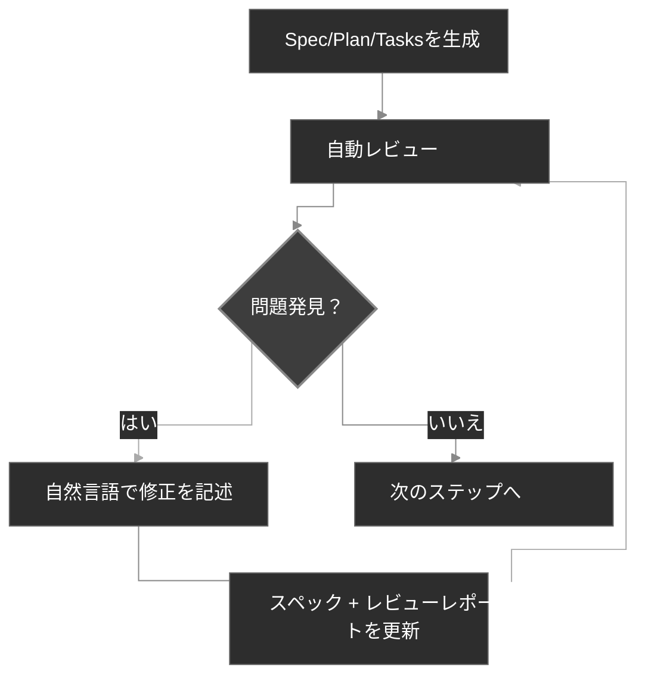

<div align="center">
  <picture>
    <source media="(prefers-color-scheme: dark)" srcset="codexspec-logo-dark.svg">
    <source media="(prefers-color-scheme: light)" srcset="codexspec-logo-light.svg">
    
  </picture>
</div>

# CodexSpec

[English](README.md) | [中文](README.zh-CN.md) | **日本語** | [Español](README.es.md) | [Português](README.pt-BR.md) | [한국어](README.ko.md) | [Deutsch](README.de.md) | [Français](README.fr.md)

[](https://pypi.org/project/codexspec/)
[](https://pypi.org/project/codexspec/)
[](https://opensource.org/licenses/MIT)

**Claude Code 向けスペック駆動開発 (SDD) ツールキット**

CodexSpec は、構造化されたスペック駆動アプローチを使用して高品質なソフトウェアを構築するのに役立つツールキットです。**どのように**構築するかを決める前に、**何を**構築するか、**なぜ**構築するかを先に定義します。

[📖 ドキュメント](https://zts0hg.github.io/codexspec/ja/) | [Documentation](https://zts0hg.github.io/codexspec/en/) | [中文文档](https://zts0hg.github.io/codexspec/zh/) | [한국어 문서](https://zts0hg.github.io/codexspec/ko/) | [Documentación](https://zts0hg.github.io/codexspec/es/) | [Documentation](https://zts0hg.github.io/codexspec/fr/) | [Dokumentation](https://zts0hg.github.io/codexspec/de/) | [Documentação](https://zts0hg.github.io/codexspec/pt-BR/)

---

## 目次

- [スペック駆動開発とは？](#スペック駆動開発とは)
- [設計哲学：人間-AI協調](#設計哲学人間-ai協調)
- [30秒クイックスタート](#-30秒クイックスタート)
- [インストール](#インストール)
- [コアワークフロー](#コアワークフロー)
- [利用可能なコマンド](#利用可能なコマンド)
- [spec-kitとの比較](#spec-kitとの比較)
- [国際化](#国際化-i18n)
- [コントリビュート & ライセンス](#コントリビュート)

---

## スペック駆動開発とは？

**スペック駆動開発 (SDD)** は「スペック先行、コード後」の方法論です：

```
従来の開発:  アイデア → コード → デバッグ → 書き直し
SDD:         アイデア → スペック → 計画 → タスク → コード
```

**なぜSDDを使うのか？**

| 問題 | SDDの解決策 |
|------|------------|
| AIの誤解 | スペックが「何を構築するか」を明確にし、AIが推測しなくなる |
| 要件の欠落 | インタラクティブな明確化でエッジケースを発見 |
| アーキテクチャの逸脱 | レビューチェックポイントで正しい方向を確保 |
| 無駄なやり直し | コードが書かれる前に問題を発見 |

<details>
<summary>✨ 主な機能</summary>

### コアSDDワークフロー

- **憲法ベースの開発** - すべての決定を導くプロジェクト原則を確立
- **2段階スペック作成** - インタラクティブな明確化 (`/specify`) に続くドキュメント生成 (`/generate-spec`)
- **自動レビュー** - すべてのアーティファクトに組み込みの品質チェックを含む
- **TDD対応タスク** - タスク分解がテストファースト手法を強制

### 人間-AI協調

- **レビューコマンド** - スペック、計画、タスク専用のレビューコマンド
- **インタラクティブ明確化** - Q&Aベースの要件精緻化
- **クロスアーティファクト分析** - 実装前に不整合を検出

### 開発者体験

- **ネイティブClaude Code統合** - スラッシュコマンドがシームレスに動作
- **多言語サポート** - LLM動的翻訳で13以上の言語をサポート
- **クロスプラットフォーム** - BashとPowerShellスクリプトを含む
- **拡張可能** - カスタムコマンド用のプラグインアーキテクチャ

</details>

---

## 設計哲学：人間-AI協調

CodexSpecは**効果的なAI支援開発には各段階での積極的な人間の参加が必要**という信念に基づいて構築されています。

### なぜ人間の監督が重要か

| レビューなし | レビューあり |
|--------------|--------------|
| AIが誤った仮定を立てる | 人間が早期に誤解をキャッチ |
| 不完全な要件が伝播 | 実装前にギャップを特定 |
| アーキテクチャが意図から逸脱 | 各段階で整合性を検証 |
| タスクが重要な機能を見逃す | 体系的にカバレッジを検証 |
| **結果：やり直し、無駄な努力** | **結果：一発で正しい** |

### CodexSpecのアプローチ

CodexSpecは開発を**レビュー可能なチェックポイント**に構造化します：

```
アイデア → /specify → /generate-spec → /spec-to-plan → /plan-to-tasks → /implement
                              │                  │                │
                         スペックをレビュー    計画をレビュー    タスクをレビュー
                              │                  │                │
                           ✅ 人間            ✅ 人間           ✅ 人間
```

**すべてのアーティファクトに対応するレビューコマンドがあります：**

- `spec.md` → `/codexspec:review-spec`
- `plan.md` → `/codexspec:review-plan`
- `tasks.md` → `/codexspec:review-tasks`
- すべてのアーティファクト → `/codexspec:analyze`

この体系的なレビュープロセスは以下を保証します：

- **早期エラー検出**: コードが書かれる前に誤解をキャッチ
- **整合性検証**: AIの解釈があなたの意図と一致していることを確認
- **品質ゲート**: 各段階で完全性、明確性、実現可能性を検証
- **やり直しの削減**: レビューに数分投資して、再実装の時間を節約

---

## 🚀 30秒クイックスタート

```bash
# 1. インストール
uv tool install codexspec

# 2. プロジェクトを初期化
#    方法A：新規プロジェクトを作成
codexspec init my-project && cd my-project

#    方法B：既存のプロジェクトで初期化
cd your-existing-project && codexspec init .

# 3. Claude Codeで使用
claude
> /codexspec:constitution コード品質とテストに焦点を当てた原則を作成
> /codexspec:specify タスク管理アプリを構築したい
> /codexspec:generate-spec
> /codexspec:spec-to-plan
> /codexspec:plan-to-tasks
> /codexspec:implement-tasks
```

これだけです！完全なワークフローについては読み続けてください。

---

## インストール

### 前提条件

- Python 3.11+
- [uv](https://docs.astral.sh/uv/)（推奨）または pip

### 推奨インストール

```bash
# uvを使用（推奨）
uv tool install codexspec

# またはpipを使用
pip install codexspec
```

### インストールの確認

```bash
codexspec --version
```

<details>
<summary>📦 その他のインストール方法</summary>

#### 一度きりの使用（インストールなし）

```bash
# 新規プロジェクトを作成
uvx codexspec init my-project

# 既存のプロジェクトで初期化
cd your-existing-project
uvx codexspec init . --ai claude
```

#### GitHubから開発版をインストール

```bash
# uvを使用
uv tool install git+https://github.com/Zts0hg/codexspec.git

# ブランチまたはタグを指定
uv tool install git+https://github.com/Zts0hg/codexspec.git@main
uv tool install git+https://github.com/Zts0hg/codexspec.git@v0.5.6
```

</details>

<details>
<summary>🪟 Windowsユーザーへの注意</summary>

**推奨：PowerShellを使用**

```powershell
# 1. uvをインストール（まだの場合）
powershell -c "irm https://astral.sh/uv/install.ps1 | iex"

# 2. PowerShellを再起動し、codexspecをインストール
uv tool install codexspec

# 3. インストールを確認
codexspec --version
```

**CMDトラブルシューティング**

「アクセス拒否」エラーが発生した場合：

1. すべてのCMDウィンドウを閉じて新しいものを開く
2. または手動でPATHを更新：`set PATH=%PATH%;%USERPROFILE%\.local\bin`
3. または完全パスを使用：`%USERPROFILE%\.local\bin\codexspec.exe --version`

詳細は [Windowsトラブルシューティングガイド](docs/WINDOWS-TROUBLESHOOTING.md) を参照してください。

</details>

### アップグレード

```bash
# uvを使用
uv tool install codexspec --upgrade

# pipを使用
pip install --upgrade codexspec
```

---

## コアワークフロー

CodexSpecは開発を**レビュー可能なチェックポイント**に分解します：

```
アイデア → /specify → /generate-spec → /spec-to-plan → /plan-to-tasks → /implement
                              │                  │                │
                         スペックをレビュー    計画をレビュー    タスクをレビュー
                              │                  │                │
                           ✅ 人間            ✅ 人間           ✅ 人間
```

### ワークフローステップ

| ステップ | コマンド | 出力 | 人間チェック |
|----------|----------|------|--------------|
| 1. プロジェクト原則 | `/codexspec:constitution` | `constitution.md` | ✅ |
| 2. 要件明確化 | `/codexspec:specify` | なし（インタラクティブダイアログ） | ✅ |
| 3. スペック生成 | `/codexspec:generate-spec` | `spec.md` + 自動レビュー | ✅ |
| 4. 技術計画 | `/codexspec:spec-to-plan` | `plan.md` + 自動レビュー | ✅ |
| 5. タスク分解 | `/codexspec:plan-to-tasks` | `tasks.md` + 自動レビュー | ✅ |
| 6. クロスアーティファクト分析 | `/codexspec:analyze` | 分析レポート | ✅ |
| 7. 実装 | `/codexspec:implement-tasks` | コード | - |

### specify vs clarify：どちらを使うべきか？

| 側面 | `/codexspec:specify` | `/codexspec:clarify` |
|------|----------------------|----------------------|
| **目的** | 初期要件の探索 | 既存スペックの反復的精緻化 |
| **使用タイミング** | spec.mdがまだ存在しない | spec.mdに改善が必要 |
| **出力** | なし（ダイアログのみ） | spec.mdを更新 |
| **方法** | オープンエンドのQ&A | 構造化スキャン（4カテゴリ） |
| **質問数** | 無制限 | 最大5問 |

### 重要概念：反復品質ループ

すべての生成コマンドには**自動レビュー**が含まれ、レビューレポートが生成されます。以下のことができます：

1. レポートを確認
2. 自然言語で修正すべき問題を記述
3. システムが自動的にスペックとレビューレポートを更新



<details>
<summary>📖 詳細ワークフロー説明</summary>

### 1. プロジェクトを初期化

```bash
codexspec init my-awesome-project
cd my-awesome-project
claude
```

### 2. プロジェクト原則を確立

```
/codexspec:constitution コード品質、テスト標準、クリーンアーキテクチャに焦点を当てた原則を作成
```

### 3. 要件を明確化

```
/codexspec:specify タスク管理アプリケーションを構築したい
```

このコマンドは：

- アイデアを理解するための明確化質問を行う
- 考慮されていないエッジケースを探索
- ダイアログを通じて高品質な要件を共創
- ファイルを自動生成**しない** - ユーザーがコントロール

### 4. スペックドキュメントを生成

要件が明確になったら：

```
/codexspec:generate-spec
```

このコマンドは：

- 明確化された要件を構造化スペックにコンパイル
- **自動的に**レビューを実行し `review-spec.md` を生成

### 5. 技術計画を作成

```
/codexspec:spec-to-plan バックエンドにPython FastAPI、データベースにPostgreSQL、フロントエンドにReactを使用
```

**憲法整合性レビュー**を含む - 計画がプロジェクト原則と整合しているかを検証。

### 6. タスクを生成

```
/codexspec:plan-to-tasks
```

タスクは標準フェーズで構成：

- **TDD強制**: テストタスクが実装タスクに先行
- **並列マーカー `[P]`**: 独立したタスクを識別
- **ファイルパス指定**: タスクごとに明確な成果物

### 7. クロスアーティファクト分析（オプションだが推奨）

```
/codexspec:analyze
```

スペック、計画、タスク全体の問題を検出：

- カバレッジギャップ（タスクのない要件）
- 重複と不整合
- 憲法違反
- 不十分に指定された項目

### 8. 実装

```
/codexspec:implement-tasks
```

実装は**条件付きTDDワークフロー**に従います：

- コードタスク: テストファースト（Red → Green → Verify → Refactor）
- 非テスト可能タスク（docs, config）: 直接実装

</details>

---

## 利用可能なコマンド

### CLIコマンド

| コマンド | 説明 |
|----------|------|
| `codexspec init` | 新規プロジェクトを初期化 |
| `codexspec check` | インストールされたツールを確認 |
| `codexspec version` | バージョン情報を表示 |
| `codexspec config` | 設定を表示または変更 |

<details>
<summary>📋 initオプション</summary>

| オプション | 説明 |
|------------|------|
| `PROJECT_NAME` | プロジェクトディレクトリ名 |
| `--here`, `-h` | 現在のディレクトリで初期化 |
| `--ai`, `-a` | 使用するAIアシスタント（デフォルト：claude） |
| `--lang`, `-l` | 出力言語（例：en, ja, zh-CN） |
| `--force`, `-f` | 既存ファイルを強制上書き |
| `--no-git` | git初期化をスキップ |
| `--debug`, `-d` | デバッグ出力を有効化 |

</details>

<details>
<summary>📋 configオプション</summary>

| オプション | 説明 |
|------------|------|
| `--set-lang`, `-l` | 出力言語を設定 |
| `--set-commit-lang`, `-c` | コミットメッセージ言語を設定 |
| `--list-langs` | サポートされている言語を一覧表示 |

</details>

### スラッシュコマンド

#### コアワークフローコマンド

| コマンド | 説明 |
|----------|------|
| `/codexspec:constitution` | クロスアーティファクト検証付きでプロジェクト憲法を作成/更新 |
| `/codexspec:specify` | インタラクティブQ&Aで要件を明確化（ファイル生成なし） |
| `/codexspec:generate-spec` | `spec.md` ドキュメントを生成 ★ 自動レビュー |
| `/codexspec:spec-to-plan` | スペックを技術計画に変換 ★ 自動レビュー |
| `/codexspec:plan-to-tasks` | 計画を原子的タスクに分解 ★ 自動レビュー |
| `/codexspec:implement-tasks` | タスクを実行（条件付きTDD） |

#### レビューコマンド（品質ゲート）

| コマンド | 説明 |
|----------|------|
| `/codexspec:review-spec` | スペックをレビュー（自動または手動） |
| `/codexspec:review-plan` | 技術計画をレビュー（自動または手動） |
| `/codexspec:review-tasks` | タスク分解をレビュー（自動または手動） |

#### 拡張コマンド

| コマンド | 説明 |
|----------|------|
| `/codexspec:clarify` | 既存spec.mdを曖昧さスキャン（4カテゴリ、最大5問） |
| `/codexspec:analyze` | 非破壊的クロスアーティファクト分析（読み取り専用、重要度ベース） |
| `/codexspec:checklist` | 要件検証用の品質チェックリストを生成 |
| `/codexspec:tasks-to-issues` | タスクをGitHub Issuesに変換 |

#### Gitワークフローコマンド

| コマンド | 説明 |
|----------|------|
| `/codexspec:commit-staged` | ステージ済みの変更からコミットメッセージを生成 |
| `/codexspec:pr` | PR/MR説明を生成（自動検出プラットフォーム） |

#### コードレビューコマンド

| コマンド | 説明 |
|----------|------|
| `/codexspec:review-python-code` | Pythonコードをレビュー（PEP 8、型安全性、エンジニアリング堅牢性） |
| `/codexspec:review-react-code` | React/TypeScriptコードをレビュー（アーキテクチャ、Hooks、パフォーマンス） |

---

## spec-kitとの比較

CodexSpecはGitHubのspec-kitに触発されていますが、いくつかの重要な違いがあります：

| 機能 | spec-kit | CodexSpec |
|------|----------|-----------|
| コア哲学 | スペック駆動開発 | スペック駆動開発 + 人間-AI協調 |
| CLI名 | `specify` | `codexspec` |
| 主要AI | マルチエージェントサポート | Claude Codeに注力 |
| 憲法システム | 基本 | クロスアーティファクト検証付きの完全な憲法 |
| 2段階スペック | なし | あり（明確化 + 生成） |
| レビューコマンド | オプション | スコアリング付きの3つの専用レビューコマンド |
| Clarifyコマンド | あり | 4つの集中カテゴリ、レビュー統合 |
| Analyzeコマンド | あり | 読み取り専用、重要度ベース、憲法認識 |
| タスクのTDD | オプション | 強制（テストが実装に先行） |
| 実装 | 標準 | 条件付きTDD（コード vs docs/config） |
| 拡張システム | あり | あり |
| PowerShellスクリプト | あり | あり |
| i18nサポート | なし | あり（LLM翻訳で13以上の言語） |

### 主な差別化要因

1. **レビューファースト文化**: すべての主要なアーティファクトに専用のレビューコマンド
2. **憲法ガバナンス**: 原則は単に文書化されるだけでなく、検証される
3. **デフォルトでTDD**: テストファースト手法がタスク生成に強制される
4. **人間チェックポイント**: ワークフローは検証ゲートを中心に設計されている

---

## 国際化 (i18n)

CodexSpecは**LLM動的翻訳**を通じて複数の言語をサポートしています。翻訳されたテンプレートを維持するのではなく、Claudeが実行時に言語設定に基づいてコンテンツを翻訳します。

### 言語の設定

**初期化時：**

```bash
# 日本語出力でプロジェクトを作成
codexspec init my-project --lang ja

# 中国語出力でプロジェクトを作成
codexspec init my-project --lang zh-CN
```

**初期化後：**

```bash
# 現在の設定を表示
codexspec config

# 言語設定を変更
codexspec config --set-lang ja

# コミットメッセージ言語を設定
codexspec config --set-commit-lang en
```

### サポートされている言語

| コード | 言語 |
|--------|------|
| `en` | English（デフォルト） |
| `zh-CN` | 中文（简体） |
| `zh-TW` | 中文（繁體） |
| `ja` | 日本語 |
| `ko` | 한국어 |
| `es` | Español |
| `fr` | Français |
| `de` | Deutsch |
| `pt-BR` | Português |
| `ru` | Русский |
| `it` | Italiano |
| `ar` | العربية |
| `hi` | हिन्दी |

<details>
<summary>⚙️ 設定ファイル例</summary>

`.codexspec/config.yml`：

```yaml
version: "1.0"

language:
  output: "ja"           # 出力言語
  commit: "ja"           # コミットメッセージ言語（デフォルト：出力言語）
  templates: "en"        # "en"のまま

project:
  ai: "claude"
  created: "2025-02-15"
```

</details>

---

## プロジェクト構造

初期化後のプロジェクト構造：

```
my-project/
├── .codexspec/
│   ├── memory/
│   │   └── constitution.md    # プロジェクト憲法
│   ├── specs/
│   │   └── {feature-id}/
│   │       ├── spec.md        # 機能スペック
│   │       ├── plan.md        # 技術計画
│   │       ├── tasks.md       # タスク分解
│   │       └── checklists/    # 品質チェックリスト
│   ├── templates/             # カスタムテンプレート
│   ├── scripts/               # ヘルパースクリプト
│   └── extensions/            # カスタム拡張
├── .claude/
│   └── commands/              # Claude Code用スラッシュコマンド
└── CLAUDE.md                  # Claude Code用コンテキスト
```

---

## 拡張システム

CodexSpecはカスタムコマンドを追加するためのプラグインアーキテクチャをサポートしています：

```
my-extension/
├── extension.yml          # 拡張マニフェスト
├── commands/              # カスタムスラッシュコマンド
│   └── command.md
└── README.md
```

詳細は `extensions/EXTENSION-DEVELOPMENT-GUIDE.md` を参照してください。

---

## 開発

### 前提条件

- Python 3.11+
- uvパッケージマネージャー
- Git

### ローカル開発

```bash
# リポジトリをクローン
git clone https://github.com/Zts0hg/codexspec.git
cd codexspec

# 開発依存関係をインストール
uv sync --dev

# ローカルで実行
uv run codexspec --help

# テストを実行
uv run pytest

# コードをリント
uv run ruff check src/

# パッケージをビルド
uv build
```

---

## コントリビュート

コントリビュートを歓迎します！プルリクエストを提出する前にコントリビュートガイドラインをお読みください。

## ライセンス

MITライセンス - 詳細は [LICENSE](LICENSE) を参照。

## 謝辞

- [GitHub spec-kit](https://github.com/github/spec-kit) に触発
- [Claude Code](https://claude.ai/code) のために構築
