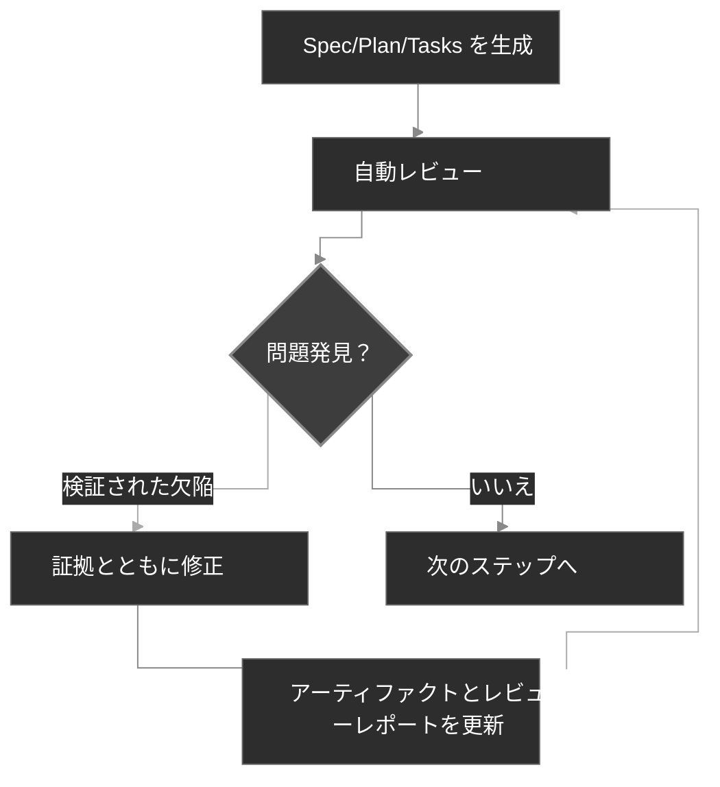

<div align="center">
  <picture>
    <source media="(prefers-color-scheme: dark)" srcset="codexspec-logo-dark.svg">
    <source media="(prefers-color-scheme: light)" srcset="codexspec-logo-light.svg">
    
  </picture>
</div>

<h1 align="center">CodexSpec</h1>

<p align="center">
  <a href="README.md">English</a> | <a href="README.zh-CN.md">中文</a> | <b>日本語</b> | <a href="README.es.md">Español</a> | <a href="README.pt-BR.md">Português</a> | <a href="README.ko.md">한국어</a> | <a href="README.de.md">Deutsch</a> | <a href="README.fr.md">Français</a>
</p>

<p align="center">
  <a href="https://pypi.org/project/codexspec/"></a>
  <a href="https://pypi.org/project/codexspec/"></a>
  <a href="https://opensource.org/licenses/MIT"></a>
</p>

<p align="center">
  <strong>Claude Code 向け Requirements-First SDD ツールキット</strong>
</p>

CodexSpec は、**Requirements-First Spec-Driven Development (SDD)** を通じて高品質なソフトウェア開発を支援します。確認された要件が常に先に来ます。あなたが明示的に確認するまでは、何一つ確定しません。
コードを書き始める前に、**何を**作るのか、**なぜ**作るのかを確定させ、それから**どうやって**作るかを考えます。

[📖 Documentation](https://zts0hg.github.io/codexspec/) | [中文文档](https://zts0hg.github.io/codexspec/zh/) | [日本語ドキュメント](https://zts0hg.github.io/codexspec/ja/) | [한국어 문서](https://zts0hg.github.io/codexspec/ko/) | [Documentación](https://zts0hg.github.io/codexspec/es/) | [Documentation](https://zts0hg.github.io/codexspec/fr/) | [Dokumentation](https://zts0hg.github.io/codexspec/de/) | [Documentação](https://zts0hg.github.io/codexspec/pt-BR/)

---

## 目次

- [なぜ CodexSpec を選ぶのか？](#なぜ-codexspec-を選ぶのか)
- [Requirements-First SDD とは？](#requirements-first-sdd-とは)
- [設計哲学：人間と AI の協調](#設計哲学人間と-ai-の協調)
- [30 秒クイックスタート](#-30-秒クイックスタート)
- [インストール](#インストール)
- [コアワークフロー](#コアワークフロー)
- [利用可能なコマンド](#利用可能なコマンド)
- [spec-kit との比較](#spec-kit-との比較)
- [国際化 (i18n)](#国際化-i18n)
- [コントリビューションとライセンス](#コントリビューションとライセンス)

---

## なぜ CodexSpec を選ぶのか？

Claude Code の上に CodexSpec を重ねる理由とは？ 比較で示します。

| 側面 | Claude Code 単体 | CodexSpec + Claude Code |
|------|------------------|-------------------------|
| **多言語サポート** | デフォルトは英語でのやり取り | チームの言語を設定でき、コラボレーションとレビューがより円滑に |
| **トレーサビリティ** | セッション終了後の判断を追跡するのが困難 | すべてのスペック・計画・タスクが `.codexspec/specs/` に保存される |
| **セッション復旧** | プランモードが中断されると復旧が難しい | コマンドを複数に分割しドキュメントも永続化するため、復旧が容易 |
| **チームガバナンス** | 統一原則がなく、スタイルが一貫しない | `constitution.md` がチームの基準と品質を強制する |

---

## Requirements-First SDD とは？

**Requirements-First SDD** は、スペック駆動開発（Spec-Driven Development, SDD）の方法論に改良を一つ加えたものです。その改良とは、**確認された要件が最優先の権威を持つ**ということです。*何を*作るのか、*なぜ*作るのかを定義して確認してから、*どうやって*作るかを決めます。そして、あなたが明示的に確認するまでは、何も確定しません。

```
従来:        アイデア → コード → デバッグ → 書き直し
SDD:         アイデア → 確認された要件 → スペック → 計画 → タスク → コード
```

**なぜ Requirements-First SDD を使うのか？**

| 問題                  | Requirements-First SDD による解決策                              |
| --------------------- | -------------------------------------------------------- |
| AI が要件を誤解する    | 確認された要件が「何を作るか」を AI に明示し、推測を排除する                |
| 要件の漏れ             | インタラクティブな明確化と確認ゲートがエッジケースを表面化する               |
| アーキテクチャの逸脱   | レビューチェックポイントが正しい方向を担保する                           |
| 無駄な手戻り           | コードを書く前に問題を発見し、確認できる                                  |

<details>
<summary>✨ 主な機能</summary>

### コアワークフロー

- **憲法に基づく開発** - すべての判断を導くプロジェクト原則を確立
- **要件の永続的な記録** - `/specify` はドキュメント生成の前に、確認された議論を `requirements.md` に記録
- **自動レビュー** - 生成されるすべてのスペック・計画・タスクに組み込みの品質チェックを同梱
- **トレーサブルなタスク** - タスク分解は要件と計画のカバレッジを保持し、必要な箇所にのみテストファーストを適用

### 人間と AI の協調

- **レビューコマンド** - スペック・計画・タスクそれぞれに専用のレビューコマンド
- **インタラクティブな明確化** - Q&A を通じた要件の精緻化
- **クロスアーティファクト分析** - 実装前に不整合を検出

### 開発者体験

- **Claude Code とネイティブに統合** - スラッシュコマンドがシームレスに動作
- **多言語サポート** - LLM による動的翻訳で 13 以上の言語をサポート
- **クロスプラットフォーム** - Bash と PowerShell の両スクリプトを同梱
- **拡張可能** - カスタムコマンドのためのプラグインアーキテクチャ

</details>

---

## 設計哲学：人間と AI の協調

CodexSpec は、**効果的な AI 支援開発にはすべての段階で人間が積極的に関与することが不可欠**だという信念に基づいて構築されています。

### なぜ人間の監督が重要なのか

| レビューがない場合              | レビューがある場合                    |
| ------------------------------- | ------------------------------------- |
| AI が誤った前提で進んでしまう   | 人間が誤解を早期に発見する             |
| 不完全な要件がそのまま伝播する   | 実装前にギャップを特定できる           |
| アーキテクチャが意図から逸れる   | 各段階で整合性を検証できる             |
| タスクが重要な機能を見落とす     | 体系的にカバレッジを検証できる         |
| **結果：手戻りと無駄な作業**     | **結果：一度で正しく仕上がる**         |

### CodexSpec のアプローチ

CodexSpec は開発を**レビュー可能なチェックポイント**に分割します。

```
アイデア → /specify → requirements.md → /generate-spec → spec.md → /spec-to-plan → plan.md → /plan-to-tasks → tasks.md → /implement
                                                  │                        │                          │
                                            スペックをレビュー         計画をレビュー            タスクをレビュー
```

確認された要件は、最優先の機能権威（highest-priority feature authority）です。そこから派生するアーティファクトにはソースへの明示的なリンクを付与するため、矛盾が起きても密かに伝播するのではなく、元まで辿って追跡できます。

**生成されるすべてのアーティファクトには対応するレビューコマンドがあります。**

- `spec.md` → `/codexspec:review-spec`
- `plan.md` → `/codexspec:review-plan`
- `tasks.md` → `/codexspec:review-tasks`
- すべてのアーティファクト → `/codexspec:analyze`

この体系的なレビュープロセスが次を保証します。

- **早期のエラー発見**: コードが書かれる前に誤解を捕捉する
- **整合性の検証**: AI の解釈があなたの意図と一致していることを確かめる
- **品質ゲート**: 各段階で完全性・明確性・実現可能性を検証する
- **手戻りの削減**: レビューに数分を投資して、再実装にかかる時間を節約する

---

## 🚀 30 秒クイックスタート

```bash
# 1. インストール
uv tool install codexspec

# 2. プロジェクトを初期化
#    方法 A：新規プロジェクトを作る
codexspec init my-project && cd my-project

#    方法 B：既存のプロジェクト内で初期化する
cd your-existing-project && codexspec init .

# 3. Claude Code で使う
claude
> /codexspec:constitution コード品質とテストに焦点を当てた原則を作成
> /codexspec:specify タスク管理アプリを構築したい
> /codexspec:generate-spec
> /codexspec:spec-to-plan
> /codexspec:plan-to-tasks
> /codexspec:implement-tasks
```

以上です。完全なワークフローはこの先をご覧ください。

---

## インストール

### 前提条件

- Python 3.11+
- [uv](https://docs.astral.sh/uv/)（推奨）または pip

### 推奨インストール

```bash
# uv を使う（推奨）
uv tool install codexspec

# または pip を使う
pip install codexspec
```

### インストールの確認

```bash
codexspec --version
```

<details>
<summary>📦 その他のインストール方法</summary>

#### インストールせずに一度だけ使う

```bash
# 新規プロジェクトを作る
uvx codexspec init my-project

# 既存のプロジェクト内で初期化する
cd your-existing-project
uvx codexspec init . --ai claude

# Codex CLI 向けに初期化する
uvx codexspec init . --ai codex
```

#### GitHub から開発版をインストール

```bash
# uv を使う
uv tool install git+https://github.com/Zts0hg/codexspec.git

# ブランチやタグを指定する
uv tool install git+https://github.com/Zts0hg/codexspec.git@main
uv tool install git+https://github.com/Zts0hg/codexspec.git@v0.5.6
```

</details>

<details>
<summary>🪟 Windows ユーザーへの注意</summary>

**推奨：PowerShell を使う**

```powershell
# 1. uv をインストール（まだの場合）
powershell -c "irm https://astral.sh/uv/install.ps1 | iex"

# 2. PowerShell を再起動し、codexspec をインストール
uv tool install codexspec

# 3. インストールを確認
codexspec --version
```

**CMD でのトラブルシューティング**

「アクセスが拒否されました」というエラーが出る場合：

1. すべての CMD ウィンドウを閉じて開き直す
2. または PATH を手動で更新：`set PATH=%PATH%;%USERPROFILE%\.local\bin`
3. またはフルパスで実行：`%USERPROFILE%\.local\bin\codexspec.exe --version`

詳しくは [Windows トラブルシューティングガイド](docs/WINDOWS-TROUBLESHOOTING.md) を参照してください。

</details>

### アップグレード

```bash
# uv を使う
uv tool install codexspec --upgrade

# pip を使う
pip install --upgrade codexspec
```

### プラグインマーケットプレイスからのインストール（代替方法）

CodexSpec は Claude Code のプラグインとしても利用できます。CLI ツールを介さず、Claude Code の中から直接 CodexSpec コマンドを使いたい場合に適しています。

#### インストール手順

```bash
# Claude Code 上で、マーケットプレイスを追加
> /plugin marketplace add Zts0hg/codexspec

# プラグインをインストール
> /plugin install codexspec@codexspec-market
```

#### プラグインユーザー向けの言語設定

プラグインマーケットプレイス経由でインストールした後は、`/codexspec:config` コマンドで好みの言語を設定します。

```bash
# インタラクティブに設定する
> /codexspec:config

# または現在の設定を確認する
> /codexspec:config --view
```

config コマンドが次の手順を案内します。

1. 出力言語の選択（生成されるドキュメント向け）
2. コミットメッセージの言語の選択
3. `.codexspec/config.yml` ファイルの作成

**インストール方法の比較**

| 方法 | 最適な用途 | 提供される機能 |
|------|----------|------|
| **CLI インストール** (`uv tool install`) | 完全な開発ワークフロー | CLI コマンド（`init`・`check`・`config`）+ スラッシュコマンド |
| **プラグインマーケットプレイス** | クイックスタート、既存プロジェクト | スラッシュコマンドのみ（言語設定は `/codexspec:config` で行う） |

**注意**: プラグインは `strict: false` モードを使用し、LLM 動的翻訳による既存の多言語サポートを再利用しています。

---

## コアワークフロー

CodexSpec は開発を**レビュー可能なチェックポイント**に分解します。

```
アイデア → /specify → requirements.md → /generate-spec → spec.md → /spec-to-plan → plan.md → /plan-to-tasks → tasks.md → /implement
                                                  │                        │                          │
                                            スペックをレビュー         計画をレビュー            タスクをレビュー
```

### ワークフローの各ステップ

| ステップ                | コマンド                     | 出力                          | 人間の確認 |
| ----------------------- | ---------------------------- | ----------------------------- | ---------- |
| 1. プロジェクト原則     | `/codexspec:constitution`    | `constitution.md`             | ✅         |
| 2. 要件の明確化         | `/codexspec:specify`         | `requirements.md`             | ✅         |
| 3. スペックの生成       | `/codexspec:generate-spec`   | `spec.md` + 自動レビュー      | ✅         |
| 4. 技術計画             | `/codexspec:spec-to-plan`    | `plan.md` + 自動レビュー      | ✅         |
| 5. タスク分解           | `/codexspec:plan-to-tasks`   | `tasks.md` + 自動レビュー     | ✅         |
| 6. クロスアーティファクト分析 | `/codexspec:analyze`         | 分析レポート                  | ✅         |
| 7. 実装                 | `/codexspec:implement-tasks` | コード                        | -          |

### specify と clarify：どちらを使うべきか？

| 側面 | `/codexspec:specify` | `/codexspec:clarify` |
|------|----------------------|----------------------|
| **目的** | 初期要件の探索と確認 | 確認された要件や派生スペックを精緻化する |
| **使うタイミング** | 機能を始めるとき | 要件やスペックに明確化が必要なとき |
| **出力** | `requirements.md` を作成・更新 | まず `requirements.md` を更新し、続けて `spec.md` を同期 |
| **手法** | 自由形式の Q&A | 構造化スキャン（4 カテゴリ） |
| **質問数** | 上限なし | 1 回あたり最大 5 問 |

### 主要概念：反復的な品質ループ

すべての生成コマンドに**自動レビュー**が含まれます。検証された欠陥は修正して再レビューでき、最大 2 ラウンドまで行えます。助言的な提案は別枠であり、自動変更をトリガーすることはありません。

1. レポートを確認する
2. 自然言語で修正すべき問題を記述する
3. システムが自動的にスペックとレビューレポートを更新する



<details>
<summary>📖 ワークフローの詳しい説明</summary>

### 1. プロジェクトを初期化

```bash
codexspec init my-awesome-project
cd my-awesome-project
claude
```

### 2. プロジェクト原則を確立

```
/codexspec:constitution コード品質・テスト基準・クリーンアーキテクチャに焦点を当てた原則を作成
```

### 3. 要件を明確化

```
/codexspec:specify タスク管理アプリを構築したい
```

このコマンドは次のことを行います。

- あなたのアイデアを深く理解するため、明確化の質問をする
- あなたが見落としているかもしれないエッジケースを探る
- 最終的な要件サマリーの確認を求める
- 確認されたニーズ・制約・決定・除外項目・未解決の質問を `requirements.md` に永続化する

### 4. スペックを生成

要件が明確化されたら：

```
/codexspec:generate-spec
```

このコマンドは次のことを行います。

- `requirements.md` の確認されたエントリを構造化されたスペックにまとめる
- 要件のトレーサビリティのためのソース参照を付与する
- **自動的に**レビューを実行し、`review-spec.md` を生成する

### 5. 技術計画を作成

```
/codexspec:spec-to-plan バックエンドに Python FastAPI、データベースに PostgreSQL、フロントエンドに React を使用
```

関連する計画セクションのみを使用し、スペックの要件に対する `Covers` リンクを記録し、該当するプロジェクト原則を検証します。

### 6. タスクを生成

```
/codexspec:plan-to-tasks
```

タスクは検証可能な成果を中心に構成されます。

- **条件付きテスト**: 計画・憲法・タスクのリスクが要求する場合にのみ、テストファーストの順序を採用
- **並列マーカー `[P]`**: 真に独立したタスクにのみ使用
- **ファイルパス指定**: タスクごとに明確な成果物を明示
- **トレーサビリティ**: 各タスクがカバーする計画と要件にリンク

### 7. クロスアーティファクト分析（任意ですが推奨）

```
/codexspec:analyze
```

要件・スペック・計画・タスク全体の問題を検出します。

- カバレッジのギャップ（タスクのない要件）
- 重複や不整合
- 憲法違反
- 指定が不十分な項目

### 8. 実装

```
/codexspec:implement-tasks
```

実装は**条件付き TDD ワークフロー**に従います。

- コードを書くタスク: テストファースト（Red → Green → Verify → Refactor）
- テスト不可能なタスク（docs や config）: 直接実装

</details>

---

## 利用可能なコマンド

### CLI コマンド

| コマンド            | 説明                       |
| ------------------- | -------------------------- |
| `codexspec init`    | 新規プロジェクトを初期化   |
| `codexspec check`   | インストール済みツールを確認 |
| `codexspec version` | バージョン情報を表示       |
| `codexspec config`  | 設定を表示・変更           |

<details>
<summary>📋 init のオプション</summary>

| オプション          | 説明                                                   |
| ------------------- | ------------------------------------------------------ |
| `PROJECT_NAME`      | プロジェクトのディレクトリ名（`.` または `--here` でカレントディレクトリ） |
| `--here`, `-h`      | カレントディレクトリで初期化                           |
| `--ai`, `-a`        | 使用する AI アシスタント：`claude`・`codex`・`both`（デフォルト：claude） |
| `--lang`, `-l`      | 出力（ベース）言語。interaction/document/commit はこれにフォールバック（例：en, zh-CN, ja） |
| `--interaction-lang`| インタラクション言語（LLM との対話 + CLI 出力）。`--lang` を上書き |
| `--document-lang`   | ドキュメント言語（生成される spec/plan/tasks）。`--lang` を上書き |
| `--commit-lang`     | コミットメッセージの言語。`--lang` を上書き             |
| `--force`, `-f`     | ファイルを上書き + プロンプトを自動承認。`config.yml` は再生成しない |
| `--no-git`          | git リポジトリの初期化をスキップ                        |
| `--debug`, `-d`     | デバッグ出力を有効化                                    |

</details>

<details>
<summary>📋 config のオプション</summary>

| オプション                 | 説明                                                   |
| -------------------------- | ------------------------------------------------------ |
| `--set-lang`, `-l`         | 出力（ベース）言語を設定                               |
| `--set-interaction-lang`   | インタラクション言語を設定                             |
| `--set-document-lang`      | ドキュメント言語を設定                                 |
| `--set-commit-lang`, `-c`  | コミットメッセージの言語を設定                         |
| `--list-langs`             | サポートされているすべての言語を一覧表示               |
| `--auto-next`              | `workflow.auto_next` を切り替え/設定（値なしでトグル、または on/off） |

</details>

### スラッシュコマンド

#### コアワークフローのコマンド

| コマンド                     | 説明                                                              |
| ---------------------------- | ----------------------------------------------------------------- |
| `/codexspec:constitution`    | クロスアーティファクト検証付きでプロジェクト憲法を作成・更新     |
| `/codexspec:specify`         | 要件を明確化・確認し、`requirements.md` に永続化                  |
| `/codexspec:generate-spec`   | `spec.md` ドキュメントを生成 ★ 自動レビュー                       |
| `/codexspec:spec-to-plan`    | スペックを技術計画に変換 ★ 自動レビュー                           |
| `/codexspec:plan-to-tasks`   | 計画をトレーサブルで検証可能なタスクに分解 ★ 自動レビュー         |
| `/codexspec:implement-tasks` | タスクを実行（条件付き TDD）                                      |

#### レビューコマンド（品質ゲート）

| コマンド                | 説明                              |
| ----------------------- | --------------------------------- |
| `/codexspec:review-spec`  | スペックをレビュー（自動または手動） |
| `/codexspec:review-plan`  | 技術計画をレビュー（自動または手動） |
| `/codexspec:review-tasks` | タスク分解をレビュー（自動または手動） |

#### 拡張コマンド

| コマンド                     | 説明                                                       |
| ---------------------------- | ---------------------------------------------------------- |
| `/codexspec:config`          | プロジェクト設定を管理（作成・表示・変更・リセット）       |
| `/codexspec:clarify`         | スペックの曖昧さをスキャン（4 カテゴリ、最大 5 問）        |
| `/codexspec:analyze`         | クロスアーティファクト整合性分析（読み取り専用・重要度ベース） |
| `/codexspec:checklist`       | 要件の品質チェックリストを生成                             |
| `/codexspec:tasks-to-issues` | タスクを GitHub Issues に変換                              |

#### Git ワークフローのコマンド

| コマンド                    | 説明                                            |
| --------------------------- | ----------------------------------------------- |
| `/codexspec:commit-staged`  | ステージされた変更からコミットメッセージを生成   |
| `/codexspec:pr`             | PR/MR の説明を生成（プラットフォームを自動検出） |

#### コードレビューのコマンド

| コマンド                 | 説明                                                              |
| ------------------------ | ----------------------------------------------------------------- |
| `/codexspec:review-code` | 変更範囲の欠陥ゲート。パス品質スコアカードには `--audit` を使用 |

---

## spec-kit との比較

CodexSpec は GitHub の spec-kit に触発されていますが、重要な違いがあります。

| 機能              | spec-kit                  | CodexSpec                                            |
| ----------------- | ------------------------- | ---------------------------------------------------- |
| コア思想          | スペック駆動開発          | Requirements-First SDD + 人間と AI の協調            |
| CLI 名            | `specify`                 | `codexspec`                                          |
| 主要 AI           | マルチエージェント対応    | Claude Code に特化                                   |
| 憲法システム      | 基本                      | 完全な憲法 + クロスアーティファクト検証              |
| 二段階スペック    | なし                      | あり（明確化 + 生成）                                |
| レビューコマンド  | オプション                | 3 つの専用レビューコマンド + スコアリング            |
| clarify コマンド  | あり                      | 4 つの焦点カテゴリ、レビューとの統合                 |
| analyze コマンド  | あり                      | 読み取り専用・重要度ベース・憲法認識                 |
| タスクでの TDD    | オプション                | 要件・リスク・ポリシーに基づき条件付きで適用         |
| 実装              | 標準                      | 条件付き TDD（コード vs docs/config）                |
| 拡張システム      | あり                      | あり                                                 |
| PowerShell スクリプト | あり                   | あり                                                 |
| i18n サポート     | なし                      | あり（LLM 翻訳で 13 以上の言語）                     |

### 主な差別化要因

1. **レビューファーストの文化**: 主要なすべてのアーティファクトに専用のレビューコマンドがある
2. **憲法によるガバナンス**: 原則はただ文書化されるのではなく、検証される
3. **証拠に基づくレビュー**: 欠陥の指摘には具体的証拠が必要であり、助言的な設計案は承認に影響しない
4. **確認ゲート**: 要件・スペック・計画・タスクは、人間が明示的に確認した後にのみ確定（binding）される

---

## 国際化 (i18n)

CodexSpec は **LLM による動的翻訳** で多言語をサポートします。翻訳テンプレートを維持する必要はなく、Claude が実行時に言語設定に基づいてコンテンツを翻訳します。

### 言語の次元

CodexSpec は言語を、独立に設定可能な 4 つの次元に分割しています。`output` がベースであり、他はこれを上書きし、未設定時はこれ（次いで `en`）にフォールバックします。そのため、ある言語で Claude と対話しながら、生成されるアーティファクトやコミットメッセージは別の言語に保つ、といった運用が可能です。

| 次元        | `config.yml` キー | init 時の設定        | 後からの設定                  | 制御対象                  | フォールバック先 |
|-------------|-------------------|----------------------|-------------------------------|---------------------------|------------------|
| Output (ベース) | `output`          | `--lang`             | `config --set-lang`           | 他 3 つのベース           | `en`             |
| Interaction | `interaction`     | `--interaction-lang` | `config --set-interaction-lang` | LLM との対話 + CLI 出力   | output → `en`    |
| Document    | `document`        | `--document-lang`    | `config --set-document-lang`  | 生成される spec/plan/tasks | output → `en`    |
| Commit      | `commit`          | `--commit-lang`      | `config --set-commit-lang`    | git のコミットメッセージ  | output → `en`    |
| Templates   | `templates`       | —                    | —                             | テンプレートのソース（常に `en`） | —                |

### 言語の設定

**初期化時：**

```bash
# 中国語で出力（output ベースを設定）
codexspec init my-project --lang zh-CN

# 完全に非対話型で実行：zh-CN ベース、コミットメッセージは英語
codexspec init my-project --lang zh-CN --commit-lang en

# すべての次元を明示的に設定（スクリプト可能、プロンプトなし）
codexspec init my-project \
  --interaction-lang zh-CN --document-lang en --commit-lang en
```

TTY 環境で `--lang` を付けずに（かつ 3 つの次元フラグをすべて付けずに）初回 init を実行すると、ベース言語の入力を求められます。非 TTY 環境（CI やスクリプト）では `en` がデフォルトです。`init` を再実行しても、明示的に指定しなかった言語キーは保持されます。

**初期化後：**

```bash
# 現在の設定を表示
codexspec config

# 単一の次元だけを変更
codexspec config --set-lang zh-CN
codexspec config --set-interaction-lang zh-CN
codexspec config --set-document-lang en
codexspec config --set-commit-lang en
codexspec config --auto-next
```

### サポートされている言語

| コード   | 言語               |
| -------- | ------------------ |
| `en`     | English（デフォルト） |
| `zh-CN`  | 简体中文           |
| `zh-TW`  | 繁體中文           |
| `ja`     | 日本語             |
| `ko`     | 한국어             |
| `es`     | Español            |
| `fr`     | Français           |
| `de`     | Deutsch            |
| `pt-BR`  | Português          |
| `ru`     | Русский            |
| `it`     | Italiano           |
| `ar`     | العربية            |
| `hi`     | हिन्दी               |

<details>
<summary>⚙️ 設定ファイルの例</summary>

`.codexspec/config.yml`：

```yaml
version: "1.0"

language:
  output: "zh-CN"        # ベース言語。以下 3 つはこれに（次いで "en"）フォールバック
  interaction: "zh-CN"   # LLM との対話 + codexspec CLI 出力（省略可 → デフォルトは output）
  document: "en"         # 生成される requirements/spec/plan/tasks（省略可 → デフォルトは output）
  commit: "en"           # git コミットメッセージ（省略可 → デフォルトは output）
  templates: "en"        # "en" のまま維持

project:
  ai: "claude"
  created: "2025-02-15"
```

</details>

---

## プロジェクト構造

初期化後のプロジェクト構造：

```
my-project/
├── .codexspec/
│   ├── memory/
│   │   └── constitution.md    # プロジェクト憲法
│   ├── specs/
│   │   └── {feature-id}/
│   │       ├── spec.md        # 機能スペック
│   │       ├── plan.md        # 技術計画
│   │       ├── tasks.md       # タスク分解
│   │       └── checklists/    # 品質チェックリスト
│   ├── templates/             # カスタムテンプレート
│   ├── scripts/               # ヘルパースクリプト
│   └── extensions/            # カスタム拡張
├── .claude/
│   └── commands/              # Claude Code 用スラッシュコマンド
├── .agents/
│   └── skills/                # Codex スキル（--ai codex または both で初期化した場合）
├── CLAUDE.md                  # Claude Code 向けコンテキスト
└── AGENTS.md                  # Codex 向けコンテキスト
```

---

## 拡張システム

CodexSpec はカスタムコマンドを追加するためのプラグインアーキテクチャをサポートしています。

```
my-extension/
├── extension.yml          # 拡張マニフェスト
├── commands/              # カスタムスラッシュコマンド
│   └── command.md
└── README.md
```

詳細は `extensions/EXTENSION-DEVELOPMENT-GUIDE.md` を参照してください。

---

## 開発

### 前提条件

- Python 3.11+
- uv パッケージマネージャー
- Git

### ローカル開発

```bash
# リポジトリをクローン
git clone https://github.com/Zts0hg/codexspec.git
cd codexspec

# 開発用依存関係をインストール
uv sync --dev

# ローカルで実行
uv run codexspec --help

# テストを実行
uv run pytest

# コードをリント
uv run ruff check src/

# パッケージをビルド
uv build
```

---

## コントリビューションとライセンス

コントリビューションを歓迎します。プルリクエストを送る前に、コントリビューションガイドラインをご確認ください。

## ライセンス

MIT ライセンスです。詳細は [LICENSE](LICENSE) を参照してください。

## 謝辞

- [GitHub spec-kit](https://github.com/github/spec-kit) に触発されました
- [Claude Code](https://claude.ai/code) のために構築されました
