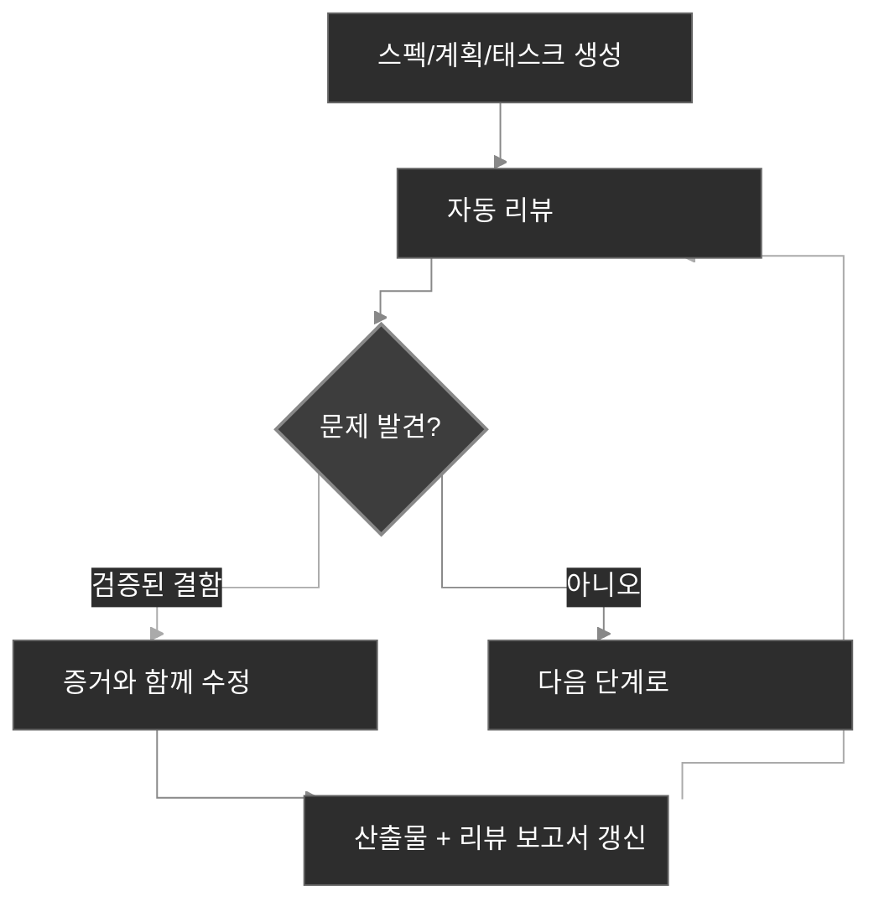

<div align="center">
  <picture>
    <source media="(prefers-color-scheme: dark)" srcset="codexspec-logo-dark.svg">
    <source media="(prefers-color-scheme: light)" srcset="codexspec-logo-light.svg">
    
  </picture>
</div>

<h1 align="center">CodexSpec</h1>

<p align="center">
  <a href="README.md">English</a> | <a href="README.zh-CN.md">中文</a> | <a href="README.ja.md">日本語</a> | <a href="README.es.md">Español</a> | <a href="README.pt-BR.md">Português</a> | <b>한국어</b> | <a href="README.de.md">Deutsch</a> | <a href="README.fr.md">Français</a>
</p>

<p align="center">
  <a href="https://pypi.org/project/codexspec/"></a>
  <a href="https://pypi.org/project/codexspec/"></a>
  <a href="https://opensource.org/licenses/MIT"></a>
</p>

<p align="center">
  <strong>Claude Code를 위한 Requirements-First SDD 툴킷</strong>
</p>

CodexSpec은 **Requirements-First Spec-Driven Development(요구사항 우선 SDD)** 방식으로 고품질 소프트웨어를 개발하도록 돕습니다. 핵심은 단 하나입니다 — 확정된 요구사항이 먼저이며, 사용자가 명시적으로 확인하기 전에는 어떤 내용도 확정되지 않습니다.
코드로 곧장 뛰어드는 대신, **어떻게** 만들지 결정하기에 앞서 **무엇을** 만들지, 그리고 **왜** 만들지를 먼저 확정합니다.

📖 [한국어 문서](https://zts0hg.github.io/codexspec/ko/) | [Documentation](https://zts0hg.github.io/codexspec/) | [中文文档](https://zts0hg.github.io/codexspec/zh/) | [日本語ドキュメント](https://zts0hg.github.io/codexspec/ja/) | [Documentación](https://zts0hg.github.io/codexspec/es/) | [Documentation](https://zts0hg.github.io/codexspec/fr/) | [Dokumentation](https://zts0hg.github.io/codexspec/de/) | [Documentação](https://zts0hg.github.io/codexspec/pt-BR/)

---

## 목차

- [왜 CodexSpec인가?](#왜-codexspec인가)
- [Requirements-First SDD란?](#requirements-first-sdd란)
- [설계 철학: 인간-AI 협업](#설계-철학-인간-ai-협업)
- [🚀 30초 퀵스타트](#-30초-퀵스타트)
- [설치](#설치)
- [핵심 워크플로우](#핵심-워크플로우)
- [사용 가능한 명령어](#사용-가능한-명령어)
- [spec-kit과의 비교](#spec-kit과의-비교)
- [국제화(i18n)](#국제화i18n)
- [기여 및 라이선스](#기여-및-라이선스)

---

## 왜 CodexSpec인가?

Claude Code 위에 굳이 CodexSpec을 얹어야 하는 이유는 무엇일까요? 직접 비교해 보겠습니다.

| 측면 | Claude Code 단독 | CodexSpec + Claude Code |
|------|------------------|-------------------------|
| **다국어 지원** | 기본적으로 영어로 소통 | 팀 언어를 설정해 협업과 리뷰를 더 매끄럽게 진행 |
| **추적 가능성** | 세션이 끝나면 의사결정 맥락을 추적하기 어려움 | 모든 스펙, 계획, 태스크가 `.codexspec/specs/`에 저장 |
| **세션 복구** | Plan 모드가 중간에 끊기면 복구가 어려움 | 여러 명령어로 단계를 나누고 문서를 영속화해 복구가 쉬움 |
| **팀 거버넌스** | 통일된 원칙이 없고 스타일이 들쭉날쭉 | `constitution.md`가 팀 표준과 품질 기준을 강제 |

---

## Requirements-First SDD란?

**Requirements-First SDD**는 스펙 주도 개발(SDD) 방법론에 하나의 핵심 원칙을 더한 것입니다 — **확정된 요구사항이 가장 우선순위가 높은 기준**이 됩니다. *무엇을* 만들지, *왜* 만들지를 먼저 정의하고 확인한 뒤에야 *어떻게*를 다루며, 사용자가 명시적으로 확인하기 전에는 어떤 결과도 확정되지 않습니다.

```
전통적 방식:  아이디어 → 코드 → 디버깅 → 다시 작성
SDD:          아이디어 → 확정된 요구사항 → 스펙 → 계획 → 태스크 → 코드
```

**왜 Requirements-First SDD를 쓸까요?**

| 문제                | Requirements-First SDD의 해결책                          |
| ------------------- | -------------------------------------------------------- |
| AI가 엇갈려 해석    | 확정된 요구사항이 "무엇을 만들지"를 알려주어 AI의 추측을 제거 |
| 요구사항 누락       | 대화형 명확화와 확인 게이트가 엣지 케이스를 조기에 발견 |
| 아키텍처 이탈       | 리뷰 체크포인트가 올바른 방향을 유지                     |
| 헛된 재작업         | 코드 작성 전에 문제를 발견·확인                           |

<details>
<summary>✨ 주요 기능</summary>

### 핵심 워크플로우

- **프로젝트 헌법 기반 개발** - 모든 결정을 이끌어주는 프로젝트 원칙 수립
- **요구사항 영속화** - `/specify`가 확인된 대화 내용을 문서 생성 전에 `requirements.md`로 기록
- **자동 리뷰** - 생성되는 모든 스펙, 계획, 태스크 산출물에 품질 검사가 내장
- **추적 가능한 태스크** - 태스크 분해가 요구사항과 계획 커버리지를 보존하며, 테스트 우선 방식은 필요한 곳에만 적용

### 인간-AI 협업

- **리뷰 명령어** - 스펙, 계획, 태스크 각각을 위한 전용 리뷰 명령어
- **대화형 명확화** - Q&A 기반으로 요구사항을 다듬는 과정
- **교차 산출물 분석** - 구현에 앞서 불일치를 발견

### 개발자 경험

- **네이티브 Claude Code 연동** - 슬래시 명령어가 자연스럽게 동작
- **다국어 지원** - LLM 동적 번역으로 13개 이상 언어 지원
- **크로스 플랫폼** - Bash와 PowerShell 스크립트를 함께 제공
- **확장 가능** - 커스텀 명령어를 위한 플러그인 아키텍처

</details>

---

## 설계 철학: 인간-AI 협업

CodexSpec은 한 가지 믿음 위에 세워져 있습니다 — **효과적인 AI 보조 개발은 모든 단계에서 인간의 적극적인 참여를 전제로 한다**는 것입니다.

### 인간의 감독이 중요한 이유

| 리뷰가 없을 때                  | 리뷰가 있을 때                          |
| ------------------------------- | ---------------------------------------- |
| AI가 잘못된 가정을 함           | 인간이 오해를 일찍 포착                  |
| 불완전한 요구사항이 그대로 번짐 | 구현 전에 빈틈이 식별됨                  |
| 아키텍처가 의도에서 어긋남       | 각 단계마다 정합성을 검증                |
| 태스크가 핵심 기능을 빠뜨림      | 체계적인 커버리지 검증                   |
| **결과: 재작업과 낭비된 노력**   | **결과: 한 번에 제대로 완성**            |

### CodexSpec의 접근 방식

CodexSpec은 개발을 **리뷰 가능한 체크포인트** 단위로 구조화합니다.

```
아이디어 → /specify → requirements.md → /generate-spec → spec.md → /spec-to-plan → plan.md → /plan-to-tasks → tasks.md → /implement
                                                   │                         │                            │
                                              스펙 리뷰                계획 리뷰                    태스크 리뷰
```

확정된 요구사항은 가장 우선순위가 높은 기능 기준(highest-priority feature authority)입니다. 파생되는 산출물은 명시적인 출처 링크를 달고 나오기 때문에, 충돌이 조용히 전파되는 일 없이 거슬러 추적할 수 있습니다.

**생성되는 모든 산출물에는 대응하는 리뷰 명령어가 있습니다:**

- `spec.md` → `/codexspec:review-spec`
- `plan.md` → `/codexspec:review-plan`
- `tasks.md` → `/codexspec:review-tasks`
- 모든 산출물 → `/codexspec:analyze`

이러한 체계적인 리뷰 과정은 다음을 보장합니다.

- **조기 오류 감지**: 코드가 쓰이기 전에 오해를 잡아냄
- **정합성 검증**: AI의 해석이 의도와 일치하는지 확인
- **품질 게이트**: 각 단계에서 완전성, 명확성, 실현 가능성을 검증
- **재작업 감소**: 리뷰에 몇 분을 들여 재구현에 드는 몇 시간을 아낌

---

## 🚀 30초 퀵스타트

```bash
# 1. 설치
uv tool install codexspec

# 2. 프로젝트 초기화
#    옵션 A: 새 프로젝트 만들기
codexspec init my-project && cd my-project

#    옵션 B: 기존 프로젝트에서 초기화
cd your-existing-project && codexspec init .

# 3. Claude Code에서 사용
claude
> /codexspec:constitution 코드 품질과 테스트에 집중하는 원칙 만들기
> /codexspec:specify 투두 애플리케이션을 만들고 싶어
> /codexspec:generate-spec
> /codexspec:spec-to-plan
> /codexspec:plan-to-tasks
> /codexspec:implement-tasks
```

끝입니다! 완전한 워크플로우는 아래서 이어서 살펴보세요.

---

## 설치

### 사전 요구사항

- Python 3.11+
- [uv](https://docs.astral.sh/uv/) (권장) 또는 pip

### 권장 설치

```bash
# uv 사용(권장)
uv tool install codexspec

# 또는 pip 사용
pip install codexspec
```

### 설치 확인

```bash
codexspec --version
```

<details>
<summary>📦 기타 설치 방법</summary>

#### 설치 없이 한 번만 실행

```bash
# 새 프로젝트 만들기
uvx codexspec init my-project

# 기존 프로젝트에서 초기화
cd your-existing-project
uvx codexspec init . --ai claude

# Codex CLI용으로 초기화
uvx codexspec init . --ai codex
```

#### GitHub에서 개발 버전 설치

```bash
# uv 사용
uv tool install git+https://github.com/Zts0hg/codexspec.git

# 브랜치 또는 태그 지정
uv tool install git+https://github.com/Zts0hg/codexspec.git@main
uv tool install git+https://github.com/Zts0hg/codexspec.git@v0.5.6
```

</details>

<details>
<summary>🪟 Windows 사용자 안내</summary>

**권장: PowerShell 사용**

```powershell
# 1. uv 설치(아직 설치하지 않았다면)
powershell -c "irm https://astral.sh/uv/install.ps1 | iex"

# 2. PowerShell을 다시 시작한 뒤 codexspec 설치
uv tool install codexspec

# 3. 설치 확인
codexspec --version
```

**CMD 문제 해결**

"액세스가 거부되었습니다" 오류가 나타나면:

1. 모든 CMD 창을 닫고 새로 열기
2. 또는 PATH를 수동으로 새로 고침: `set PATH=%PATH%;%USERPROFILE%\.local\bin`
3. 또는 전체 경로로 실행: `%USERPROFILE%\.local\bin\codexspec.exe --version`

자세한 문제 해결은 [Windows 문제 해결 가이드](docs/WINDOWS-TROUBLESHOOTING.md)를 참조하세요.

</details>

### 업그레이드

```bash
# uv 사용
uv tool install codexspec --upgrade

# pip 사용
pip install --upgrade codexspec
```

### 플러그인 마켓플레이스로 설치(대안)

CodexSpec은 Claude Code 플러그인으로도 사용할 수 있습니다. CLI 도구 없이 Claude Code 안에서 바로 CodexSpec 명령어를 쓰고 싶다면 이 방법이 적합합니다.

#### 설치 단계

```bash
# Claude Code에서 마켓플레이스 추가
> /plugin marketplace add Zts0hg/codexspec

# 플러그인 설치
> /plugin install codexspec@codexspec-market
```

#### 플러그인 사용자를 위한 언어 설정

플러그인 마켓플레이스로 설치한 뒤에는 `/codexspec:config` 명령어로 선호하는 언어를 설정하세요.

```bash
# 대화형 설정 시작
> /codexspec:config

# 또는 현재 설정 확인
> /codexspec:config --view
```

config 명령어가 다음 항목들을 안내합니다.

1. 출력 언어 선택(생성되는 문서에 적용)
2. 커밋 메시지 언어 선택
3. `.codexspec/config.yml` 파일 생성

**설치 방법 비교**

| 방법 | 이런 경우에 적합 | 제공 기능 |
|------|------------------|-----------|
| **CLI 설치**(`uv tool install`) | 전체 개발 워크플로우 | CLI 명령어(`init`, `check`, `config`) + 슬래시 명령어 |
| **플러그인 마켓플레이스** | 빠른 시작, 기존 프로젝트 | 슬래시 명령어만(언어 설정은 `/codexspec:config` 사용) |

**참고**: 플러그인은 `strict: false` 모드를 사용하며, 기존 다국어 지원을 LLM 동적 번역으로 그대로 재사용합니다.

---

## 핵심 워크플로우

CodexSpec은 개발을 **리뷰 가능한 체크포인트**로 쪼갭니다.

```
아이디어 → /specify → requirements.md → /generate-spec → spec.md → /spec-to-plan → plan.md → /plan-to-tasks → tasks.md → /implement
                                                   │                         │                            │
                                              스펙 리뷰                계획 리뷰                    태스크 리뷰
```

### 워크플로우 단계

| 단계                | 명령어                        | 산출물                       | 인간 확인 |
| ------------------- | ----------------------------- | ---------------------------- | --------- |
| 1. 프로젝트 원칙    | `/codexspec:constitution`     | `constitution.md`            | ✅        |
| 2. 요구사항 명확화  | `/codexspec:specify`          | `requirements.md`            | ✅        |
| 3. 스펙 생성        | `/codexspec:generate-spec`    | `spec.md` + 자동 리뷰        | ✅        |
| 4. 기술 계획        | `/codexspec:spec-to-plan`     | `plan.md` + 자동 리뷰        | ✅        |
| 5. 태스크 분해      | `/codexspec:plan-to-tasks`    | `tasks.md` + 자동 리뷰       | ✅        |
| 6. 교차 산출물 분석 | `/codexspec:analyze`          | 분석 보고서                  | ✅        |
| 7. 구현             | `/codexspec:implement-tasks`  | 코드                         | -         |

### specify vs clarify: 어느 쪽을 쓸까?

| 측면         | `/codexspec:specify`                | `/codexspec:clarify`                              |
|-------------|-------------------------------------|---------------------------------------------------|
| **목적**    | 초기 요구사항 탐색과 확인           | 확정된 요구사항 또는 파생된 스펙을 다듬기         |
| **사용 시기** | 기능을 막 시작할 때                 | 요구사항이나 스펙이 더 명확해져야 할 때           |
| **산출물**  | `requirements.md`를 생성/갱신       | 먼저 `requirements.md`를 갱신하고 `spec.md`를 동기화 |
| **방식**    | 열린형 Q&A                          | 구조화된 스캔(4개 카테고리)                       |
| **질문 수** | 제한 없음                           | 실행당 최대 5개                                   |

### 핵심 개념: 반복 품질 루프

모든 생성 명령어에는 **자동 리뷰**가 따라붙어 리뷰 보고서를 만들어 냅니다. 검증된 결함은 수정 후 재리뷰할 수 있으며 최대 두 라운드까지 진행됩니다. 반면 권고(advisory) 성격의 제안은 별도로 분리되어 자동 변경을 유발하지 않습니다.

1. 보고서를 검토
2. 자연어로 고칠 문제를 설명
3. 시스템이 스펙과 리뷰 보고서를 자동으로 갱신



<details>
<summary>📖 상세 워크플로우 설명</summary>

### 1. 프로젝트 초기화

```bash
codexspec init my-awesome-project
cd my-awesome-project
claude
```

### 2. 프로젝트 원칙 수립

```
/codexspec:constitution 코드 품질, 테스트 표준, 클린 아키텍처에 집중하는 원칙 만들기
```

### 3. 요구사항 명확화

```
/codexspec:specify 태스크 관리 애플리케이션을 만들고 싶어
```

이 명령어는 다음을 수행합니다.

- 아이디어를 이해하기 위한 명확화 질문을 던짐
- 미처 떠올리지 못했을 엣지 케이스를 탐색
- 최종 요구사항 요약본에 대한 확인을 요청
- 확정된 필요성, 제약, 결정, 제외 항목, 미해결 질문을 `requirements.md`에 영속화

### 4. 스펙 문서 생성

요구사항이 명확해지면:

```
/codexspec:generate-spec
```

이 명령어는:

- `requirements.md`의 확정된 항목들을 구조화된 명세서로 컴파일
- 요구사항 추적을 위한 출처 참조를 추가
- **자동으로** 리뷰를 실행해 `review-spec.md`를 생성

### 5. 기술 계획 수립

```
/codexspec:spec-to-plan 백엔드는 Python FastAPI, 데이터베이스는 PostgreSQL, 프론트엔드는 React 사용
```

관련 있는 계획 섹션만 사용하고, 스펙의 요구사항을 가리키는 `Covers` 링크를 기록하며, 적용 가능한 프로젝트 원칙을 검증합니다.

### 6. 태스크 생성

```
/codexspec:plan-to-tasks
```

태스크는 검증 가능한 결과물을 중심으로 구성됩니다.

- **조건부 테스팅**: 계획, 프로젝트 헌법, 또는 태스크 위험도가 요구할 때만 테스트 우선 순서를 적용
- **병렬 마커 `[P]`**: 진짜로 독립적인 태스크에만 사용
- **파일 경로 명시**: 태스크마다 산출물을 분명하게 지정
- **추적 가능성**: 각 태스크가 자신이 다루는 계획과 요구사항에 링크

### 7. 교차 산출물 분석(선택이지만 권장)

```
/codexspec:analyze
```

요구사항, 스펙, 계획, 태스크에 걸쳐 다음 문제를 감지합니다.

- 커버리지 갭(태스크가 없는 요구사항)
- 중복과 불일치
- 헌법 위반
- 명세가 불충분한 항목

### 8. 구현

```
/codexspec:implement-tasks
```

구현은 **조건부 TDD 워크플로우**를 따릅니다.

- 코드 태스크: 테스트 우선(Red → Green → Verify → Refactor)
- 테스트 불가능한 태스크(문서, 설정): 곧바로 구현

</details>

---

## 사용 가능한 명령어

### CLI 명령어

| 명령어              | 설명                       |
| ------------------- | -------------------------- |
| `codexspec init`    | 새 프로젝트를 초기화       |
| `codexspec check`   | 설치된 도구를 확인         |
| `codexspec version` | 버전 정보를 표시           |
| `codexspec config`  | 설정을 보거나 수정         |

<details>
<summary>📋 init 옵션</summary>

| 옵션                | 설명                                                            |
| ------------------- | --------------------------------------------------------------- |
| `PROJECT_NAME`      | 프로젝트 디렉토리 이름(현재 디렉토리는 `.` 또는 `--here`)       |
| `--here`, `-h`      | 현재 디렉토리에서 초기화                                        |
| `--ai`, `-a`        | 사용할 AI 어시스턴트: `claude`, `codex`, 또는 `both`(기본값: claude) |
| `--lang`, `-l`      | 출력(기본) 언어; interaction/document/commit이 이 언어로 폴백(예: en, zh-CN, ja) |
| `--interaction-lang`| 상호작용 언어(LLM 대화 + CLI 출력); `--lang`보다 우선            |
| `--document-lang`   | 문서 언어(생성되는 spec/plan/tasks); `--lang`보다 우선           |
| `--commit-lang`     | 커밋 메시지 언어; `--lang`보다 우선                              |
| `--force`, `-f`     | 파일을 덮어쓰고 프롬프트를 자동 확정; `config.yml`은 재생성하지 않음 |
| `--no-git`          | git 리포지토리 초기화를 건너뜀                                   |
| `--debug`, `-d`     | 디버그 출력을 활성화                                            |

</details>

<details>
<summary>📋 config 옵션</summary>

| 옵션                      | 설명                                                  |
| ------------------------- | ----------------------------------------------------- |
| `--set-lang`, `-l`        | 출력(기본) 언어를 설정                                |
| `--set-interaction-lang`  | 상호작용 언어를 설정                                  |
| `--set-document-lang`     | 문서 언어를 설정                                      |
| `--set-commit-lang`, `-c` | 커밋 메시지 언어를 설정                               |
| `--list-langs`            | 지원되는 모든 언어를 나열                             |
| `--auto-next`             | `workflow.auto_next`를 토글/설정(값 없으면 토글, 또는 on/off) |

</details>

### 슬래시 명령어

#### 핵심 워크플로우 명령어

| 명령어                        | 설명                                                          |
| ----------------------------- | ------------------------------------------------------------- |
| `/codexspec:constitution`     | 교차 산출물 검증과 함께 프로젝트 헌법을 생성/갱신            |
| `/codexspec:specify`          | 요구사항을 명확화하고 확인해 `requirements.md`에 영속화       |
| `/codexspec:generate-spec`    | `spec.md` 문서를 생성 ★ 자동 리뷰                             |
| `/codexspec:spec-to-plan`     | 스펙을 기술 계획으로 변환 ★ 자동 리뷰                         |
| `/codexspec:plan-to-tasks`    | 계획을 추적 가능하고 검증 가능한 태스크로 분해 ★ 자동 리뷰    |
| `/codexspec:implement-tasks`  | 태스크를 실행(조건부 TDD)                                     |

#### 리뷰 명령어(품질 게이트)

| 명령어                   | 설명                              |
| ------------------------ | --------------------------------- |
| `/codexspec:review-spec` | 명세서 리뷰(자동 또는 수동)       |
| `/codexspec:review-plan` | 기술 계획 리뷰(자동 또는 수동)    |
| `/codexspec:review-tasks`| 태스크 분해 리뷰(자동 또는 수동)  |

#### 보조 명령어

| 명령어                        | 설명                                                       |
| ----------------------------- | ---------------------------------------------------------- |
| `/codexspec:config`           | 프로젝트 설정 관리(생성/보기/수정/재설정)                  |
| `/codexspec:clarify`          | 스펙의 모호성을 스캔(4개 카테고리, 최대 5개 질문)          |
| `/codexspec:analyze`          | 교차 산출물 정합성 분석(읽기 전용, 심각도 기반)            |
| `/codexspec:checklist`        | 요구사항 품질 체크리스트 생성                              |
| `/codexspec:tasks-to-issues`  | 태스크를 GitHub 이슈로 변환                                |

#### Git 워크플로우 명령어

| 명령어                    | 설명                                          |
| ------------------------- | --------------------------------------------- |
| `/codexspec:commit-staged`| 스테이징된 변경사항으로 커밋 메시지 생성      |
| `/codexspec:pr`           | PR/MR 설명 생성(플랫폼 자동 감지)             |

#### 코드 리뷰 명령어

| 명령어                         | 설명                                                          |
| ------------------------------ | ------------------------------------------------------------- |
| `/codexspec:review-code` | 변경 범위 결함 게이트. 경로 품질 점수표에는 `--audit` 사용 |

---

## spec-kit과의 비교

CodexSpec은 GitHub의 spec-kit에서 영감을 받았지만, 몇 가지 중요한 차이가 있습니다.

| 기능              | spec-kit                  | CodexSpec                                       |
| ----------------- | ------------------------- | ----------------------------------------------- |
| 핵심 철학         | 스펙 주도 개발            | Requirements-First SDD + 인간-AI 협업           |
| CLI 이름          | `specify`                 | `codexspec`                                     |
| 주요 AI           | 다중 에이전트 지원        | Claude Code에 집중                              |
| 프로젝트 헌법 시스템| 기본                      | 완전한 프로젝트 헌법 + 교차 산출물 검증            |
| 2단계 스펙        | 없음                      | 있음(명확화 + 생성)                             |
| 리뷰 명령어       | 선택적                    | 전용 리뷰 명령어 3개 + 점수화                   |
| Clarify 명령어    | 있음                      | 4개 초점 카테고리, 리뷰 연동                    |
| Analyze 명령어    | 있음                      | 읽기 전용, 심각도 기반, 헌법 인식               |
| 태스크의 TDD      | 선택적                    | 요구사항, 위험도, 정책에 따라 조건부 적용       |
| 구현              | 표준                      | 조건부 TDD(코드 vs 문서/설정)                   |
| 확장 시스템       | 있음                      | 있음                                            |
| PowerShell 스크립트 | 있음                    | 있음                                            |
| i18n 지원         | 없음                      | 있음(LLM 번역으로 13개 이상 언어)               |

### 주요 차별점

1. **리뷰 우선 문화**: 주요 산출물마다 전용 리뷰 명령어가 있음
2. **프로젝트 헌법 거버넌스**: 원칙을 단순히 문서화하는 데 그치지 않고 검증
3. **증거 기반 리뷰**: 결함은 구체적인 증거를 요구하며, 권고 수준의 설계 제안은 수용 여부에 영향을 주지 않음
4. **확인 게이트**: 요구사항, 스펙, 계획, 태스크는 인간이 명시적으로 확인한 뒤에야 확정됨

---

## 국제화(i18n)

CodexSpec은 **LLM 동적 번역**으로 여러 언어를 지원합니다. 번역된 템플릿을 따로 유지할 필요가 없습니다 — Claude가 언어 설정에 맞춰 런타임에 콘텐츠를 번역합니다.

### 언어 차원

CodexSpec은 언어를 서로 독립적으로 설정할 수 있는 네 가지 차원으로 나눕니다. `output`이 기반이고, 나머지는 이를 덮어쓰되 설정하지 않았을 때 이 언어(그다음엔 `en`)로 폴백합니다. 그래서 Claude와는 한 언어로 소통하면서도 생성되는 산출물이나 커밋 메시지를 다른 언어로 유지할 수 있습니다.

| 차원         | `config.yml` 키    | init 시 설정        | 이후 설정                | 제어 대상                 | 폴백            |
|--------------|--------------------|---------------------|--------------------------|---------------------------|-----------------|
| 출력(기본)   | `output`           | `--lang`            | `config --set-lang`      | 나머지 세 가지의 기반     | `en`            |
| 상호작용     | `interaction`      | `--interaction-lang`| `config --set-interaction-lang` | LLM 대화 + CLI 출력       | output → `en`   |
| 문서         | `document`         | `--document-lang`   | `config --set-document-lang` | 생성되는 spec/plan/tasks  | output → `en`   |
| 커밋         | `commit`           | `--commit-lang`     | `config --set-commit-lang` | git 커밋 메시지           | output → `en`   |
| 템플릿       | `templates`        | —                   | —                        | 템플릿 소스(항상 `en`)    | —               |

### 언어 설정

**초기화할 때:**

```bash
# 중국어 출력(출력 기반을 설정)
codexspec init my-project --lang zh-CN

# 완전히 비대화형으로: zh-CN 기반, 영어 커밋 메시지
codexspec init my-project --lang zh-CN --commit-lang en

# 모든 차원을 명시적으로 설정(스크립트 가능, 프롬프트 없음)
codexspec init my-project \
  --interaction-lang zh-CN --document-lang en --commit-lang en
```

TTY 환경에서 `--lang` 없이(그리고 세 개의 차원 플래그 모두 없이) 처음 초기화하면 기본 언어를 묻는 프롬프트가 나타납니다. 반대로 non-TTY(CI/스크립트) 환경에서는 `en`이 기본값입니다. `init`을 다시 실행할 때 지정하지 않은 언어 키는 그대로 보존됩니다.

**초기화 이후:**

```bash
# 현재 설정 보기
codexspec config

# 단일 차원 변경
codexspec config --set-lang zh-CN
codexspec config --set-interaction-lang zh-CN
codexspec config --set-document-lang en
codexspec config --set-commit-lang en
codexspec config --auto-next
```

### 지원 언어

| 코드    | 언어              |
| ------- | ----------------- |
| `en`    | English(기본값)   |
| `zh-CN` | 简体中文          |
| `zh-TW` | 繁體中文          |
| `ja`    | 日本語            |
| `ko`    | 한국어            |
| `es`    | Español           |
| `fr`    | Français          |
| `de`    | Deutsch           |
| `pt-BR` | Português         |
| `ru`    | Русский           |
| `it`    | Italiano          |
| `ar`    | العربية           |
| `hi`    | हिन्दी               |

<details>
<summary>⚙️ 설정 파일 예시</summary>

`.codexspec/config.yml`:

```yaml
version: "1.0"

language:
  output: "zh-CN"        # 기본 언어; 아래 세 가지는 이 언어로 폴백한 뒤 "en"으로 폴백
  interaction: "zh-CN"   # LLM 대화 + codexspec CLI 출력(선택 → 기본값은 output)
  document: "en"         # 생성되는 requirements/spec/plan/tasks(선택 → 기본값은 output)
  commit: "en"           # git 커밋 메시지(선택 → 기본값은 output)
  templates: "en"        # "en"으로 유지

project:
  ai: "claude"
  created: "2025-02-15"
```

</details>

---

## 프로젝트 구조

초기화 이후의 프로젝트 구조:

```
my-project/
├── .codexspec/
│   ├── memory/
│   │   └── constitution.md    # 프로젝트 헌법
│   ├── specs/
│   │   └── {feature-id}/
│   │       ├── spec.md        # 기능 명세서
│   │       ├── plan.md        # 기술 계획
│   │       ├── tasks.md       # 태스크 분해
│   │       └── checklists/    # 품질 체크리스트
│   ├── templates/             # 커스텀 템플릿
│   ├── scripts/               # 보조 스크립트
│   └── extensions/            # 커스텀 확장
├── .claude/
│   └── commands/              # Claude Code 슬래시 명령어
├── .agents/
│   └── skills/                # Codex 스킬(--ai codex 또는 both로 초기화한 경우)
├── CLAUDE.md                  # Claude Code 컨텍스트
└── AGENTS.md                  # Codex 컨텍스트
```

---

## 확장 시스템

CodexSpec은 커스텀 명령어를 위한 플러그인 아키텍처를 지원합니다.

```
my-extension/
├── extension.yml          # 확장 매니페스트
├── commands/              # 커스텀 슬래시 명령어
│   └── command.md
└── README.md
```

자세한 내용은 `extensions/EXTENSION-DEVELOPMENT-GUIDE.md`를 참조하세요.

---

## 개발

### 사전 요구사항

- Python 3.11+
- uv 패키지 매니저
- Git

### 로컬 개발

```bash
# 리포지토리 클론
git clone https://github.com/Zts0hg/codexspec.git
cd codexspec

# 개발 의존성 설치
uv sync --dev

# 로컬에서 실행
uv run codexspec --help

# 테스트 실행
uv run pytest

# 코드 린트
uv run ruff check src/

# 패키지 빌드
uv build
```

---

## 기여 및 라이선스

기여를 환영합니다! 풀 리퀘스트를 보내기 전에 기여 가이드라인을 먼저 읽어주세요.

## 라이선스

MIT 라이선스 — 자세한 내용은 [LICENSE](LICENSE)를 참조하세요.

## 감사의 글

- [GitHub spec-kit](https://github.com/github/spec-kit)에서 영감을 받았습니다
- [Claude Code](https://claude.ai/code)를 위해 만들어졌습니다
