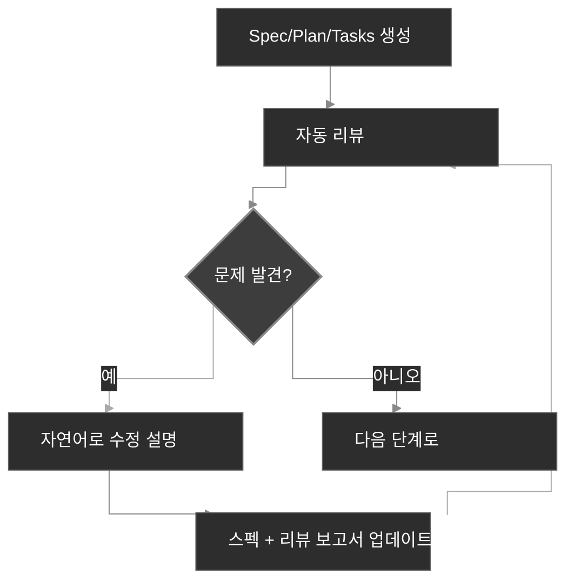

<div align="center">
  <picture>
    <source media="(prefers-color-scheme: dark)" srcset="codexspec-logo-dark.svg">
    <source media="(prefers-color-scheme: light)" srcset="codexspec-logo-light.svg">
    
  </picture>
</div>

# CodexSpec

[English](README.md) | [中文](README.zh-CN.md) | [日本語](README.ja.md) | [Español](README.es.md) | [Português](README.pt-BR.md) | **한국어** | [Deutsch](README.de.md) | [Français](README.fr.md)

[](https://pypi.org/project/codexspec/)
[](https://pypi.org/project/codexspec/)
[](https://opensource.org/licenses/MIT)

**Claude Code를 위한 스펙 주도 개발 (SDD) 툴킷**

CodexSpec은 구조화되고 스펙 주도적인 접근 방식을 사용하여 고품질 소프트웨어를 구축하는 데 도움이 되는 툴킷입니다. **어떻게** 구축할지 결정하기 전에 **무엇을** 구축할지, **왜** 구축할지를 먼저 정의합니다.

[📖 문서](https://zts0hg.github.io/codexspec/ko/) | [Documentation](https://zts0hg.github.io/codexspec/en/) | [中文文档](https://zts0hg.github.io/codexspec/zh/) | [日本語ドキュメント](https://zts0hg.github.io/codexspec/ja/) | [Documentación](https://zts0hg.github.io/codexspec/es/) | [Documentation](https://zts0hg.github.io/codexspec/fr/) | [Dokumentation](https://zts0hg.github.io/codexspec/de/) | [Documentação](https://zts0hg.github.io/codexspec/pt-BR/)

---

## 목차

- [스펙 주도 개발이란?](#스펙-주도-개발이란)
- [설계 철학: 인간-AI 협업](#설계-철학-인간-ai-협업)
- [30초 퀵 스타트](#-30초-퀵-스타트)
- [설치](#설치)
- [핵심 워크플로우](#핵심-워크플로우)
- [사용 가능한 명령어](#사용-가능한-명령어)
- [spec-kit과의 비교](#spec-kit과의-비교)
- [국제화](#국제화-i18n)
- [기여 및 라이선스](#기여)

---

## 스펙 주도 개발이란?

**스펙 주도 개발 (SDD)**은 "스펙 먼저, 코드는 나중에" 방법론입니다:

```
전통적 개발:  아이디어 → 코드 → 디버그 → 재작성
SDD:           아이디어 → 스펙 → 계획 → 태스크 → 코드
```

**왜 SDD를 사용할까?**

| 문제 | SDD 해결책 |
|------|-----------|
| AI 오해 | 스펙이 "무엇을 구축할지" 명확히 하여 AI가 추측하지 않음 |
| 누락된 요구사항 | 대화형 명확화로 엣지 케이스 발견 |
| 아키텍처 이탈 | 리뷰 체크포인트로 올바른 방향 보장 |
| 낭비되는 재작업 | 코드 작성 전에 문제 발견 |

<details>
<summary>✨ 주요 기능</summary>

### 핵심 SDD 워크플로우

- **컨스티튜션 기반 개발** - 모든 결정을 안내하는 프로젝트 원칙 수립
- **2단계 스펙** - 대화형 명확화 (`/specify`) 후 문서 생성 (`/generate-spec`)
- **자동 리뷰** - 모든 아티팩트에 내장된 품질 검사 포함
- **TDD 준비 태스크** - 태스크 분해가 테스트 우선 방법론 강제

### 인간-AI 협업

- **리뷰 명령어** - 스펙, 계획, 태스크를 위한 전용 리뷰 명령어
- **대화형 명확화** - Q&A 기반 요구사항 정제
- **교차 아티팩트 분석** - 구현 전에 불일치 감지

### 개발자 경험

- **네이티브 Claude Code 통합** - 슬래시 명령어가 원활하게 작동
- **다국어 지원** - LLM 동적 번역으로 13개 이상 언어 지원
- **크로스 플랫폼** - Bash 및 PowerShell 스크립트 포함
- **확장 가능** - 사용자 정의 명령어를 위한 플러그인 아키텍처

</details>

---

## 설계 철학: 인간-AI 협업

CodexSpec은 **효과적인 AI 지원 개발에는 모든 단계에서 적극적인 인간 참여가 필요하다**는 믿음을 기반으로 구축되었습니다.

### 인간 감독이 중요한 이유

| 리뷰 없이 | 리뷰와 함께 |
|----------|------------|
| AI가 잘못된 가정을 함 | 인간이 조기에 오해를 포착 |
| 불완전한 요구사항 전파 | 구현 전에 갭 식별 |
| 아키텍처가 의도에서 이탈 | 각 단계에서 정렬 검증 |
| 태스크가 핵심 기능 누락 | 체계적으로 커버리지 검증 |
| **결과: 재작업, 낭비된 노력** | **결과: 첫 번째에 맞음** |

### CodexSpec 접근 방식

CodexSpec은 개발을 **리뷰 가능한 체크포인트**로 구조화합니다:

```
아이디어 → /specify → /generate-spec → /spec-to-plan → /plan-to-tasks → /implement
                           │                  │                │
                      스펙 리뷰          계획 리뷰         태스크 리뷰
                           │                  │                │
                        ✅ 인간            ✅ 인간           ✅ 인간
```

**모든 아티팩트에는 해당하는 리뷰 명령어가 있습니다:**

- `spec.md` → `/codexspec:review-spec`
- `plan.md` → `/codexspec:review-plan`
- `tasks.md` → `/codexspec:review-tasks`
- 모든 아티팩트 → `/codexspec:analyze`

이 체계적인 리뷰 프로세스는 다음을 보장합니다:

- **조기 오류 감지**: 코드가 작성되기 전에 오해를 포착
- **정렬 검증**: AI의 해석이 의도와 일치하는지 확인
- **품질 게이트**: 각 단계에서 완전성, 명확성, 실현 가능성 검증
- **재작업 감소**: 리뷰에 몇 분을 투자하여 재구현에 몇 시간을 절약

---

## 🚀 30초 퀵 스타트

```bash
# 1. 설치
uv tool install codexspec

# 2. 프로젝트 초기화
#    옵션 A: 새 프로젝트 생성
codexspec init my-project && cd my-project

#    옵션 B: 기존 프로젝트에서 초기화
cd your-existing-project && codexspec init .

# 3. Claude Code에서 사용
claude
> /codexspec:constitution 코드 품질과 테스트에 중점을 둔 원칙 생성
> /codexspec:specify 할일 앱을 구축하고 싶습니다
> /codexspec:generate-spec
> /codexspec:spec-to-plan
> /codexspec:plan-to-tasks
> /codexspec:implement-tasks
```

이게 전부입니다! 전체 워크플로우를 계속 읽어보세요.

---

## 설치

### 사전 요구사항

- Python 3.11+
- [uv](https://docs.astral.sh/uv/) (권장) 또는 pip

### 권장 설치

```bash
# uv 사용 (권장)
uv tool install codexspec

# 또는 pip 사용
pip install codexspec
```

### 설치 확인

```bash
codexspec --version
```

<details>
<summary>📦 다른 설치 방법</summary>

#### 일회성 사용 (설치 없음)

```bash
# 새 프로젝트 생성
uvx codexspec init my-project

# 기존 프로젝트에서 초기화
cd your-existing-project
uvx codexspec init . --ai claude
```

#### GitHub에서 개발 버전 설치

```bash
# uv 사용
uv tool install git+https://github.com/Zts0hg/codexspec.git

# 브랜치 또는 태그 지정
uv tool install git+https://github.com/Zts0hg/codexspec.git@main
uv tool install git+https://github.com/Zts0hg/codexspec.git@v0.5.6
```

</details>

<details>
<summary>🪟 Windows 사용자 안내</summary>

**권장: PowerShell 사용**

```powershell
# 1. uv 설치 (아직 설치하지 않은 경우)
powershell -c "irm https://astral.sh/uv/install.ps1 | iex"

# 2. PowerShell을 다시 시작한 후 codexspec 설치
uv tool install codexspec

# 3. 설치 확인
codexspec --version
```

**CMD 문제 해결**

"액세스가 거부되었습니다" 오류가 발생하는 경우:

1. 모든 CMD 창을 닫고 새 창 열기
2. 또는 수동으로 PATH 새로고침: `set PATH=%PATH%;%USERPROFILE%\.local\bin`
3. 또는 전체 경로 사용: `%USERPROFILE%\.local\bin\codexspec.exe --version`

자세한 내용은 [Windows 문제 해결 가이드](docs/WINDOWS-TROUBLESHOOTING.md)를 참조하세요.

</details>

### 업그레이드

```bash
# uv 사용
uv tool install codexspec --upgrade

# pip 사용
pip install --upgrade codexspec
```

### 플러그인 마켓플레이스 설치 (대안)

CodexSpec은 Claude Code 플러그인으로도 제공됩니다. CLI 도구 없이 Claude Code에서 직접 CodexSpec 명령을 사용하려는 경우 이 방법이 적합합니다.

#### 설치 단계

```bash
# Claude Code에서 마켓플레이스 추가
> /plugin marketplace add Zts0hg/codexspec

# 플러그인 설치
> /plugin install codexspec@codexspec-market
```

#### 플러그인 사용자를 위한 언어 설정

플러그인 마켓플레이스를 통해 설치한 후, `/codexspec:config` 명령을 사용하여 선호하는 언어를 설정합니다:

```bash
# 대화형 설정 시작
> /codexspec:config

# 또는 현재 설정 확인
> /codexspec:config --view
```

config 명령은 다음을 안내합니다:

1. 출력 언어 선택 (생성된 문서용)
2. 커밋 메시지 언어 선택
3. `.codexspec/config.yml` 파일 생성

**설치 방법 비교**

| 방법 | 최적 용도 | 기능 |
|------|----------|------|
| **CLI 설치** (`uv tool install`) | 전체 개발 워크플로우 | CLI 명령 (`init`, `check`, `config`) + 슬래시 명령 |
| **플러그인 마켓플레이스** | 빠른 시작, 기존 프로젝트 | 슬래시 명령만 (`/codexspec:config`로 언어 설정) |

**참고**: 플러그인은 `strict: false` 모드를 사용하며 LLM 동적 번역을 통한 기존 다국어 지원을 재사용합니다.

---

## 핵심 워크플로우

CodexSpec은 개발을 **리뷰 가능한 체크포인트**로 분해합니다:

```
아이디어 → /specify → /generate-spec → /spec-to-plan → /plan-to-tasks → /implement
                           │                  │                │
                      스펙 리뷰          계획 리뷰         태스크 리뷰
                           │                  │                │
                        ✅ 인간            ✅ 인간           ✅ 인간
```

### 워크플로우 단계

| 단계 | 명령어 | 출력 | 인간 체크 |
|------|--------|------|----------|
| 1. 프로젝트 원칙 | `/codexspec:constitution` | `constitution.md` | ✅ |
| 2. 요구사항 명확화 | `/codexspec:specify` | 없음 (대화형 대화) | ✅ |
| 3. 스펙 생성 | `/codexspec:generate-spec` | `spec.md` + 자동 리뷰 | ✅ |
| 4. 기술 계획 | `/codexspec:spec-to-plan` | `plan.md` + 자동 리뷰 | ✅ |
| 5. 태스크 분해 | `/codexspec:plan-to-tasks` | `tasks.md` + 자동 리뷰 | ✅ |
| 6. 교차 아티팩트 분석 | `/codexspec:analyze` | 분석 보고서 | ✅ |
| 7. 구현 | `/codexspec:implement-tasks` | 코드 | - |

### specify vs clarify: 언제 어떤 것을 사용할까?

| 측면 | `/codexspec:specify` | `/codexspec:clarify` |
|------|----------------------|----------------------|
| **목적** | 초기 요구사항 탐색 | 기존 스펙의 반복적 정제 |
| **사용 시기** | spec.md가 아직 없음 | spec.md에 개선 필요 |
| **출력** | 없음 (대화만) | spec.md 업데이트 |
| **방법** | 개방형 Q&A | 구조화된 스캔 (4 카테고리) |
| **질문 수** | 무제한 | 최대 5개 |

### 핵심 개념: 반복적 품질 루프

모든 생성 명령어에는 **자동 리뷰**가 포함되어 리뷰 보고서를 생성합니다. 다음을 할 수 있습니다:

1. 보고서 검토
2. 자연어로 수정할 문제 설명
3. 시스템이 자동으로 스펙과 리뷰 보고서 업데이트



<details>
<summary>📖 상세 워크플로우 설명</summary>

### 1. 프로젝트 초기화

```bash
codexspec init my-awesome-project
cd my-awesome-project
claude
```

### 2. 프로젝트 원칙 수립

```
/codexspec:constitution 코드 품질, 테스트 표준, 클린 아키텍처에 중점을 둔 원칙 생성
```

### 3. 요구사항 명확화

```
/codexspec:specify 태스크 관리 애플리케이션을 구축하고 싶습니다
```

이 명령은:

- 아이디어를 이해하기 위한 명확화 질문을 함
- 고려하지 않았을 수 있는 엣지 케이스를 탐색
- 파일을 자동으로 생성하지 **않음** - 사용자가 제어

### 4. 스펙 문서 생성

요구사항이 명확해지면:

```
/codexspec:generate-spec
```

이 명령은:

- 명확화된 요구사항을 구조화된 스펙으로 컴파일
- **자동으로** 리뷰를 실행하고 `review-spec.md` 생성

### 5. 기술 계획 생성

```
/codexspec:spec-to-plan 백엔드에 Python FastAPI, 데이터베이스에 PostgreSQL, 프론트엔드에 React 사용
```

**컨스티튜션 리뷰** 포함 - 계획이 프로젝트 원칙과 일치하는지 검증.

### 6. 태스크 생성

```
/codexspec:plan-to-tasks
```

태스크는 표준 단계로 구성:

- **TDD 강제**: 테스트 태스크가 구현 태스크보다 선행
- **병렬 마커 `[P]`**: 독립적인 태스크 식별
- **파일 경로 명세**: 태스크별 명확한 산출물

### 7. 교차 아티팩트 분석 (선택사항이지만 권장)

```
/codexspec:analyze
```

스펙, 계획, 태스크 간의 문제를 감지:

- 커버리지 갭 (태스크가 없는 요구사항)
- 중복 및 불일치
- 컨스티튜션 위반
- 명세 불충분 항목

### 8. 구현

```
/codexspec:implement-tasks
```

구현은 **조건부 TDD 워크플로우**를 따름:

- 코드 태스크: 테스트 우선 (Red → Green → Verify → Refactor)
- 비테스트 가능 태스크 (문서, 설정): 직접 구현

</details>

---

## 사용 가능한 명령어

### CLI 명령어

| 명령어 | 설명 |
|--------|------|
| `codexspec init` | 새 프로젝트 초기화 |
| `codexspec check` | 설치된 도구 확인 |
| `codexspec version` | 버전 정보 표시 |
| `codexspec config` | 설정 보기 또는 수정 |

<details>
<summary>📋 init 옵션</summary>

| 옵션 | 설명 |
|------|------|
| `PROJECT_NAME` | 프로젝트 디렉토리 이름 |
| `--here`, `-h` | 현재 디렉토리에서 초기화 |
| `--ai`, `-a` | 사용할 AI 어시스턴트 (기본값: claude) |
| `--lang`, `-l` | 출력 언어 (예: en, ko, zh-CN, ja) |
| `--force`, `-f` | 기존 파일 강제 덮어쓰기 |
| `--no-git` | git 초기화 건너뛰기 |
| `--debug`, `-d` | 디버그 출력 활성화 |

</details>

<details>
<summary>📋 config 옵션</summary>

| 옵션 | 설명 |
|------|------|
| `--set-lang`, `-l` | 출력 언어 설정 |
| `--set-commit-lang`, `-c` | 커밋 메시지 언어 설정 |
| `--list-langs` | 지원되는 모든 언어 나열 |

</details>

### 슬래시 명령어

#### 핵심 워크플로우 명령어

| 명령어 | 설명 |
|--------|------|
| `/codexspec:constitution` | 교차 아티팩트 검증과 함께 프로젝트 컨스티튜션 생성/업데이트 |
| `/codexspec:specify` | 대화형 Q&A로 요구사항 명확화 (파일 생성 없음) |
| `/codexspec:generate-spec` | `spec.md` 문서 생성 ★ 자동 리뷰 |
| `/codexspec:spec-to-plan` | 스펙을 기술 계획으로 변환 ★ 자동 리뷰 |
| `/codexspec:plan-to-tasks` | 계획을 원자적 태스크로 분해 ★ 자동 리뷰 |
| `/codexspec:implement-tasks` | 태스크 실행 (조건부 TDD) |

#### 리뷰 명령어 (품질 게이트)

| 명령어 | 설명 |
|--------|------|
| `/codexspec:review-spec` | 스펙 리뷰 (자동 또는 수동) |
| `/codexspec:review-plan` | 기술 계획 리뷰 (자동 또는 수동) |
| `/codexspec:review-tasks` | 태스크 분해 리뷰 (자동 또는 수동) |

#### 확장 명령어

| 명령어 | 설명 |
|--------|------|
| `/codexspec:config` | 프로젝트 설정 관리 (생성/보기/수정/재설정) |
| `/codexspec:clarify` | 기존 spec.md를 모호성 스캔 (4 카테고리, 최대 5개 질문) |
| `/codexspec:analyze` | 비파괴적 교차 아티팩트 분석 (읽기 전용, 심각도 기반) |
| `/codexspec:checklist` | 요구사항 검증을 위한 품질 체크리스트 생성 |
| `/codexspec:tasks-to-issues` | 태스크를 GitHub 이슈로 변환 |

#### Git 워크플로우 명령어

| 명령어 | 설명 |
|--------|------|
| `/codexspec:commit-staged` | 스테이징된 변경사항으로 커밋 메시지 생성 |
| `/codexspec:pr` | PR/MR 설명 생성 (자동 감지 플랫폼) |

#### 코드 리뷰 명령어

| 명령어 | 설명 |
|--------|------|
| `/codexspec:review-python-code` | Python 코드 리뷰 (PEP 8, 타입 안전성, 엔지니어링 견고성) |
| `/codexspec:review-react-code` | React/TypeScript 코드 리뷰 (아키텍처, Hooks, 성능) |

---

## spec-kit과의 비교

CodexSpec은 GitHub의 spec-kit에서 영감을 받았지만 몇 가지 주요 차이점이 있습니다:

| 기능 | spec-kit | CodexSpec |
|------|----------|-----------|
| 핵심 철학 | 스펙 주도 개발 | 스펙 주도 개발 + 인간-AI 협업 |
| CLI 이름 | `specify` | `codexspec` |
| 주요 AI | 멀티 에이전트 지원 | Claude Code 중심 |
| 컨스티튜션 시스템 | 기본 | 교차 아티팩트 검증을 갖춘 완전한 컨스티튜션 |
| 2단계 스펙 | 없음 | 있음 (명확화 + 생성) |
| 리뷰 명령어 | 선택사항 | 점수 매기기를 갖춘 3개 전용 리뷰 명령어 |
| Clarify 명령어 | 있음 | 4개 초점 카테고리, 리뷰 통합 |
| Analyze 명령어 | 있음 | 읽기 전용, 심각도 기반, 컨스티튜션 인식 |
| 태스크의 TDD | 선택사항 | 강제 (테스트가 구현보다 선행) |
| 구현 | 표준 | 조건부 TDD (코드 vs 문서/설정) |
| 확장 시스템 | 있음 | 있음 |
| PowerShell 스크립트 | 있음 | 있음 |
| i18n 지원 | 없음 | 있음 (LLM 번역을 통한 13개 이상 언어) |

### 주요 차별화 요소

1. **리뷰 우선 문화**: 모든 주요 아티팩트에는 전용 리뷰 명령어가 있음
2. **컨스티튜션 거버넌스**: 원칙이 단순히 문서화되는 것이 아니라 검증됨
3. **기본 TDD**: 태스크 생성에 테스트 우선 방법론이 강제됨
4. **인간 체크포인트**: 검증 게이트를 중심으로 설계된 워크플로우

---

## 국제화 (i18n)

CodexSpec은 **LLM 동적 번역**을 통해 여러 언어를 지원합니다. 번역된 템플릿을 유지하는 대신, Claude가 언어 설정에 따라 런타임에 콘텐츠를 번역합니다.

### 언어 설정

**초기화 시:**

```bash
# 한국어 출력으로 프로젝트 생성
codexspec init my-project --lang ko

# 일본어 출력으로 프로젝트 생성
codexspec init my-project --lang ja
```

**초기화 후:**

```bash
# 현재 설정 보기
codexspec config

# 언어 설정 변경
codexspec config --set-lang ko

# 커밋 메시지 언어 설정
codexspec config --set-commit-lang en
```

### 지원되는 언어

| 코드 | 언어 |
|------|------|
| `en` | English (기본값) |
| `zh-CN` | 中文（简体） |
| `zh-TW` | 中文（繁體） |
| `ja` | 日本語 |
| `ko` | 한국어 |
| `es` | Español |
| `fr` | Français |
| `de` | Deutsch |
| `pt-BR` | Português |
| `ru` | Русский |
| `it` | Italiano |
| `ar` | العربية |
| `hi` | हिन्दी |

<details>
<summary>⚙️ 설정 파일 예시</summary>

`.codexspec/config.yml`:

```yaml
version: "1.0"

language:
  output: "ko"           # 출력 언어
  commit: "ko"           # 커밋 메시지 언어 (기본값: 출력 언어)
  templates: "en"        # "en" 유지

project:
  ai: "claude"
  created: "2025-02-15"
```

</details>

---

## 프로젝트 구조

초기화 후 프로젝트 구조:

```
my-project/
├── .codexspec/
│   ├── memory/
│   │   └── constitution.md    # 프로젝트 컨스티튜션
│   ├── specs/
│   │   └── {feature-id}/
│   │       ├── spec.md        # 기능 스펙
│   │       ├── plan.md        # 기술 계획
│   │       ├── tasks.md       # 태스크 분해
│   │       └── checklists/    # 품질 체크리스트
│   ├── templates/             # 사용자 정의 템플릿
│   ├── scripts/               # 헬퍼 스크립트
│   └── extensions/            # 사용자 정의 확장
├── .claude/
│   └── commands/              # Claude Code 슬래시 명령어
└── CLAUDE.md                  # Claude Code용 컨텍스트
```

---

## 확장 시스템

CodexSpec은 사용자 정의 명령어를 추가하기 위한 플러그인 아키텍처를 지원합니다:

```
my-extension/
├── extension.yml          # 확장 매니페스트
├── commands/              # 사용자 정의 슬래시 명령어
│   └── command.md
└── README.md
```

자세한 내용은 `extensions/EXTENSION-DEVELOPMENT-GUIDE.md`를 참조하세요.

---

## 개발

### 사전 요구사항

- Python 3.11+
- uv 패키지 매니저
- Git

### 로컬 개발

```bash
# 저장소 클론
git clone https://github.com/Zts0hg/codexspec.git
cd codexspec

# 개발 의존성 설치
uv sync --dev

# 로컬에서 실행
uv run codexspec --help

# 테스트 실행
uv run pytest

# 코드 린트
uv run ruff check src/

# 패키지 빌드
uv build
```

---

## 기여

기여를 환영합니다! 풀 리퀘스트를 제출하기 전에 기여 가이드라인을 읽어주세요.

## 라이선스

MIT 라이선스 - 자세한 내용은 [LICENSE](LICENSE)를 참조하세요.

## 감사의 글

- [GitHub spec-kit](https://github.com/github/spec-kit)에서 영감을 받았습니다
- [Claude Code](https://claude.ai/code)를 위해 구축되었습니다
