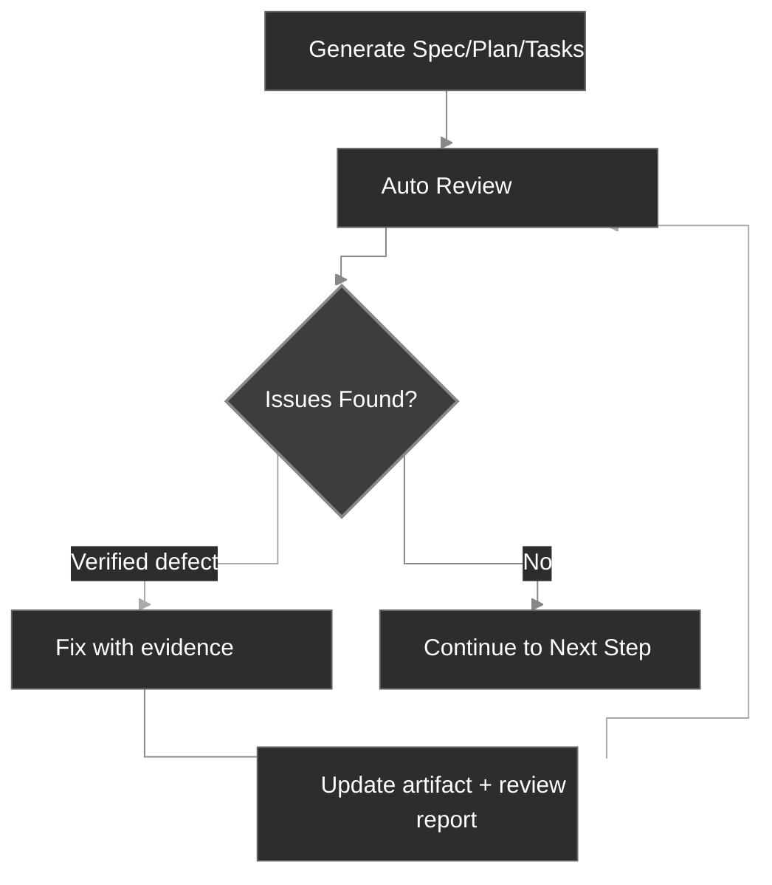

<div align="center">
  <picture>
    <source media="(prefers-color-scheme: dark)" srcset="codexspec-logo-dark.svg">
    <source media="(prefers-color-scheme: light)" srcset="codexspec-logo-light.svg">
    
  </picture>
</div>

<h1 align="center">CodexSpec</h1>

<p align="center">
  <b>English</b> | <a href="README.zh-CN.md">中文</a> | <a href="README.ja.md">日本語</a> | <a href="README.es.md">Español</a> | <a href="README.pt-BR.md">Português</a> | <a href="README.ko.md">한국어</a> | <a href="README.de.md">Deutsch</a> | <a href="README.fr.md">Français</a>
</p>

<p align="center">
  <a href="https://pypi.org/project/codexspec/"></a>
  <a href="https://pypi.org/project/codexspec/"></a>
  <a href="https://opensource.org/licenses/MIT"></a>
</p>

<p align="center">
  <strong>A Requirements-First SDD toolkit for Claude Code</strong>
</p>

CodexSpec helps you build high-quality software through **Requirements-First Spec-Driven Development (SDD)** — confirmed requirements come first, and nothing is binding until you explicitly confirm it.
Instead of jumping straight to code, you confirm **what** to build and **why** before deciding **how** to build it.

[📖 Documentation](https://zts0hg.github.io/codexspec/) | [中文文档](https://zts0hg.github.io/codexspec/zh/) | [日本語ドキュメント](https://zts0hg.github.io/codexspec/ja/) | [한국어 문서](https://zts0hg.github.io/codexspec/ko/) | [Documentación](https://zts0hg.github.io/codexspec/es/) | [Documentation](https://zts0hg.github.io/codexspec/fr/) | [Dokumentation](https://zts0hg.github.io/codexspec/de/) | [Documentação](https://zts0hg.github.io/codexspec/pt-BR/)

---

## Table of Contents

- [Why Choose CodexSpec?](#why-choose-codexspec)
- [What is Requirements-First SDD?](#what-is-requirements-first-sdd)
- [Design Philosophy: Human-AI Collaboration](#design-philosophy-human-ai-collaboration)
- [30-Second Quick Start](#-30-second-quick-start)
- [Installation](#installation)
- [Core Workflow](#core-workflow)
- [Available Commands](#available-commands)
- [Comparison with spec-kit](#comparison-with-spec-kit)
- [Internationalization](#internationalization-i18n)
- [Contributing & License](#contributing)

---

## Why Choose CodexSpec?

Why use CodexSpec on top of Claude Code? Here's the comparison:

| Aspect | Claude Code Only | CodexSpec + Claude Code |
|--------|------------------|-------------------------|
| **Multi-language Support** | Default English interaction | Configure team language for smoother collaboration and reviews |
| **Traceability** | Hard to trace decisions after session ends | All specs, plans, and tasks saved in `.codexspec/specs/` |
| **Session Recovery** | Plan mode interruptions are hard to recover from | Multi-command split + persisted docs = easy recovery |
| **Team Governance** | No unified principles, inconsistent styles | `constitution.md` enforces team standards and quality |

---

## What is Requirements-First SDD?

**Requirements-First SDD** is the Spec-Driven Development (SDD) methodology with one upgrade: **confirmed requirements are the highest-priority authority**. You define and confirm *what* to build and *why* before deciding *how* — and nothing becomes binding until you explicitly confirm it.

```
Traditional:  Idea → Code → Debug → Rewrite
SDD:          Idea → Confirmed Requirements → Spec → Plan → Tasks → Code
```

**Why use Requirements-First SDD?**

| Problem              | Requirements-First SDD Solution                          |
| -------------------- | -------------------------------------------------------- |
| AI misunderstandings | Confirmed requirements tell AI "what to build"; AI stops guessing |
| Missing requirements | Interactive clarification + a confirmation gate surface edge cases |
| Architecture drift   | Review checkpoints ensure correct direction              |
| Wasted rework        | Problems are found and confirmed before code is written  |

<details>
<summary>✨ Key Features</summary>

### Core Workflow

- **Constitution-Based Development** - Establish project principles that guide all decisions
- **Persistent Requirement Capture** - `/specify` records confirmed discussion in `requirements.md` before document generation
- **Automatic Reviews** - Every generated spec, plan, and task artifact includes built-in quality checks
- **Traceable Tasks** - Task breakdowns preserve requirement and plan coverage, applying test-first only where required

### Human-AI Collaboration

- **Review Commands** - Dedicated review commands for spec, plan, and tasks
- **Interactive Clarification** - Q&A-based requirement refinement
- **Cross-Artifact Analysis** - Detect inconsistencies before implementation

### Developer Experience

- **Native Claude Code Integration** - Slash commands work seamlessly
- **Multi-Language Support** - 13+ languages via LLM dynamic translation
- **Cross-Platform** - Bash and PowerShell scripts included
- **Extensible** - Plugin architecture for custom commands

</details>

---

## Design Philosophy: Human-AI Collaboration

CodexSpec is built on the belief that **effective AI-assisted development requires active human participation at every stage**.

### Why Human Oversight Matters

| Without Reviews                   | With Reviews                            |
| --------------------------------- | --------------------------------------- |
| AI makes wrong assumptions        | Humans catch misunderstandings early    |
| Incomplete requirements propagate | Gaps identified before implementation   |
| Architecture drifts from intent   | Alignment verified at each stage        |
| Tasks miss critical features      | Systematic coverage validation          |
| **Result: Rework, wasted effort** | **Result: Get it right the first time** |

### The CodexSpec Approach

CodexSpec structures development into **reviewable checkpoints**:

```
Idea → /specify → requirements.md → /generate-spec → spec.md → /spec-to-plan → plan.md → /plan-to-tasks → tasks.md → /implement
                                                   │                         │                            │
                                              Review spec               Review plan                  Review tasks
```

Confirmed requirements are the highest-priority feature authority. Derived artifacts carry explicit source links so conflicts can be traced back instead of silently propagated.

**Every generated artifact has a corresponding review command:**

- `spec.md` → `/codexspec:review-spec`
- `plan.md` → `/codexspec:review-plan`
- `tasks.md` → `/codexspec:review-tasks`
- All artifacts → `/codexspec:analyze`

This systematic review process ensures:

- **Early error detection**: Catch misunderstandings before code is written
- **Alignment verification**: Confirm AI's interpretation matches your intent
- **Quality gates**: Validate completeness, clarity, and feasibility at each stage
- **Reduced rework**: Invest minutes in review to save hours of reimplementation

---

## 🚀 30-Second Quick Start

```bash
# 1. Install
uv tool install codexspec

# 2. Initialize project
#    Option A: Create new project
codexspec init my-project && cd my-project

#    Option B: Initialize in existing project
cd your-existing-project && codexspec init .

# 3. Use in Claude Code
claude
> /codexspec:constitution Create principles focused on code quality and testing
> /codexspec:specify I want to build a todo application
> /codexspec:generate-spec
> /codexspec:spec-to-plan
> /codexspec:plan-to-tasks
> /codexspec:implement-tasks
```

That's it! Read on for the complete workflow.

---

## Installation

### Prerequisites

- Python 3.11+
- [uv](https://docs.astral.sh/uv/) (recommended) or pip

### Recommended Installation

```bash
# Using uv (recommended)
uv tool install codexspec

# Or using pip
pip install codexspec
```

### Verify Installation

```bash
codexspec --version
```

<details>
<summary>📦 Alternative Installation Methods</summary>

#### One-time Usage (No Installation)

```bash
# Create new project
uvx codexspec init my-project

# Initialize in existing project
cd your-existing-project
uvx codexspec init . --ai claude

# Initialize for Codex CLI
uvx codexspec init . --ai codex
```

#### Install Development Version from GitHub

```bash
# Using uv
uv tool install git+https://github.com/Zts0hg/codexspec.git

# Specify branch or tag
uv tool install git+https://github.com/Zts0hg/codexspec.git@main
uv tool install git+https://github.com/Zts0hg/codexspec.git@v0.5.6
```

</details>

<details>
<summary>🪟 Notes for Windows Users</summary>

**Recommended: Use PowerShell**

```powershell
# 1. Install uv (if not already installed)
powershell -c "irm https://astral.sh/uv/install.ps1 | iex"

# 2. Restart PowerShell, then install codexspec
uv tool install codexspec

# 3. Verify installation
codexspec --version
```

**CMD Troubleshooting**

If you encounter "Access denied" errors:

1. Close all CMD windows and reopen
2. Or manually refresh PATH: `set PATH=%PATH%;%USERPROFILE%\.local\bin`
3. Or use full path: `%USERPROFILE%\.local\bin\codexspec.exe --version`

For detailed troubleshooting, see [Windows Troubleshooting Guide](docs/WINDOWS-TROUBLESHOOTING.md).

</details>

### Upgrade

```bash
# Using uv
uv tool install codexspec --upgrade

# Using pip
pip install --upgrade codexspec
```

### Plugin Marketplace Installation (Alternative)

CodexSpec is also available as a Claude Code plugin. This method is ideal if you want to use CodexSpec commands directly in Claude Code without the CLI tool.

#### Installation Steps

```bash
# In Claude Code, add the marketplace
> /plugin marketplace add Zts0hg/codexspec

# Install the plugin
> /plugin install codexspec@codexspec-market
```

#### Language Configuration for Plugin Users

After installing via Plugin Marketplace, configure your preferred language using the `/codexspec:config` command:

```bash
# Start interactive configuration
> /codexspec:config

# Or view current configuration
> /codexspec:config --view
```

The config command will guide you through:

1. Selecting output language (for generated documents)
2. Selecting commit message language
3. Creating the `.codexspec/config.yml` file

**Comparison of Installation Methods**

| Method | Best For | Features |
|--------|----------|----------|
| **CLI Installation** (`uv tool install`) | Full development workflow | CLI commands (`init`, `check`, `config`) + slash commands |
| **Plugin Marketplace** | Quick start, existing projects | Slash commands only (use `/codexspec:config` for language setup) |

**Note**: The plugin uses `strict: false` mode and reuses the existing multi-language support via LLM dynamic translation.

---

## Core Workflow

CodexSpec breaks development into **reviewable checkpoints**:

```
Idea → /specify → requirements.md → /generate-spec → spec.md → /spec-to-plan → plan.md → /plan-to-tasks → tasks.md → /implement
                                                   │                         │                            │
                                              Review spec               Review plan                  Review tasks
```

### Workflow Steps

| Step                         | Command                      | Output                      | Human Check |
| ---------------------------- | ---------------------------- | --------------------------- | ----------- |
| 1. Project Principles        | `/codexspec:constitution`    | `constitution.md`           | ✅           |
| 2. Requirement Clarification | `/codexspec:specify`         | `requirements.md`           | ✅           |
| 3. Generate Spec             | `/codexspec:generate-spec`   | `spec.md` + auto-review     | ✅           |
| 4. Technical Planning        | `/codexspec:spec-to-plan`    | `plan.md` + auto-review     | ✅           |
| 5. Task Breakdown            | `/codexspec:plan-to-tasks`   | `tasks.md` + auto-review    | ✅           |
| 6. Cross-Artifact Analysis   | `/codexspec:analyze`         | Analysis report             | ✅           |
| 7. Implementation            | `/codexspec:implement-tasks` | Code                        | -           |

### specify vs clarify: When to Use Which?

| Aspect | `/codexspec:specify` | `/codexspec:clarify` |
|--------|----------------------|----------------------|
| **Purpose** | Initial requirement exploration and confirmation | Refine confirmed requirements or derived spec |
| **When to Use** | Starting a feature | Requirements or spec need clarification |
| **Output** | Creates/updates `requirements.md` | Updates `requirements.md` first, then synchronizes `spec.md` |
| **Method** | Open-ended Q&A | Structured scan (4 categories) |
| **Questions** | Unlimited | Max 5 per run |

### Key Concept: Iterative Quality Loop

Every generation command includes **automatic review**. Verified defects may be fixed and re-reviewed for at most two rounds; advisory suggestions remain separate and never trigger automatic changes.

1. Review the report
2. Describe issues to fix in natural language
3. System automatically updates specs and review reports



<details>
<summary>📖 Detailed Workflow Description</summary>

### 1. Initialize Project

```bash
codexspec init my-awesome-project
cd my-awesome-project
claude
```

### 2. Establish Project Principles

```
/codexspec:constitution Create principles focused on code quality, testing standards, and clean architecture
```

### 3. Clarify Requirements

```
/codexspec:specify I want to build a task management application
```

This command will:

- Ask clarifying questions to understand your idea
- Explore edge cases you might not have considered
- Ask you to confirm the final requirement summary
- Persist confirmed needs, constraints, decisions, exclusions, and open questions in `requirements.md`

### 4. Generate Specification Document

Once requirements are clarified:

```
/codexspec:generate-spec
```

This command:

- Compiles confirmed entries from `requirements.md` into a structured specification
- Adds source references for requirement traceability
- **Automatically** runs review and generates `review-spec.md`

### 5. Create Technical Plan

```
/codexspec:spec-to-plan Use Python FastAPI for backend, PostgreSQL for database, React for frontend
```

Uses only relevant planning sections, records `Covers` links to specification requirements, and verifies applicable project principles.

### 6. Generate Tasks

```
/codexspec:plan-to-tasks
```

Tasks are organized around verifiable outcomes:

- **Conditional testing**: Test-first ordering is used when required by the plan, constitution, or task risk
- **Parallel Markers `[P]`**: Used only for genuinely independent tasks
- **File Path Specifications**: Clear deliverables per task
- **Traceability**: Each task links to the plan and requirements it covers

### 7. Cross-Artifact Analysis (Optional but Recommended)

```
/codexspec:analyze
```

Detects issues across requirements, spec, plan, and tasks:

- Coverage gaps (requirements without tasks)
- Duplication and inconsistencies
- Constitution violations
- Underspecified items

### 8. Implementation

```
/codexspec:implement-tasks
```

Implementation follows **conditional TDD workflow**:

- Code tasks: Test-first (Red → Green → Verify → Refactor)
- Non-testable tasks (docs, config): Direct implementation

</details>

---

## Available Commands

### CLI Commands

| Command             | Description                  |
| ------------------- | ---------------------------- |
| `codexspec init`    | Initialize a new project     |
| `codexspec check`   | Check for installed tools    |
| `codexspec version` | Display version information  |
| `codexspec config`  | View or modify configuration |

<details>
<summary>📋 init Options</summary>

| Option          | Description                           |
| --------------- | ------------------------------------- |
| `PROJECT_NAME`  | Project directory name (`.` or `--here` for current dir) |
| `--here`, `-h`  | Initialize in the current directory   |
| `--ai`, `-a`    | AI assistant to use: `claude`, `codex`, or `both` (default: claude) |
| `--lang`, `-l`  | Output (base) language; interaction/document/commit fall back to it (e.g., en, zh-CN, ja) |
| `--interaction-lang` | Interaction language (LLM dialogue + CLI output); overrides `--lang` |
| `--document-lang` | Document language (generated spec/plan/tasks); overrides `--lang` |
| `--commit-lang` | Commit-message language; overrides `--lang` |
| `--force`, `-f` | Overwrite files + auto-confirm prompts; never regenerates `config.yml` |
| `--no-git`      | Skip git repository initialization    |
| `--debug`, `-d` | Enable debug output                   |

</details>

<details>
<summary>📋 config Options</summary>

| Option                    | Description                  |
| ------------------------- | ---------------------------- |
| `--set-lang`, `-l`        | Set the output (base) language |
| `--set-interaction-lang`  | Set the interaction language |
| `--set-document-lang`     | Set the document language    |
| `--set-commit-lang`, `-c` | Set the commit-message language |
| `--list-langs`            | List all supported languages |
| `--auto-next`            | Toggle/set `workflow.auto_next` (bare toggles; or on/off) |

</details>

### Slash Commands

#### Core Workflow Commands

| Command                      | Description                                                       |
| ---------------------------- | ----------------------------------------------------------------- |
| `/codexspec:constitution`    | Create/update project constitution with cross-artifact validation |
| `/codexspec:specify`         | Clarify, confirm, and persist requirements in `requirements.md`    |
| `/codexspec:generate-spec`   | Generate `spec.md` document ★ Auto-review                         |
| `/codexspec:spec-to-plan`    | Convert spec to technical plan ★ Auto-review                      |
| `/codexspec:plan-to-tasks`   | Break down plan into traceable, verifiable tasks ★ Auto-review    |
| `/codexspec:implement-tasks` | Execute tasks (conditional TDD)                                   |

#### Review Commands (Quality Gates)

| Command                   | Description                            |
| ------------------------- | -------------------------------------- |
| `/codexspec:review-spec`  | Review specification (auto or manual)  |
| `/codexspec:review-plan`  | Review technical plan (auto or manual) |
| `/codexspec:review-tasks` | Review task breakdown (auto or manual) |

#### Enhancement Commands

| Command                      | Description                                                     |
| ---------------------------- | --------------------------------------------------------------- |
| `/codexspec:config`          | Manage project configuration (create/view/modify/reset)         |
| `/codexspec:clarify`         | Scan spec for ambiguities (4 categories, max 5 questions)       |
| `/codexspec:analyze`         | Cross-artifact consistency analysis (read-only, severity-based) |
| `/codexspec:checklist`       | Generate requirements quality checklist                         |
| `/codexspec:tasks-to-issues` | Convert tasks to GitHub Issues                                  |

#### Git Workflow Commands

| Command                    | Description                                       |
| -------------------------- | ------------------------------------------------- |
| `/codexspec:commit-staged` | Generate commit message from staged changes       |
| `/codexspec:pr`            | Generate PR/MR description (auto-detect platform) |

#### Code Review Commands

| Command                         | Description                                                     |
| ------------------------------- | --------------------------------------------------------------- |
| `/codexspec:review-code` | Review code in any language (idiomatic clarity, correctness, robustness, architecture) |

---

## Comparison with spec-kit

CodexSpec is inspired by GitHub spec-kit with key differences:

| Feature             | spec-kit                | CodexSpec                                     |
| ------------------- | ----------------------- | --------------------------------------------- |
| Core Philosophy     | Spec-driven development | Requirements-First SDD + Human-AI collaboration |
| CLI Name            | `specify`               | `codexspec`                                   |
| Primary AI          | Multi-agent support     | Focused on Claude Code                        |
| Constitution System | Basic                   | Full constitution + cross-artifact validation |
| Two-Phase Spec      | No                      | Yes (clarify + generate)                      |
| Review Commands     | Optional                | 3 dedicated review commands + scoring         |
| Clarify Command     | Yes                     | 4 focus categories, review integration        |
| Analyze Command     | Yes                     | Read-only, severity-based, constitution-aware |
| TDD in Tasks        | Optional                | Conditional on requirements, risk, and policy |
| Implementation      | Standard                | Conditional TDD (code vs docs/config)         |
| Extension System    | Yes                     | Yes                                           |
| PowerShell Scripts  | Yes                     | Yes                                           |
| i18n Support        | No                      | Yes (13+ languages via LLM translation)       |

### Key Differentiators

1. **Review-First Culture**: Every major artifact has a dedicated review command
2. **Constitution Governance**: Principles are validated, not just documented
3. **Evidence-Based Review**: Defects require concrete evidence; advisory design ideas do not affect acceptance
4. **Confirmation Gate**: Requirements, specs, plans, and tasks become binding only after explicit human confirmation

---

## Internationalization (i18n)

CodexSpec supports multiple languages through **LLM dynamic translation**. No translation templates to maintain - Claude translates content at runtime based on your language configuration.

### Language Dimensions

CodexSpec splits language into four independently-configurable dimensions. `output` is the base; the others override it and fall back to it (then `en`) when unset — so you can converse with Claude in one language while keeping generated artifacts or commit messages in another.

| Dimension | `config.yml` key | Set at init | Set later | Controls | Falls back to |
|-----------|------------------|-------------|-----------|----------|---------------|
| Output (base) | `output` | `--lang` | `config --set-lang` | base for the other three | `en` |
| Interaction | `interaction` | `--interaction-lang` | `config --set-interaction-lang` | LLM dialogue + CLI output | output → `en` |
| Document | `document` | `--document-lang` | `config --set-document-lang` | generated spec/plan/tasks | output → `en` |
| Commit | `commit` | `--commit-lang` | `config --set-commit-lang` | git commit messages | output → `en` |
| Templates | `templates` | — | — | template source (always `en`) | — |

### Setting Language

**During initialization:**

```bash
# Chinese output (sets the output base)
codexspec init my-project --lang zh-CN

# Fully non-interactive: zh-CN base, English commit messages
codexspec init my-project --lang zh-CN --commit-lang en

# Set every dimension explicitly (scriptable, no prompts)
codexspec init my-project \
  --interaction-lang zh-CN --document-lang en --commit-lang en
```

First-time init in a TTY without `--lang` (and without all three dimension flags) prompts for a base language; in a non-TTY (CI/scripts) it defaults to `en`. Re-running `init` preserves any language key you did not specify.

**After initialization:**

```bash
# View current configuration
codexspec config

# Change a single dimension
codexspec config --set-lang zh-CN
codexspec config --set-interaction-lang zh-CN
codexspec config --set-document-lang en
codexspec config --set-commit-lang en
codexspec config --auto-next
```

### Supported Languages

| Code    | Language          |
| ------- | ----------------- |
| `en`    | English (default) |
| `zh-CN` | 简体中文          |
| `zh-TW` | 繁體中文          |
| `ja`    | 日本語            |
| `ko`    | 한국어            |
| `es`    | Español           |
| `fr`    | Français          |
| `de`    | Deutsch           |
| `pt-BR` | Português         |
| `ru`    | Русский           |
| `it`    | Italiano          |
| `ar`    | العربية           |
| `hi`    | हिन्दी               |

<details>
<summary>⚙️ Configuration File Example</summary>

`.codexspec/config.yml`:

```yaml
version: "1.0"

language:
  output: "zh-CN"        # Base language; the three below fall back to it, then "en"
  interaction: "zh-CN"   # LLM dialogue + codexspec CLI output (optional → defaults to output)
  document: "en"         # Generated requirements/spec/plan/tasks (optional → defaults to output)
  commit: "en"           # Git commit messages (optional → defaults to output)
  templates: "en"        # Keep as "en"

project:
  ai: "claude"
  created: "2025-02-15"
```

</details>

---

## Project Structure

Project structure after initialization:

```
my-project/
├── .codexspec/
│   ├── memory/
│   │   └── constitution.md    # Project constitution
│   ├── specs/
│   │   └── {feature-id}/
│   │       ├── spec.md        # Feature specification
│   │       ├── plan.md        # Technical plan
│   │       ├── tasks.md       # Task breakdown
│   │       └── checklists/    # Quality checklists
│   ├── templates/             # Custom templates
│   ├── scripts/               # Helper scripts
│   └── extensions/            # Custom extensions
├── .claude/
│   └── commands/              # Claude Code slash commands
├── .agents/
│   └── skills/                # Codex skills (when initialized with --ai codex or both)
├── CLAUDE.md                  # Claude Code context
└── AGENTS.md                  # Codex context
```

---

## Extension System

CodexSpec supports a plugin architecture for custom commands:

```
my-extension/
├── extension.yml          # Extension manifest
├── commands/              # Custom slash commands
│   └── command.md
└── README.md
```

See `extensions/EXTENSION-DEVELOPMENT-GUIDE.md` for details.

---

## Development

### Prerequisites

- Python 3.11+
- uv package manager
- Git

### Local Development

```bash
# Clone repository
git clone https://github.com/Zts0hg/codexspec.git
cd codexspec

# Install dev dependencies
uv sync --dev

# Run locally
uv run codexspec --help

# Run tests
uv run pytest

# Lint code
uv run ruff check src/

# Build package
uv build
```

---

## Contributing

Contributions are welcome! Please read the contributing guidelines before submitting a pull request.

## License

MIT License - see [LICENSE](LICENSE) for details.

## Acknowledgements

- Inspired by [GitHub spec-kit](https://github.com/github/spec-kit)
- Built for [Claude Code](https://claude.ai/code)
