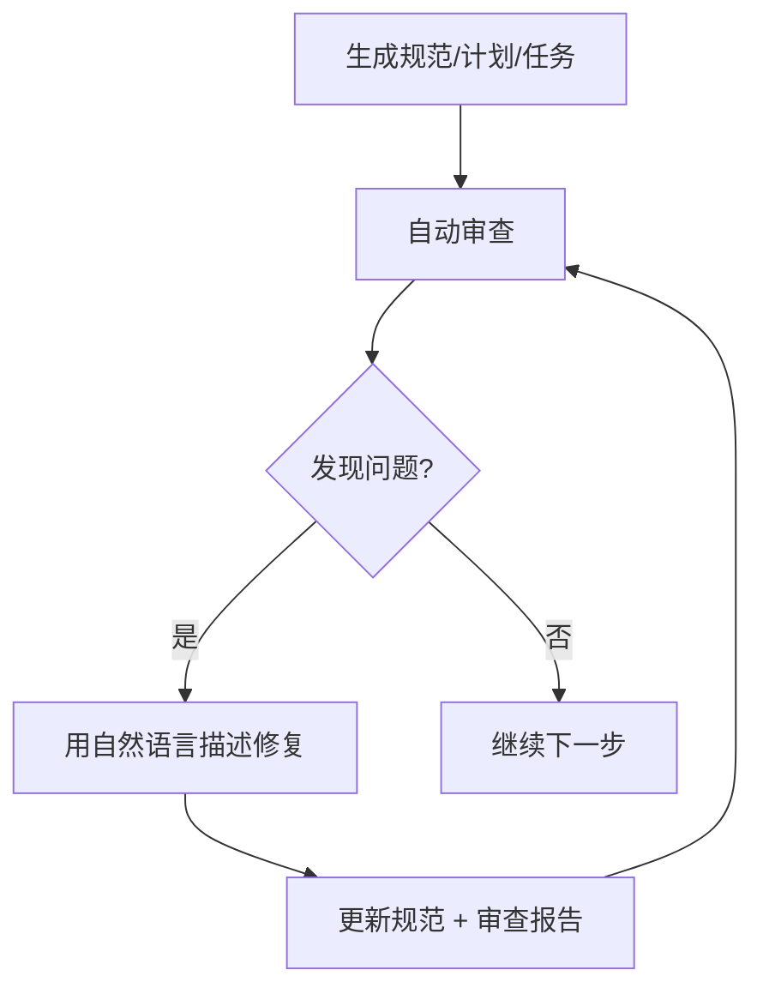

<div align="center">
  <picture>
    <source media="(prefers-color-scheme: dark)" srcset="codexspec-logo-dark.svg">
    <source media="(prefers-color-scheme: light)" srcset="codexspec-logo-light.svg">
    
  </picture>
</div>

# CodexSpec

**English** | [中文](README.zh-CN.md) | [日本語](README.ja.md) | [Español](README.es.md) | [Português](README.pt-BR.md) | [한국어](README.ko.md) | [Deutsch](README.de.md) | [Français](README.fr.md)

[](https://pypi.org/project/codexspec/)
[](https://pypi.org/project/codexspec/)
[](https://opensource.org/licenses/MIT)

**A Spec-Driven Development (SDD) toolkit for Claude Code**

[📖 Documentation](https://zts0hg.github.io/codexspec/) | [中文文档](https://zts0hg.github.io/codexspec/zh/) | [日本語ドキュメント](https://zts0hg.github.io/codexspec/ja/) | [한국어 문서](https://zts0hg.github.io/codexspec/ko/)

---

## 目录

- [什么是 Spec-Driven Development?](#什么是-spec-driven-development)
- [30秒快速开始](#-30秒快速开始)
- [安装](#安装)
- [核心工作流](#核心工作流)
- [可用命令](#可用命令)
- [与 spec-kit 对比](#comparison-with-spec-kit)
- [国际化支持](#internationalization-i18n)
- [贡献 & 许可证](#contributing)

---

## 什么是 Spec-Driven Development?

**Spec-Driven Development (SDD)** 是一种「先写规范、后写代码」的开发方法论：

```
传统开发:  想法 → 直接写代码 → 调试 → 重写
SDD 开发:  想法 → 规范 → 计划 → 任务 → 代码
```

**为什么使用 SDD?**

| 问题 | SDD 的解决方案 |
|------|----------------|
| AI 理解偏差 | 规范明确「做什么」，AI 不再猜测 |
| 需求遗漏 | 交互式澄清发现边缘情况 |
| 架构偏离 | 审查检查点确保方向正确 |
| 返工浪费 | 问题在写代码前被发现 |

**CodexSpec 的核心理念**：在每个阶段都设置 **人工审查检查点**，确保 AI 的输出符合你的意图。

---

## 🚀 30秒快速开始

```bash
# 1. 安装
uv tool install codexspec

# 2. 创建项目
codexspec init my-project && cd my-project

# 3. 在 Claude Code 中使用
claude
> /codexspec:constitution 创建注重代码质量和测试的原则
> /codexspec:specify 我想构建一个待办事项应用
> /codexspec:generate-spec
> /codexspec:spec-to-plan
> /codexspec:plan-to-tasks
> /codexspec:implement-tasks
```

就这么简单！继续阅读了解完整的工作流程。

---

## 安装

### 前置要求

- Python 3.11+
- [uv](https://docs.astral.sh/uv/) (推荐) 或 pip

### 推荐安装方式

```bash
# 使用 uv (推荐)
uv tool install codexspec

# 或使用 pip
pip install codexspec
```

### 验证安装

```bash
codexspec --version
```

<details>
<summary>📦 其他安装方式</summary>

#### 一次性使用 (无需安装)

```bash
# 创建新项目
uvx codexspec init my-project

# 在现有项目中初始化
cd your-existing-project
uvx codexspec init . --ai claude
```

#### 从 GitHub 安装开发版

```bash
# 使用 uv
uv tool install git+https://github.com/Zts0hg/codexspec.git

# 指定分支或标签
uv tool install git+https://github.com/Zts0hg/codexspec.git@main
uv tool install git+https://github.com/Zts0hg/codexspec.git@v0.5.6
```

</details>

<details>
<summary>🪟 Windows 用户注意事项</summary>

**推荐使用 PowerShell**：

```powershell
# 1. 安装 uv (如果尚未安装)
powershell -c "irm https://astral.sh/uv/install.ps1 | iex"

# 2. 重启 PowerShell，然后安装 codexspec
uv tool install codexspec

# 3. 验证安装
codexspec --version
```

**CMD 故障排除**：

如果遇到 "Access denied" 错误：

1. 关闭所有 CMD 窗口并重新打开
2. 或手动刷新 PATH：`set PATH=%PATH%;%USERPROFILE%\.local\bin`
3. 或使用完整路径：`%USERPROFILE%\.local\bin\codexspec.exe --version`

详细故障排除请参阅 [Windows Troubleshooting Guide](docs/WINDOWS-TROUBLESHOOTING.md)。

</details>

### 升级

```bash
# 使用 uv
uv tool install codexspec --upgrade

# 使用 pip
pip install --upgrade codexspec
```

---

## 核心工作流

CodexSpec 将开发过程分解为 **可审查的检查点**：

```mermaid
flowchart LR
    A[想法] --> B[/specify]
    B --> C[/generate-spec]
    C --> D[审查 spec]
    D --> E[/spec-to-plan]
    E --> F[审查 plan]
    F --> G[/plan-to-tasks]
    G --> H[审查 tasks]
    H --> I[/implement]
```

### 工作流步骤

| 步骤 | 命令 | 输出 | 人工检查 |
|------|------|------|----------|
| 1. 项目原则 | `/codexspec:constitution` | `constitution.md` | ✅ |
| 2. 需求澄清 | `/codexspec:specify` | 无 (交互式对话) | ✅ |
| 3. 生成规范 | `/codexspec:generate-spec` | `spec.md` + 自动审查 | ✅ |
| 4. 技术规划 | `/codexspec:spec-to-plan` | `plan.md` + 自动审查 | ✅ |
| 5. 任务分解 | `/codexspec:plan-to-tasks` | `tasks.md` + 自动审查 | ✅ |
| 6. 跨工件分析 | `/codexspec:analyze` | 分析报告 | ✅ |
| 7. 实现 | `/codexspec:implement-tasks` | 代码 | - |

### 关键概念：迭代质量循环

每个生成命令都会 **自动审查**，生成审查报告。你可以：

1. 查看审查报告
2. 用自然语言描述需要修复的问题
3. 系统自动更新规范和审查报告



<details>
<summary>📖 详细工作流说明</summary>

### 1. 初始化项目

```bash
codexspec init my-awesome-project
cd my-awesome-project
claude
```

### 2. 建立项目原则

```
/codexspec:constitution 创建注重代码质量、测试标准和清晰架构的原则
```

### 3. 澄清需求

```
/codexspec:specify 我想构建一个任务管理应用
```

此命令会：

- 通过问答了解你的想法
- 探索你可能没考虑到的边缘情况
- **不**自动生成文件 - 你保持控制

### 4. 生成规范文档

需求明确后：

```
/codexspec:generate-spec
```

此命令：

- 将澄清的需求编译为结构化规范
- **自动**运行审查并生成 `review-spec.md`

### 5. 创建技术计划

```
/codexspec:spec-to-plan 后端使用 Python FastAPI，数据库用 PostgreSQL，前端用 React
```

包含 **合规性审查** - 验证计划符合项目原则。

### 6. 生成任务

```
/codexspec:plan-to-tasks
```

任务组织为标准阶段：

- **TDD 强制**：测试任务在实现任务之前
- **并行标记 `[P]`**：识别可并行执行的任务
- **文件路径规范**：每个任务有明确的交付物

### 7. 跨工件分析 (可选但推荐)

```
/codexspec:analyze
```

检测 spec、plan、tasks 之间的问题：

- 覆盖缺口（需求没有对应任务）
- 重复和不一致
- 违反宪法
- 未充分说明的项目

### 8. 实现

```
/codexspec:implement-tasks
```

实现遵循 **条件 TDD 工作流**：

- 代码任务：测试优先 (Red → Green → Verify → Refactor)
- 非测试任务（文档、配置）：直接实现

</details>

---

## 可用命令

### CLI 命令

| 命令 | 描述 |
|------|------|
| `codexspec init` | 初始化新项目 |
| `codexspec check` | 检查已安装工具 |
| `codexspec version` | 显示版本信息 |
| `codexspec config` | 查看或修改配置 |

<details>
<summary>📋 init 选项</summary>

| 选项 | 描述 |
|------|------|
| `PROJECT_NAME` | 项目目录名称 |
| `--here`, `-h` | 在当前目录初始化 |
| `--ai`, `-a` | 使用的 AI 助手 (默认: claude) |
| `--lang`, `-l` | 输出语言 (如 en, zh-CN, ja) |
| `--force`, `-f` | 强制覆盖现有文件 |
| `--no-git` | 跳过 git 初始化 |
| `--debug`, `-d` | 启用调试输出 |

</details>

<details>
<summary>📋 config 选项</summary>

| 选项 | 描述 |
|------|------|
| `--set-lang`, `-l` | 设置输出语言 |
| `--set-commit-lang`, `-c` | 设置提交信息语言 |
| `--list-langs` | 列出所有支持的语言 |

</details>

### Slash 命令

#### 核心工作流命令

| 命令 | 描述 |
|------|------|
| `/codexspec:constitution` | 创建/更新项目宪法，包含跨工件验证 |
| `/codexspec:specify` | 通过交互式问答澄清需求 |
| `/codexspec:generate-spec` | 生成 `spec.md` 文档 ★ 自动审查 |
| `/codexspec:spec-to-plan` | 将规范转换为技术计划 ★ 自动审查 |
| `/codexspec:plan-to-tasks` | 分解计划为原子任务 ★ 自动审查 |
| `/codexspec:implement-tasks` | 执行任务 (条件 TDD) |

#### 审查命令 (质量门)

| 命令 | 描述 |
|------|------|
| `/codexspec:review-spec` | 审查规范 (自动调用或手动运行) |
| `/codexspec:review-plan` | 审查技术计划 (自动调用或手动运行) |
| `/codexspec:review-tasks` | 审查任务分解 (自动调用或手动运行) |

#### 增强命令

| 命令 | 描述 |
|------|------|
| `/codexspec:clarify` | 扫描规范中的模糊点 (4 类别，最多 5 问题) |
| `/codexspec:analyze` | 跨工件一致性分析 (只读，基于严重性) |
| `/codexspec:checklist` | 生成需求质量检查清单 |
| `/codexspec:tasks-to-issues` | 将任务转换为 GitHub Issues |

#### Git 工作流命令

| 命令 | 描述 |
|------|------|
| `/codexspec:commit-staged` | 从暂存更改生成提交信息 |
| `/codexspec:pr` | 生成 PR/MR 描述 (自动检测平台) |

#### 代码审查命令

| 命令 | 描述 |
|------|------|
| `/codexspec:review-python-code` | 审查 Python 代码 (PEP 8、类型安全、工程健壮性) |
| `/codexspec:review-react-code` | 审查 React/TypeScript 代码 (架构、Hooks、性能) |

---

## Comparison with spec-kit

CodexSpec 受 GitHub spec-kit 启发，但有一些关键差异：

| 特性 | spec-kit | CodexSpec |
|------|----------|-----------|
| 核心理念 | 规范驱动开发 | 规范驱动 + 人机协作 |
| CLI 名称 | `specify` | `codexspec` |
| 主要 AI | 多代理支持 | 专注于 Claude Code |
| 宪法系统 | 基础 | 完整宪法 + 跨工件验证 |
| 两阶段规范 | 否 | 是 (澄清 + 生成) |
| 审查命令 | 可选 | 3 个专用审查命令 + 评分 |
| 澄清命令 | 是 | 4 个聚焦类别，审查集成 |
| 分析命令 | 是 | 只读，基于严重性，感知宪法 |
| 任务中 TDD | 可选 | 强制 (测试先于实现) |
| 实现 | 标准 | 条件 TDD (代码 vs 文档/配置) |
| 扩展系统 | 是 | 是 |
| PowerShell 脚本 | 是 | 是 |
| i18n 支持 | 否 | 是 (13+ 语言，通过 LLM 翻译) |

### 关键差异

1. **审查优先文化**：每个主要工件都有专用审查命令
2. **宪法治理**：原则被验证，而不仅仅是记录
3. **默认 TDD**：测试优先方法论在任务生成中强制执行
4. **人工检查点**：工作流围绕验证门设计

---

## Internationalization (i18n)

CodexSpec 通过 **LLM 动态翻译** 支持多种语言。无需维护翻译模板，Claude 在运行时根据你的语言配置翻译内容。

### 设置语言

**初始化时：**

```bash
# 创建中文输出项目
codexspec init my-project --lang zh-CN

# 创建日文输出项目
codexspec init my-project --lang ja
```

**初始化后：**

```bash
# 查看当前配置
codexspec config

# 更改输出语言
codexspec config --set-lang zh-CN

# 设置提交信息语言
codexspec config --set-commit-lang en
```

### 支持的语言

| 代码 | 语言 |
|------|------|
| `en` | English (默认) |
| `zh-CN` | 简体中文 |
| `zh-TW` | 繁體中文 |
| `ja` | 日本語 |
| `ko` | 한국어 |
| `es` | Español |
| `fr` | Français |
| `de` | Deutsch |
| `pt-BR` | Português |
| `ru` | Русский |
| `it` | Italiano |
| `ar` | العربية |
| `hi` | हिन्दी |

<details>
<summary>⚙️ 配置文件示例</summary>

`.codexspec/config.yml`:

```yaml
version: "1.0"

language:
  output: "zh-CN"        # 输出语言
  commit: "zh-CN"        # 提交信息语言 (默认为 output)
  templates: "en"        # 保持为 "en"

project:
  ai: "claude"
  created: "2025-02-15"
```

</details>

---

## Project Structure

初始化后的项目结构：

```
my-project/
├── .codexspec/
│   ├── memory/
│   │   └── constitution.md    # 项目宪法
│   ├── specs/
│   │   └── {feature-id}/
│   │       ├── spec.md        # 功能规范
│   │       ├── plan.md        # 技术计划
│   │       ├── tasks.md       # 任务分解
│   │       └── checklists/    # 质量检查清单
│   ├── templates/             # 自定义模板
│   ├── scripts/               # 辅助脚本
│   └── extensions/            # 自定义扩展
├── .claude/
│   └── commands/              # Claude Code slash 命令
└── CLAUDE.md                  # Claude Code 上下文
```

---

## Extension System

CodexSpec 支持插件架构来添加自定义命令：

```
my-extension/
├── extension.yml          # 扩展清单
├── commands/              # 自定义 slash 命令
│   └── command.md
└── README.md
```

详见 `extensions/EXTENSION-DEVELOPMENT-GUIDE.md`。

---

## Development

### 前置要求

- Python 3.11+
- uv 包管理器
- Git

### 本地开发

```bash
# 克隆仓库
git clone https://github.com/Zts0hg/codexspec.git
cd codexspec

# 安装开发依赖
uv sync --dev

# 本地运行
uv run codexspec --help

# 运行测试
uv run pytest

# 代码检查
uv run ruff check src/

# 构建包
uv build
```

---

## Philosophy

### SDD 基础

1. **意图驱动**：规范先定义「做什么」，再决定「怎么做」
2. **丰富规范创建**：使用护栏和组织原则
3. **多步骤细化**：而非一次性代码生成
4. **宪法治理**：项目原则指导所有决策

### 人机协作

5. **人在环中**：AI 生成工件，人类验证
6. **审查导向**：每步前验证工件
7. **渐进披露**：复杂信息逐步揭示
8. **显式优于隐式**：需求应清晰，而非假设

### 质量保证

9. **默认测试驱动**：TDD 工作流内置于任务生成
10. **跨工件一致性**：同时分析 spec、plan、tasks
11. **宪法对齐**：所有工件遵守项目原则

### 为什么审查重要

| 没有审查 | 有审查 |
|----------|--------|
| AI 做出错误假设 | 人工早期发现误解 |
| 不完整需求传播 | 实现前识别缺口 |
| 架构偏离意图 | 每阶段验证对齐 |
| 任务遗漏关键功能 | 系统验证覆盖 |
| **结果：返工，浪费精力** | **结果：一次做对** |

---

## Contributing

欢迎贡献！提交 pull request 前请阅读贡献指南。

## License

MIT License - 详见 [LICENSE](LICENSE)。

## Acknowledgements

- 灵感来自 [GitHub spec-kit](https://github.com/github/spec-kit)
- 为 [Claude Code](https://claude.ai/code) 构建
