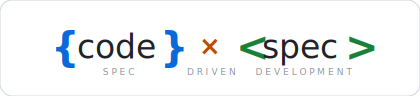
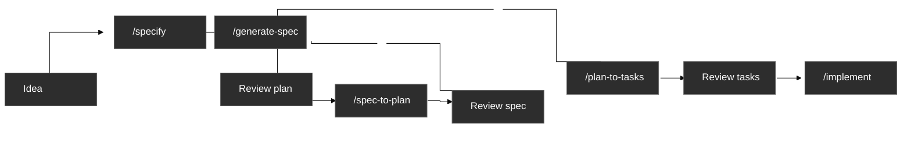
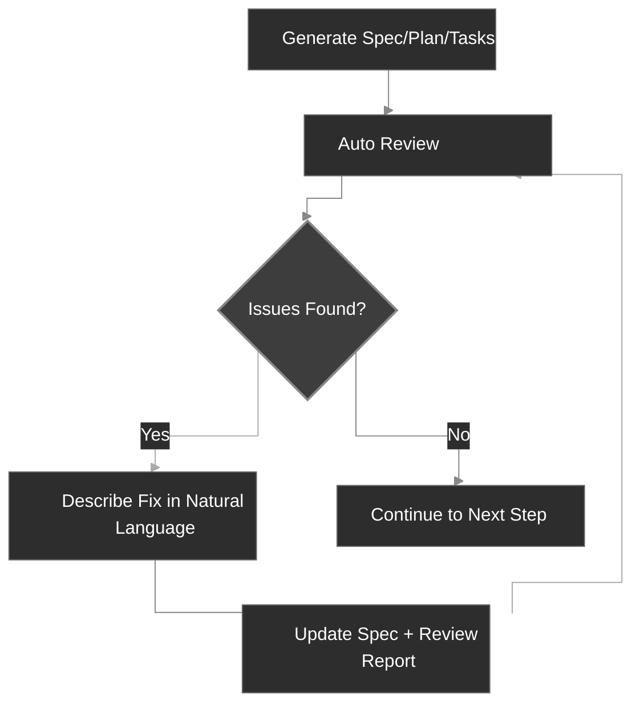

<div align="center">
  <picture>
    <source media="(prefers-color-scheme: dark)" srcset="codexspec-logo-dark.svg">
    <source media="(prefers-color-scheme: light)" srcset="codexspec-logo-light.svg">
    
  </picture>
</div>

# CodexSpec

**English** | [中文](README.zh-CN.md) | [日本語](README.ja.md) | [Español](README.es.md) | [Português](README.pt-BR.md) | [한국어](README.ko.md) | [Deutsch](README.de.md) | [Français](README.fr.md)

[](https://pypi.org/project/codexspec/)
[](https://pypi.org/project/codexspec/)
[](https://opensource.org/licenses/MIT)

**A Spec-Driven Development (SDD) toolkit for Claude Code**

[📖 Documentation](https://zts0hg.github.io/codexspec/) | [中文文档](https://zts0hg.github.io/codexspec/zh/) | [日本語ドキュメント](https://zts0hg.github.io/codexspec/ja/) | [한국어 문서](https://zts0hg.github.io/codexspec/ko/)

---

## Table of Contents

- [What is Spec-Driven Development?](#what-is-spec-driven-development)
- [Design Philosophy: Human-AI Collaboration](#design-philosophy-human-ai-collaboration)
- [30-Second Quick Start](#-30-second-quick-start)
- [Installation](#installation)
- [Core Workflow](#core-workflow)
- [Available Commands](#available-commands)
- [Comparison with spec-kit](#comparison-with-spec-kit)
- [Internationalization](#internationalization-i18n)
- [Contributing & License](#contributing)

---

## What is Spec-Driven Development?

**Spec-Driven Development (SDD)** is a "specifications first, code later" methodology:

```
Traditional:  Idea → Code → Debug → Rewrite
SDD:          Idea → Spec → Plan → Tasks → Code
```

**Why use SDD?**

| Problem              | SDD Solution                                     |
| -------------------- | ------------------------------------------------ |
| AI misunderstandings | Specs clarify "what to build", AI stops guessing |
| Missing requirements | Interactive clarification discovers edge cases   |
| Architecture drift   | Review checkpoints ensure correct direction      |
| Wasted rework        | Problems are found before code is written        |

---

## Design Philosophy: Human-AI Collaboration

CodexSpec is built on the belief that **effective AI-assisted development requires active human participation at every stage**.

### Why Human Oversight Matters

| Without Reviews                   | With Reviews                            |
| --------------------------------- | --------------------------------------- |
| AI makes wrong assumptions        | Humans catch misunderstandings early    |
| Incomplete requirements propagate | Gaps identified before implementation   |
| Architecture drifts from intent   | Alignment verified at each stage        |
| Tasks miss critical features      | Systematic coverage validation          |
| **Result: Rework, wasted effort** | **Result: Get it right the first time** |

### The CodexSpec Approach

CodexSpec structures development into **reviewable checkpoints**:


**Every artifact has a corresponding review command:**

- `spec.md` → `/codexspec:review-spec`
- `plan.md` → `/codexspec:review-plan`
- `tasks.md` → `/codexspec:review-tasks`
- All artifacts → `/codexspec:analyze`

This systematic review process ensures:

- **Early error detection**: Catch misunderstandings before code is written
- **Alignment verification**: Confirm AI's interpretation matches your intent
- **Quality gates**: Validate completeness, clarity, and feasibility at each stage
- **Reduced rework**: Invest minutes in review to save hours of reimplementation

---

## 🚀 30-Second Quick Start

```bash
# 1. Install
uv tool install codexspec

# 2. Create project
codexspec init my-project && cd my-project

# 3. Use in Claude Code
claude
> /codexspec:constitution Create principles focused on code quality and testing
> /codexspec:specify I want to build a todo application
> /codexspec:generate-spec
> /codexspec:spec-to-plan
> /codexspec:plan-to-tasks
> /codexspec:implement-tasks
```

That's it! Read on for the complete workflow.

---

## Installation

### Prerequisites

- Python 3.11+
- [uv](https://docs.astral.sh/uv/) (recommended) or pip

### Recommended Installation

```bash
# Using uv (recommended)
uv tool install codexspec

# Or using pip
pip install codexspec
```

### Verify Installation

```bash
codexspec --version
```

<details>
<summary>📦 Alternative Installation Methods</summary>

#### One-time Usage (No Installation)

```bash
# Create new project
uvx codexspec init my-project

# Initialize in existing project
cd your-existing-project
uvx codexspec init . --ai claude
```

#### Install Development Version from GitHub

```bash
# Using uv
uv tool install git+https://github.com/Zts0hg/codexspec.git

# Specify branch or tag
uv tool install git+https://github.com/Zts0hg/codexspec.git@main
uv tool install git+https://github.com/Zts0hg/codexspec.git@v0.5.6
```

</details>

<details>
<summary>🪟 Notes for Windows Users</summary>

**Recommended: Use PowerShell**

```powershell
# 1. Install uv (if not already installed)
powershell -c "irm https://astral.sh/uv/install.ps1 | iex"

# 2. Restart PowerShell, then install codexspec
uv tool install codexspec

# 3. Verify installation
codexspec --version
```

**CMD Troubleshooting**

If you encounter "Access denied" errors:

1. Close all CMD windows and reopen
2. Or manually refresh PATH: `set PATH=%PATH%;%USERPROFILE%\.local\bin`
3. Or use full path: `%USERPROFILE%\.local\bin\codexspec.exe --version`

For detailed troubleshooting, see [Windows Troubleshooting Guide](docs/WINDOWS-TROUBLESHOOTING.md).

</details>

### Upgrade

```bash
# Using uv
uv tool install codexspec --upgrade

# Using pip
pip install --upgrade codexspec
```

---

## Core Workflow

CodexSpec breaks development into **reviewable checkpoints**:



### Workflow Steps

| Step                         | Command                      | Output                      | Human Check |
| ---------------------------- | ---------------------------- | --------------------------- | ----------- |
| 1. Project Principles        | `/codexspec:constitution`    | `constitution.md`           | ✅           |
| 2. Requirement Clarification | `/codexspec:specify`         | None (interactive dialogue) | ✅           |
| 3. Generate Spec             | `/codexspec:generate-spec`   | `spec.md` + auto-review     | ✅           |
| 4. Technical Planning        | `/codexspec:spec-to-plan`    | `plan.md` + auto-review     | ✅           |
| 5. Task Breakdown            | `/codexspec:plan-to-tasks`   | `tasks.md` + auto-review    | ✅           |
| 6. Cross-Artifact Analysis   | `/codexspec:analyze`         | Analysis report             | ✅           |
| 7. Implementation            | `/codexspec:implement-tasks` | Code                        | -           |

### Key Concept: Iterative Quality Loop

Every generation command includes **automatic review**, generating a review report. You can:

1. Review the report
2. Describe issues to fix in natural language
3. System automatically updates specs and review reports



<details>
<summary>📖 Detailed Workflow Description</summary>

### 1. Initialize Project

```bash
codexspec init my-awesome-project
cd my-awesome-project
claude
```

### 2. Establish Project Principles

```
/codexspec:constitution Create principles focused on code quality, testing standards, and clean architecture
```

### 3. Clarify Requirements

```
/codexspec:specify I want to build a task management application
```

This command will:

- Ask clarifying questions to understand your idea
- Explore edge cases you might not have considered
- **NOT** generate files automatically - you stay in control

### 4. Generate Specification Document

Once requirements are clarified:

```
/codexspec:generate-spec
```

This command:

- Compiles clarified requirements into structured specification
- **Automatically** runs review and generates `review-spec.md`

### 5. Create Technical Plan

```
/codexspec:spec-to-plan Use Python FastAPI for backend, PostgreSQL for database, React for frontend
```

Includes **constitutionality review** - verifies plan aligns with project principles.

### 6. Generate Tasks

```
/codexspec:plan-to-tasks
```

Tasks are organized into standard phases:

- **TDD Enforcement**: Test tasks precede implementation tasks
- **Parallel Markers `[P]`**: Identify independent tasks
- **File Path Specifications**: Clear deliverables per task

### 7. Cross-Artifact Analysis (Optional but Recommended)

```
/codexspec:analyze
```

Detects issues across spec, plan, and tasks:

- Coverage gaps (requirements without tasks)
- Duplication and inconsistencies
- Constitution violations
- Underspecified items

### 8. Implementation

```
/codexspec:implement-tasks
```

Implementation follows **conditional TDD workflow**:

- Code tasks: Test-first (Red → Green → Verify → Refactor)
- Non-testable tasks (docs, config): Direct implementation

</details>

---

## Available Commands

### CLI Commands

| Command             | Description                  |
| ------------------- | ---------------------------- |
| `codexspec init`    | Initialize a new project     |
| `codexspec check`   | Check for installed tools    |
| `codexspec version` | Display version information  |
| `codexspec config`  | View or modify configuration |

<details>
<summary>📋 init Options</summary>

| Option          | Description                           |
| --------------- | ------------------------------------- |
| `PROJECT_NAME`  | Project directory name                |
| `--here`, `-h`  | Initialize in current directory       |
| `--ai`, `-a`    | AI assistant to use (default: claude) |
| `--lang`, `-l`  | Output language (e.g., en, zh-CN, ja) |
| `--force`, `-f` | Force overwrite existing files        |
| `--no-git`      | Skip git initialization               |
| `--debug`, `-d` | Enable debug output                   |

</details>

<details>
<summary>📋 config Options</summary>

| Option                    | Description                  |
| ------------------------- | ---------------------------- |
| `--set-lang`, `-l`        | Set output language          |
| `--set-commit-lang`, `-c` | Set commit message language  |
| `--list-langs`            | List all supported languages |

</details>

### Slash Commands

#### Core Workflow Commands

| Command                      | Description                                                       |
| ---------------------------- | ----------------------------------------------------------------- |
| `/codexspec:constitution`    | Create/update project constitution with cross-artifact validation |
| `/codexspec:specify`         | Clarify requirements through interactive Q&A                      |
| `/codexspec:generate-spec`   | Generate `spec.md` document ★ Auto-review                         |
| `/codexspec:spec-to-plan`    | Convert spec to technical plan ★ Auto-review                      |
| `/codexspec:plan-to-tasks`   | Break down plan into atomic tasks ★ Auto-review                   |
| `/codexspec:implement-tasks` | Execute tasks (conditional TDD)                                   |

#### Review Commands (Quality Gates)

| Command                   | Description                            |
| ------------------------- | -------------------------------------- |
| `/codexspec:review-spec`  | Review specification (auto or manual)  |
| `/codexspec:review-plan`  | Review technical plan (auto or manual) |
| `/codexspec:review-tasks` | Review task breakdown (auto or manual) |

#### Enhancement Commands

| Command                      | Description                                                     |
| ---------------------------- | --------------------------------------------------------------- |
| `/codexspec:clarify`         | Scan spec for ambiguities (4 categories, max 5 questions)       |
| `/codexspec:analyze`         | Cross-artifact consistency analysis (read-only, severity-based) |
| `/codexspec:checklist`       | Generate requirements quality checklist                         |
| `/codexspec:tasks-to-issues` | Convert tasks to GitHub Issues                                  |

#### Git Workflow Commands

| Command                    | Description                                       |
| -------------------------- | ------------------------------------------------- |
| `/codexspec:commit-staged` | Generate commit message from staged changes       |
| `/codexspec:pr`            | Generate PR/MR description (auto-detect platform) |

#### Code Review Commands

| Command                         | Description                                                     |
| ------------------------------- | --------------------------------------------------------------- |
| `/codexspec:review-python-code` | Review Python code (PEP 8, type safety, engineering robustness) |
| `/codexspec:review-react-code`  | Review React/TypeScript code (architecture, hooks, performance) |

---

## Comparison with spec-kit

CodexSpec is inspired by GitHub spec-kit with key differences:

| Feature             | spec-kit                | CodexSpec                                     |
| ------------------- | ----------------------- | --------------------------------------------- |
| Core Philosophy     | Spec-driven development | Spec-driven + Human-AI collaboration          |
| CLI Name            | `specify`               | `codexspec`                                   |
| Primary AI          | Multi-agent support     | Focused on Claude Code                        |
| Constitution System | Basic                   | Full constitution + cross-artifact validation |
| Two-Phase Spec      | No                      | Yes (clarify + generate)                      |
| Review Commands     | Optional                | 3 dedicated review commands + scoring         |
| Clarify Command     | Yes                     | 4 focus categories, review integration        |
| Analyze Command     | Yes                     | Read-only, severity-based, constitution-aware |
| TDD in Tasks        | Optional                | Enforced (tests before implementation)        |
| Implementation      | Standard                | Conditional TDD (code vs docs/config)         |
| Extension System    | Yes                     | Yes                                           |
| PowerShell Scripts  | Yes                     | Yes                                           |
| i18n Support        | No                      | Yes (13+ languages via LLM translation)       |

### Key Differentiators

1. **Review-First Culture**: Every major artifact has a dedicated review command
2. **Constitution Governance**: Principles are validated, not just documented
3. **TDD by Default**: Test-first methodology enforced in task generation
4. **Human Checkpoints**: Workflow designed around validation gates

---

## Internationalization (i18n)

CodexSpec supports multiple languages through **LLM dynamic translation**. No translation templates to maintain - Claude translates content at runtime based on your language configuration.

### Setting Language

**During initialization:**

```bash
# Create Chinese output project
codexspec init my-project --lang zh-CN

# Create Japanese output project
codexspec init my-project --lang ja
```

**After initialization:**

```bash
# View current configuration
codexspec config

# Change output language
codexspec config --set-lang zh-CN

# Set commit message language
codexspec config --set-commit-lang en
```

### Supported Languages

| Code    | Language          |
| ------- | ----------------- |
| `en`    | English (default) |
| `zh-CN` | 简体中文          |
| `zh-TW` | 繁體中文          |
| `ja`    | 日本語            |
| `ko`    | 한국어            |
| `es`    | Español           |
| `fr`    | Français          |
| `de`    | Deutsch           |
| `pt-BR` | Português         |
| `ru`    | Русский           |
| `it`    | Italiano          |
| `ar`    | العربية           |
| `hi`    | हिन्दी               |

<details>
<summary>⚙️ Configuration File Example</summary>

`.codexspec/config.yml`:

```yaml
version: "1.0"

language:
  output: "zh-CN"        # Output language
  commit: "zh-CN"        # Commit message language (defaults to output)
  templates: "en"        # Keep as "en"

project:
  ai: "claude"
  created: "2025-02-15"
```

</details>

---

## Project Structure

Project structure after initialization:

```
my-project/
├── .codexspec/
│   ├── memory/
│   │   └── constitution.md    # Project constitution
│   ├── specs/
│   │   └── {feature-id}/
│   │       ├── spec.md        # Feature specification
│   │       ├── plan.md        # Technical plan
│   │       ├── tasks.md       # Task breakdown
│   │       └── checklists/    # Quality checklists
│   ├── templates/             # Custom templates
│   ├── scripts/               # Helper scripts
│   └── extensions/            # Custom extensions
├── .claude/
│   └── commands/              # Claude Code slash commands
└── CLAUDE.md                  # Claude Code context
```

---

## Extension System

CodexSpec supports a plugin architecture for custom commands:

```
my-extension/
├── extension.yml          # Extension manifest
├── commands/              # Custom slash commands
│   └── command.md
└── README.md
```

See `extensions/EXTENSION-DEVELOPMENT-GUIDE.md` for details.

---

## Development

### Prerequisites

- Python 3.11+
- uv package manager
- Git

### Local Development

```bash
# Clone repository
git clone https://github.com/Zts0hg/codexspec.git
cd codexspec

# Install dev dependencies
uv sync --dev

# Run locally
uv run codexspec --help

# Run tests
uv run pytest

# Lint code
uv run ruff check src/

# Build package
uv build
```

---

## Contributing

Contributions are welcome! Please read the contributing guidelines before submitting a pull request.

## License

MIT License - see [LICENSE](LICENSE) for details.

## Acknowledgements

- Inspired by [GitHub spec-kit](https://github.com/github/spec-kit)
- Built for [Claude Code](https://claude.ai/code)
