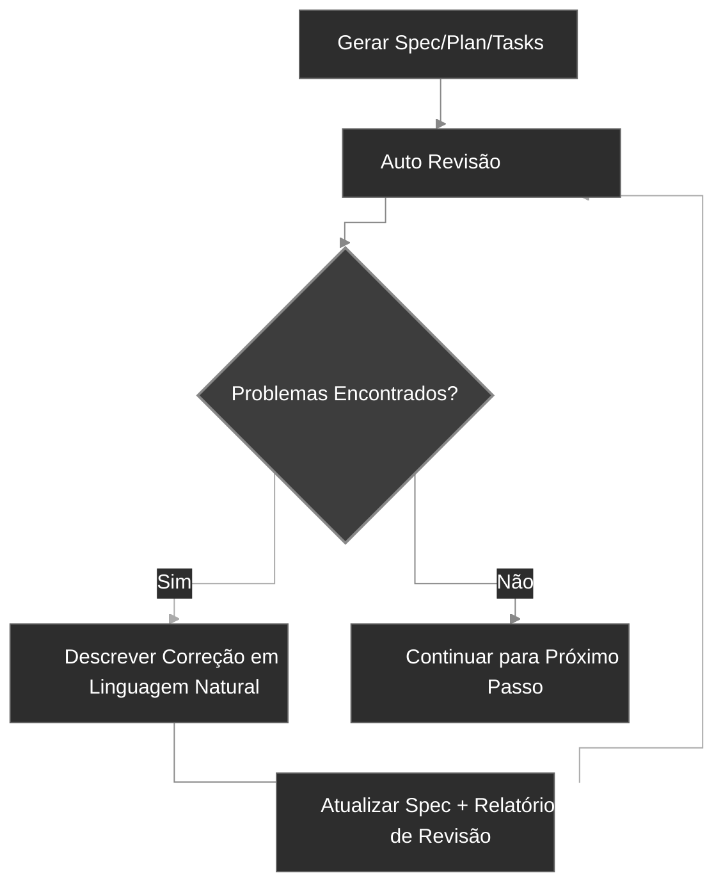

<div align="center">
  <picture>
    <source media="(prefers-color-scheme: dark)" srcset="codexspec-logo-dark.svg">
    <source media="(prefers-color-scheme: light)" srcset="codexspec-logo-light.svg">
    
  </picture>
</div>

# CodexSpec

[English](README.md) | [中文](README.zh-CN.md) | [日本語](README.ja.md) | [Español](README.es.md) | **Português** | [한국어](README.ko.md) | [Deutsch](README.de.md) | [Français](README.fr.md)

[](https://pypi.org/project/codexspec/)
[](https://pypi.org/project/codexspec/)
[](https://opensource.org/licenses/MIT)

**Um toolkit de Desenvolvimento Orientado a Especificações (SDD) para Claude Code**

CodexSpec ajuda você a construir software de alta qualidade através de uma abordagem estruturada e orientada a especificações. Antes de decidir **como** construir, defina **o que** construir e **por que**.

[📖 Documentação](https://zts0hg.github.io/codexspec/pt-BR/) | [Documentation](https://zts0hg.github.io/codexspec/en/) | [中文文档](https://zts0hg.github.io/codexspec/zh/) | [日本語ドキュメント](https://zts0hg.github.io/codexspec/ja/) | [한국어 문서](https://zts0hg.github.io/codexspec/ko/) | [Documentación](https://zts0hg.github.io/codexspec/es/) | [Documentation](https://zts0hg.github.io/codexspec/fr/) | [Dokumentation](https://zts0hg.github.io/codexspec/de/)

---

## Tabela de Conteúdos

- [O que é Desenvolvimento Orientado a Especificações?](#o-que-é-desenvolvimento-orientado-a-especificações)
- [Filosofia de Design: Colaboração Humano-AI](#filosofia-de-design-colaboração-humano-ai)
- [Início Rápido em 30 Segundos](#-início-rápido-em-30-segundos)
- [Instalação](#instalação)
- [Fluxo de Trabalho Central](#fluxo-de-trabalho-central)
- [Comandos Disponíveis](#comandos-disponíveis)
- [Comparação com spec-kit](#comparação-com-spec-kit)
- [Internacionalização](#internacionalização-i18n)
- [Contribuir e Licença](#contribuir)

---

## O que é Desenvolvimento Orientado a Especificações?

**Desenvolvimento Orientado a Especificações (SDD)** é uma metodologia de "especificações primeiro, código depois":

```
Desenvolvimento Tradicional:  Ideia → Código → Debug → Reescrever
SDD:                           Ideia → Spec → Plano → Tarefas → Código
```

**Por que usar SDD?**

| Problema | Solução SDD |
|----------|-------------|
| Mal-entendidos da IA | Specs clarificam "o que construir", a IA para de adivinhar |
| Requisitos faltantes | Clarificação interativa descobre casos de borda |
| Deriva de arquitetura | Pontos de verificação de revisão garantem direção correta |
| Retrabalho desperdiçado | Problemas encontrados antes de escrever código |

<details>
<summary>✨ Recursos Principais</summary>

### Fluxo de Trabalho SDD Central

- **Desenvolvimento Baseado em Constituição** - Estabelecer princípios de projeto que guiam todas as decisões
- **Especificação em Duas Fases** - Clarificação interativa (`/specify`) seguida por geração de documento (`/generate-spec`)
- **Revisões Automáticas** - Cada artefato inclui verificações de qualidade integradas
- **Tarefas Prontas para TDD** - Decomposições de tarefas aplicam metodologia test-first

### Colaboração Humano-AI

- **Comandos de Revisão** - Comandos de revisão dedicados para spec, plan e tasks
- **Clarificação Interativa** - Refinamento de requisitos baseado em Q&A
- **Análise Cross-Artefato** - Detectar inconsistências antes da implementação

### Experiência do Desenvolvedor

- **Integração Nativa com Claude Code** - Comandos slash funcionam perfeitamente
- **Suporte Multi-idioma** - 13+ idiomas via tradução dinâmica LLM
- **Multiplataforma** - Scripts Bash e PowerShell incluídos
- **Extensível** - Arquitetura de plugins para comandos personalizados

</details>

---

## Filosofia de Design: Colaboração Humano-AI

CodexSpec é construído sobre a crença de que **o desenvolvimento efetivo assistido por IA requer participação humana ativa em cada estágio**.

### Por Que a Supervisão Humana Importa

| Sem Revisão | Com Revisão |
|-------------|-------------|
| A IA faz suposições incorretas | O humano captura más interpretações cedo |
| Requisitos incompletos se propagam | Lacunas identificadas antes da implementação |
| A arquitetura deriva da intenção | Alinhamento verificado em cada estágio |
| As tarefas perdem funcionalidade crítica | Cobertura validada sistematicamente |
| **Resultado: Retrabalho, esforço desperdiçado** | **Resultado: Correto na primeira vez** |

### A Abordagem CodexSpec

CodexSpec estrutura o desenvolvimento em **pontos de verificação revisáveis**:

```
Ideia → /specify → /generate-spec → /spec-to-plan → /plan-to-tasks → /implement
                          │                  │                │
                     Revisar spec       Revisar plano    Revisar tarefas
                          │                  │                │
                       ✅ Humano           ✅ Humano         ✅ Humano
```

**Cada artefato tem um comando de revisão correspondente:**

- `spec.md` → `/codexspec:review-spec`
- `plan.md` → `/codexspec:review-plan`
- `tasks.md` → `/codexspec:review-tasks`
- Todos os artefatos → `/codexspec:analyze`

Este processo de revisão sistemático garante:

- **Detecção precoce de erros**: Capturar mal-entendidos antes do código ser escrito
- **Verificação de alinhamento**: Confirmar que a interpretação da IA corresponde à sua intenção
- **Portões de qualidade**: Validar completude, clareza e viabilidade em cada estágio
- **Redução de retrabalho**: Investir minutos em revisão para economizar horas de reimplementação

---

## 🚀 Início Rápido em 30 Segundos

```bash
# 1. Instalar
uv tool install codexspec

# 2. Inicializar projeto
#    Opção A: Criar novo projeto
codexspec init my-project && cd my-project

#    Opção B: Inicializar em projeto existente
cd your-existing-project && codexspec init .

# 3. Usar no Claude Code
claude
> /codexspec:constitution Criar princípios focados em qualidade de código e testes
> /codexspec:specify Quero construir um app de tarefas
> /codexspec:generate-spec
> /codexspec:spec-to-plan
> /codexspec:plan-to-tasks
> /codexspec:implement-tasks
```

É isso! Continue lendo para o fluxo de trabalho completo.

---

## Instalação

### Pré-requisitos

- Python 3.11+
- [uv](https://docs.astral.sh/uv/) (recomendado) ou pip

### Instalação Recomendada

```bash
# Usando uv (recomendado)
uv tool install codexspec

# Ou usando pip
pip install codexspec
```

### Verificar Instalação

```bash
codexspec --version
```

<details>
<summary>📦 Métodos de Instalação Alternativos</summary>

#### Uso Único (Sem Instalação)

```bash
# Criar novo projeto
uvx codexspec init my-project

# Inicializar em projeto existente
cd your-existing-project
uvx codexspec init . --ai claude
```

#### Instalar Versão de Desenvolvimento do GitHub

```bash
# Usando uv
uv tool install git+https://github.com/Zts0hg/codexspec.git

# Especificar branch ou tag
uv tool install git+https://github.com/Zts0hg/codexspec.git@main
uv tool install git+https://github.com/Zts0hg/codexspec.git@v0.5.6
```

</details>

<details>
<summary>🪟 Notas para Usuários Windows</summary>

**Recomendado: Usar PowerShell**

```powershell
# 1. Instalar uv (se ainda não instalado)
powershell -c "irm https://astral.sh/uv/install.ps1 | iex"

# 2. Reiniciar PowerShell, então instalar codexspec
uv tool install codexspec

# 3. Verificar a instalação
codexspec --version
```

**Solução de Problemas para Usuários CMD**

Se você encontrar erros de "Acesso negado":

1. Fechar todas as janelas CMD e abrir uma nova
2. Ou atualizar PATH manualmente: `set PATH=%PATH%;%USERPROFILE%\.local\bin`
3. Ou usar caminho completo: `%USERPROFILE%\.local\bin\codexspec.exe --version`

Para mais detalhes, consulte o [Guia de Solução de Problemas do Windows](docs/WINDOWS-TROUBLESHOOTING.md) (em inglês).

</details>

### Atualizar

```bash
# Usando uv
uv tool install codexspec --upgrade

# Usando pip
pip install --upgrade codexspec
```

### Instalação via Marketplace de Plugins (Alternativa)

O CodexSpec também está disponível como um plugin do Claude Code. Este método é ideal se você quiser usar os comandos do CodexSpec diretamente no Claude Code sem a ferramenta CLI.

#### Passos de Instalação

```bash
# No Claude Code, adicionar o marketplace
> /plugin marketplace add Zts0hg/codexspec

# Instalar o plugin
> /plugin install codexspec@codexspec-market
```

#### Configuração de Idioma para Usuários de Plugin

Após instalar via Marketplace de Plugins, configure seu idioma preferido usando o comando `/codexspec:config`:

```bash
# Iniciar configuração interativa
> /codexspec:config

# Ou ver a configuração atual
> /codexspec:config --view
```

O comando config irá guiá-lo através de:

1. Selecionar idioma de saída (para documentos gerados)
2. Selecionar idioma das mensagens de commit
3. Criar o arquivo `.codexspec/config.yml`

**Comparação de Métodos de Instalação**

| Método | Melhor Para | Recursos |
|--------|------------|----------|
| **Instalação CLI** (`uv tool install`) | Fluxo de desenvolvimento completo | Comandos CLI (`init`, `check`, `config`) + comandos slash |
| **Marketplace de Plugins** | Início rápido, projetos existentes | Apenas comandos slash (usar `/codexspec:config` para configuração de idioma) |

**Nota**: O plugin usa o modo `strict: false` e reutiliza o suporte multilíngue existente via tradução dinâmica LLM.

---

## Fluxo de Trabalho Central

CodexSpec decompõe o desenvolvimento em **pontos de verificação revisáveis**:

```
Ideia → /specify → /generate-spec → /spec-to-plan → /plan-to-tasks → /implement
                          │                  │                │
                     Revisar spec       Revisar plano    Revisar tarefas
                          │                  │                │
                       ✅ Humano           ✅ Humano         ✅ Humano
```

### Passos do Fluxo de Trabalho

| Passo | Comando | Saída | Verificação Humana |
|-------|---------|-------|-------------------|
| 1. Princípios do Projeto | `/codexspec:constitution` | `constitution.md` | ✅ |
| 2. Clarificação de Requisitos | `/codexspec:specify` | Nenhum (diálogo interativo) | ✅ |
| 3. Gerar Spec | `/codexspec:generate-spec` | `spec.md` + auto-revisão | ✅ |
| 4. Planejamento Técnico | `/codexspec:spec-to-plan` | `plan.md` + auto-revisão | ✅ |
| 5. Decomposição de Tarefas | `/codexspec:plan-to-tasks` | `tasks.md` + auto-revisão | ✅ |
| 6. Análise Cross-Artefato | `/codexspec:analyze` | Relatório de análise | ✅ |
| 7. Implementação | `/codexspec:implement-tasks` | Código | - |

### specify vs clarify: Quando Usar Qual?

| Aspecto | `/codexspec:specify` | `/codexspec:clarify` |
|---------|----------------------|----------------------|
| **Propósito** | Exploração inicial de requisitos | Refinamento iterativo de spec existente |
| **Quando Usar** | spec.md ainda não existe | spec.md precisa de melhorias |
| **Saída** | Nenhuma (apenas diálogo) | Atualiza spec.md |
| **Método** | Q&A aberto | Escaneamento estruturado (4 categorias) |
| **Perguntas** | Sem limite | Máximo 5 |

### Conceito Chave: Loop de Qualidade Iterativo

Cada comando de geração inclui **revisão automática**, gerando um relatório de revisão. Você pode:

1. Revisar o relatório
2. Descrever problemas a corrigir em linguagem natural
3. O sistema atualiza automaticamente specs e relatórios de revisão



<details>
<summary>📖 Descrição Detalhada do Fluxo de Trabalho</summary>

### 1. Inicializar um Projeto

```bash
codexspec init my-awesome-project
cd my-awesome-project
claude
```

### 2. Estabelecer Princípios do Projeto

```
/codexspec:constitution Criar princípios focados em qualidade de código, padrões de teste e arquitetura limpa
```

### 3. Clarificar Requisitos

```
/codexspec:specify Quero construir uma aplicação de gerenciamento de tarefas
```

Este comando:

- Fará perguntas de clarificação para entender sua ideia
- Explorará casos de borda que você pode não ter considerado
- **NÃO** gerará arquivos automaticamente - você mantém o controle

### 4. Gerar Documento de Especificação

Uma vez que os requisitos estão clarificados:

```
/codexspec:generate-spec
```

Este comando:

- Compila requisitos clarificados em especificação estruturada
- **Automaticamente** executa revisão e gera `review-spec.md`

### 5. Criar um Plano Técnico

```
/codexspec:spec-to-plan Usar Python com FastAPI para o backend, PostgreSQL para o banco de dados e React para o frontend
```

Inclui **revisão de constitucionalidade** - verificando se seu plano está alinhado com os princípios do projeto.

### 6. Gerar Tarefas

```
/codexspec:plan-to-tasks
```

As tarefas são organizadas em fases padrão com:

- **Aplicação de TDD**: Tarefas de teste precedem tarefas de implementação
- **Marcadores paralelos `[P]`**: Identificam tarefas independentes
- **Especificações de caminho de arquivo**: Entregáveis claros por tarefa

### 7. Análise Cross-Artefato (Opcional mas Recomendado)

```
/codexspec:analyze
```

Detecta problemas entre spec, plan e tasks:

- Lacunas de cobertura (requisitos sem tarefas)
- Duplicações e inconsistências
- Violações da constituição
- Itens subespecificados

### 8. Implementar

```
/codexspec:implement-tasks
```

A implementação segue **fluxo de trabalho TDD condicional**:

- Tarefas de código: Test-first (Red → Green → Verify → Refactor)
- Tarefas não testáveis (docs, config): Implementação direta

</details>

---

## Comandos Disponíveis

### Comandos CLI

| Comando | Descrição |
|---------|-----------|
| `codexspec init` | Inicializar um novo projeto |
| `codexspec check` | Verificar ferramentas instaladas |
| `codexspec version` | Exibir informação de versão |
| `codexspec config` | Ver ou modificar configuração |

<details>
<summary>📋 Opções de init</summary>

| Opção | Descrição |
|-------|-----------|
| `PROJECT_NAME` | Nome do diretório do projeto |
| `--here`, `-h` | Inicializar no diretório atual |
| `--ai`, `-a` | Assistente de IA a usar (padrão: claude) |
| `--lang`, `-l` | Idioma de saída (ex: en, pt-BR, zh-CN, ja) |
| `--force`, `-f` | Forçar sobrescrita de arquivos existentes |
| `--no-git` | Pular inicialização do git |
| `--debug`, `-d` | Habilitar saída de debug |

</details>

<details>
<summary>📋 Opções de config</summary>

| Opção | Descrição |
|-------|-----------|
| `--set-lang`, `-l` | Definir o idioma de saída |
| `--set-commit-lang`, `-c` | Definir o idioma das mensagens de commit |
| `--list-langs` | Listar todos os idiomas suportados |

</details>

### Comandos Slash

#### Comandos de Fluxo de Trabalho Central

| Comando | Descrição |
|---------|-----------|
| `/codexspec:constitution` | Criar/atualizar constituição do projeto com validação cross-artefato |
| `/codexspec:specify` | Clarificar requisitos através de Q&A interativo (sem geração de arquivo) |
| `/codexspec:generate-spec` | Gerar documento `spec.md` ★ Auto-revisão |
| `/codexspec:spec-to-plan` | Converter especificação em plano técnico ★ Auto-revisão |
| `/codexspec:plan-to-tasks` | Decompor plano em tarefas atômicas ★ Auto-revisão |
| `/codexspec:implement-tasks` | Executar tarefas (TDD condicional) |

#### Comandos de Revisão (Portões de Qualidade)

| Comando | Descrição |
|---------|-----------|
| `/codexspec:review-spec` | Revisar especificação (auto ou manual) |
| `/codexspec:review-plan` | Revisar plano técnico (auto ou manual) |
| `/codexspec:review-tasks` | Revisar decomposição de tarefas (auto ou manual) |

#### Comandos Avançados

| Comando | Descrição |
|---------|-----------|
| `/codexspec:config` | Gerenciar configuração do projeto (criar/visualizar/modificar/redefinir) |
| `/codexspec:clarify` | Escanear spec.md existente por ambiguidades (4 categorias, máx 5 perguntas) |
| `/codexspec:analyze` | Análise cross-artefato não destrutiva (somente leitura, baseada em severidade) |
| `/codexspec:checklist` | Gerar checklists de qualidade para validação de requisitos |
| `/codexspec:tasks-to-issues` | Converter tarefas em GitHub Issues |

#### Comandos de Fluxo de Trabalho Git

| Comando | Descrição |
|---------|-----------|
| `/codexspec:commit-staged` | Gerar mensagem de commit das alterações preparadas |
| `/codexspec:pr` | Gerar descrição de PR/MR (auto-detectar plataforma) |

#### Comandos de Revisão de Código

| Comando | Descrição |
|---------|-----------|
| `/codexspec:review-python-code` | Revisar código Python (PEP 8, segurança de tipos, robustez de engenharia) |
| `/codexspec:review-react-code` | Revisar código React/TypeScript (arquitetura, Hooks, desempenho) |

---

## Comparação com spec-kit

CodexSpec é inspirado no spec-kit do GitHub mas com algumas diferenças importantes:

| Recurso | spec-kit | CodexSpec |
|---------|----------|-----------|
| Filosofia Central | Desenvolvimento orientado a especificações | Desenvolvimento orientado a especificações + colaboração humano-AI |
| Nome do CLI | `specify` | `codexspec` |
| IA Principal | Suporte multi-agente | Focado em Claude Code |
| Sistema de Constituição | Básico | Constituição completa com validação cross-artefato |
| Spec em Duas Fases | Não | Sim (clarificar + gerar) |
| Comandos de Revisão | Opcional | 3 comandos de revisão dedicados com pontuação |
| Comando Clarify | Sim | 4 categorias focadas, integração com revisão |
| Comando Analyze | Sim | Somente leitura, baseado em severidade, consciente da constituição |
| TDD em Tasks | Opcional | Aplicado (testes precedem implementação) |
| Implementação | Padrão | TDD condicional (código vs docs/config) |
| Sistema de Extensões | Sim | Sim |
| Scripts PowerShell | Sim | Sim |
| Suporte i18n | Não | Sim (13+ idiomas via tradução LLM) |

### Diferenciadores Chave

1. **Cultura Review-First**: Cada artefato principal tem um comando de revisão dedicado
2. **Governança por Constituição**: Princípios são validados, não apenas documentados
3. **TDD por Padrão**: Metodologia test-first aplicada na geração de tarefas
4. **Pontos de Verificação Humanos**: Fluxo de trabalho desenvolvido em torno de portões de validação

---

## Internacionalização (i18n)

CodexSpec suporta múltiplos idiomas através de **tradução dinâmica LLM**. Em vez de manter templates traduzidos, deixamos o Claude traduzir o conteúdo em tempo real com base na sua configuração de idioma.

### Definir Idioma

**Durante a inicialização:**

```bash
# Criar um projeto com saída em português
codexspec init my-project --lang pt-BR

# Criar um projeto com saída em japonês
codexspec init my-project --lang ja
```

**Após a inicialização:**

```bash
# Ver configuração atual
codexspec config

# Alterar configuração de idioma
codexspec config --set-lang pt-BR

# Definir idioma das mensagens de commit
codexspec config --set-commit-lang en
```

### Idiomas Suportados

| Código | Idioma |
|--------|--------|
| `en` | English (padrão) |
| `zh-CN` | Chinese (Simplified) |
| `zh-TW` | Chinese (Traditional) |
| `ja` | Japanese |
| `ko` | Korean |
| `es` | Spanish |
| `fr` | French |
| `de` | German |
| `pt-BR` | Portuguese |
| `ru` | Russian |
| `it` | Italian |
| `ar` | Arabic |
| `hi` | Hindi |

<details>
<summary>⚙️ Exemplo de Arquivo de Configuração</summary>

`.codexspec/config.yml`:

```yaml
version: "1.0"

language:
  output: "pt-BR"       # Idioma de saída
  commit: "pt-BR"       # Idioma das mensagens de commit (padrão: idioma de saída)
  templates: "en"       # Manter "en"

project:
  ai: "claude"
  created: "2025-02-15"
```

</details>

---

## Estrutura do Projeto

Estrutura do projeto após a inicialização:

```
my-project/
├── .codexspec/
│   ├── memory/
│   │   └── constitution.md    # Constituição do projeto
│   ├── specs/
│   │   └── {feature-id}/
│   │       ├── spec.md        # Especificação de funcionalidade
│   │       ├── plan.md        # Plano técnico
│   │       ├── tasks.md       # Decomposição de tarefas
│   │       └── checklists/    # Checklists de qualidade
│   ├── templates/             # Templates personalizados
│   ├── scripts/               # Scripts auxiliares
│   └── extensions/            # Extensões personalizadas
├── .claude/
│   └── commands/              # Comandos slash para Claude Code
└── CLAUDE.md                  # Contexto para Claude Code
```

---

## Sistema de Extensões

CodexSpec suporta uma arquitetura de plugins para adicionar comandos personalizados:

```
my-extension/
├── extension.yml          # Manifesto da extensão
├── commands/              # Comandos slash personalizados
│   └── command.md
└── README.md
```

Veja `extensions/EXTENSION-DEVELOPMENT-GUIDE.md` para detalhes.

---

## Desenvolvimento

### Pré-requisitos

- Python 3.11+
- Gerenciador de pacotes uv
- Git

### Desenvolvimento Local

```bash
# Clonar o repositório
git clone https://github.com/Zts0hg/codexspec.git
cd codexspec

# Instalar dependências de desenvolvimento
uv sync --dev

# Executar localmente
uv run codexspec --help

# Executar testes
uv run pytest

# Verificar código com linter
uv run ruff check src/

# Construir o pacote
uv build
```

---

## Contribuir

Contribuições são bem-vindas! Por favor leia nossas diretrizes de contribuição antes de enviar um pull request.

## Licença

Licença MIT - veja [LICENSE](LICENSE) para detalhes.

## Agradecimentos

- Inspirado por [GitHub spec-kit](https://github.com/github/spec-kit)
- Construído para [Claude Code](https://claude.ai/code)
