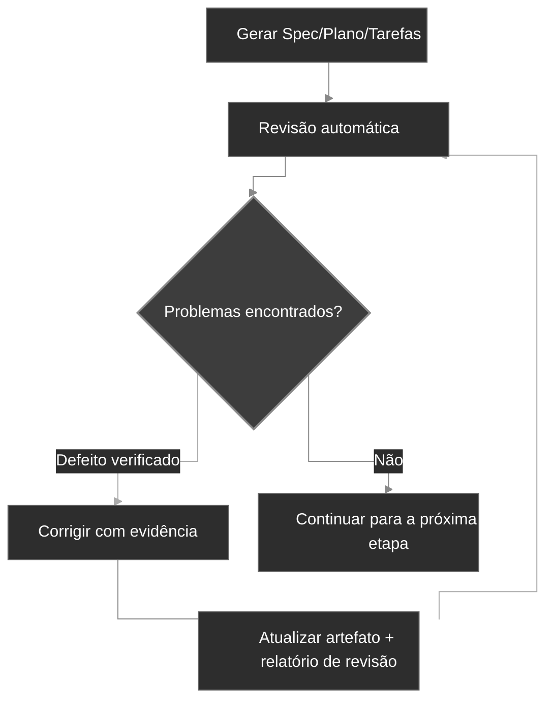

<div align="center">
  <picture>
    <source media="(prefers-color-scheme: dark)" srcset="codexspec-logo-dark.svg">
    <source media="(prefers-color-scheme: light)" srcset="codexspec-logo-light.svg">
    
  </picture>
</div>

<h1 align="center">CodexSpec</h1>

<p align="center">
  <a href="README.md">English</a> | <a href="README.zh-CN.md">中文</a> | <a href="README.ja.md">日本語</a> | <a href="README.es.md">Español</a> | <b>Português</b> | <a href="README.ko.md">한국어</a> | <a href="README.de.md">Deutsch</a> | <a href="README.fr.md">Français</a>
</p>

<p align="center">
  <a href="https://pypi.org/project/codexspec/"></a>
  <a href="https://pypi.org/project/codexspec/"></a>
  <a href="https://opensource.org/licenses/MIT"></a>
</p>

<p align="center">
  <strong>Um toolkit de SDD Requirements-First para o Claude Code</strong>
</p>

O CodexSpec ajuda você a construir software de alta qualidade por meio do **Requirements-First Spec-Driven Development (SDD)** — requisitos confirmados vêm primeiro, e nada é definitivo até você confirmar explicitamente.
Em vez de pular direto para o código, você confirma **o que** construir e **por que**, antes de decidir **como** construir.

[📖 Documentação](https://zts0hg.github.io/codexspec/pt-BR/) | [Documentation](https://zts0hg.github.io/codexspec/) | [中文文档](https://zts0hg.github.io/codexspec/zh/) | [日本語ドキュメント](https://zts0hg.github.io/codexspec/ja/) | [한국어 문서](https://zts0hg.github.io/codexspec/ko/) | [Documentación](https://zts0hg.github.io/codexspec/es/) | [Documentation](https://zts0hg.github.io/codexspec/fr/) | [Dokumentation](https://zts0hg.github.io/codexspec/de/)

---

## Tabela de Conteúdo

- [Por que escolher o CodexSpec?](#por-que-escolher-o-codexspec)
- [O que é o SDD Requirements-First?](#o-que-é-o-sdd-requirements-first)
- [Filosofia de Design: Colaboração entre Humano e AI](#filosofia-de-design-colaboração-entre-humano-e-ai)
- [Início Rápido em 30 Segundos](#-início-rápido-em-30-segundos)
- [Instalação](#instalação)
- [Fluxo de Trabalho Central](#fluxo-de-trabalho-central)
- [Comandos Disponíveis](#comandos-disponíveis)
- [Comparação com o spec-kit](#comparação-com-o-spec-kit)
- [Internacionalização (i18n)](#internacionalização-i18n)
- [Contribuindo e Licença](#contribuindo)

---

## Por que escolher o CodexSpec?

Por que adicionar o CodexSpec ao Claude Code? Veja a comparação:

| Aspecto | Apenas Claude Code | CodexSpec + Claude Code |
|---------|--------------------|--------------------------|
| **Suporte multilíngue** | Interação em inglês por padrão | Configure o idioma da equipe para colaboração e revisões mais fluidas |
| **Rastreabilidade** | Difícil rastrear decisões após o fim da sessão | Todos os specs, planos e tarefas ficam salvos em `.codexspec/specs/` |
| **Recuperação de sessão** | Interrupções do modo plan são difíceis de recuperar | Divisão em múltiplos comandos + documentos persistentes = recuperação fácil |
| **Governança da equipe** | Sem princípios unificados, estilos inconsistentes | `constitution.md` impõe padrões e qualidade da equipe |

---

## O que é o SDD Requirements-First?

O **Requirements-First SDD** é a metodologia de Spec-Driven Development (SDD) com um aprimoramento: **requisitos confirmados são a autoridade de maior prioridade**. Você define e confirma *o que* construir e *por que*, antes de decidir *como* — e nada é definitivo até você confirmar explicitamente.

```
Tradicional:  Ideia → Código → Debug → Reescrever
SDD:          Ideia → Requisitos Confirmados → Spec → Plano → Tarefas → Código
```

**Por que usar Requirements-First SDD?**

| Problema                 | Solução do Requirements-First SDD                                |
| ------------------------ | ---------------------------------------------------------------- |
| Mal-entendidos da IA     | Requisitos confirmados dizem à IA "o que construir"; a IA para de adivinhar |
| Requisitos ausentes      | Clarificação interativa + um portão de confirmação revelam casos de borda |
| Deriva de arquitetura    | Pontos de verificação de revisão garantem a direção correta      |
| Retrabalho desperdiçado  | Problemas são encontrados e confirmados antes de o código ser escrito |

<details>
<summary>✨ Recursos Principais</summary>

### Fluxo de Trabalho Central

- **Desenvolvimento baseado em Constituição** — Estabeleça princípios de projeto que orientam todas as decisões
- **Captura persistente de requisitos** — `/specify` registra a discussão confirmada em `requirements.md` antes da geração de documentos
- **Revisões automáticas** — Todo artefato gerado (spec, plano e tarefa) inclui verificações de qualidade embutidas
- **Tarefas rastreáveis** — A decomposição de tarefas preserva a cobertura de requisitos e do plano, aplicando test-first apenas onde necessário

### Colaboração entre Humano e AI

- **Comandos de revisão** — Comandos dedicados de revisão para spec, plano e tarefas
- **Clarificação interativa** — Refinamento de requisitos orientado por perguntas e respostas
- **Análise cross-artefato** — Detecte inconsistências antes da implementação

### Experiência do Desenvolvedor

- **Integração nativa com Claude Code** — Slash commands funcionam de forma fluida
- **Suporte multilíngue** — 13+ idiomas via tradução dinâmica por LLM
- **Multiplataforma** — Scripts Bash e PowerShell inclusos
- **Extensível** — Arquitetura de plugins para comandos personalizados

</details>

---

## Filosofia de Design: Colaboração entre Humano e AI

O CodexSpec parte do princípio de que **o desenvolvimento efetivo assistido por IA exige participação humana ativa em cada etapa**.

### Por que a supervisão humana importa

| Sem revisões                       | Com revisões                              |
| ---------------------------------- | ----------------------------------------- |
| A IA faz suposições incorretas     | Humanos capturam mal-entendidos cedo      |
| Requisitos incompletos se propagam | Lacunas identificadas antes da implementação |
| A arquitetura se afasta da intenção | Alinhamento verificado em cada etapa     |
| Tarefas perdem funcionalidades críticas | Validação sistemática de cobertura    |
| **Resultado: retrabalho, esforço desperdiçado** | **Resultado: acertar de primeira** |

### A Abordagem CodexSpec

O CodexSpec estrutura o desenvolvimento em **pontos de verificação revisáveis**:

```
Ideia → /specify → requirements.md → /generate-spec → spec.md → /spec-to-plan → plan.md → /plan-to-tasks → tasks.md → /implement
                                                   │                         │                            │
                                              Revisar spec             Revisar plano                Revisar tarefas
```

Os requisitos confirmados são a autoridade máxima sobre a funcionalidade. Os artefatos derivados carregam links explícitos para suas fontes, de modo que conflitos podem ser rastreados até a origem em vez de propagados silenciosamente.

**Cada artefato gerado tem um comando de revisão correspondente:**

- `spec.md` → `/codexspec:review-spec`
- `plan.md` → `/codexspec:review-plan`
- `tasks.md` → `/codexspec:review-tasks`
- Todos os artefatos → `/codexspec:analyze`

Esse processo sistemático de revisão garante:

- **Detecção precoce de erros**: capturar mal-entendidos antes de o código ser escrito
- **Verificação de alinhamento**: confirmar que a interpretação da IA corresponde à sua intenção
- **Portões de qualidade**: validar completude, clareza e viabilidade em cada etapa
- **Menos retrabalho**: investir minutos em revisão para economizar horas de reimplementação

---

## 🚀 Início Rápido em 30 Segundos

```bash
# 1. Instalar
uv tool install codexspec

# 2. Inicializar o projeto
#    Opção A: Criar um novo projeto
codexspec init my-project && cd my-project

#    Opção B: Inicializar em um projeto existente
cd your-existing-project && codexspec init .

# 3. Usar no Claude Code
claude
> /codexspec:constitution Criar princípios focados em qualidade de código e testes
> /codexspec:specify Quero construir um aplicativo de tarefas
> /codexspec:generate-spec
> /codexspec:spec-to-plan
> /codexspec:plan-to-tasks
> /codexspec:implement-tasks
```

Pronto! Continue a leitura para o fluxo de trabalho completo.

---

## Instalação

### Pré-requisitos

- Python 3.11+
- [uv](https://docs.astral.sh/uv/) (recomendado) ou pip

### Instalação recomendada

```bash
# Usando uv (recomendado)
uv tool install codexspec

# Ou usando pip
pip install codexspec
```

### Verificar a instalação

```bash
codexspec --version
```

<details>
<summary>📦 Métodos alternativos de instalação</summary>

#### Uso único (sem instalação)

```bash
# Criar um novo projeto
uvx codexspec init my-project

# Inicializar em um projeto existente
cd your-existing-project
uvx codexspec init . --ai claude

# Inicializar para o Codex CLI
uvx codexspec init . --ai codex
```

#### Instalar versão de desenvolvimento a partir do GitHub

```bash
# Usando uv
uv tool install git+https://github.com/Zts0hg/codexspec.git

# Especificar branch ou tag
uv tool install git+https://github.com/Zts0hg/codexspec.git@main
uv tool install git+https://github.com/Zts0hg/codexspec.git@v0.5.6
```

</details>

<details>
<summary>🪟 Observações para usuários Windows</summary>

**Recomendado: usar o PowerShell**

```powershell
# 1. Instalar o uv (se ainda não estiver instalado)
powershell -c "irm https://astral.sh/uv/install.ps1 | iex"

# 2. Reiniciar o PowerShell e depois instalar o codexspec
uv tool install codexspec

# 3. Verificar a instalação
codexspec --version
```

**Solução de problemas no CMD**

Se você encontrar erros de "Acesso negado":

1. Feche todas as janelas do CMD e reabra
2. Ou atualize o PATH manualmente: `set PATH=%PATH%;%USERPROFILE%\.local\bin`
3. Ou use o caminho completo: `%USERPROFILE%\.local\bin\codexspec.exe --version`

Para detalhes completos, consulte o [Guia de solução de problemas do Windows](docs/WINDOWS-TROUBLESHOOTING.md) (em inglês).

</details>

### Atualizar

```bash
# Usando uv
uv tool install codexspec --upgrade

# Usando pip
pip install --upgrade codexspec
```

### Instalação pelo Marketplace de Plugins (alternativa)

O CodexSpec também está disponível como um plugin do Claude Code. Esse método é ideal se você quer usar os comandos do CodexSpec diretamente no Claude Code, sem a ferramenta CLI.

#### Passos de instalação

```bash
# No Claude Code, adicionar o marketplace
> /plugin marketplace add Zts0hg/codexspec

# Instalar o plugin
> /plugin install codexspec@codexspec-market
```

#### Configuração de idioma para usuários do plugin

Após instalar pelo Marketplace de Plugins, configure seu idioma preferido usando o comando `/codexspec:config`:

```bash
# Iniciar a configuração interativa
> /codexspec:config

# Ou visualizar a configuração atual
> /codexspec:config --view
```

O comando config vai guiá-lo por:

1. Selecionar o idioma de saída (para documentos gerados)
2. Selecionar o idioma das mensagens de commit
3. Criar o arquivo `.codexspec/config.yml`

**Comparação dos métodos de instalação**

| Método | Ideal para | Recursos |
|--------|------------|----------|
| **Instalação CLI** (`uv tool install`) | Fluxo de desenvolvimento completo | Comandos CLI (`init`, `check`, `config`) + slash commands |
| **Marketplace de Plugins** | Início rápido, projetos existentes | Apenas slash commands (use `/codexspec:config` para configurar o idioma) |

**Observação**: o plugin usa o modo `strict: false` e reaproveita o suporte multilíngue existente por meio da tradução dinâmica via LLM.

---

## Fluxo de Trabalho Central

O CodexSpec decompõe o desenvolvimento em **pontos de verificação revisáveis**:

```
Ideia → /specify → requirements.md → /generate-spec → spec.md → /spec-to-plan → plan.md → /plan-to-tasks → tasks.md → /implement
                                                   │                         │                            │
                                              Revisar spec             Revisar plano                Revisar tarefas
```

### Etapas do fluxo de trabalho

| Etapa                       | Comando                      | Saída                       | Verificação humana |
| --------------------------- | ---------------------------- | --------------------------- | ------------------ |
| 1. Princípios do projeto    | `/codexspec:constitution`    | `constitution.md`           | ✅                  |
| 2. Clarificação de requisitos | `/codexspec:specify`       | `requirements.md`           | ✅                  |
| 3. Gerar spec               | `/codexspec:generate-spec`   | `spec.md` + auto-revisão    | ✅                  |
| 4. Planejamento técnico     | `/codexspec:spec-to-plan`    | `plan.md` + auto-revisão    | ✅                  |
| 5. Decomposição de tarefas  | `/codexspec:plan-to-tasks`   | `tasks.md` + auto-revisão   | ✅                  |
| 6. Análise cross-artefato   | `/codexspec:analyze`         | Relatório de análise        | ✅                  |
| 7. Implementação            | `/codexspec:implement-tasks` | Código                      | -                  |

### specify vs clarify: quando usar qual?

| Aspecto | `/codexspec:specify` | `/codexspec:clarify` |
|---------|----------------------|----------------------|
| **Objetivo** | Exploração e confirmação inicial de requisitos | Refinar requisitos confirmados ou o spec derivado |
| **Quando usar** | Ao começar uma funcionalidade | Quando requisitos ou spec precisam de esclarecimento |
| **Saída** | Cria/atualiza `requirements.md` | Atualiza primeiro `requirements.md` e depois sincroniza `spec.md` |
| **Método** | Q&A aberta | Varredura estruturada (4 categorias) |
| **Perguntas** | Sem limite | No máximo 5 por execução |

### Conceito-chave: loop iterativo de qualidade

Cada comando de geração inclui **revisão automática**. Defeitos verificados podem ser corrigidos e revisados novamente por até duas rodadas; sugestões consultivas permanecem separadas e nunca acionam mudanças automáticas.

1. Revise o relatório
2. Descreva em linguagem natural os problemas a corrigir
3. O sistema atualiza automaticamente os specs e os relatórios de revisão



<details>
<summary>📖 Descrição detalhada do fluxo de trabalho</summary>

### 1. Inicializar o projeto

```bash
codexspec init my-awesome-project
cd my-awesome-project
claude
```

### 2. Estabelecer os princípios do projeto

```
/codexspec:constitution Criar princípios focados em qualidade de código, padrões de teste e arquitetura limpa
```

### 3. Clarificar os requisitos

```
/codexspec:specify Quero construir um aplicativo de gerenciamento de tarefas
```

Esse comando vai:

- Fazer perguntas de esclarecimento para entender sua ideia
- Explorar casos de borda que você pode não ter considerado
- Pedir que você confirme o resumo final dos requisitos
- Persistir necessidades, restrições, decisões, exclusões e questões em aberto confirmadas em `requirements.md`

### 4. Gerar o documento de especificação

Após os requisitos estarem esclarecidos:

```
/codexspec:generate-spec
```

Esse comando:

- Compila as entradas confirmadas de `requirements.md` em uma especificação estruturada
- Adiciona referências de origem para rastreabilidade dos requisitos
- **Automaticamente** executa a revisão e gera `review-spec.md`

### 5. Criar o plano técnico

```
/codexspec:spec-to-plan Usar Python FastAPI no backend, PostgreSQL no banco de dados e React no frontend
```

Usa apenas as seções relevantes de planejamento, registra links `Covers` para os requisitos da especificação e verifica os princípios aplicáveis do projeto.

### 6. Gerar as tarefas

```
/codexspec:plan-to-tasks
```

As tarefas são organizadas em torno de resultados verificáveis:

- **Testes condicionais**: a ordenação test-first é usada quando necessária, conforme exigido pelo plano, pela constituição ou pelo risco da tarefa
- **Marcadores paralelos `[P]`**: usados apenas para tarefas genuinamente independentes
- **Especificação de caminhos de arquivo**: entregáveis claros por tarefa
- **Rastreabilidade**: cada tarefa vincula-se ao plano e aos requisitos que cobre

### 7. Análise cross-artefato (opcional, mas recomendada)

```
/codexspec:analyze
```

Detecta problemas entre requisitos, spec, plano e tarefas:

- Lacunas de cobertura (requisitos sem tarefas)
- Duplicações e inconsistências
- Violações da constituição
- Itens subespecificados

### 8. Implementação

```
/codexspec:implement-tasks
```

A implementação segue o **fluxo de TDD condicional**:

- Tarefas de código: test-first (Red → Green → Verify → Refactor)
- Tarefas não testáveis (documentação, configuração): implementação direta

</details>

---

## Comandos Disponíveis

### Comandos CLI

| Comando             | Descrição                       |
| ------------------- | ------------------------------- |
| `codexspec init`    | Inicializa um novo projeto      |
| `codexspec check`   | Verifica as ferramentas instaladas |
| `codexspec version` | Exibe informações de versão     |
| `codexspec config`  | Visualiza ou altera a configuração |

<details>
<summary>📋 Opções do init</summary>

| Opção                | Descrição                                                        |
| -------------------- | ---------------------------------------------------------------- |
| `PROJECT_NAME`       | Nome do diretório do projeto (`.` ou `--here` para o diretório atual) |
| `--here`, `-h`       | Inicializa no diretório atual                                    |
| `--ai`, `-a`         | Assistente de IA a usar: `claude`, `codex` ou `both` (padrão: claude) |
| `--lang`, `-l`       | Idioma (base) de saída; interaction/document/commit recaem sobre ele (ex.: en, zh-CN, ja) |
| `--interaction-lang` | Idioma de interação (diálogo com o LLM + saída do CLI); sobrescreve `--lang` |
| `--document-lang`    | Idioma dos documentos (spec/plan/tasks gerados); sobrescreve `--lang` |
| `--commit-lang`      | Idioma das mensagens de commit; sobrescreve `--lang`             |
| `--force`, `-f`      | Sobrescreve arquivos + confirma prompts automaticamente; nunca regenera `config.yml` |
| `--no-git`           | Pula a inicialização do repositório git                          |
| `--debug`, `-d`      | Habilita a saída de debug                                        |

</details>

<details>
<summary>📋 Opções do config</summary>

| Opção                     | Descrição                                                  |
| ------------------------- | ---------------------------------------------------------- |
| `--set-lang`, `-l`        | Define o idioma (base) de saída                            |
| `--set-interaction-lang`  | Define o idioma de interação                               |
| `--set-document-lang`     | Define o idioma dos documentos                             |
| `--set-commit-lang`, `-c` | Define o idioma das mensagens de commit                    |
| `--list-langs`            | Lista todos os idiomas suportados                          |
| `--auto-next`             | Alterna/define `workflow.auto_next` (sem valor alterna; ou on/off) |

</details>

### Slash Commands

#### Comandos do fluxo de trabalho central

| Comando                       | Descrição                                                          |
| ----------------------------- | ------------------------------------------------------------------ |
| `/codexspec:constitution`     | Cria/atualiza a constituição do projeto com validação cross-artefato |
| `/codexspec:specify`          | Esclarece, confirma e persiste requisitos em `requirements.md`     |
| `/codexspec:generate-spec`    | Gera o documento `spec.md` ★ Auto-revisão                          |
| `/codexspec:spec-to-plan`     | Converte o spec em plano técnico ★ Auto-revisão                    |
| `/codexspec:plan-to-tasks`    | Decompõe o plano em tarefas rastreáveis e verificáveis ★ Auto-revisão |
| `/codexspec:implement-tasks`  | Executa as tarefas (TDD condicional)                               |

#### Comandos de revisão (portões de qualidade)

| Comando                   | Descrição                                |
| ------------------------- | ---------------------------------------- |
| `/codexspec:review-spec`  | Revisa a especificação (automática ou manual) |
| `/codexspec:review-plan`  | Revisa o plano técnico (automática ou manual) |
| `/codexspec:review-tasks` | Revisa a decomposição de tarefas (automática ou manual) |

#### Comandos de aprimoramento

| Comando                       | Descrição                                                          |
| ----------------------------- | ----------------------------------------------------------------- |
| `/codexspec:config`           | Gerencia a configuração do projeto (criar/ver/modificar/redefinir) |
| `/codexspec:clarify`          | Varre o spec em busca de ambiguidades (4 categorias, máx. 5 perguntas) |
| `/codexspec:analyze`          | Análise de consistência cross-artefato (somente leitura, por severidade) |
| `/codexspec:checklist`        | Gera checklist de qualidade dos requisitos                         |
| `/codexspec:tasks-to-issues`  | Converte tarefas em GitHub Issues                                  |

#### Comandos do fluxo de trabalho Git

| Comando                    | Descrição                                            |
| -------------------------- | ---------------------------------------------------- |
| `/codexspec:commit-staged` | Gera mensagem de commit a partir das alterações em stage |
| `/codexspec:pr`            | Gera descrição de PR/MR (detecta a plataforma automaticamente) |

#### Comandos de revisão de código

| Comando                  | Descrição                                                                                   |
| ------------------------ | ------------------------------------------------------------------------------------------- |
| `/codexspec:review-code` | Revisa código em qualquer linguagem (clareza idiomática, correção, robustez, arquitetura)   |

---

## Comparação com o spec-kit

O CodexSpec é inspirado no spec-kit do GitHub, com diferenças importantes:

| Recurso                | spec-kit                       | CodexSpec                                              |
| ---------------------- | ------------------------------ | ------------------------------------------------------ |
| Filosofia central      | Spec-driven development        | Requirements-First SDD + colaboração entre humano e AI |
| Nome do CLI            | `specify`                      | `codexspec`                                            |
| IA principal           | Suporte multiagente            | Focado no Claude Code                                  |
| Sistema de constituição| Básico                         | Constituição completa + validação cross-artefato       |
| Spec em duas fases     | Não                            | Sim (clarificar + gerar)                               |
| Comandos de revisão    | Opcional                       | 3 comandos dedicados de revisão + pontuação            |
| Comando clarify        | Sim                            | 4 categorias de foco, integrado à revisão              |
| Comando analyze        | Sim                            | Somente leitura, por severidade, ciente da constituição |
| TDD nas tarefas        | Opcional                       | Condicional a requisitos, risco e política             |
| Implementação          | Padrão                         | TDD condicional (código vs. docs/config)               |
| Sistema de extensões   | Sim                            | Sim                                                    |
| Scripts PowerShell     | Sim                            | Sim                                                    |
| Suporte a i18n         | Não                            | Sim (13+ idiomas via tradução por LLM)                 |

### Principais diferenciadores

1. **Cultura review-first**: cada artefato principal tem um comando de revisão dedicado
2. **Governança por Constituição**: os princípios são validados, não apenas documentados
3. **Revisão baseada em evidência**: defeitos exigem evidência concreta; sugestões consultivas de design não afetam a aceitação
4. **Portão de confirmação**: requisitos, specs, planos e tarefas só se tornam vinculativos após confirmação humana explícita

---

## Internacionalização (i18n)

O CodexSpec suporta múltiplos idiomas por meio de **tradução dinâmica via LLM**. Não há templates de tradução para manter — o Claude traduz o conteúdo em tempo de execução, com base na sua configuração de idioma.

### Dimensões de idioma

O CodexSpec divide o idioma em quatro dimensões configuráveis de forma independente. `output` é a base; as demais a sobrescrevem e recaem sobre ela (e depois sobre `en`) quando deixadas em branco — assim você pode conversar com o Claude em um idioma enquanto mantém os artefatos gerados ou as mensagens de commit em outro.

| Dimensão        | Chave do `config.yml` | Definir no init       | Definir depois               | Controla                            | Recai sobre          |
|-----------------|------------------------|-----------------------|------------------------------|-------------------------------------|----------------------|
| Saída (base)    | `output`               | `--lang`              | `config --set-lang`          | base para as outras três            | `en`                 |
| Interação       | `interaction`          | `--interaction-lang`  | `config --set-interaction-lang` | diálogo com o LLM + saída do CLI   | output → `en`        |
| Documento       | `document`             | `--document-lang`     | `config --set-document-lang` | spec/plan/tasks gerados             | output → `en`        |
| Commit          | `commit`               | `--commit-lang`       | `config --set-commit-lang`   | mensagens de commit do git          | output → `en`        |
| Templates       | `templates`            | —                     | —                            | origem dos modelos (sempre `en`)    | —                    |

### Definir o idioma

**Durante a inicialização:**

```bash
# Saída em chinês (define a base de output)
codexspec init my-project --lang zh-CN

# Totalmente não interativo: base zh-CN, mensagens de commit em inglês
codexspec init my-project --lang zh-CN --commit-lang en

# Definir cada dimensão explicitamente (scriptável, sem prompts)
codexspec init my-project \
  --interaction-lang zh-CN --document-lang en --commit-lang en
```

A primeira execução do `init` em um TTY sem `--lang` (e sem as três flags de dimensão) solicita um idioma base; em um ambiente não-TTY (CI/scripts) o padrão é `en`. Executar `init` novamente preserva qualquer chave de idioma que você não tenha especificado.

**Após a inicialização:**

```bash
# Visualizar a configuração atual
codexspec config

# Alterar uma única dimensão
codexspec config --set-lang zh-CN
codexspec config --set-interaction-lang zh-CN
codexspec config --set-document-lang en
codexspec config --set-commit-lang en
codexspec config --auto-next
```

### Idiomas suportados

| Código  | Idioma                  |
| ------- | ----------------------- |
| `en`    | English (padrão)        |
| `zh-CN` | 简体中文                 |
| `zh-TW` | 繁體中文                 |
| `ja`    | 日本語                  |
| `ko`    | 한국어                  |
| `es`    | Español                 |
| `fr`    | Français                |
| `de`    | Deutsch                 |
| `pt-BR` | Português               |
| `ru`    | Русский                 |
| `it`    | Italiano                |
| `ar`    | العربية                 |
| `hi`    | हिन्दी                  |

<details>
<summary>⚙️ Exemplo de arquivo de configuração</summary>

`.codexspec/config.yml`:

```yaml
version: "1.0"

language:
  output: "zh-CN"        # Idioma base; os três abaixo recaem sobre ele, depois sobre "en"
  interaction: "zh-CN"   # Diálogo com o LLM + saída do CLI codexspec (opcional → padrão: output)
  document: "en"         # requirements/spec/plan/tasks gerados (opcional → padrão: output)
  commit: "en"           # Mensagens de commit do git (opcional → padrão: output)
  templates: "en"        # Manter como "en"

project:
  ai: "claude"
  created: "2025-02-15"
```

</details>

---

## Estrutura do Projeto

Estrutura do projeto após a inicialização:

```
my-project/
├── .codexspec/
│   ├── memory/
│   │   └── constitution.md    # Constituição do projeto
│   ├── specs/
│   │   └── {feature-id}/
│   │       ├── spec.md        # Especificação da funcionalidade
│   │       ├── plan.md        # Plano técnico
│   │       ├── tasks.md       # Decomposição de tarefas
│   │       └── checklists/    # Checklists de qualidade
│   ├── templates/             # Templates personalizados
│   ├── scripts/               # Scripts de apoio
│   └── extensions/            # Extensões personalizadas
├── .claude/
│   └── commands/              # Slash commands do Claude Code
├── .agents/
│   └── skills/                # Skills do Codex (quando inicializado com --ai codex ou both)
├── CLAUDE.md                  # Contexto do Claude Code
└── AGENTS.md                  # Contexto do Codex
```

---

## Sistema de Extensões

O CodexSpec oferece uma arquitetura de plugins para adicionar comandos personalizados:

```
my-extension/
├── extension.yml          # Manifesto da extensão
├── commands/              # Slash commands personalizados
│   └── command.md
└── README.md
```

Consulte `extensions/EXTENSION-DEVELOPMENT-GUIDE.md` para detalhes.

---

## Desenvolvimento

### Pré-requisitos

- Python 3.11+
- Gerenciador de pacotes uv
- Git

### Desenvolvimento local

```bash
# Clonar o repositório
git clone https://github.com/Zts0hg/codexspec.git
cd codexspec

# Instalar dependências de desenvolvimento
uv sync --dev

# Executar localmente
uv run codexspec --help

# Executar os testes
uv run pytest

# Verificar o código com o linter
uv run ruff check src/

# Compilar o pacote
uv build
```

---

## Contribuindo

Contribuições são bem-vindas! Por favor, leia as diretrizes de contribuição antes de enviar um pull request.

## Licença

Licença MIT — consulte [LICENSE](LICENSE) para detalhes.

## Agradecimentos

- Inspirado pelo [GitHub spec-kit](https://github.com/github/spec-kit)
- Construído para o [Claude Code](https://claude.ai/code)
