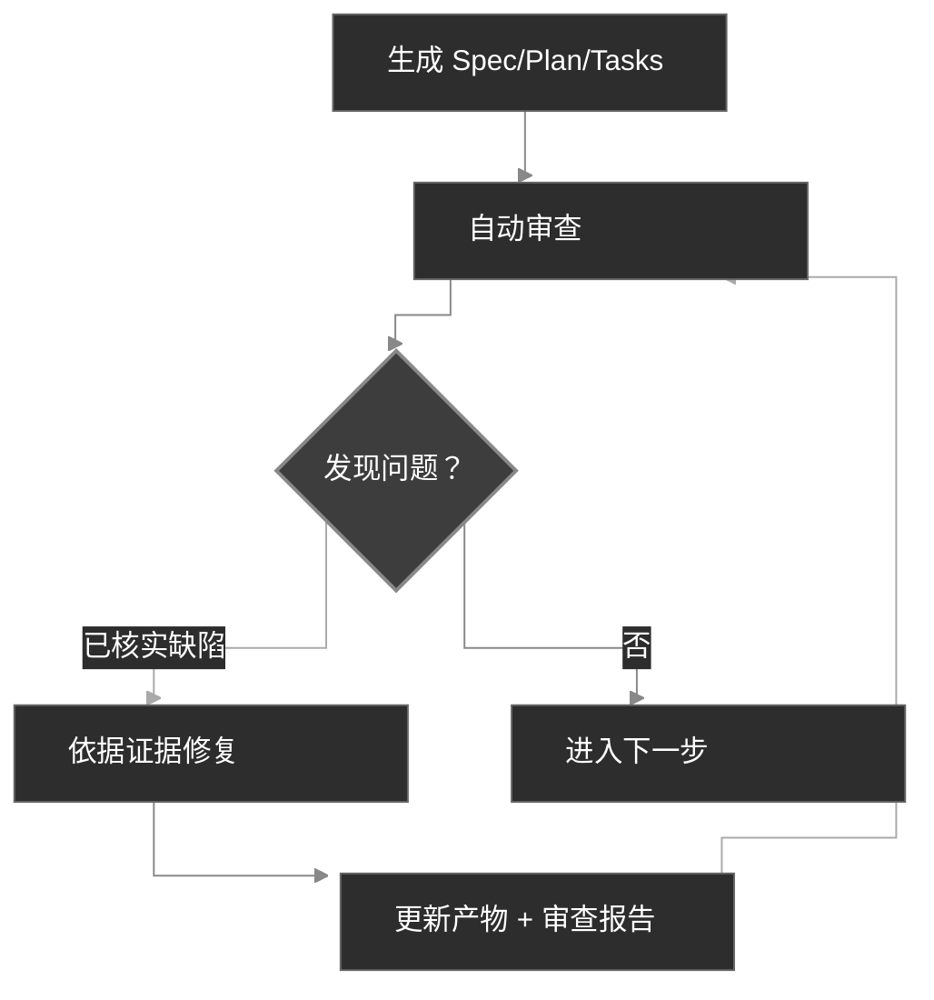

<div align="center">
  <picture>
    <source media="(prefers-color-scheme: dark)" srcset="codexspec-logo-dark.svg">
    <source media="(prefers-color-scheme: light)" srcset="codexspec-logo-light.svg">
    
  </picture>
</div>

<h1 align="center">CodexSpec</h1>

<p align="center">
  <a href="README.md">English</a> | <b>中文</b> | <a href="README.ja.md">日本語</a> | <a href="README.es.md">Español</a> | <a href="README.pt-BR.md">Português</a> | <a href="README.ko.md">한국어</a> | <a href="README.de.md">Deutsch</a> | <a href="README.fr.md">Français</a>
</p>

<p align="center">
  <a href="https://pypi.org/project/codexspec/"></a>
  <a href="https://pypi.org/project/codexspec/"></a>
  <a href="https://opensource.org/licenses/MIT"></a>
</p>

<p align="center">
  <strong>面向 Claude Code 的 Requirements-First SDD 工具包</strong>
</p>

CodexSpec 通过 **Requirements-First Spec-Driven Development（SDD，需求先行的规格驱动开发）** 帮你构建高质量软件——已确认的需求优先，任何内容在你显式确认之前都不具约束力。
换句话说，在决定**如何**实现之前，先把**要构建什么**以及**为什么构建**敲定下来，而不是直接奔向代码。

[📖 Documentation](https://zts0hg.github.io/codexspec/) | [中文文档](https://zts0hg.github.io/codexspec/zh/) | [日本語ドキュメント](https://zts0hg.github.io/codexspec/ja/) | [한국어 문서](https://zts0hg.github.io/codexspec/ko/) | [Documentación](https://zts0hg.github.io/codexspec/es/) | [Documentation](https://zts0hg.github.io/codexspec/fr/) | [Dokumentation](https://zts0hg.github.io/codexspec/de/) | [Documentação](https://zts0hg.github.io/codexspec/pt-BR/)

---

## 目录

- [为什么选择 CodexSpec？](#为什么选择-codexspec)
- [什么是 Requirements-First SDD？](#什么是-requirements-first-sdd)
- [设计理念：人机协同](#设计理念人机协同)
- [30 秒快速开始](#-30-秒快速开始)
- [安装](#安装)
- [核心工作流](#核心工作流)
- [可用命令](#可用命令)
- [与 spec-kit 对比](#与-spec-kit-对比)
- [国际化（i18n）](#国际化i18n)
- [贡献与许可证](#贡献与许可证)

---

## 为什么选择 CodexSpec？

为什么要在 Claude Code 基础上使用 CodexSpec？看下面对比：

| 维度 | 仅使用 Claude Code | CodexSpec + Claude Code |
|------|-------------------|-------------------------|
| **多语言支持** | 默认英文交互 | 可配置团队语言，让协作与审阅更顺畅 |
| **可追溯性** | 会话结束后难以追溯历史决策 | 所有规格、计划与任务都保存在 `.codexspec/specs/` |
| **会话恢复** | plan mode 一旦中断便难以恢复 | 多命令拆分 + 持久化文档，进度随时可续 |
| **团队治理** | 缺少统一原则，风格参差 | `constitution.md` 落实团队标准与质量底线 |

---

## 什么是 Requirements-First SDD？

**Requirements-First SDD** 是规格驱动开发（Spec-Driven Development，SDD）方法论的一次升级，核心理念是：**已确认的需求拥有最高优先级的权威**。在决定*如何*实现之前，先把*要做什么*以及*为什么做*定义清楚并确认下来——任何内容在你显式确认之前都不具约束力。

```
传统开发:  想法 → 代码 → 调试 → 重写
SDD:       想法 → 已确认需求 → 规格 → 计划 → 任务 → 代码
```

**为什么要用 Requirements-First SDD？**

| 痛点                  | Requirements-First SDD 的应对                            |
| --------------------- | ------------------------------------------------------- |
| AI 理解偏差           | 已确认的需求告诉 AI"要构建什么"，AI 不再靠猜            |
| 需求遗漏              | 交互式澄清 + 确认关卡把边界情况挤到台前                |
| 架构跑偏              | 审查检查点保证方向不出错                                |
| 返工浪费              | 问题在动代码之前就被发现并确认                          |

<details>
<summary>✨ 核心特性</summary>

### 核心工作流

- **宪法驱动开发** - 先确立项目原则，让原则贯穿后续所有决策
- **持久化需求捕获** - `/specify` 在生成正式文档前，先把确认后的讨论沉淀进 `requirements.md`
- **自动审查** - 每一份生成的规格、计划与任务产物都内置质量检查
- **可追溯的任务** - 任务分解保留对需求和计划的覆盖关系，仅在需要时才采用测试优先

### 人机协同

- **审查命令** - 针对规格、计划、任务各设有专用审查命令
- **交互式澄清** - 通过问答不断细化需求
- **跨产物分析** - 在动手实现之前就能发现各产物之间的不一致

### 开发者体验

- **原生 Claude Code 集成** - 斜杠命令开箱即用
- **多语言支持** - 借助 LLM 动态翻译，覆盖 13+ 种语言
- **跨平台** - 同时提供 Bash 与 PowerShell 脚本
- **可扩展** - 通过插件架构支持自定义命令

</details>

---

## 设计理念：人机协同

CodexSpec 始于一个判断：**真正有效的 AI 辅助开发，需要人在每个阶段都积极参与。**

### 为什么需要人工监督

| 不做审查                          | 做审查                                |
| --------------------------------- | ------------------------------------- |
| AI 自顾自做出错误假设             | 人在早期就能识破误解                  |
| 不完整的需求一路传下去            | 缺口在实现之前就被识别                |
| 架构渐渐偏离初衷                  | 每个阶段都核对一致性                  |
| 任务漏掉关键功能                  | 系统性地校验覆盖度                    |
| **结果：返工、白费力气**          | **结果：一次做对**                    |

### CodexSpec 的做法

CodexSpec 把开发拆解成一连串**可审查的检查点**：

```
想法 → /specify → requirements.md → /generate-spec → spec.md → /spec-to-plan → plan.md → /plan-to-tasks → tasks.md → /implement
                                                   │                         │                            │
                                              审查规格                    审查计划                     审查任务
```

已确认的需求是功能范围内最高优先级的权威依据。后续派生产物会显式带上来源链接，所以一旦出现冲突，可以沿着链路追根溯源，而不是被默默地带偏。

**每一类生成产物都有对应的审查命令：**

- `spec.md` → `/codexspec:review-spec`
- `plan.md` → `/codexspec:review-plan`
- `tasks.md` → `/codexspec:review-tasks`
- 所有产物 → `/codexspec:analyze`

这套系统化的审查流程能够：

- **早期错误发现**：在动代码之前识破误解
- **一致性核对**：确认 AI 的理解与你的意图一致
- **质量关卡**：在每个阶段验证完整性、清晰度与可行性
- **减少返工**：花几分钟审查，省下数小时的返工

---

## 🚀 30 秒快速开始

```bash
# 1. 安装
uv tool install codexspec

# 2. 初始化项目
#    方式 A：新建项目
codexspec init my-project && cd my-project

#    方式 B：在已有项目中初始化
cd your-existing-project && codexspec init .

# 3. 在 Claude Code 中使用
claude
> /codexspec:constitution 创建以代码质量和测试为核心的原则
> /codexspec:specify 我想做一个待办应用
> /codexspec:generate-spec
> /codexspec:spec-to-plan
> /codexspec:plan-to-tasks
> /codexspec:implement-tasks
```

就这么多。完整工作流见下文。

---

## 安装

### 前置要求

- Python 3.11+
- [uv](https://docs.astral.sh/uv/)（推荐）或 pip

### 推荐安装方式

```bash
# 使用 uv（推荐）
uv tool install codexspec

# 或者用 pip
pip install codexspec
```

### 验证安装

```bash
codexspec --version
```

<details>
<summary>📦 其他安装方式</summary>

#### 一次性使用（无需安装）

```bash
# 新建项目
uvx codexspec init my-project

# 在已有项目中初始化
cd your-existing-project
uvx codexspec init . --ai claude

# 为 Codex CLI 初始化
uvx codexspec init . --ai codex
```

#### 从 GitHub 安装开发版本

```bash
# 使用 uv
uv tool install git+https://github.com/Zts0hg/codexspec.git

# 指定分支或标签
uv tool install git+https://github.com/Zts0hg/codexspec.git@main
uv tool install git+https://github.com/Zts0hg/codexspec.git@v0.5.6
```

</details>

<details>
<summary>🪟 Windows 用户注意事项</summary>

**推荐：使用 PowerShell**

```powershell
# 1. 安装 uv（如果尚未安装）
powershell -c "irm https://astral.sh/uv/install.ps1 | iex"

# 2. 重启 PowerShell，再安装 codexspec
uv tool install codexspec

# 3. 验证安装
codexspec --version
```

**CMD 故障排查**

如果遇到"拒绝访问"错误：

1. 关闭所有 CMD 窗口再重新打开
2. 或手动刷新 PATH：`set PATH=%PATH%;%USERPROFILE%\.local\bin`
3. 或直接用全路径：`%USERPROFILE%\.local\bin\codexspec.exe --version`

详细排查步骤见 [Windows 故障排查指南](docs/WINDOWS-TROUBLESHOOTING.md)。

</details>

### 升级

```bash
# 使用 uv
uv tool install codexspec --upgrade

# 使用 pip
pip install --upgrade codexspec
```

### 通过插件市场安装（备选）

CodexSpec 也以 Claude Code 插件形式发布。如果你只想直接在 Claude Code 里用上 CodexSpec 命令、不想装 CLI，这种方式很合适。

#### 安装步骤

```bash
# 在 Claude Code 中添加插件市场
> /plugin marketplace add Zts0hg/codexspec

# 安装插件
> /plugin install codexspec@codexspec-market
```

#### 插件用户配置语言

通过插件市场装好之后，可以用 `/codexspec:config` 命令配置首选语言：

```bash
# 启动交互式配置
> /codexspec:config

# 或查看当前配置
> /codexspec:config --view
```

config 命令会依次引导你：

1. 选择输出语言（用于生成文档）
2. 选择提交信息语言
3. 创建 `.codexspec/config.yml` 配置文件

**两种安装方式对比**

| 方式 | 适用场景 | 提供能力 |
|------|----------|----------|
| **CLI 安装**（`uv tool install`） | 完整开发流程 | CLI 命令（`init`、`check`、`config`）+ 斜杠命令 |
| **插件市场** | 快速上手、已有项目 | 仅斜杠命令（语言设置用 `/codexspec:config`） |

**说明**：插件采用 `strict: false` 模式，并复用现有的 LLM 动态翻译来支持多语言。

---

## 核心工作流

CodexSpec 把开发拆解成一连串**可审查的检查点**：

```
想法 → /specify → requirements.md → /generate-spec → spec.md → /spec-to-plan → plan.md → /plan-to-tasks → tasks.md → /implement
                                                   │                         │                            │
                                              审查规格                    审查计划                     审查任务
```

### 工作流步骤

| 步骤                 | 命令                          | 产物                        | 人工检查 |
| -------------------- | ----------------------------- | --------------------------- | -------- |
| 1. 项目原则          | `/codexspec:constitution`     | `constitution.md`           | ✅       |
| 2. 需求澄清          | `/codexspec:specify`          | `requirements.md`           | ✅       |
| 3. 生成规格          | `/codexspec:generate-spec`    | `spec.md` + 自动审查        | ✅       |
| 4. 技术规划          | `/codexspec:spec-to-plan`     | `plan.md` + 自动审查        | ✅       |
| 5. 任务分解          | `/codexspec:plan-to-tasks`    | `tasks.md` + 自动审查       | ✅       |
| 6. 跨产物分析        | `/codexspec:analyze`          | 分析报告                    | ✅       |
| 7. 实现              | `/codexspec:implement-tasks`  | 代码                        | -        |

### specify 还是 clarify：什么时候用哪个？

| 维度       | `/codexspec:specify`              | `/codexspec:clarify`                          |
| ---------- | --------------------------------- | --------------------------------------------- |
| **目的**   | 初始需求的探索与确认              | 细化已确认的需求或派生出的规格                |
| **何时用** | 启动一个新功能时                  | 需求或规格需要澄清时                          |
| **产物**   | 创建或更新 `requirements.md`      | 先更新 `requirements.md`，再同步 `spec.md`    |
| **方法**   | 开放式问答                        | 结构化扫描（4 个类别）                        |
| **问题数** | 不限                              | 每次最多 5 个                                 |

### 关键概念：迭代式质量循环

每个生成命令都内含**自动审查**。已核实的缺陷可修复并复审，最多进行两轮；建议性意见则单独保留，不会触发任何自动改动。

1. 查看报告
2. 用自然语言描述要修复的问题
3. 系统自动更新规格与审查报告



<details>
<summary>📖 详细工作流说明</summary>

### 1. 初始化项目

```bash
codexspec init my-awesome-project
cd my-awesome-project
claude
```

### 2. 确立项目原则

```
/codexspec:constitution 创建以代码质量、测试标准和整洁架构为核心的原则
```

### 3. 澄清需求

```
/codexspec:specify 我想做一个任务管理应用
```

这条命令会：

- 通过澄清性问题理解你的想法
- 探索你可能没考虑到的边界情况
- 请你确认最终的需求摘要
- 把已确认的需求、约束、决策、排除项以及开放问题都写进 `requirements.md`

### 4. 生成规格文档

需求澄清完成后：

```
/codexspec:generate-spec
```

这条命令会：

- 把 `requirements.md` 中已确认的条目整理成结构化规格
- 给每条需求加上来源引用，保持可追溯
- **自动**运行审查并生成 `review-spec.md`

### 5. 制定技术计划

```
/codexspec:spec-to-plan 用 Python FastAPI 做后端，PostgreSQL 做数据库，React 做前端
```

只生成与本功能相关的规划内容，用 `Covers` 链接关联到规格需求，并校验适用的项目原则。

### 6. 生成任务

```
/codexspec:plan-to-tasks
```

任务围绕可验证的结果来组织：

- **条件化测试**：仅当计划、项目原则或任务风险有要求时，才采用测试优先的顺序
- **并行标记 `[P]`**：只用在真正相互独立的任务上
- **文件路径规范**：每条任务都有明确的交付物
- **可追溯**：每条任务都关联到它所覆盖的计划项与需求

### 7. 跨产物分析（可选，但推荐）

```
/codexspec:analyze
```

在需求、规格、计划与任务之间检测问题：

- 覆盖缺口（没有任务对应的需求）
- 重复与不一致
- 违反项目宪法
- 描述不充分的条目

### 8. 实现

```
/codexspec:implement-tasks
```

实现遵循**条件式 TDD 工作流**：

- 代码类任务：测试优先（红 → 绿 → 验证 → 重构）
- 不可测试的任务（文档、配置等）：直接实现

</details>

---

## 可用命令

### CLI 命令

| 命令                 | 说明                  |
| -------------------- | --------------------- |
| `codexspec init`     | 初始化新项目          |
| `codexspec check`    | 检查已安装的工具      |
| `codexspec version`  | 显示版本信息          |
| `codexspec config`   | 查看或修改配置        |

<details>
<summary>📋 init 选项</summary>

| 选项               | 说明                                                       |
| ------------------ | ---------------------------------------------------------- |
| `PROJECT_NAME`     | 项目目录名（`.` 或 `--here` 表示当前目录）                 |
| `--here`, `-h`     | 在当前目录初始化                                           |
| `--ai`, `-a`       | 使用的 AI 助手：`claude`、`codex` 或 `both`（默认：claude）|
| `--lang`, `-l`     | 输出（基础）语言；interaction/document/commit 在未设置时回退到它（如 en、zh-CN、ja） |
| `--interaction-lang` | 交互语言（LLM 对话 + CLI 输出）；覆盖 `--lang`            |
| `--document-lang`  | 文档语言（生成的 spec/plan/tasks）；覆盖 `--lang`          |
| `--commit-lang`    | 提交信息语言；覆盖 `--lang`                                |
| `--force`, `-f`    | 覆盖文件并自动确认提示；永不重新生成 `config.yml`          |
| `--no-git`         | 跳过 git 仓库初始化                                        |
| `--debug`, `-d`    | 启用调试输出                                               |

</details>

<details>
<summary>📋 config 选项</summary>

| 选项                       | 说明                                              |
| -------------------------- | ------------------------------------------------- |
| `--set-lang`, `-l`         | 设置输出（基础）语言                              |
| `--set-interaction-lang`   | 设置交互语言                                      |
| `--set-document-lang`      | 设置文档语言                                      |
| `--set-commit-lang`, `-c`  | 设置提交信息语言                                  |
| `--list-langs`             | 列出所有支持的语言                                |
| `--auto-next`              | 切换或设置 `workflow.auto_next`（不带值即切换；或 on/off） |

</details>

### 斜杠命令

#### 核心工作流命令

| 命令                          | 说明                                                       |
| ----------------------------- | ---------------------------------------------------------- |
| `/codexspec:constitution`     | 创建或更新项目宪法，并支持跨产物校验                       |
| `/codexspec:specify`          | 澄清、确认并把需求固化到 `requirements.md`                 |
| `/codexspec:generate-spec`    | 生成 `spec.md` 文档 ★ 自动审查                             |
| `/codexspec:spec-to-plan`     | 把规格转换成技术计划 ★ 自动审查                            |
| `/codexspec:plan-to-tasks`    | 把计划拆解成可追溯、可验证的任务 ★ 自动审查                |
| `/codexspec:implement-tasks`  | 执行任务（条件式 TDD）                                     |

#### 审查命令（质量关卡）

| 命令                  | 说明                          |
| --------------------- | ----------------------------- |
| `/codexspec:review-spec`  | 审查规格（自动或手动）    |
| `/codexspec:review-plan`  | 审查技术计划（自动或手动）|
| `/codexspec:review-tasks` | 审查任务分解（自动或手动）|

#### 增强命令

| 命令                          | 说明                                                     |
| ----------------------------- | -------------------------------------------------------- |
| `/codexspec:config`           | 管理项目配置（创建/查看/修改/重置）                      |
| `/codexspec:clarify`          | 扫描规格中的模糊点（4 个类别，每次最多 5 个问题）        |
| `/codexspec:analyze`          | 跨产物一致性分析（只读，按严重程度划分）                 |
| `/codexspec:checklist`        | 生成需求质量检查清单                                     |
| `/codexspec:tasks-to-issues`  | 将任务转换为 GitHub Issues                               |

#### Git 工作流命令

| 命令                    | 说明                                       |
| ----------------------- | ------------------------------------------ |
| `/codexspec:commit-staged` | 基于暂存的 diff 生成提交信息                |
| `/codexspec:pr`           | 生成 PR/MR 描述（自动识别平台）          |

#### 代码审查命令

| 命令                      | 说明                                                             |
| ------------------------- | ---------------------------------------------------------------- |
| `/codexspec:review-code`  | 审查任意语言的代码（地道性、正确性、健壮性、架构）               |

---

## 与 spec-kit 对比

CodexSpec 的灵感来自 GitHub 的 spec-kit，但有几点关键不同：

| 特性             | spec-kit                | CodexSpec                                       |
| ---------------- | ----------------------- | ----------------------------------------------- |
| 核心理念         | 规格驱动开发            | Requirements-First SDD + 人机协同               |
| CLI 名称         | `specify`               | `codexspec`                                     |
| 主要 AI          | 多代理支持              | 专注 Claude Code                                |
| 宪法系统         | 基础                    | 完整宪法 + 跨产物校验                           |
| 两阶段规格       | 否                      | 是（澄清 + 生成）                               |
| 审查命令         | 可选                    | 3 条专用审查命令 + 评分                         |
| Clarify 命令     | 有                      | 4 个聚焦类别，与审查集成                        |
| Analyze 命令     | 有                      | 只读、按严重程度、感知宪法                      |
| 任务中的 TDD     | 可选                    | 依据需求、风险与项目原则条件化启用              |
| 实现             | 标准                    | 条件式 TDD（代码 vs 文档/配置）                 |
| 扩展系统         | 有                      | 有                                              |
| PowerShell 脚本  | 有                      | 有                                              |
| i18n 支持        | 无                      | 有（通过 LLM 翻译支持 13+ 种语言）              |

### 关键差异

1. **审查优先文化**：每一类主要产物都有专用审查命令
2. **宪法治理**：原则会被校验，而不只是被记录下来
3. **基于证据的审查**：缺陷必须给出具体证据；建议性的设计想法不会影响验收
4. **确认关卡**：需求、规格、计划和任务，只有在经过人工显式确认之后才具有约束力

---

## 国际化（i18n）

CodexSpec 通过 **LLM 动态翻译**支持多种语言。无需维护翻译模板——Claude 会在运行时根据你的语言配置即时翻译内容。

### 语言维度

CodexSpec 把"语言"拆成四个可独立配置的维度。`output` 是基础维度，其余三个会覆盖它、并在未设置时回退到它（再回退到 `en`）——这样你就可以用一种语言跟 Claude 对话，同时让生成的产物或提交信息保留在另一种语言里。

| 维度         | `config.yml` 键  | 初始化时设置   | 之后设置                       | 控制范围                  | 回退到          |
| ------------ | ---------------- | -------------- | ------------------------------ | ------------------------- | --------------- |
| Output（基础） | `output`       | `--lang`       | `config --set-lang`            | 其余三个维度的基础        | `en`            |
| Interaction  | `interaction`    | `--interaction-lang` | `config --set-interaction-lang` | LLM 对话 + CLI 输出       | output → `en`   |
| Document     | `document`       | `--document-lang`    | `config --set-document-lang`    | 生成的 spec/plan/tasks    | output → `en`   |
| Commit       | `commit`         | `--commit-lang`      | `config --set-commit-lang`      | git 提交信息              | output → `en`   |
| Templates    | `templates`      | —              | —                              | 模板来源（始终为 `en`）   | —               |

### 设置语言

**初始化时：**

```bash
# 中文输出（设置 output 基础语言）
codexspec init my-project --lang zh-CN

# 完全非交互：zh-CN 为基础语言，提交信息用英文
codexspec init my-project --lang zh-CN --commit-lang en

# 显式设置每个维度（可脚本化、无提示）
codexspec init my-project \
  --interaction-lang zh-CN --document-lang en --commit-lang en
```

在 TTY 中首次运行 `init` 且未指定 `--lang`（同时也未给出全部三个维度标志）时，会提示选择基础语言；在非 TTY 环境（CI/脚本）下默认为 `en`。重新运行 `init` 会保留你未显式指定的语言键。

**初始化之后：**

```bash
# 查看当前配置
codexspec config

# 修改单个维度
codexspec config --set-lang zh-CN
codexspec config --set-interaction-lang zh-CN
codexspec config --set-document-lang en
codexspec config --set-commit-lang en
codexspec config --auto-next
```

### 支持的语言

| 代码    | 语言              |
| ------- | ----------------- |
| `en`    | English（默认）   |
| `zh-CN` | 简体中文          |
| `zh-TW` | 繁體中文          |
| `ja`    | 日本語            |
| `ko`    | 한국어            |
| `es`    | Español           |
| `fr`    | Français          |
| `de`    | Deutsch           |
| `pt-BR` | Português         |
| `ru`    | Русский           |
| `it`    | Italiano          |
| `ar`    | العربية           |
| `hi`    | हिन्दी               |

<details>
<summary>⚙️ 配置文件示例</summary>

`.codexspec/config.yml`：

```yaml
version: "1.0"

language:
  output: "zh-CN"        # 基础语言；下面三项在未设置时回退到它，再到 "en"
  interaction: "zh-CN"   # LLM 对话 + codexspec CLI 输出（可选 → 默认为 output）
  document: "en"         # 生成的 requirements/spec/plan/tasks（可选 → 默认为 output）
  commit: "en"           # git 提交信息（可选 → 默认为 output）
  templates: "en"        # 保持为 "en"

project:
  ai: "claude"
  created: "2025-02-15"
```

</details>

---

## 项目结构

初始化后的项目结构：

```
my-project/
├── .codexspec/
│   ├── memory/
│   │   └── constitution.md    # 项目宪法
│   ├── specs/
│   │   └── {feature-id}/
│   │       ├── spec.md        # 功能规格
│   │       ├── plan.md        # 技术计划
│   │       ├── tasks.md       # 任务分解
│   │       └── checklists/    # 质量检查清单
│   ├── templates/             # 自定义模板
│   ├── scripts/               # 辅助脚本
│   └── extensions/            # 自定义扩展
├── .claude/
│   └── commands/              # Claude Code 斜杠命令
├── .agents/
│   └── skills/                # Codex 技能（使用 --ai codex 或 both 初始化时生成）
├── CLAUDE.md                  # Claude Code 上下文
└── AGENTS.md                  # Codex 上下文
```

---

## 扩展系统

CodexSpec 支持用于自定义命令的插件架构：

```
my-extension/
├── extension.yml          # 扩展清单
├── commands/              # 自定义斜杠命令
│   └── command.md
└── README.md
```

详见 `extensions/EXTENSION-DEVELOPMENT-GUIDE.md`。

---

## 开发

### 前置要求

- Python 3.11+
- uv 包管理器
- Git

### 本地开发

```bash
# 克隆仓库
git clone https://github.com/Zts0hg/codexspec.git
cd codexspec

# 安装开发依赖
uv sync --dev

# 本地运行
uv run codexspec --help

# 运行测试
uv run pytest

# 代码检查
uv run ruff check src/

# 构建包
uv build
```

---

## 贡献与许可证

欢迎贡献！在提交 pull request 之前，请先阅读贡献指南。

## 许可证

MIT 许可证——详见 [LICENSE](LICENSE)。

## 致谢

- 灵感来自 [GitHub spec-kit](https://github.com/github/spec-kit)
- 为 [Claude Code](https://claude.ai/code) 而构建
