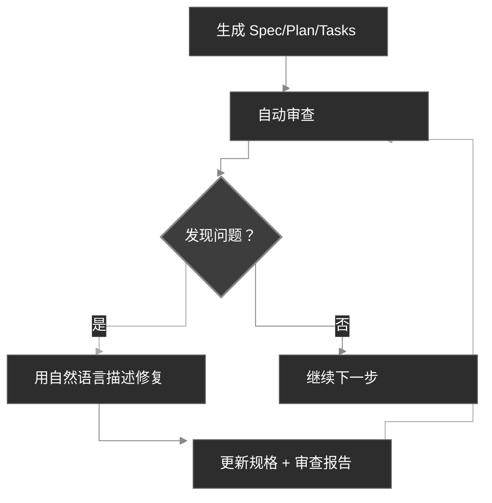

<div align="center">
  <picture>
    <source media="(prefers-color-scheme: dark)" srcset="codexspec-logo-dark.svg">
    <source media="(prefers-color-scheme: light)" srcset="codexspec-logo-light.svg">
    
  </picture>
</div>

# CodexSpec

[English](README.md) | **中文** | [日本語](README.ja.md) | [Español](README.es.md) | [Português](README.pt-BR.md) | [한국어](README.ko.md) | [Deutsch](README.de.md) | [Français](README.fr.md)

[](https://pypi.org/project/codexspec/)
[](https://pypi.org/project/codexspec/)
[](https://opensource.org/licenses/MIT)

**面向 Claude Code 的规格驱动开发 (SDD) 工具包**

CodexSpec 帮助您通过结构化、规格优先的方法构建高质量软件。在决定**如何**构建之前，先定义**构建什么**以及**为什么**构建，而不是直接跳到代码。

[📖 文档](https://zts0hg.github.io/codexspec/zh/) | [Documentation](https://zts0hg.github.io/codexspec/en/) | [日本語ドキュメント](https://zts0hg.github.io/codexspec/ja/) | [한국어 문서](https://zts0hg.github.io/codexspec/ko/) | [Documentación](https://zts0hg.github.io/codexspec/es/) | [Documentation](https://zts0hg.github.io/codexspec/fr/) | [Dokumentation](https://zts0hg.github.io/codexspec/de/) | [Documentação](https://zts0hg.github.io/codexspec/pt-BR/)

---

## 目录

- [为什么选择 CodexSpec](#为什么选择-codexspec)
- [什么是规格驱动开发？](#什么是规格驱动开发)
- [设计理念：人机协同](#设计理念人机协同)
- [30 秒快速开始](#-30-秒快速开始)
- [安装](#安装)
- [核心工作流](#核心工作流)
- [可用命令](#可用命令)
- [与 spec-kit 对比](#与-spec-kit-对比)
- [国际化](#国际化-i18n)
- [贡献与许可证](#贡献)

---

## 为什么选择 CodexSpec？

为什么在 Claude Code 之上使用 CodexSpec？以下是对比：

| 维度 | 只使用 Claude Code | CodexSpec + Claude Code |
|------|-------------------|------------------------|
| **多语言适配** | 默认英文交互，非英语用户体验不佳 | 配置团队语言，交互和审阅更顺畅高效 |
| **可追溯性** | 会话结束后难以追溯历史决策 | `.codexspec/specs/` 保存所有规格、方案、任务 |
| **会话恢复** | plan mode 误操作会话中断，恢复困难 | 多命令拆分 + 持久化文档，随时恢复进度 |
| **团队治理** | 无统一原则约束，风格不统一 | `constitution.md` 定制团队原则，保持质量风格统一 |

---

## 什么是规格驱动开发？

**规格驱动开发 (SDD)** 是一种"规格先行，代码在后"的方法论：

```
传统开发:  想法 → 代码 → 调试 → 重写
SDD:       想法 → 规格 → 计划 → 任务 → 代码
```

**为什么使用 SDD？**

| 问题 | SDD 解决方案 |
|------|-------------|
| AI 误解 | 规格阐明"构建什么"，AI 不再猜测 |
| 需求遗漏 | 交互式澄清发现边界情况 |
| 架构偏离 | 审查检查点确保正确方向 |
| 返工浪费 | 问题在代码编写前被发现 |

<details>
<summary>✨ 核心特性</summary>

### 核心 SDD 工作流

- **宪法驱动开发** - 建立指导所有决策的项目原则
- **两阶段规格说明** - 交互式澄清 (`/specify`) 后生成文档 (`/generate-spec`)
- **自动审查** - 每个产物都包含内置质量检查
- **TDD 就绪任务** - 任务分解强制执行测试优先方法

### 人机协同

- **审查命令** - 针对规格、计划和任务的专用审查命令
- **交互式澄清** - 基于问答的需求细化
- **跨产物分析** - 在实现之前检测不一致性

### 开发者体验

- **原生 Claude Code 集成** - 斜杠命令无缝工作
- **多语言支持** - 通过 LLM 动态翻译支持 13+ 语言
- **跨平台** - 包含 Bash 和 PowerShell 脚本
- **可扩展** - 支持自定义命令的插件架构

</details>

---

## 设计理念：人机协同

CodexSpec 基于**有效的 AI 辅助开发需要在每个阶段都有人类积极参与**这一信念构建。

### 为什么人工监督很重要

| 没有审查 | 有审查 |
|---------|--------|
| AI 做出错误的假设 | 人工早期发现误解 |
| 不完整的需求传播 | 在实现前识别缺口 |
| 架构偏离意图 | 在每个阶段验证一致性 |
| 任务遗漏关键功能 | 系统性验证覆盖度 |
| **结果：返工、浪费精力** | **结果：一次做对** |

### CodexSpec 的方法

CodexSpec 将开发结构化为**可审查的检查点**：

```
想法 → /specify → /generate-spec → /spec-to-plan → /plan-to-tasks → /implement
                         │                  │                │
                    审查规格            审查计划         审查任务
                         │                  │                │
                      ✅ 人工             ✅ 人工           ✅ 人工
```

**每个产物都有对应的审查命令：**

- `spec.md` → `/codexspec:review-spec`
- `plan.md` → `/codexspec:review-plan`
- `tasks.md` → `/codexspec:review-tasks`
- 所有产物 → `/codexspec:analyze`

这种系统的审查流程确保：

- **早期错误检测**：在编写代码之前发现误解
- **一致性验证**：确认 AI 的理解与您的意图一致
- **质量关卡**：在每个阶段验证完整性、清晰性和可行性
- **减少返工**：花几分钟审查，节省数小时的重新实现

---

## 🚀 30 秒快速开始

```bash
# 1. 安装
uv tool install codexspec

# 2. 初始化项目
#    方式 A：创建新项目
codexspec init my-project && cd my-project

#    方式 B：在现有项目中初始化
cd your-existing-project && codexspec init .

# 3. 在 Claude Code 中使用
claude
> /codexspec:constitution 创建专注于代码质量和测试的原则
> /codexspec:specify 我想构建一个待办应用
> /codexspec:generate-spec
> /codexspec:spec-to-plan
> /codexspec:plan-to-tasks
> /codexspec:implement-tasks
```

就是这样！继续阅读完整工作流。

---

## 安装

### 前置要求

- Python 3.11+
- [uv](https://docs.astral.sh/uv/)（推荐）或 pip

### 推荐安装方式

```bash
# 使用 uv（推荐）
uv tool install codexspec

# 或使用 pip
pip install codexspec
```

### 验证安装

```bash
codexspec --version
```

<details>
<summary>📦 其他安装方式</summary>

#### 一次性使用（无需安装）

```bash
# 创建新项目
uvx codexspec init my-project

# 在现有项目中初始化
cd your-existing-project
uvx codexspec init . --ai claude
```

#### 从 GitHub 安装开发版本

```bash
# 使用 uv
uv tool install git+https://github.com/Zts0hg/codexspec.git

# 指定分支或标签
uv tool install git+https://github.com/Zts0hg/codexspec.git@main
uv tool install git+https://github.com/Zts0hg/codexspec.git@v0.5.6
```

</details>

<details>
<summary>🪟 Windows 用户注意事项</summary>

**推荐：使用 PowerShell**

```powershell
# 1. 安装 uv（如果尚未安装）
powershell -c "irm https://astral.sh/uv/install.ps1 | iex"

# 2. 重启 PowerShell，然后安装 codexspec
uv tool install codexspec

# 3. 验证安装
codexspec --version
```

**CMD 故障排除**

如果遇到"拒绝访问"错误：

1. 关闭所有 CMD 窗口并重新打开
2. 或手动刷新 PATH：`set PATH=%PATH%;%USERPROFILE%\.local\bin`
3. 或使用完整路径：`%USERPROFILE%\.local\bin\codexspec.exe --version`

更多详情请参阅 [Windows 故障排除指南](docs/WINDOWS-TROUBLESHOOTING.md)。

</details>

### 升级

```bash
# 使用 uv
uv tool install codexspec --upgrade

# 使用 pip
pip install --upgrade codexspec
```

### 插件市场安装（备选方案）

CodexSpec 也作为 Claude Code 插件提供。如果您只想在 Claude Code 中直接使用 CodexSpec 命令而无需 CLI 工具，此方法非常适合。

#### 安装步骤

```bash
# 在 Claude Code 中，添加插件市场
> /plugin marketplace add Zts0hg/codexspec

# 安装插件
> /plugin install codexspec@codexspec-market
```

#### 插件用户的语言配置

通过插件市场安装后，使用 `/codexspec:config` 命令配置您的首选语言：

```bash
# 启动交互式配置
> /codexspec:config

# 或查看当前配置
> /codexspec:config --view
```

config 命令将引导您完成：

1. 选择输出语言（用于生成的文档）
2. 选择提交信息语言
3. 创建 `.codexspec/config.yml` 文件

**安装方式对比**

| 方式 | 适用场景 | 功能特性 |
|------|----------|----------|
| **CLI 安装** (`uv tool install`) | 完整开发工作流 | CLI 命令（`init`、`check`、`config`）+ 斜杠命令 |
| **插件市场** | 快速开始、现有项目 | 仅斜杠命令（使用 `/codexspec:config` 进行语言设置） |

**注意**：插件使用 `strict: false` 模式，并通过 LLM 动态翻译复用现有的多语言支持。

---

## 核心工作流

CodexSpec 将开发分解为**可审查的检查点**：

```
想法 → /specify → /generate-spec → /spec-to-plan → /plan-to-tasks → /implement
                         │                  │                │
                    审查规格            审查计划         审查任务
                         │                  │                │
                      ✅ 人工             ✅ 人工           ✅ 人工
```

### 工作流步骤

| 步骤 | 命令 | 输出 | 人工检查 |
|------|------|------|---------|
| 1. 项目原则 | `/codexspec:constitution` | `constitution.md` | ✅ |
| 2. 需求澄清 | `/codexspec:specify` | 无（交互式对话） | ✅ |
| 3. 生成规格 | `/codexspec:generate-spec` | `spec.md` + 自动审查 | ✅ |
| 4. 技术规划 | `/codexspec:spec-to-plan` | `plan.md` + 自动审查 | ✅ |
| 5. 任务分解 | `/codexspec:plan-to-tasks` | `tasks.md` + 自动审查 | ✅ |
| 6. 跨产物分析 | `/codexspec:analyze` | 分析报告 | ✅ |
| 7. 实现 | `/codexspec:implement-tasks` | 代码 | - |

### specify vs clarify：何时使用哪个？

| 方面 | `/codexspec:specify` | `/codexspec:clarify` |
|------|----------------------|----------------------|
| **目的** | 初始需求探索 | 细化现有规格 |
| **何时使用** | 没有 spec.md 时 | spec.md 需要改进时 |
| **输出** | 无（仅对话） | 更新 spec.md |
| **方法** | 开放式问答 | 结构化扫描（4 类别） |
| **问题数量** | 无限制 | 每次最多 5 个 |

### 核心概念：迭代质量循环

每个生成命令都包含**自动审查**，生成审查报告。您可以：

1. 查看报告
2. 用自然语言描述要修复的问题
3. 系统自动更新规格和审查报告



<details>
<summary>📖 详细工作流描述</summary>

### 1. 初始化项目

```bash
codexspec init my-awesome-project
cd my-awesome-project
claude
```

### 2. 建立项目原则

```
/codexspec:constitution 创建专注于代码质量、测试标准和整洁架构的原则
```

### 3. 澄清需求

```
/codexspec:specify 我想构建一个任务管理应用
```

此命令将：

- 提出澄清性问题以理解您的想法
- 探索您可能未考虑到的边界情况
- **不会**自动生成文件 - 您保持控制

### 4. 生成规格文档

需求澄清后：

```
/codexspec:generate-spec
```

此命令：

- 将澄清的需求编译为结构化规格
- **自动**运行审查并生成 `review-spec.md`

### 5. 创建技术计划

```
/codexspec:spec-to-plan 使用 Python FastAPI 作为后端，PostgreSQL 作为数据库，React 作为前端
```

包含**合宪性审查** - 验证计划符合项目原则。

### 6. 生成任务

```
/codexspec:plan-to-tasks
```

任务按标准阶段组织：

- **TDD 强制执行**：测试任务先于实现任务
- **并行标记 `[P]`**：识别独立任务
- **文件路径规范**：每个任务有明确的交付物

### 7. 跨产物分析（可选但推荐）

```
/codexspec:analyze
```

检测规格、计划和任务中的问题：

- 覆盖缺口（没有任务的需求）
- 重复和不一致性
- 宪法违规
- 规格不充分的项目

### 8. 实现

```
/codexspec:implement-tasks
```

实现遵循**条件 TDD 工作流**：

- 代码任务：测试优先（红 → 绿 → 验证 → 重构）
- 不可测试任务（文档、配置）：直接实现

</details>

---

## 可用命令

### CLI 命令

| 命令 | 描述 |
|------|------|
| `codexspec init` | 初始化新项目 |
| `codexspec check` | 检查已安装的工具 |
| `codexspec version` | 显示版本信息 |
| `codexspec config` | 查看或修改配置 |

<details>
<summary>📋 init 选项</summary>

| 选项 | 描述 |
|------|------|
| `PROJECT_NAME` | 项目目录名称 |
| `--here`, `-h` | 在当前目录初始化 |
| `--ai`, `-a` | 使用的 AI 助手（默认：claude） |
| `--lang`, `-l` | 输出语言（如：en, zh-CN, ja） |
| `--force`, `-f` | 强制覆盖现有文件 |
| `--no-git` | 跳过 git 初始化 |
| `--debug`, `-d` | 启用调试输出 |

</details>

<details>
<summary>📋 config 选项</summary>

| 选项 | 描述 |
|------|------|
| `--set-lang`, `-l` | 设置输出语言 |
| `--set-commit-lang`, `-c` | 设置提交消息语言 |
| `--list-langs` | 列出所有支持的语言 |

</details>

### 斜杠命令

#### 核心工作流命令

| 命令 | 描述 |
|------|------|
| `/codexspec:constitution` | 创建/更新项目宪法，支持跨产物验证 |
| `/codexspec:specify` | 通过交互式问答澄清需求 |
| `/codexspec:generate-spec` | 生成 `spec.md` 文档 ★ 自动审查 |
| `/codexspec:spec-to-plan` | 将规格转换为技术计划 ★ 自动审查 |
| `/codexspec:plan-to-tasks` | 将计划分解为原子任务 ★ 自动审查 |
| `/codexspec:implement-tasks` | 执行任务（条件 TDD） |

#### 审查命令（质量关卡）

| 命令 | 描述 |
|------|------|
| `/codexspec:review-spec` | 审查规格（自动或手动） |
| `/codexspec:review-plan` | 审查技术计划（自动或手动） |
| `/codexspec:review-tasks` | 审查任务分解（自动或手动） |

#### 增强命令

| 命令 | 描述 |
|------|------|
| `/codexspec:config` | 管理项目配置（创建/查看/修改/重置） |
| `/codexspec:clarify` | 扫描规格中的模糊区域（4 类别，最多 5 个问题） |
| `/codexspec:analyze` | 跨产物一致性分析（只读，基于严重性） |
| `/codexspec:checklist` | 生成需求质量检查清单 |
| `/codexspec:tasks-to-issues` | 将任务转换为 GitHub Issues |

#### Git 工作流命令

| 命令 | 描述 |
|------|------|
| `/codexspec:commit-staged` | 从暂存更改生成提交消息 |
| `/codexspec:pr` | 生成 PR/MR 描述（自动检测平台） |

#### 代码审查命令

| 命令 | 描述 |
|------|------|
| `/codexspec:review-code` | 审查任意语言代码（地道表达、正确性、健壮性、架构） |

---

## 与 spec-kit 对比

CodexSpec 灵感来源于 GitHub 的 spec-kit，但有一些关键差异：

| 特性 | spec-kit | CodexSpec |
|------|----------|-----------|
| 核心理念 | 规格驱动开发 | 规格驱动开发 + 人机协同 |
| CLI 名称 | `specify` | `codexspec` |
| 主要 AI | 多代理支持 | 专注于 Claude Code |
| 宪法系统 | 基础 | 完整宪法，支持跨产物验证 |
| 两阶段规格 | 否 | 是（澄清 + 生成） |
| 审查命令 | 可选 | 3 个专用审查命令，带评分 |
| Clarify 命令 | 是 | 4 个聚焦类别，与审查集成 |
| Analyze 命令 | 是 | 只读、基于严重性、感知宪法 |
| 任务中的 TDD | 可选 | 强制执行（测试先于实现） |
| 实现 | 标准 | 条件 TDD（代码 vs 文档/配置） |
| 扩展系统 | 是 | 是 |
| PowerShell 脚本 | 是 | 是 |
| i18n 支持 | 否 | 是（通过 LLM 翻译支持 13+ 语言） |

### 关键差异

1. **审查优先文化**：每个主要产物都有专用审查命令
2. **宪法治理**：原则经过验证，而不仅仅是记录
3. **默认 TDD**：任务生成中强制执行测试优先方法
4. **人工检查点**：工作流围绕验证关卡设计

---

## 国际化 (i18n)

CodexSpec 通过 **LLM 动态翻译**支持多种语言。无需维护翻译模板 - Claude 根据您的语言配置在运行时翻译内容。

### 设置语言

**初始化时：**

```bash
# 创建中文输出的项目
codexspec init my-project --lang zh-CN

# 创建日语输出的项目
codexspec init my-project --lang ja
```

**初始化后：**

```bash
# 查看当前配置
codexspec config

# 更改语言设置
codexspec config --set-lang zh-CN

# 设置提交消息语言
codexspec config --set-commit-lang en
```

### 支持的语言

| 代码 | 语言 |
|------|------|
| `en` | English（默认） |
| `zh-CN` | 简体中文 |
| `zh-TW` | 繁體中文 |
| `ja` | 日本語 |
| `ko` | 한국어 |
| `es` | Español |
| `fr` | Français |
| `de` | Deutsch |
| `pt-BR` | Português |
| `ru` | Русский |
| `it` | Italiano |
| `ar` | العربية |
| `hi` | हिन्दी |

<details>
<summary>⚙️ 配置文件示例</summary>

`.codexspec/config.yml`：

```yaml
version: "1.0"

language:
  output: "zh-CN"        # 输出语言
  commit: "zh-CN"        # 提交消息语言（默认为输出语言）
  templates: "en"        # 保持 "en"

project:
  ai: "claude"
  created: "2025-02-15"
```

</details>

---

## 项目结构

初始化后的项目结构：

```
my-project/
├── .codexspec/
│   ├── memory/
│   │   └── constitution.md    # 项目宪法
│   ├── specs/
│   │   └── {feature-id}/
│   │       ├── spec.md        # 功能规格
│   │       ├── plan.md        # 技术计划
│   │       ├── tasks.md       # 任务分解
│   │       └── checklists/    # 质量检查清单
│   ├── templates/             # 自定义模板
│   ├── scripts/               # 辅助脚本
│   └── extensions/            # 自定义扩展
├── .claude/
│   └── commands/              # Claude Code 斜杠命令
└── CLAUDE.md                  # Claude Code 上下文
```

---

## 扩展系统

CodexSpec 支持用于自定义命令的插件架构：

```
my-extension/
├── extension.yml          # 扩展清单
├── commands/              # 自定义斜杠命令
│   └── command.md
└── README.md
```

详见 `extensions/EXTENSION-DEVELOPMENT-GUIDE.md`。

---

## 开发

### 前置要求

- Python 3.11+
- uv 包管理器
- Git

### 本地开发

```bash
# 克隆仓库
git clone https://github.com/Zts0hg/codexspec.git
cd codexspec

# 安装开发依赖
uv sync --dev

# 本地运行
uv run codexspec --help

# 运行测试
uv run pytest

# 代码检查
uv run ruff check src/

# 构建包
uv build
```

---

## 贡献

欢迎贡献！请在提交 pull request 前阅读贡献指南。

## 许可证

MIT 许可证 - 详见 [LICENSE](LICENSE)。

## 致谢

- 灵感来源于 [GitHub spec-kit](https://github.com/github/spec-kit)
- 为 [Claude Code](https://claude.ai/code) 构建
