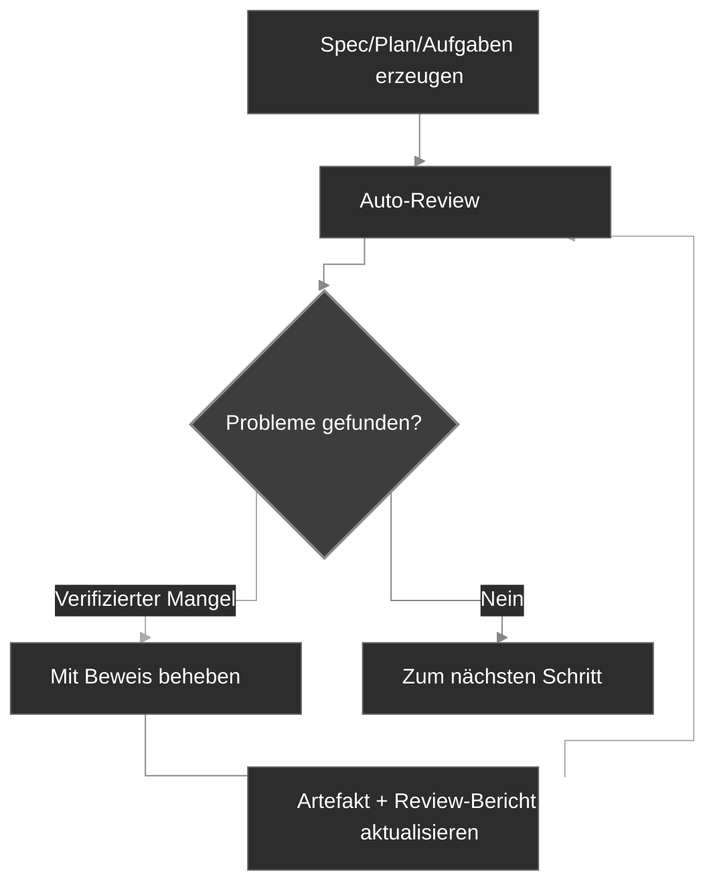

# Workflow

CodexSpec gliedert die Entwicklung in überprüfbare Checkpoints, wobei die bestätigte Absicht des Nutzers über Sessions hinweg erhalten bleibt. Er basiert auf **Requirements-First SDD**: bestätigte Anforderungen stehen zuerst, und nichts ist verbindlich, bis Sie es ausdrücklich bestätigen. Sie definieren und bestätigen *was* gebaut wird und *warum*, bevor Sie entscheiden *wie*.

## Workflow-Überblick

Auf konzeptioneller Ebene ersetzt Requirements-First SDD die traditionelle „Idee → Code → Debuggen → Neuschreiben"-Schleife durch eine explizite Kette bestätigter Artefakte:

```text
Traditionell:  Idee → Code → Debuggen → Neuschreiben
SDD:           Idee → Bestätigte Anforderungen → Spec → Plan → Aufgaben → Code
```

In CodexSpec wird diese Kette zu einer Folge von Slash-Befehls-Checkpoints, von denen jeder ein persistentes Artefakt mit einem Review-Marker erzeugt:

```text
Idee → /specify → requirements.md → /generate-spec → spec.md → /spec-to-plan → plan.md → /plan-to-tasks → tasks.md → /implement
                                                   │                         │                            │
                                              Spec reviewen              Plan reviewen               Aufgaben reviewen
```

`requirements.md` persistiert das Ergebnis der Anforderungsdiskussionen. Es erfasst bestätigte Bedürfnisse, Einschränkungen, Entscheidungen, Ausschlüsse, offene Fragen, Nutzer-Belege und ein Bestätigungs-Log.

## Workflow-Schritte

| Schritt                          | Befehl                      | Ausgabe                       | Menschen-Prüfung |
| -------------------------------- | --------------------------- | ----------------------------- | ---------------- |
| 1. Projektprinzipien             | `/codexspec:constitution`   | `constitution.md`             | Ja               |
| 2. Anforderungs-Klärung          | `/codexspec:specify`        | `requirements.md`             | Ja               |
| 3. Spec erzeugen                 | `/codexspec:generate-spec`  | `spec.md` + Auto-Review       | Ja               |
| 4. Technische Planung            | `/codexspec:spec-to-plan`   | `plan.md` + Auto-Review       | Ja               |
| 5. Aufgaben-Aufteilung           | `/codexspec:plan-to-tasks`  | `tasks.md` + Auto-Review      | Ja               |
| 6. Artefaktübergreifende Analyse | `/codexspec:analyze`        | Analyse-Bericht               | Ja               |
| 7. Implementierung               | `/codexspec:implement-tasks`| Code                          | –                |

Geben Sie ein explizites Feature-Verzeichnis oder einen Artefaktpfad an, wenn mehr als ein Feature existiert. Befehle wählen niemals implizit das neueste Verzeichnis.

## Confirmation Gate

**Anforderungen, Specs, Pläne und Aufgaben werden erst nach ausdrücklicher menschlicher Bestätigung verbindlich.** CodexSpec befördert nie stillschweigend einen Entwurf zum autorisierenden Artefakt – an jedem Checkpoint wird der Nutzer zur Bestätigung aufgefordert, bevor Downstream-Befehle es als Quelle der Wahrheit behandeln dürfen.

### Autorität und Nachvollziehbarkeit

Bei Konflikten zwischen Quellen verwenden die Befehle diese Reihenfolge:

1. Bestätigte Einträge in `requirements.md`
2. `spec.md`
3. Anwendbare Verfassungs-Regeln und Repository-Fakten
4. `plan.md`
5. `tasks.md`
6. Allgemeine Best Practices

Spätere Artefakte können frühere nicht stillschweigend umdefinieren. Anforderungen verwenden stabile IDs, Spezifikations-Items zitieren `Sources`, Pläne und Aufgaben zitieren `Covers`, und ungelöste Konflikte stoppen die Generierung zur Nutzerbestätigung. Mit anderen Worten: **bestätigte Anforderungen sind die höchstrangige Autorität**.

Bestehende Feature-Verzeichnisse, die nur `spec.md` enthalten, bleiben unterstützt. Befehle weisen explizit darauf hin, dass Traceability zur ursprünglichen Diskussion nicht verfügbar ist.

## Schlüsselkonzept: Iterative Qualitätsschleife

Jeder Generierungsbefehl enthält ein **automatisches Review**. Verifizierte Mängel dürfen behoben und für höchstens zwei Runden erneut geprüft werden; empfehlende Hinweise bleiben getrennt und lösen nie automatische Änderungen aus.

1. Review-Bericht lesen.
2. Zu behebende Probleme in natürlicher Sprache beschreiben.
3. Das System aktualisiert automatisch Specs und Review-Berichte.



## Review-Modell

Reviews trennen drei Arten von Aussagen:

- **Fidelity-Mängel**: Konflikt mit einer autorisierenden Quelle oder fehlende geforderte Abdeckung.
- **Intrinsische Mängel**: das Artefakt ist intern widersprüchlich, nicht überprüfbar oder nicht durchführbar.
- **Risiko-Hinweise / Design-Möglichkeiten**: optionale Verbesserungen ohne Beweis für einen aktuellen Mangel.

Jeder Mangel muss seine Beweise, Position, Abweichung, Auswirkung und minimale Behebung identifizieren. Befunde mit derselben Ursache werden zusammengeführt. Hinweise beeinflussen Status, Score oder automatische Fixes nicht.

Der Review-Status ist:

- `PASS`: keine kritischen, Warn- oder Minor-Mängel.
- `PASS_WITH_WARNINGS`: nur Minor-Mängel verbleiben.
- `NEEDS_REVISION`: eine oder mehrere Warnungen verbleiben.
- `BLOCKED`: ein kritischer Konflikt verhindert zuverlässiges Fortfahren.

Der Kompatibilitäts-Score wird aus denselben klassifizierten Befunden abgeleitet statt aus festen Vorlagen-Abschnitten. Der Status ist autorisierend; der Score existiert für Integrationen, die noch eine Zahl erwarten.

## Begrenztes Auto-Review

Generierungsbefehle führen das passende Review automatisch aus. Das ist die **evidenzbasierte Review**-Disziplin in Aktion: Sie dürfen nur evidenzbasierte Mängel reparieren und für höchstens zwei Runden erneut prüfen. Sie stoppen früher bei `PASS` und stoppen für Nutzereingabe, wenn:

- eine autorisierende Quelle mit einer anderen Quelle konfligiert;
- ein Fix bestätigte Absicht ändern würde;
- das verbleibende Element eher ein Hinweis als ein Mangel ist;
- zwei Reparatur-Runden aufgebraucht sind.

Manuelle `/codexspec:review-*`-Befehle können jederzeit für einen frischen Bericht ausgeführt werden.

## specify vs clarify

| Aspekt | `/codexspec:specify` | `/codexspec:clarify` |
|--------|----------------------|----------------------|
| Zweck | Ursprüngliche Absicht etablieren und bestätigen | Lücken oder Mehrdeutigkeiten auflösen |
| Haupt-Artefakt | `requirements.md` | `requirements.md` |
| Spec-Behandlung | Später erzeugt | Nach bestätigten Änderungen synchronisiert |
| Offene Fragen | Ohne Beförderung erfasst | Nur nach Nutzerbestätigung aktualisiert |

## Conditional TDD

CodexSpec verwendet **Conditional TDD**: test-first-Reihenfolge wird nur angewendet, wo Plan, Verfassung oder Implementierungsrisiko es erfordern. Dokumentations- und Konfigurationsarbeiten können direkt implementiert werden. Jede Aufgabe sollte ein überprüfbares Ergebnis liefern; sie muss nicht zwingend nur eine Datei berühren.

Bei Aufgaben mit test-first-Reihenfolge folgt die Implementierung der Red → Green → Verify → Refactor-Schleife:

- **Code-Aufgaben**: Test-first – einen fehlschlagenden Test schreiben (Red), ihn zum Laufen bringen (Green), das Verhalten verifizieren (Verify), dann die Implementierung verfeinern, ohne das Verhalten zu ändern (Refactor).
- **Nicht-testbare Aufgaben** (Doku, Konfiguration): direkte Implementierung, wobei das Ergebnis gegen das angegebene Aufgaben-Ergebnis statt gegen einen Unit-Test verifiziert wird.
