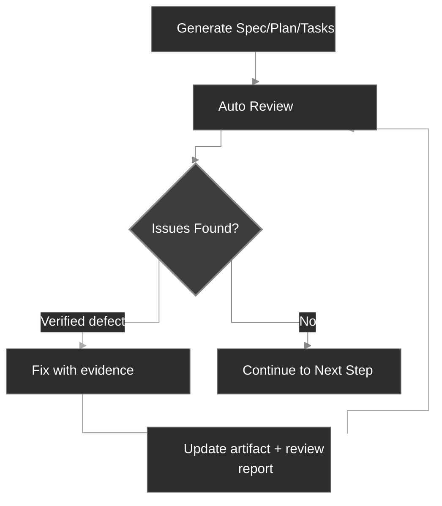

# Workflow

CodexSpec structures development into reviewable checkpoints while preserving the user's confirmed intent across sessions. It is built on **Requirements-First SDD**: confirmed requirements come first, and nothing is binding until you explicitly confirm it. You define and confirm *what* to build and *why* before deciding *how*.

## Workflow Overview

At the conceptual level, Requirements-First SDD replaces the traditional "Idea → Code → Debug → Rewrite" loop with an explicit chain of confirmed artifacts:

```text
Traditional:  Idea → Code → Debug → Rewrite
SDD:          Idea → Confirmed Requirements → Spec → Plan → Tasks → Code
```

In CodexSpec, that chain becomes a sequence of slash-command checkpoints, each producing a persisted artifact with a review marker:

```text
Idea → /specify → requirements.md → /generate-spec → spec.md → /spec-to-plan → plan.md → /plan-to-tasks → tasks.md → /implement
                                                   │                         │                            │
                                              Review spec               Review plan                  Review tasks
```

`requirements.md` persists the result of requirement discussions. It records confirmed needs, constraints, decisions, exclusions, open questions, user evidence, and a confirmation log.

## Workflow Steps

| Step                         | Command                      | Output                      | Human Check |
| ---------------------------- | ---------------------------- | --------------------------- | ----------- |
| 1. Project Principles        | `/codexspec:constitution`    | `constitution.md`           | Yes         |
| 2. Requirement Clarification | `/codexspec:specify`         | `requirements.md`           | Yes         |
| 3. Generate Spec             | `/codexspec:generate-spec`   | `spec.md` + auto-review     | Yes         |
| 4. Technical Planning        | `/codexspec:spec-to-plan`    | `plan.md` + auto-review     | Yes         |
| 5. Task Breakdown            | `/codexspec:plan-to-tasks`   | `tasks.md` + auto-review    | Yes         |
| 6. Cross-Artifact Analysis   | `/codexspec:analyze`         | Analysis report             | Yes         |
| 7. Implementation            | `/codexspec:implement-tasks` | Code                        | -           |

Pass an explicit feature directory or artifact path when more than one feature exists. Commands never choose the newest directory implicitly.

## Confirmation Gate

**Requirements, specs, plans, and tasks become binding only after explicit human confirmation.** CodexSpec never silently promotes a draft to an authoritative artifact — at every checkpoint the user is asked to confirm before downstream commands may treat it as the source of truth.

### Authority And Traceability

When sources conflict, commands use this order:

1. Confirmed entries in `requirements.md`
2. `spec.md`
3. Applicable constitution rules and repository facts
4. `plan.md`
5. `tasks.md`
6. General best practices

Later artifacts cannot silently redefine earlier ones. Requirements use stable IDs, specification items cite `Sources`, plans and tasks cite `Covers`, and unresolved conflicts stop generation for user confirmation. In other words, **confirmed requirements are the highest-priority authority**.

Legacy feature directories containing only `spec.md` remain supported. Commands explicitly report that traceability to the original discussion is unavailable.

## Key Concept: Iterative Quality Loop

Every generation command includes **automatic review**. Verified defects may be fixed and re-reviewed for at most two rounds; advisory suggestions remain separate and never trigger automatic changes.

1. Review the report.
2. Describe issues to fix in natural language.
3. The system automatically updates specs and review reports.



## Review Model

Reviews separate three kinds of output:

- **Fidelity defects**: conflict with an authoritative source or omit required coverage.
- **Intrinsic defects**: the artifact is internally contradictory, unverifiable, or infeasible.
- **Risk advisories / design opportunities**: optional improvements without evidence of a current defect.

Every defect must identify its evidence, location, mismatch, impact, and minimal remediation. Findings with the same root cause are merged. Advisories do not affect status, score, or automatic fixes.

Review status is:

- `PASS`: no critical, warning, or minor defects.
- `PASS_WITH_WARNINGS`: only minor defects remain.
- `NEEDS_REVISION`: one or more warnings remain.
- `BLOCKED`: a critical conflict prevents reliable continuation.

The compatibility score is derived from the same classified findings rather than fixed template-section deductions. Status is authoritative; the score exists for integrations that still expect a number.

## Bounded Auto Review

Generation commands run the matching review automatically. This is the **evidence-based review** discipline in action: they may repair only evidence-backed defects and re-review for at most two rounds. They stop earlier on `PASS`, and stop for user input when:

- an authoritative source conflicts with another source;
- a fix would change confirmed intent;
- the remaining item is advisory rather than defective;
- two repair rounds have been used.

Manual `/codexspec:review-*` commands can be run at any time for a fresh report.

## specify vs clarify

| Aspect | `/codexspec:specify` | `/codexspec:clarify` |
|--------|----------------------|----------------------|
| Purpose | Establish and confirm initial intent | Resolve gaps or ambiguities |
| Primary artifact | `requirements.md` | `requirements.md` |
| Spec handling | Generated later | Synchronized after confirmed changes |
| Open questions | Recorded without promotion | Updated only after user confirmation |

## Conditional TDD

CodexSpec uses **conditional TDD**: test-first ordering is applied only where the plan, constitution, or implementation risk requires it. Documentation and configuration work may be implemented directly. Each task should produce one verifiable outcome; it is not required to touch only one file.

For tasks where test-first ordering applies, implementation follows the Red → Green → Verify → Refactor loop:

- **Code tasks**: Test-first — write a failing test (Red), make it pass (Green), verify behavior (Verify), then refine the implementation without changing behavior (Refactor).
- **Non-testable tasks** (docs, config): Direct implementation, with the result verified against the task's stated outcome rather than a unit test.
