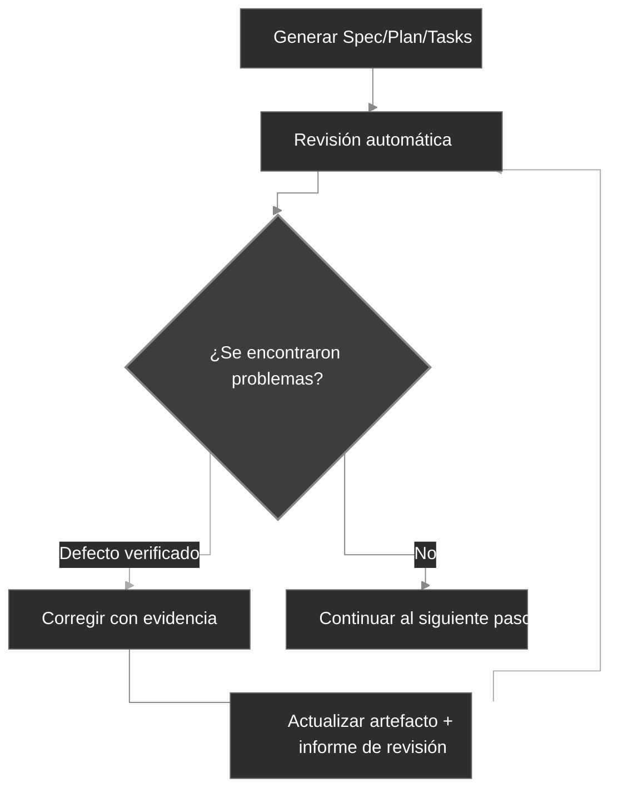

# Flujo de trabajo

CodexSpec estructura el desarrollo en puntos de control revisables y, al mismo tiempo, preserva la intención confirmada del usuario entre sesiones. Se basa en **Requirements-First SDD**: primero los requisitos confirmados, y nada es vinculante hasta que tú lo confirmes de forma explícita. Defines y confirmas *qué* construir y *por qué* antes de decidir *cómo*.

## Visión general del flujo de trabajo

A nivel conceptual, Requirements-First SDD sustituye el bucle tradicional "Idea → Código → Depurar → Reescribir" por una cadena explícita de artefactos confirmados:

```text
Tradicional:   Idea → Código → Depurar → Reescribir
SDD:           Idea → Requisitos Confirmados → Especificación → Plan → Tareas → Código
```

En CodexSpec, esa cadena se convierte en una secuencia de puntos de control mediante slash commands, cada uno de los cuales produce un artefacto persistente con un marcador de revisión:

```text
Idea → /specify → requirements.md → /generate-spec → spec.md → /spec-to-plan → plan.md → /plan-to-tasks → tasks.md → /implement
                                                   │                         │                            │
                                         Revisar especificación        Revisar plan                Revisar tareas
```

`requirements.md` persiste el resultado de las discusiones de requisitos. Registra necesidades, restricciones, decisiones, exclusiones, preguntas abiertas, evidencia del usuario y un registro de confirmación.

## Pasos del flujo de trabajo

| Paso                              | Comando                      | Salida                       | Verificación humana |
| --------------------------------- | ---------------------------- | ---------------------------- | ------------------- |
| 1. Principios del proyecto        | `/codexspec:constitution`    | `constitution.md`            | Sí                  |
| 2. Clarificación de requisitos    | `/codexspec:specify`         | `requirements.md`            | Sí                  |
| 3. Generar especificación         | `/codexspec:generate-spec`   | `spec.md` + revisión auto    | Sí                  |
| 4. Planificación técnica          | `/codexspec:spec-to-plan`    | `plan.md` + revisión auto    | Sí                  |
| 5. Desglose de tareas             | `/codexspec:plan-to-tasks`   | `tasks.md` + revisión auto   | Sí                  |
| 6. Análisis entre artefactos      | `/codexspec:analyze`         | Informe de análisis          | Sí                  |
| 7. Implementación                 | `/codexspec:implement-tasks` | Código                       | -                   |

Pasa un directorio de funcionalidad o una ruta de artefacto explícitos cuando exista más de una funcionalidad. Los comandos nunca eligen implícitamente el directorio más reciente.

## Confirmation Gate

**Los requisitos, especificaciones, planes y tareas se vuelven vinculantes únicamente tras una confirmación humana explícita.** CodexSpec nunca promueve en silencio un borrador a artefacto autoritativo: en cada punto de control se pide al usuario que confirme antes de que los comandos posteriores puedan tratarlo como fuente de verdad.

### Autoridad y trazabilidad

Cuando las fuentes entran en conflicto, los comandos usan este orden:

1. Entradas confirmadas en `requirements.md`
2. `spec.md`
3. Reglas de constitución aplicables y hechos del repositorio
4. `plan.md`
5. `tasks.md`
6. Buenas prácticas generales

Los artefactos posteriores no pueden redefinir silenciosamente los anteriores. Los requisitos usan IDs estables, los ítems de especificación citan `Sources`, los planes y tareas citan `Covers`, y los conflictos no resueltos detienen la generación hasta que el usuario confirma. En otras palabras, **los requisitos confirmados son la autoridad de máxima prioridad**.

Los directorios de funcionalidad heredados que solo contienen `spec.md` siguen siendo compatibles. Los comandos informan explícitamente de que la trazabilidad hacia la discusión original no está disponible.

## Concepto clave: bucle iterativo de calidad

Cada comando de generación incluye **revisión automática**. Los defectos verificados pueden corregirse y volverse a revisar como máximo dos rondas; las sugerencias consultivas se mantienen separadas y nunca disparan cambios automáticos.

1. Revisa el informe.
2. Describe en lenguaje natural los problemas a corregir.
3. El sistema actualiza automáticamente especificaciones e informes de revisión.



## Modelo de revisión

Las revisiones separan tres tipos de salida:

- **Defectos de fidelidad**: conflicto con una fuente autoritativa u omisión de cobertura requerida.
- **Defectos intrínsecos**: el artefacto es internamente contradictorio, no verificable o inviable.
- **Advertencias de riesgo / oportunidades de diseño**: mejoras opcionales sin evidencia de un defecto actual.

Cada defecto debe identificar su evidencia, ubicación, desajuste, impacto y remediación mínima. Los hallazgos con la misma causa raíz se fusionan. Las advertencias no afectan al estado, a la puntuación ni a las correcciones automáticas.

El estado de revisión es:

- `PASS`: no hay defectos críticos, advertencias ni menores.
- `PASS_WITH_WARNINGS`: solo quedan defectos menores.
- `NEEDS_REVISION`: queda una o más advertencias.
- `BLOCKED`: un conflicto crítico impide continuar de forma fiable.

La puntuación de compatibilidad se deriva de los mismos hallazgos clasificados, en lugar de deducciones fijas por sección de plantilla. El estado es autoritativo; la puntuación existe para integraciones que aún esperan un número.

## Revisión automática acotada

Los comandos de generación ejecutan automáticamente la revisión correspondiente. Esta es la disciplina de **revisión basada en evidencia** en acción: solo pueden reparar defectos respaldados por evidencia y volverse a revisar como máximo dos rondas. Se detienen antes si llega `PASS`, y se detienen para pedir entrada del usuario cuando:

- una fuente autoritativa entra en conflicto con otra fuente;
- una corrección cambiaría la intención confirmada;
- el ítem restante es consultivo y no un defecto;
- ya se han consumido dos rondas de reparación.

Los comandos manuales `/codexspec:review-*` pueden ejecutarse en cualquier momento para obtener un informe nuevo.

## specify frente a clarify

| Aspecto | `/codexspec:specify` | `/codexspec:clarify` |
|--------|----------------------|----------------------|
| Propósito | Establecer y confirmar la intención inicial | Resolver huecos o ambigüedades |
| Artefacto principal | `requirements.md` | `requirements.md` |
| Gestión de la especificación | Se genera más tarde | Se sincroniza tras cambios confirmados |
| Preguntas abiertas | Registradas sin promoción | Se actualizan solo tras confirmación del usuario |

## Conditional TDD

CodexSpec usa **conditional TDD**: el orden test-first se aplica únicamente donde el plan, la constitución o el riesgo de implementación lo exigen. El trabajo de documentación y configuración puede implementarse directamente. Cada tarea debe producir un resultado verificable; no se exige que toque un único archivo.

Para las tareas en las que aplica el orden test-first, la implementación sigue el bucle Red → Green → Verify → Refactor:

- **Tareas de código**: test-first: escribe una prueba que falle (Red), hazla pasar (Green), verifica el comportamiento (Verify) y luego refina la implementación sin cambiar el comportamiento (Refactor).
- **Tareas no testeables** (docs, configuración): implementación directa, con el resultado verificado frente al resultado declarado de la tarea en lugar de mediante una prueba unitaria.
