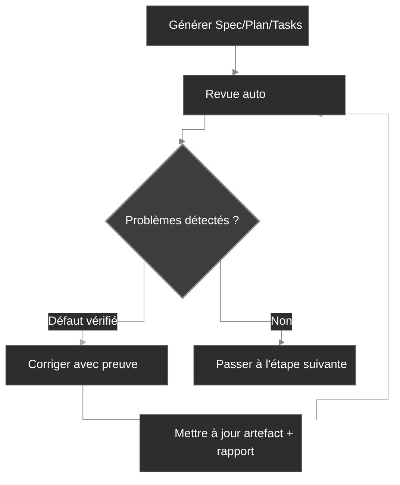

# Flux de travail

CodexSpec structure le développement en points de contrôle consultables tout en préservant l'intention confirmée par l'utilisateur entre les sessions. Il repose sur le **Requirements-First SDD** : les exigences confirmées passent en premier, et rien n'est définitif tant que vous ne l'avez pas explicitement confirmé. Vous définissez et confirmez le *quoi* à construire et le *pourquoi* avant de décider du *comment*.

## Vue d'ensemble du flux de travail

Au niveau conceptuel, Requirements-First SDD remplace la boucle traditionnelle « Idée → Code → Débogage → Réécriture » par une chaîne explicite d'artefacts confirmés :

```text
Traditionnel :  Idée → Code → Débogage → Réécriture
SDD :           Idée → Exigences confirmées → Spec → Plan → Tâches → Code
```

Dans CodexSpec, cette chaîne devient une séquence de points de contrôle sous forme de slash commands, chacun produisant un artefact persistant avec un marqueur de revue :

```text
Idée → /specify → requirements.md → /generate-spec → spec.md → /spec-to-plan → plan.md → /plan-to-tasks → tasks.md → /implement
                                                   │                         │                            │
                                              Revue spec                 Revue plan                   Revue tasks
```

`requirements.md` persiste le résultat des discussions sur les exigences. Il enregistre les besoins, contraintes, décisions, exclusions, questions ouvertes, preuves fournies par l'utilisateur et un journal de confirmation.

## Étapes du flux de travail

| Étape                          | Commande                     | Sortie                      | Contrôle humain |
| ------------------------------ | ---------------------------- | --------------------------- | --------------- |
| 1. Principes du projet         | `/codexspec:constitution`    | `constitution.md`           | Oui             |
| 2. Clarification des exigences | `/codexspec:specify`         | `requirements.md`           | Oui             |
| 3. Génération de la spec       | `/codexspec:generate-spec`   | `spec.md` + revue auto      | Oui             |
| 4. Planification technique     | `/codexspec:spec-to-plan`    | `plan.md` + revue auto      | Oui             |
| 5. Décomposition en tâches     | `/codexspec:plan-to-tasks`   | `tasks.md` + revue auto     | Oui             |
| 6. Analyse inter-artefacts     | `/codexspec:analyze`         | Rapport d'analyse           | Oui             |
| 7. Implémentation              | `/codexspec:implement-tasks` | Code                        | -               |

Passez un répertoire de fonctionnalité explicite ou un chemin d'artefact lorsqu'il existe plusieurs fonctionnalités. Les commandes ne choisissent jamais implicitement le répertoire le plus récent.

## Confirmation Gate

**Les exigences, spécifications, plans et tâches ne deviennent définitifs qu'après confirmation humaine explicite.** CodexSpec ne promeut jamais silencieusement un brouillon en artefact faisant autorité — à chaque point de contrôle, l'utilisateur est invité à confirmer avant que les commandes en aval puissent le traiter comme source de vérité.

### Autorité et traçabilité

En cas de conflit entre sources, les commandes utilisent cet ordre :

1. Les entrées confirmées dans `requirements.md`
2. `spec.md`
3. Les règles de constitution applicables et les faits du dépôt
4. `plan.md`
5. `tasks.md`
6. Les bonnes pratiques générales

Les artefacts en aval ne peuvent pas redéfinir silencieusement ceux en amont. Les exigences utilisent des identifiants stables, les éléments de spécification citent leurs `Sources`, les plans et tâches citent les `Covers`, et les conflits non résolus arrêtent la génération dans l'attente d'une confirmation utilisateur. Autrement dit, **les exigences confirmées sont l'autorité de priorité la plus haute**.

Les répertoires de fonctionnalité hérités ne contenant que `spec.md` restent pris en charge. Les commandes signalent explicitement que la traçabilité vers la discussion initiale est indisponible.

## Concept clé : la boucle de qualité itérative

Chaque commande de génération inclut une **revue automatique**. Les défauts vérifiés peuvent être corrigés puis soumis à une nouvelle revue pendant deux tours au maximum ; les suggestions consultatives restent séparées et ne déclenchent jamais de modifications automatiques.

1. Consultez le rapport.
2. Décrivez en langage naturel les problèmes à corriger.
3. Le système met à jour automatiquement les spécifications et les rapports de revue.



## Modèle de revue

Les revues séparent trois types de sorties :

- **Défauts de fidélité** : conflit avec une source faisant autorité ou couverture obligatoire manquante.
- **Défauts intrinsèques** : l'artefact est contradictoire en lui-même, invérifiable ou irréalisable.
- **Avis de risque / opportunités de conception** : améliorations facultatives sans preuve d'un défaut actuel.

Chaque défaut doit identifier sa preuve, son emplacement, la non-concordance, son impact et la remédiation minimale. Les constats partageant la même cause racine sont fusionnés. Les avis n'affectent ni le statut, ni le score, ni les corrections automatiques.

Le statut de revue est :

- `PASS` : aucun défaut critique, avertissement ou mineur.
- `PASS_WITH_WARNINGS` : seuls des défauts mineurs subsistent.
- `NEEDS_REVISION` : un ou plusieurs avertissements subsistent.
- `BLOCKED` : un conflit critique empêche toute poursuite fiable.

Le score de compatibilité est dérivé des mêmes constats classés plutôt que de déductions fixes par section de template. Le statut fait autorité ; le score n'existe que pour les intégrations qui attendent encore un nombre.

## Revue auto bornée

Les commandes de génération lancent automatiquement la revue correspondante. C'est la discipline de **revue fondée sur des preuves** en action : elles ne peuvent réparer que les défauts étayés par des preuves et reprendre la revue pendant deux tours au maximum. Elles s'arrêtent plus tôt sur `PASS`, et s'interrompent pour une entrée utilisateur lorsque :

- une source faisant autorité entre en conflit avec une autre source ;
- une correction modifierait une intention confirmée ;
- l'élément restant est consultatif plutôt qu'un défaut ;
- deux tours de réparation ont déjà été utilisés.

Les commandes manuelles `/codexspec:review-*` peuvent être lancées à tout moment pour obtenir un rapport neuf.

## specify vs clarify

| Aspect | `/codexspec:specify` | `/codexspec:clarify` |
|--------|----------------------|----------------------|
| Objectif | Établir et confirmer l'intention initiale | Résoudre des lacunes ou ambiguïtés |
| Artefact principal | `requirements.md` | `requirements.md` |
| Gestion de la spec | Générée plus tard | Synchronisée après les modifications confirmées |
| Questions ouvertes | Enregistrées sans promotion | Mises à jour uniquement après confirmation utilisateur |

## TDD conditionnel

CodexSpec utilise le **TDD conditionnel** : l'ordonnancement test-first est appliqué uniquement lorsque le plan, la constitution ou le risque d'implémentation l'exige. Le travail de documentation et de configuration peut être implémenté directement. Chaque tâche doit produire un résultat vérifiable ; il n'est pas requis qu'elle ne touche qu'un seul fichier.

Pour les tâches où l'ordonnancement test-first s'applique, l'implémentation suit la boucle Red → Green → Verify → Refactor :

- **Tâches de code** : Test-first — écrire un test qui échoue (Red), le faire passer (Green), vérifier le comportement (Verify), puis raffiner l'implémentation sans changer le comportement (Refactor).
- **Tâches non testables** (doc, config) : implémentation directe, le résultat étant vérifié par rapport à l'outcome déclaré de la tâche plutôt que par un test unitaire.
