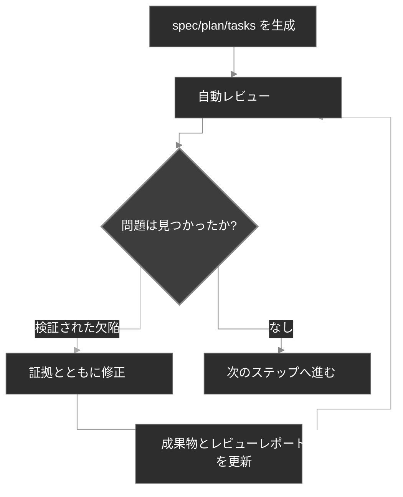

# ワークフロー

CodexSpec は開発をレビュー可能なチェックポイントに構造化しつつ、ユーザーが確認した意図をセッションをまたいで保持します。基盤は **Requirements-First SDD** です。確認された要件が先に来て、あなたが明示的に確認するまでは何も確定しません。*何を*・*なぜ*作るかを先に定義・確認し、それから*どうやって*作るかを決めます。

## ワークフローの概要

概念レベルでは、Requirements-First SDD は従来の「アイデア → コード → デバッグ → 書き直し」というループを、確認された成果物の明示的な連鎖で置き換えます。

```text
Traditional:  Idea → Code → Debug → Rewrite
SDD:          Idea → Confirmed Requirements → Spec → Plan → Tasks → Code
```

CodexSpec では、この連鎖がスラッシュコマンドのチェックポイントの連なりになります。各チェックポイントはレビューマーカー付きの永続化された成果物を生成します。

```text
Idea → /specify → requirements.md → /generate-spec → spec.md → /spec-to-plan → plan.md → /plan-to-tasks → tasks.md → /implement
                                                   │                         │                            │
                                              Review spec               Review plan                  Review tasks
```

`requirements.md` は要件議論の結果を永続化します。確認された必要事項・制約・意思決定・対象外事項・未解決の質問・ユーザーエビデンス・確認ログを記録します。

## ワークフローの各ステップ

| ステップ                         | コマンド                      | 出力                      | 人間の確認 |
| ---------------------------- | ---------------------------- | --------------------------- | ----------- |
| 1. プロジェクト原則        | `/codexspec:constitution`    | `constitution.md`           | あり         |
| 2. 要件の明確化 | `/codexspec:specify`         | `requirements.md`           | あり         |
| 3. spec の生成             | `/codexspec:generate-spec`   | `spec.md` + 自動レビュー     | あり         |
| 4. 技術計画        | `/codexspec:spec-to-plan`    | `plan.md` + 自動レビュー     | あり         |
| 5. タスク分割            | `/codexspec:plan-to-tasks`   | `tasks.md` + 自動レビュー    | あり         |
| 6. 成果物間の分析   | `/codexspec:analyze`         | 分析レポート             | あり         |
| 7. 実装            | `/codexspec:implement-tasks` | コード                        | -           |

機能が複数ある場合は、機能ディレクトリや成果物のパスを明示的に渡してください。コマンドが最新のディレクトリを暗黙に選ぶことはありません。

## Confirmation Gate (確認ゲート)

**要件・spec・plan・task は、人間による明示的な確認の後にのみ確定されます。** CodexSpec はドラフトを権威ある成果物に暗黙に昇格させることはありません。どのチェックポイントでも、ユーザーに確認を求めてからでないと、下流のコマンドはそれを真実のソースとして扱えません。

### 権威とトレーサビリティ

ソースが競合する場合、コマンドは次の優先順位を使います。

1. `requirements.md` の確認済みエントリ
2. `spec.md`
3. 該当する憲法のルールとリポジトリの事実
4. `plan.md`
5. `tasks.md`
6. 一般的なベストプラクティス

後の成果物が前の成果物を暗黙に再定義することはできません。要件は安定した ID を使い、仕様の項目は `Sources` を引用し、計画とタスクは `Covers` を引用します。未解決の競合は生成を止めてユーザーの確認を求めます。言い換えれば、**確認された要件が最優先の権威** です。

`spec.md` だけを含むレガシーの機能ディレクトリも引き続きサポートされます。この場合コマンドは、元の議論へのトレーサビリティは利用できない旨を明示的に報告します。

## 主要概念: 反復型の品質ループ

すべての生成コマンドに **自動レビュー** が含まれます。検証された欠陥は最大 2 ラウンドまで修正と再レビューが可能で、助言的な提案は切り離されて自動変更をトリガーすることはありません。

1. レポートをレビューする。
2. 修正したい問題を自然言語で記述する。
3. システムが spec とレビューレポートを自動的に更新する。



## レビューモデル

レビューは 3 種類の出力を区別します。

- **忠実性の欠陥**: 権威あるソースとの競合、あるいは必要なカバレッジの欠落。
- **内在的欠陥**: 成果物が内部的に矛盾している、検証不可能、実行不可能である。
- **リスク助言・設計の機会**: 現状の欠陥の証拠を伴わない、任意の改善。

各欠陥は、エビデンス・場所・不一致・影響・最小限の remediation を明示しなければなりません。同じ根本原因を持つ指摘はマージされます。助言はステータス・スコア・自動修正に影響しません。

レビューステータスは次のとおりです。

- `PASS`: critical・warning・minor のいずれの欠陥もない。
- `PASS_WITH_WARNINGS`: minor の欠陥のみ残っている。
- `NEEDS_REVISION`: 1 件以上の warning が残っている。
- `BLOCKED`: critical な競合があり、確実に続行できない。

互換性スコアは、固定のテンプレートセクションの減点方式ではなく、同じ分類済み指摘から導出されます。ステータスが権威であり、スコアは数値を期待する統合のために存在します。

## 限定された自動レビュー

生成コマンドは対応するレビューを自動実行します。これは **証拠に基づくレビュー** の規律そのものであり、証拠に裏打ちされた欠陥のみを修復し、最大 2 ラウンドまで再レビューします。`PASS` になれば早期終了し、以下の場合にはユーザーの入力を求めて停止します。

- 権威あるソースが別のソースと競合する
- 修正が確認された意図を変えることになる
- 残っている項目が欠陥ではなく助言である
- 2 ラウンドの修復を使い切った

`/codexspec:review-*` コマンドは、いつでも手動で実行して新鮮なレポートを得られます。

## specify と clarify の違い

| 観点 | `/codexspec:specify` | `/codexspec:clarify` |
|--------|----------------------|----------------------|
| 目的 | 初期の意図を確立して確認する | ギャップや曖昧さを解決する |
| 主成果物 | `requirements.md` | `requirements.md` |
| spec の扱い | 後で生成される | 確認された変更のあとに同期される |
| 未解決の質問 | 昇格させずに記録する | ユーザー確認の後にのみ更新する |

## Conditional TDD

CodexSpec は **conditional TDD** を採用しています。テストファーストの順序は、計画・憲法・実装上のリスクが要求する場合にのみ適用されます。ドキュメントや設定の作業は直接実装して構いません。各タスクは検証可能な結果を 1 つ生み出すべきですが、1 ファイルにしか触らない必要はありません。

テストファーストの順序が適用されるタスクでは、Red → Green → Verify → Refactor のループで実装を進めます。

- **コードのタスク**: テストファースト。失敗するテストを書き (Red)、テストを通し (Green)、振る舞いを検証し (Verify)、その後、振る舞いを変えずに実装を洗練させます (Refactor)。
- **検証不可能なタスク** (ドキュメント、設定): 直接実装し、ユニットテストではなくタスクに記載された結果に対して成果物を検証します。
