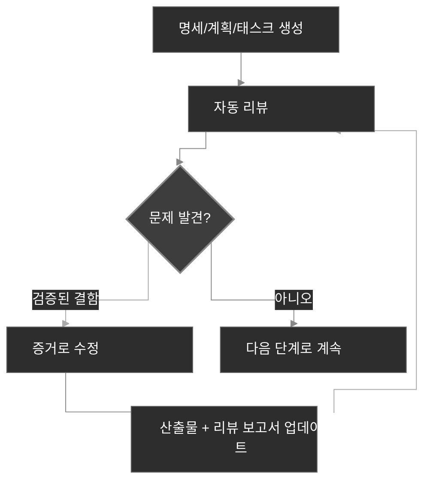

# 워크플로우

CodexSpec은 개발을 검토 가능한 체크포인트로 구조화하면서도, 세션을 가로지르러 사용자가 확정한 의도를 보존합니다. **Requirements-First SDD** 위에 세워져 있습니다. 확정된 요구사항이 먼저이며, 명시적으로 확인하기 전에는 그 어떤 것도 확정되지 않습니다. *무엇을* 만들고 *왜* 만들지를 먼저 정의하고 확정한 다음에야 *어떻게* 만들지를 결정합니다.

## 워크플로우 개요

개념 수준에서 Requirements-First SDD는 전통적인 "아이디어 → 코드 → 디버그 → 다시 작성" 루프를 확정된 산출물들의 명시적인 사슬로 대체합니다:

```text
전통적 방식:  아이디어 → 코드 → 디버그 → 다시 작성
SDD:          아이디어 → 확정된 요구사항 → 명세 → 계획 → 태스크 → 코드
```

CodexSpec에서 이 사슬은 슬래시 명령어 체크포인트의 연속이 되며, 각 체크포인트는 리뷰 마커가 붙은 영속적인 산출물을 만들어냅니다:

```text
아이디어 → /specify → requirements.md → /generate-spec → spec.md → /spec-to-plan → plan.md → /plan-to-tasks → tasks.md → /implement
                                                       │                        │                           │
                                                  명세 리뷰                계획 리뷰                  태스크 리뷰
```

`requirements.md`는 요구사항 논의의 결과를 영속화합니다. 확정된 필요·제약·결정·제외 항목·열린 질문·사용자 증거, 그리고 확인 로그를 기록합니다.

## 워크플로우 단계

| 단계                          | 명령어                         | 산출물                       | 인간 검토 |
| ---------------------------- | ---------------------------- | --------------------------- | --------- |
| 1. 프로젝트 원칙              | `/codexspec:constitution`    | `constitution.md`           | 예        |
| 2. 요구사항 명확화           | `/codexspec:specify`         | `requirements.md`           | 예        |
| 3. 명세 생성                 | `/codexspec:generate-spec`   | `spec.md` + 자동 리뷰       | 예        |
| 4. 기술 계획 수립            | `/codexspec:spec-to-plan`    | `plan.md` + 자동 리뷰       | 예        |
| 5. 태스크 분해               | `/codexspec:plan-to-tasks`   | `tasks.md` + 자동 리뷰      | 예        |
| 6. 교차 산출물 분석          | `/codexspec:analyze`         | 분석 보고서                  | 예        |
| 7. 구현                       | `/codexspec:implement-tasks` | 코드                         | -         |

기능이 여러 개 존재할 때는 명시적인 기능 디렉토리나 산출물 경로를 전달하십시오. 명령어는 결코 가장 최근 디렉토리를 암시적으로 선택하지 않습니다.

## 컨펌 게이트(Confirmation Gate)

**요구사항, 명세, 계획, 태스크는 명시적인 인간 확인 이후에만 확정 사항이 됩니다.** CodexSpec은 초안을 권위 있는 산출물로 몰래 승격시키지 않습니다. 모든 체크포인트에서 사용자에게 확인을 요청하며, 하위 명령어가 그것을 진실의 원천으로 다루려면 확인이 먼저입니다.

### 권위와 추적 가능성

소스들이 충돌할 때, 명령어는 다음 순서를 따릅니다:

1. `requirements.md`의 확정된 항목
2. `spec.md`
3. 적용 가능한 헌법 규칙과 리포지토리 사실
4. `plan.md`
5. `tasks.md`
6. 일반적인 모범 사례

이후 산출물이 이전 산출물을 소리소문 없이 재정의할 수는 없습니다. 요구사항은 안정적인 ID를 사용하고, 명세 항목은 `Sources`를 인용하며, 계획과 태스크는 `Covers`를 인용합니다. 미해결 충돌은 사용자 확인을 위해 생성을 멈춥니다. 다시 말해, **확정된 요구사항이 가장 높은 우선순위의 권위**입니다.

`spec.md`만 들어 있는 레거시 기능 디렉토리도 계속 지원됩니다. 명령어는 원래 논의로의 추적이 불가능하다는 점을 명시적으로 알립니다.

## 핵심 개념: 반복적 품질 루프

모든 생성 명령에는 **자동 리뷰**가 포함됩니다. 검증된 결함은 최대 두 라운드까지 수정 및 재리뷰될 수 있으며, 권고 제안은 분리되어 자동 변경을 트리거하지 않습니다.

1. 보고서를 검토합니다.
2. 수정할 문제를 자연어로 설명합니다.
3. 시스템이 명세와 리뷰 보고서를 자동으로 업데이트합니다.



## 리뷰 모델

리뷰는 세 종류의 산출물을 구분합니다:

- **충실도 결함(Fidelity defects)**: 권위 있는 소스와 충돌하거나 필수 커버리지가 빠진 경우.
- **내재적 결함(Intrinsic defects)**: 산출물 자체가 내적으로 모순되거나, 검증 불가능하거나, 실행 불가능한 경우.
- **리스크 권고 / 설계 기회**: 현재 결함의 증거 없이 제안되는 선택적 개선.

모든 결함은 증거·위치·불일치·영향·최소 수정 방안을 식별해야 합니다. 동일한 근본 원인을 가진 발견 항목은 병합됩니다. 권고는 상태, 점수, 자동 수정에 영향을 주지 않습니다.

리뷰 상태는 다음과 같습니다:

- `PASS`: 치명적·경고·사소한 결함이 모두 없음.
- `PASS_WITH_WARNINGS`: 사소한 결함만 남음.
- `NEEDS_REVISION`: 하나 이상의 경고가 남음.
- `BLOCKED`: 치명적 충돌이 안정적인 진행을 막음.

호환성 점수는 고정된 템플릿 섹션 감점이 아니라 동일하게 분류된 발견 항목들로부터 도출됩니다. 상태가 권위이며, 점수는 여전히 숫자를 기대하는 연동을 위해 존재합니다.

## 한정된 자동 리뷰

생성 명령은 매칭되는 리뷰를 자동으로 실행합니다. 이것은 **증거 기반 리뷰** 원칙의 실천입니다. 오직 증거가 뒷받침된 결함만 수리하고 최대 두 라운드까지만 재리뷰합니다. `PASS`이면 더 일찍 멈추며, 다음 상황에서는 사용자 입력을 기다리기 위해 멈춥니다:

- 권위 있는 소스가 다른 소스와 충돌할 때;
- 수정이 확정된 의도를 바꾸게 될 때;
- 남은 항목이 결함이 아니라 권고일 때;
- 두 라운드의 수리를 이미 사용했을 때.

수동 `/codexspec:review-*` 명령은 언제든 새 보고서를 얻기 위해 실행할 수 있습니다.

## specify vs clarify

| 측면 | `/codexspec:specify` | `/codexspec:clarify` |
|--------|----------------------|----------------------|
| 목적 | 초기 의도를 확립하고 확정 | 빈틈이나 모호함을 해소 |
| 주 산출물 | `requirements.md` | `requirements.md` |
| 명세 처리 | 이후에 생성 | 확정된 변경 이후 동기화 |
| 열린 질문 | 승격 없이 기록 | 사용자 확인 이후에만 갱신 |

## 조건부 TDD(Conditional TDD)

CodexSpec은 **조건부 TDD**를 사용합니다. 계획·헌법·구현 리스크가 요구하는 곳에서만 테스트 우선 순서를 적용합니다. 문서와 설정 작업은 직접 구현할 수 있습니다. 각 태스크는 하나의 검증 가능한 결과를 만들어내야 하며, 반드시 하나의 파일만 건드려야 하는 것은 아닙니다.

테스트 우선 순서가 적용되는 태스크의 경우, 구현은 Red → Green → Verify → Refactor 루프를 따릅니다:

- **코드 태스크**: 테스트 우선 — 실패하는 테스트 작성(Red), 통과시키기(Green), 동작 검증(Verify), 그 다음 동작을 바꾸지 않고 구현을 다듬기(Refactor).
- **테스트 불가능한 태스크**(문서, 설정): 직접 구현, 결과는 단위 테스트가 아니라 태스크가 서술한 결과에 대해 검증.
