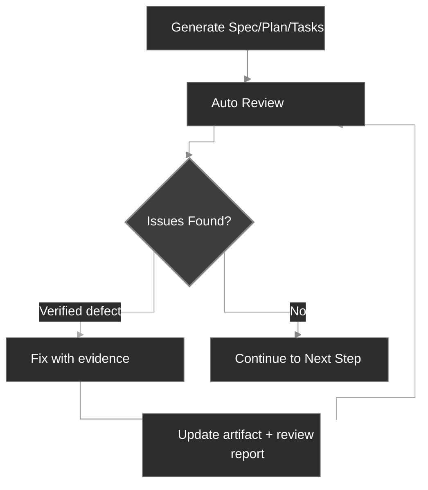

# Fluxo de trabalho

O CodexSpec estrutura o desenvolvimento em pontos de verificação revisáveis, preservando a intenção confirmada do usuário entre sessões. Ele é construído sobre o **Requirements-First SDD**: os requisitos confirmados vêm primeiro, e nada se torna vinculante até você confirmar explicitamente. Você define e confirma *o quê* construir e *por quê* antes de decidir *como*.

## Visão geral do fluxo

No nível conceitual, o Requirements-First SDD substitui o loop tradicional "Ideia → Código → Debug → Reescrever" por uma cadeia explícita de artefatos confirmados:

```text
Tradicional:  Ideia → Código → Debug → Reescrever
SDD:          Ideia → Requisitos Confirmados → Spec → Plano → Tarefas → Código
```

No CodexSpec, essa cadeia vira uma sequência de pontos de verificação em slash commands, cada um produzindo um artefato persistido com um marcador de revisão:

```text
Ideia → /specify → requirements.md → /generate-spec → spec.md → /spec-to-plan → plan.md → /plan-to-tasks → tasks.md → /implement
                                                   │                         │                            │
                                              Revisar spec              Revisar plano                Revisar tarefas
```

O `requirements.md` persiste o resultado das discussões de requisitos. Ele registra necessidades confirmadas, restrições, decisões, exclusões, perguntas em aberto, evidências do usuário e um log de confirmação.

## Etapas do fluxo

| Etapa                          | Comando                      | Saída                      | Verificação humana |
| ------------------------------ | ---------------------------- | -------------------------- | ------------------ |
| 1. Princípios do projeto       | `/codexspec:constitution`    | `constitution.md`          | Sim                |
| 2. Esclarecimento de requisitos | `/codexspec:specify`         | `requirements.md`          | Sim                |
| 3. Gerar spec                  | `/codexspec:generate-spec`   | `spec.md` + auto-review    | Sim                |
| 4. Planejamento técnico        | `/codexspec:spec-to-plan`    | `plan.md` + auto-review    | Sim                |
| 5. Decomposição de tarefas     | `/codexspec:plan-to-tasks`   | `tasks.md` + auto-review   | Sim                |
| 6. Análise entre artefatos     | `/codexspec:analyze`         | Relatório de análise       | Sim                |
| 7. Implementação               | `/codexspec:implement-tasks` | Código                     | -                  |

Passe um diretório de funcionalidade explícito ou o caminho de um artefato quando houver mais de uma funcionalidade. Os comandos nunca escolhem o diretório mais recente implicitamente.

## Confirmation Gate

**Requisitos, specs, planos e tarefas tornam-se vinculantes somente após confirmação humana explícita.** O CodexSpec nunca promove silenciosamente um rascunho a artefato autoritativo — em cada ponto de verificação, pede-se a confirmação do usuário antes que comandos downstream possam tratá-lo como fonte da verdade.

### Autoridade e rastreabilidade

Quando as fontes entram em conflito, os comandos usam esta ordem:

1. Entradas confirmadas em `requirements.md`
2. `spec.md`
3. Regras aplicáveis da constituição e fatos do repositório
4. `plan.md`
5. `tasks.md`
6. Boas práticas gerais

Artefatos posteriores não podem redefinir silenciosamente os anteriores. Os requisitos usam IDs estáveis, os itens da especificação citam `Sources`, planos e tarefas citam `Covers`, e conflitos não resolvidos interrompem a geração para confirmação do usuário. Em outras palavras, **os requisitos confirmados são a autoridade de maior prioridade**.

Diretórios legados de funcionalidade contendo apenas `spec.md` continuam suportados. Os comandos informam explicitamente que a rastreabilidade até a discussão original não está disponível.

## Conceito-chave: loop iterativo de qualidade

Cada comando de geração inclui **revisão automática**. Defeitos verificados podem ser corrigidos e reavaliados por no máximo duas rodadas; sugestões consultivas ficam separadas e nunca disparam alterações automáticas.

1. Revise o relatório.
2. Descreva, em linguagem natural, os problemas a corrigir.
3. O sistema atualiza specs e relatórios de revisão automaticamente.



## Modelo de revisão

As revisões separam três tipos de saída:

- **Defeitos de fidelidade**: conflito com uma fonte autoritativa ou omissão de cobertura exigida.
- **Defeitos intrínsecos**: o artefato é internamente contraditório, inverificável ou inviável.
- **Avisos de risco / oportunidades de design**: melhorias opcionais, sem evidência de um defeito atual.

Todo defeito deve identificar sua evidência, local, divergência, impacto e remediação mínima. Achados com a mesma causa raiz são mesclados. Avisos não afetam status, pontuação nem correções automáticas.

O status da revisão é:

- `PASS`: nenhum defeito crítico, de aviso ou menor.
- `PASS_WITH_WARNINGS`: restam apenas defeitos menores.
- `NEEDS_REVISION`: restam um ou mais avisos.
- `BLOCKED`: um conflito crítico impede a continuação confiável.

A pontuação de compatibilidade é derivada dos mesmos achados classificados, em vez de deduções fixas por seção de template. O status é autoritativo; a pontuação existe para integrações que ainda esperam um número.

## Auto Review limitado

Os comandos de geração executam a revisão correspondente automaticamente. Esta é a disciplina de **revisão baseada em evidências** em ação: eles só podem reparar defeitos com evidência e reavaliar por no máximo duas rodadas. Eles param antes em `PASS` e param para entrada do usuário quando:

- uma fonte autoritativa conflita com outra fonte;
- uma correção mudaria uma intenção confirmada;
- o item restante é consultivo, e não um defeito;
- duas rodadas de reparo já foram usadas.

Comandos manuais `/codexspec:review-*` podem ser executados a qualquer momento para um relatório atualizado.

## specify vs clarify

| Aspecto | `/codexspec:specify` | `/codexspec:clarify` |
|--------|----------------------|----------------------|
| Propósito | Estabelecer e confirmar a intenção inicial | Resolver lacunas ou ambiguidades |
| Artefato principal | `requirements.md` | `requirements.md` |
| Tratamento da spec | Gerada depois | Sincronizada após mudanças confirmadas |
| Perguntas em aberto | Registradas sem promoção | Atualizadas apenas após confirmação do usuário |

## Conditional TDD

O CodexSpec usa **conditional TDD**: a ordenação test-first é aplicada apenas onde o plano, a constituição ou o risco da implementação exigem. Trabalho de documentação e configuração pode ser implementado diretamente. Cada tarefa deve produzir um resultado verificável; não é exigido que ela toque em apenas um arquivo.

Para tarefas em que a ordenação test-first se aplica, a implementação segue o loop Red → Green → Verify → Refactor:

- **Tarefas de código**: Test-first — escreva um teste que falha (Red), faça-o passar (Green), verifique o comportamento (Verify) e então refine a implementação sem mudar o comportamento (Refactor).
- **Tarefas não testáveis** (docs, config): Implementação direta, com o resultado verificado em relação ao resultado declarado da tarefa, e não por um teste de unidade.
