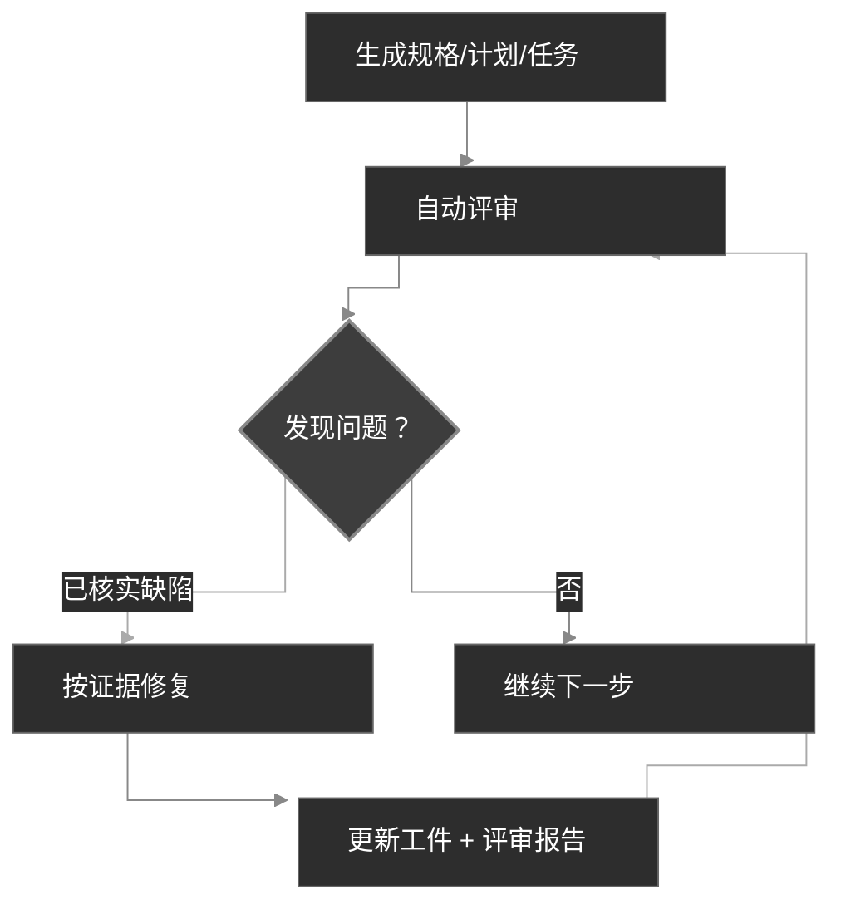

# 工作流

CodexSpec 把开发组织为一个个可评审的检查点，同时跨会话保留用户已确认的意图。它建立在 **Requirements-First SDD** 之上：已确认的需求优先，在你显式确认之前，没有任何内容会被视为约束。你先定义并确认要做什么以及为什么，再决定如何实现。

## 工作流概览

在概念层面，Requirements-First SDD 用一条由已确认工件组成的显式链路，取代了传统的"想法 → 代码 → 调试 → 重写"循环：

```text
传统方式:  想法 → 代码 → 调试 → 重写
SDD:       想法 → 已确认需求 → 规格 → 计划 → 任务 → 代码
```

在 CodexSpec 中，这条链路被具体化为一串斜杠命令检查点，每个检查点产出一个带评审标记的持久化工件：

```text
想法 → /specify → requirements.md → /generate-spec → spec.md → /spec-to-plan → plan.md → /plan-to-tasks → tasks.md → /implement
                                                  │                          │                           │
                                             评审 spec                   评审 plan                    评审 tasks
```

`requirements.md` 持久化需求讨论的结果，记录已确认的需求、约束、决策、排除项、开放问题、用户依据，以及一份确认日志。

## 工作流步骤

| 步骤 | 命令 | 产出 | 人工检查 |
| ---------------------------- | ---------------------------- | --------------------------- | ----------- |
| 1. 项目原则 | `/codexspec:constitution` | `constitution.md` | 是 |
| 2. 需求澄清 | `/codexspec:specify` | `requirements.md` | 是 |
| 3. 生成规格 | `/codexspec:generate-spec` | `spec.md` + 自动评审 | 是 |
| 4. 技术规划 | `/codexspec:spec-to-plan` | `plan.md` + 自动评审 | 是 |
| 5. 任务拆解 | `/codexspec:plan-to-tasks` | `tasks.md` + 自动评审 | 是 |
| 6. 跨工件分析 | `/codexspec:analyze` | 分析报告 | 是 |
| 7. 实现 | `/codexspec:implement-tasks` | 代码 | - |

存在多个功能时应传入明确的功能目录或工件路径。命令不会隐式选择最新的目录。

## 确认门

**需求、规格、计划与任务只有在你显式人工确认之后才生效。** CodexSpec 绝不把草稿静默提升为权威工件——在每个检查点都会请你确认，下游命令才能把它当作唯一事实来源。

### 权威与可追溯性

来源发生冲突时，命令遵循以下优先级：

1. `requirements.md` 中已确认的条目
2. `spec.md`
3. 适用的宪法规则与仓库事实
4. `plan.md`
5. `tasks.md`
6. 通用最佳实践

后序工件不能静默改写前序工件。需求使用稳定 ID，规格项通过 `Sources` 引用来源，计划与任务通过 `Covers` 声明覆盖关系，未消解的冲突会停止生成并请求用户确认。换言之，**已确认的需求拥有最高优先级的特性权威**。

仅含 `spec.md` 的旧版功能目录仍受支持。命令会显式报告：无法追溯到原始讨论。

## 核心概念：迭代式质量环

每个生成命令都内置**自动评审**。已核实的缺陷最多可修复并重审两轮；建议性意见始终单独处理，绝不触发自动修改。

1. 查看报告。
2. 用自然语言描述要修复的问题。
3. 系统自动更新规格与评审报告。



## 评审模型

评审把输出区分为三类：

- **忠实性缺陷**：与权威来源冲突，或遗漏必须覆盖的内容。
- **内在缺陷**：工件内部自相矛盾、不可验证或不可实施。
- **风险建议 / 设计机会**：没有当前缺陷证据的可选改进。

每个缺陷都必须给出证据、位置、偏差、影响和最小修复方式。根因相同的发现会被合并。建议项不影响状态、分数，也不触发自动修复。

评审状态：

- `PASS`：没有严重、警告或轻微缺陷。
- `PASS_WITH_WARNINGS`：仅剩轻微缺陷。
- `NEEDS_REVISION`：仍存在警告。
- `BLOCKED`：严重冲突阻止可靠地继续。

兼容性分数由同一组已分类的发现推导而来，不再按固定模板章节扣分。状态是权威结论；分数只是为仍需要数字的集成而保留。

## 有界自动评审

生成命令会自动运行对应的评审。这正是**基于证据的评审**纪律的体现：它们只能修复有证据支持的缺陷，且最多自动修复并重审两轮。出现 `PASS` 时会提前停止；遇到以下情况时会停下来等待用户介入：

- 某个权威来源与其他来源冲突；
- 修复会改动已确认的意图；
- 剩余项目属于建议而非缺陷；
- 两轮修复已用完。

随时可以手动运行 `/codexspec:review-*` 命令获取一份新的报告。

## specify 与 clarify 的区别

| 方面 | `/codexspec:specify` | `/codexspec:clarify` |
|--------|----------------------|----------------------|
| 目的 | 建立并确认初始意图 | 解决缺口或歧义 |
| 主要工件 | `requirements.md` | `requirements.md` |
| 规格处理 | 后续生成 | 在确认的修改后同步 |
| 开放问题 | 记录但不提升为需求 | 仅在用户确认后更新 |

## 条件式 TDD

CodexSpec 采用**条件式 TDD**：仅当计划、宪法或实现风险要求时，才施加测试优先的顺序。文档与配置工作可以直接实现。每个任务应产出一个可验证的结果，但不要求只能触碰一个文件。

对于适用测试优先的任务，实现遵循 Red → Green → Verify → Refactor 循环：

- **代码任务**：测试优先——先写一个失败的测试（Red），让它通过（Green），验证行为（Verify），再在不改变行为的前提下改进实现（Refactor）。
- **不可测任务**（文档、配置）：直接实现，结果依据任务声明的产出验证，而不是单元测试。
